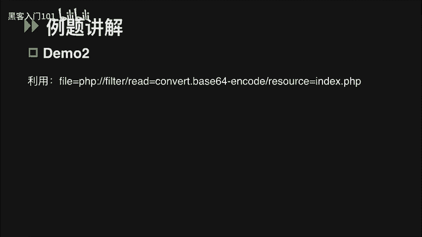
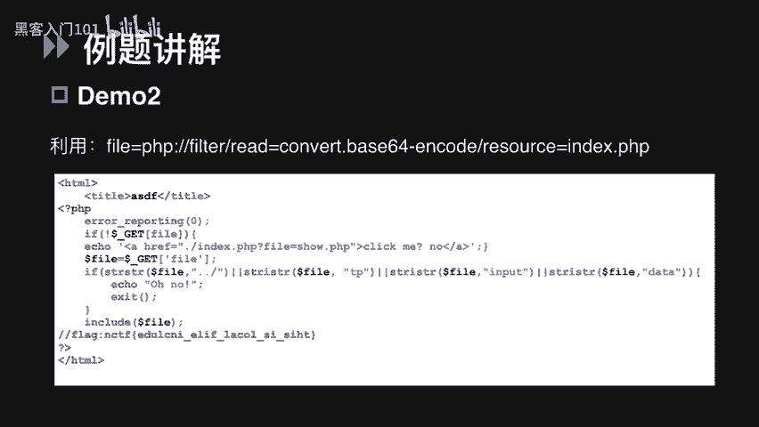
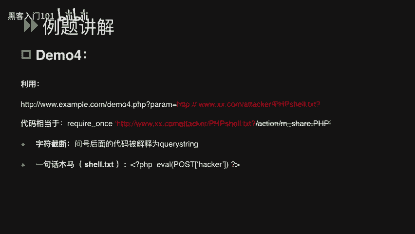
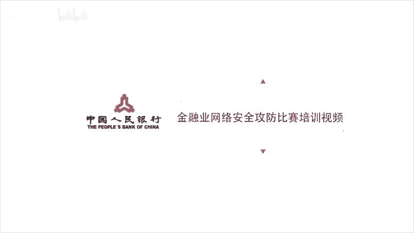

# CTF入门与实战：P27：28.文件包含漏洞详解 🚩

在本节课中，我们将要学习CTF比赛中一个重要的考点——文件包含漏洞。我们将从漏洞原理出发，讲解常见的解题思路，并通过例题演示如何利用该漏洞获取目标系统中的Flag。课程内容将围绕PHP语言展开，力求简单直白，帮助初学者快速理解。

## 文件包含漏洞原理

上一节我们介绍了课程概述，本节中我们来看看文件包含漏洞的定义与原理。

严格来说，文件包含漏洞是代码注入的一种。程序开发人员在编写程序时，不喜欢重复编写相同代码，通常会将需要重复使用的代码写入单个文件。当需要使用时，直接调用该文件，无需再次编写。这种调用过程被称为“包含”。

当需要通过PHP函数引入文件时，如果传入的文件名没有经过合理校验，从而操作了预期之外的文件，就可能导致意外的文件泄露甚至恶意代码注入。对应到CTF比赛中，我们可以通过此漏洞读取服务器本地的Flag文件，甚至获取外部权限来查看Flag文件。

## 如何判断文件包含漏洞

说完定义，我们就要分析在比赛中，如何判断某道题是否考察文件包含漏洞。

在PHP中，导致文件包含漏洞的最常见函数有以下4个：
*   `include`
*   `include_once`
*   `require`
*   `require_once`

这四个函数都可以包含并运行指定的文件。其中，`include`和`require`的区别在于对错误的处理上；`include_once`和`require_once`顾名思义，表示只包含一次。具体区别我们不做深入探讨。

当使用这些函数包含一个新文件时，只要文件内容符合PHP语法规范，那么任何扩展名的文件都可以被当作PHP代码解析。也就是说，即使我们上传一个包含恶意代码的`.txt`或`.jpg`文件，它都会被当作PHP代码执行。

## CTF文件包含题目常见解题思路

接下来，我们讲解CTF中文件包含类题目的常见解题思路。文件包含分为本地文件包含和远程文件包含。

当被包含的文件在服务器本地时，称为**本地文件包含**。通常我们会通过操纵变量去读取目标机上的Flag文件。
如果被包含的文件在第三方服务器上，则称为**远程文件包含**。此类题目多出现在CTF的AWD（混战）模式中，我们可以指定其他URL上的一个PHP木马来直接运行，从而拿到外部权限查看Flag文件。

区分两者的最简单方法是查看PHP全局配置文件`php.ini`。其中有两个非常重要的配置项：
*   `allow_url_fopen`
*   `allow_url_include`

只有当它们同时开启时，才会存在远程文件包含漏洞。

### 本地文件包含解题思路

讲完区别，我们先讲几个本地文件包含常见的解题思路。

**1. 直接包含内含Flag的文件**

以下是第一种思路的示例。
假设通过访问URL可以查看到`index`页面的PHP源码。简单分析这段代码：在`index.php`中，可以通过GET请求提交`file`参数，然后判断`/var/www/`目录下是否存在该文件名。如果存在，就用`include`包含该文件；如果不存在，则执行`else`分支，包含`home.php`文件。

这段代码没有对取得的参数`file`进行任何过滤。如果目标主机的Flag文件在`/var/www/`目录下，我们就可以通过`file`参数直接指定这个Flag文件。在代码中，相当于我们包含了这样一个文件：`/var/www/flag.php%00`。其中，`%00`是一个字符串结束符，用于截断后面的`.php`，从而包含`flag.php`文件。

**2. 利用PHP伪协议读取源码中的Flag**

第二种题型需要我们利用PHP伪协议来读取代码中的Flag。这种思路需要我们先了解PHP伪协议以及之前提到的全局配置项`allow_url_fopen`和`allow_url_include`之间的联系。

PHP伪协议是PHP支持并封装的一些协议。这里我们只涉及在CTF中经常使用的`file`和`php`这两种协议。

*   **`file`协议**：这是一种用来访问本地文件系统的协议。在CTF中，可用于读取本地敏感文件或Flag文件。`file`协议的使用不受`allow_url_fopen`和`allow_url_include`配置的限制。例如，可以通过绝对路径读取Windows上的一个Flag文件：`file:///C:/flag.txt`。
*   **`php`协议**：可以使用`php`协议中的`filter`参数读取网页源代码。`php://filter`同样可以在`allow_url_fopen`和`allow_url_include`都关闭（双off）的情况下使用。

具体用法我们来看一个示例。
访问题目URL，看到一个“click me”链接。点击后，发现URL中多了一个`file`参数，可以判断此处可能存在文件包含漏洞。如果无法查看`php.ini`文件，可以尝试读取`index.php`页面的源代码。由于不知道文件的绝对路径，`file`协议无法使用，应使用`php://filter`读取网页源代码。

构造Payload：`php://filter/read=convert.base64-encode/resource=index.php`
其中，`resource`指定要筛选的数据流，`read`设定过滤器的名称。简单来说，就是读取`index.php`的内容，并将输入流进行Base64编码后输出。使用这种方式读到的是Base64编码后的内容。之所以进行编码，是因为不编码内容会被当作PHP执行，我们就看不到源码了。将得到的Base64字符串解码，即可看到源码内容及其中包含的Flag值。

**3. 通过写入PHP木马获得Webshell权限**

最后是`php://input`参数。这个参数比较特别，只要`allow_url_include`开启，无论`allow_url_fopen`是否开启，我们都可以将POST请求中的数据作为PHP代码执行。这就涉及到第三种思路：通过写入PHP木马获得Webshell权限来查看Flag。

来看一个示例。
访问题目URL，发现直接给出了题目源码，这是一道代码审计题。代码中使用`require_once`包含了GET请求的`file`参数。注释中有两个提示：一是提醒读取`php.ini`，二是提示不允许进行远程文件包含。

结合前面知识，思路明确：首先按照提示读取`php.ini`获取信息；其次，要么绕过限制去包含远程的一句话木马，要么使用PHP伪协议直接执行代码。第一种方法需要`allow_url_fopen`和`allow_url_include`都开启；第二种方法只需要`allow_url_include`开启即可。

为了确定使用哪种思路，我们先查看`php.ini`文件，发现`allow_url_fopen`关闭，而`allow_url_include`开启。因此，可以使用`php://input`协议尝试写入木马。我们可以使用工具（如Hackbar）POST一个简单的PHP木马代码，从而在服务器上生成一个Webshell文件。上传成功后，用连接工具连接该木马，即可查看目标主机上的Flag文件。

### 远程文件包含解题思路

最后我们来说一下远程文件包含。远程文件包含一般出现在CTF的混战模式中，因为该模式下我们需要获取Shell。

这里简单说一个示例。
很明显，一段源码存在文件包含漏洞，它使用`require_once`包含了GET请求的参数`terror`。访问`php.ini`文件发现`allow_url_fopen`和`allow_url_include`都开启了，因此判断存在远程文件包含漏洞。

利用方法很简单：用`param`参数传入一个第三方服务器上的木马文件URL。问号后面的代码被解释成URL的查询字符串，这也是一种截断方式，与`%00`的用法类似。

## 总结

本节课中，我们一起学习了CTF中的文件包含漏洞。我们从漏洞的基本原理讲起，明确了其属于代码注入的一种。接着，我们学习了如何通过常见的PHP函数判断漏洞存在，并区分了本地文件包含与远程文件包含。课程重点讲解了三种本地文件包含的解题思路：直接包含文件、利用PHP伪协议读取源码、以及通过`php://input`写入木马。最后，我们简要介绍了远程文件包含在CTF混战模式中的应用。掌握这些知识，将有助于你在CTF比赛中应对文件包含类题目。