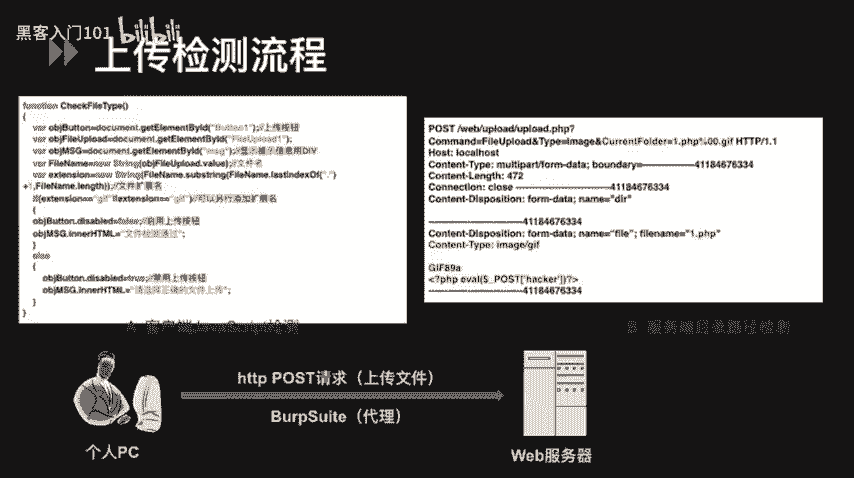
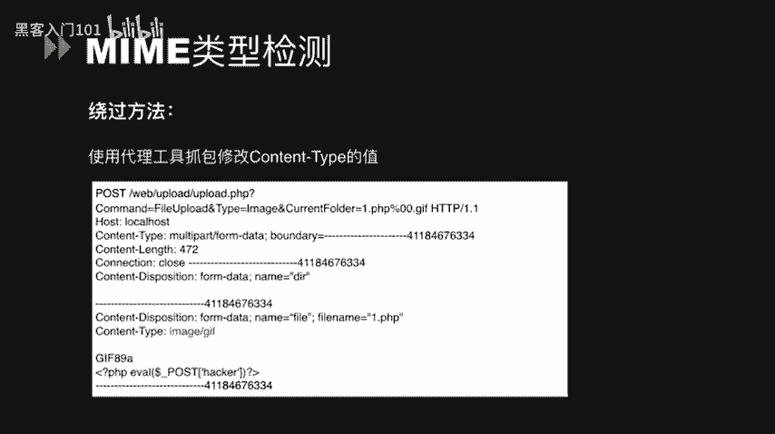
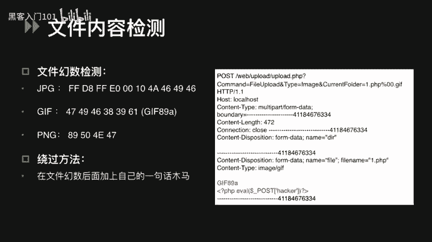
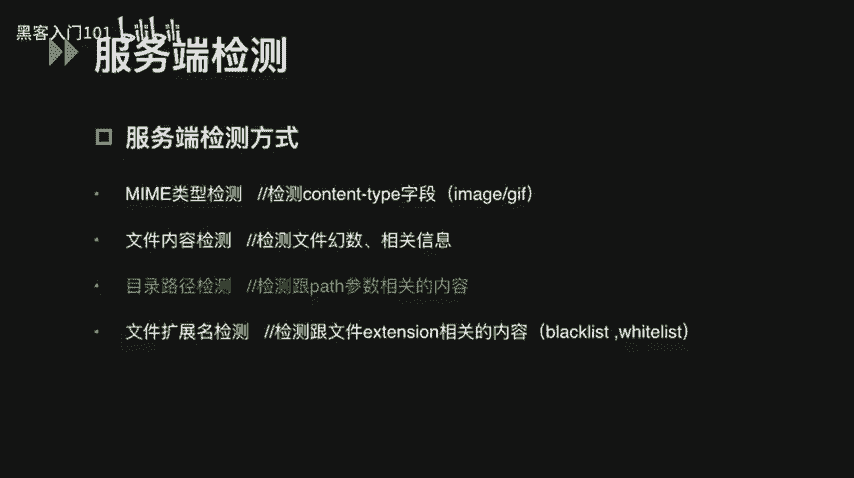
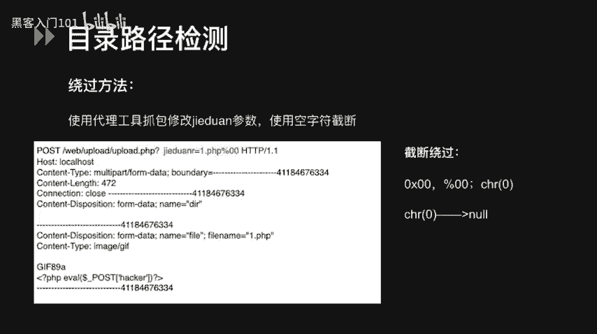
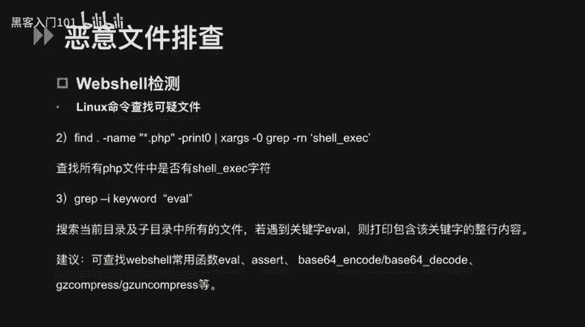
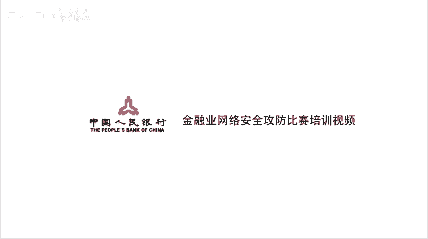

# CTF文件上传漏洞：P28：29.文件上传 - 黑客入门101


## 概述
在本节课中，我们将要学习CTF比赛中常见的文件上传漏洞。我们将从基础概念讲起，了解什么是文件上传漏洞和WebShell，然后详细分析客户端与服务端的各种检测机制及其绕过方法，最后介绍如何排查服务器上的恶意文件。通过学习，你将掌握文件上传类题目的基本解题思路。

---

## 什么是文件上传漏洞？🔍
在Web程序中，文件上传功能十分常见。如果程序允许用户上传图片、文档等文件，但未对上传文件的类型进行严格限制或限制被攻击者绕过，就可能产生文件上传漏洞。

如果攻击者成功上传了恶意文件，例如WebShell，就可能获取网站服务器的操作权限。这会导致网站被控制，甚至整个服务器沦陷。攻击者可以借此编辑网页、上传下载文件、查看数据库或执行任意系统命令。

---

## 什么是WebShell？🛠️
WebShell就是我们常说的“网页木马”，它是一种后门工具。下面是一个典型的PHP一句话木马：

```php
<?php @eval($_POST['c']); ?>
```

这段代码的含义是：通过`eval()`函数执行通过POST请求传入的参数`c`。我们只要向服务器发送一个POST请求，其中参数`c`的值是我们想执行的PHP命令，就能在服务器上执行相应操作。



例如，如果`c=phpinfo()`，服务器就会执行`phpinfo()`函数，我们便能访问到PHP信息页面，查看服务器的敏感信息。

---

## 文件上传检测流程🔄
文件从客户端上传到服务器的过程中，可能会经历一次或多次校验。检测通常分为两个阶段：**客户端检测**和**服务端检测**。

上一节我们介绍了漏洞的基本概念，本节中我们来看看文件上传的具体检测流程。

---

## 客户端检测与绕过🚫
客户端检测通常指在上传页面中，使用JavaScript代码对文件进行校验，最常见的是检查文件扩展名是否合法。

以下是一段客户端JS检测文件扩展名的示例代码：
```javascript
// 示例：限制只允许上传.gif文件
if (!filename.endsWith('.gif')) {
    alert('只允许上传.gif文件');
    return false;
}
```



**如何判断是客户端检测？**
判断方法很简单：在浏览器中选择文件后、点击上传按钮前，如果立刻弹出“只允许上传某类型文件”的对话框，这通常是客户端JS检测。此外，通过配置HTTP代理工具（如Burp Suite）进行抓包，如果选择文件时没有流量经过代理，也证明是客户端检测，因为请求尚未发送到服务器。

**绕过客户端检测的方法有以下两种：**
1.  **使用代理工具修改请求**：配置Burp Suite等代理抓取上传请求，然后将通过客户端检测的文件名（如`shell.jpg`）在数据包中修改为恶意文件名（如`shell.php`）。
2.  **禁用或修改前端JS**：使用浏览器开发者工具（如Firefox的Firebug）查看上传页面的源代码，找到负责检测的JS函数并将其禁用或修改。

客户端的检测和绕过方法基本就是这样。



---

## 服务端检测与绕过🛡️
在讲服务端的检测和绕过方法之前，先介绍一下PHP里的`$_FILES`对象。PHP通过该对象的一些属性来读取上传文件的信息，例如：
*   `$_FILES['file']['name']`：读取文件名称。
*   `$_FILES['file']['type']`：读取文件类型。



文件到达服务器后，会进行更严格的检测。服务端的检测方式主要分为以下四种。

### 1. MIME类型检测
MIME类型描述了文件的媒体类型，可以从HTTP请求头的`Content-Type`字段中获取。

以下是服务端检测MIME类型的代码示例，主要看第二行的`if`判断：
```php
if ($_FILES['file']['type'] != 'image/gif') {
    // 不是gif图片，拒绝上传
    die('Invalid file type.');
}
```

**绕过方法**：使用代理工具（如Burp Suite）截取上传请求，将数据包中`Content-Type`字段的值修改为服务器允许的类型（如`image/gif`），即可绕过检测上传`.php`木马文件。

### 2. 文件内容检测
服务端对文件内容的检测通常有两种：**文件幻数检测**和**文件信息检测**。

**文件幻数检测**：幻数是位于文件开头、用于标识文件格式的特定字节序列。例如，ZIP文件开头是`PK`，GIF文件开头是`GIF89a`。
*   **绕过方法**：在合法文件（如图片）的幻数之后，添加一句话木马代码。这样文件既能通过幻数检测，又能被当作PHP脚本执行。



**文件信息检测**：服务器可能会检测图片文件的尺寸、大小等信息。
*   **绕过方法**：先伪造好文件幻数并写入木马代码，再添加一些无关内容（如大量注释）来满足文件大小或结构要求。通常，直接使用一个结构完整的正常文件进行代码注入后再上传即可。

### 3. 目录路径检测
这种检测通常与文件路径（`path`）参数相关。漏洞常出现在处理上传文件的函数中。

我们来看一段存在漏洞的示例代码：
```php
$temp_name = $_FILES['file']['tmp_name'];
$target_path = "uploads/" . $_GET['path'] . $_FILES['file']['name'] . $file_ext;
move_uploaded_file($temp_name, $target_path);
```
这段代码中，`move_uploaded_file()`函数用于将临时文件移动到最终路径`$target_path`。`$target_path`由用户可控的`$_GET[‘path’]`参数拼接而成，这构成了安全漏洞（CVE-2015-2348）。

**绕过方法（空字符截断）**：在HTTP请求包的`path`参数中，利用空字符（`%00`、`\x00`、`\x20`）来截断其后由程序指定的扩展名（`$file_ext`）。
*   `%00`：URL编码的空字符，Web服务器会将其作为十六进制处理，翻译为ASCII码的`NULL`实现截断。
*   `\x20`：表示ASCII字符空格，在某些环境下也能起到截断作用。

### 4. 扩展名检测
这是最常见的检测方式，分为**黑名单**和**白名单**机制。

**黑名单检测**：服务器有一个列表，明确禁止上传某些危险扩展名（如`.php`, `.jsp`, `.asp`）。
*   **绕过方法**：
    *   使用未在黑名单中的类似后缀，如`.php5`, `.phtml`。
    *   利用服务器特性：IIS默认支持解析`.asa`, `.cer`, `.cdx`等后缀。
    *   大小写混淆：如`Shell.PhP`。
    *   特殊文件名：在Windows系统下，可上传`shell.php.`（末尾加点）或`shell.php `（末尾加空格），系统会自动去除点或空格，但文件仍以`.php`执行。此方法需通过代理工具修改数据包实现。
    *   空字符截断：同目录路径检测中的方法。

**白名单检测**：只允许上传指定的安全扩展名（如`.jpg`, `.png`, `.gif`）。安全性比黑名单高。
*   **绕过方法**：通常需要结合其他漏洞，如：
    *   配合**解析漏洞**（见下文）。
    *   利用空字符截断（如果路径可控）。

---

## 服务器解析漏洞与配置问题⚙️
除了直接的检测绕过，一些服务器或中间件的解析漏洞和错误配置也会导致文件上传漏洞。

### IIS解析漏洞（5.x/6.0版本）
1.  **目录解析**：在IIS6.0下，如果目录名包含`.asp`、`.asa`、`.cer`等，则该目录下的所有文件都会被当作ASP脚本执行。
2.  **文件解析**：`shell.asp;.jpg` 此类文件会被IIS解析为`.asp`文件，因为服务器默认不解析分号后的内容。
3.  **默认解析**：IIS默认支持解析`.asa`, `.cer`, `.cdx`等后缀。

### Apache解析漏洞
1.  **多后缀解析**：Apache解析文件时从右向左，遇到不认识的后缀会继续向左解析。例如，上传`test.php.owf.rar`，由于`.owf`和`.rar` Apache都不认识，最终文件会被解析为`test.php`。
2.  **配置问题**：
    *   **配置一**：`AddHandler php5-script .php`。如果配置如此，只要文件名中包含`.php`（如`test.php.jpg`），就会被当作PHP执行。
    *   **配置二**：`AddType application/x-httpd-php .jpg`。此配置会使所有`.jpg`文件以PHP方式执行。

### Nginx解析漏洞
漏洞通常与PHP-CGI的配置有关，利用条件是`fastcgi`模式开启。
**利用形式**：访问`http://site/upload/test.jpg/.php`，若`test.php`不存在，Nginx会将`test.jpg`交给PHP-CGI处理，如果`test.jpg`中包含恶意代码，就会被执行。
**利用步骤**：
1.  使用命令将木马代码写入图片：`copy test.jpg/b + shell.txt/a shell.jpg`
2.  上传`shell.jpg`。
3.  访问`http://site/upload/shell.jpg/.php`，触发解析漏洞。

---

## 如何排查WebShell？🔎
在服务器安全运维或CTF比赛中，可能需要排查已上传的WebShell。以下是一些有用的Linux命令：

以下是查找可疑文件的常用命令：

*   **查找近期被修改的PHP文件**：
    ```bash
    find /var/www/html -name “*.php” -mmin -5
    ```
    *   `-mmin -5`：查找最后5分钟内修改过的文件。
    *   `-atime`：访问时间。
    *   `-mtime`：修改时间。
    *   `-ctime`：状态改变时间。

*   **查找包含特定危险函数的文件**：
    ```bash
    find . -name “*.php” | xargs grep “eval(” | head -10
    ```
    这条命令在当前目录查找所有PHP文件中是否包含`eval(`字符串。

*   **递归搜索文件内容中的关键字**：
    ```bash
    grep -r -i “eval” ./
    ```
    *   `-r`：递归搜索。
    *   `-i`：忽略大小写。
    可以搜索`eval`、`assert`、`base64_decode`、`system`等WebShell常用函数。

---

## 总结
本节课中，我们一起学习了CTF文件上传漏洞的完整知识体系。

我们首先了解了**文件上传漏洞**和**WebShell**的基本概念。然后，我们系统地分析了**客户端检测**与**服务端检测**的流程。对于客户端检测，我们可以通过**禁用JS**或**代理改包**来绕过。对于服务端检测，我们学习了四种主要方式及其绕过技巧：
1.  **MIME类型检测**：修改HTTP请求头中的`Content-Type`。
2.  **文件内容检测**：在文件幻数后注入代码，或伪造文件信息。
3.  **目录路径检测**：利用**空字符截断**（`%00`）。
4.  **扩展名检测**：针对**黑名单**使用非常规后缀、大小写混淆；针对**白名单**需结合解析漏洞。

此外，我们还探讨了**IIS、Apache、Nginx**等服务器的解析漏洞和错误配置，这些都可能成为攻击入口。最后，我们介绍了几条在Linux系统下**排查WebShell**的实用命令。





掌握这些知识，你就能对大多数文件上传类CTF题目形成清晰的解题思路。核心在于理解检测原理，灵活运用各种绕过方法。