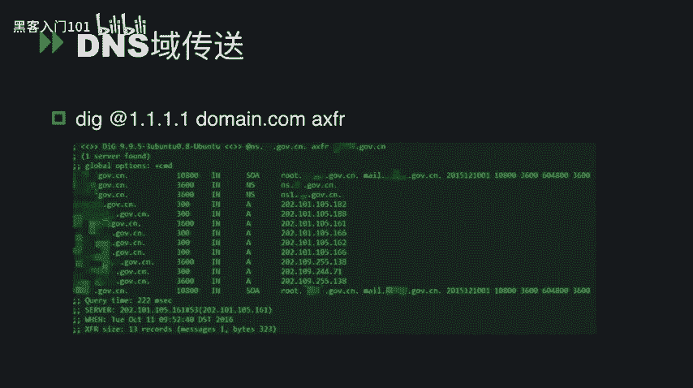
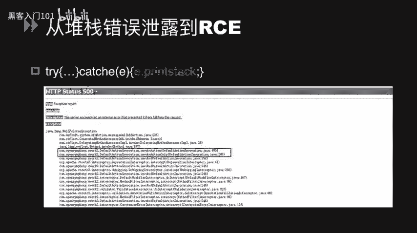
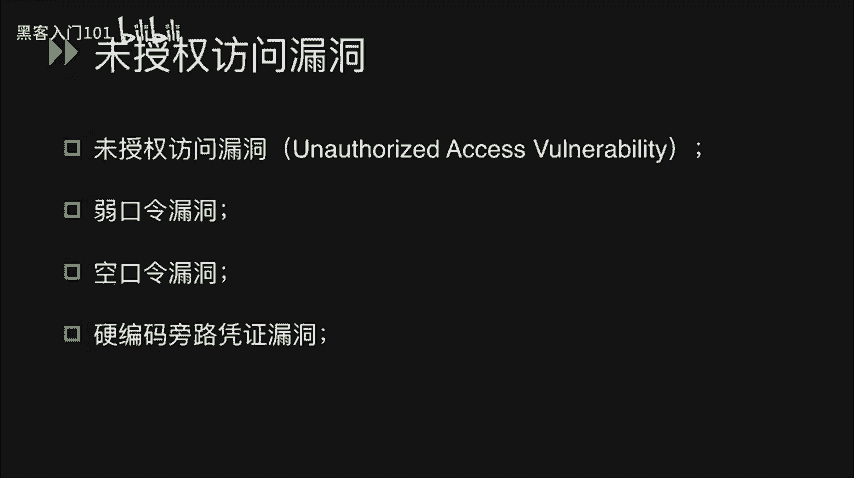
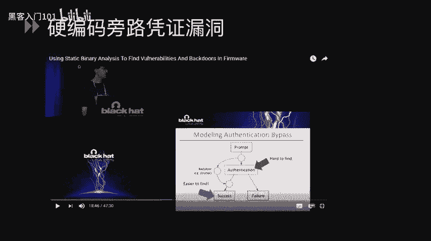
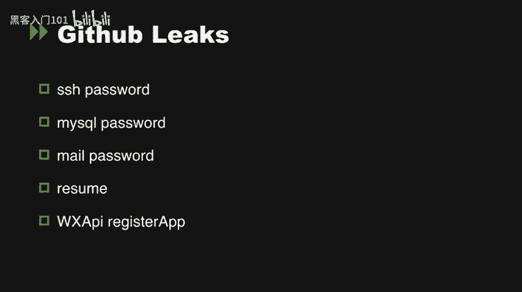
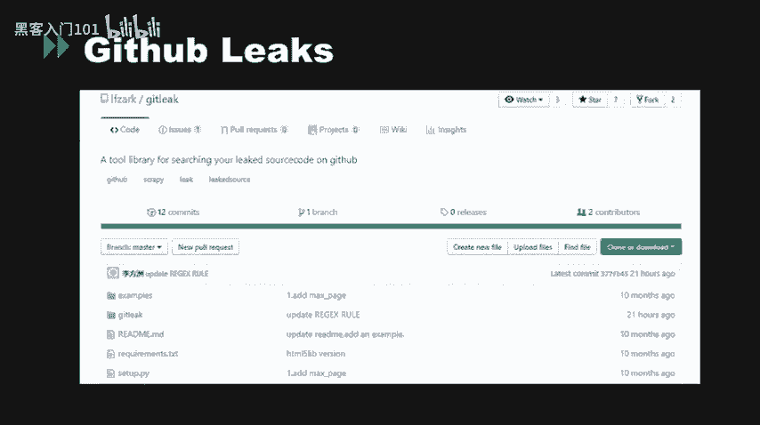
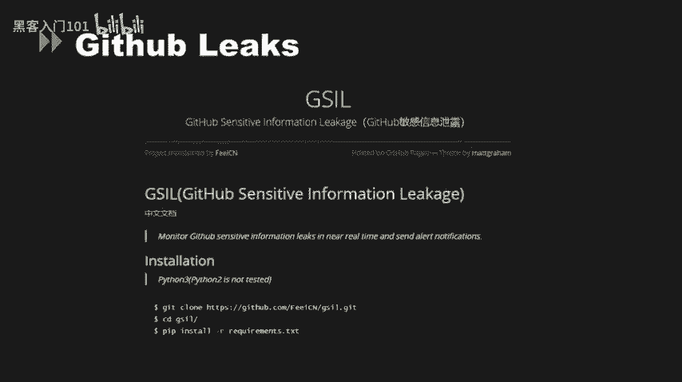
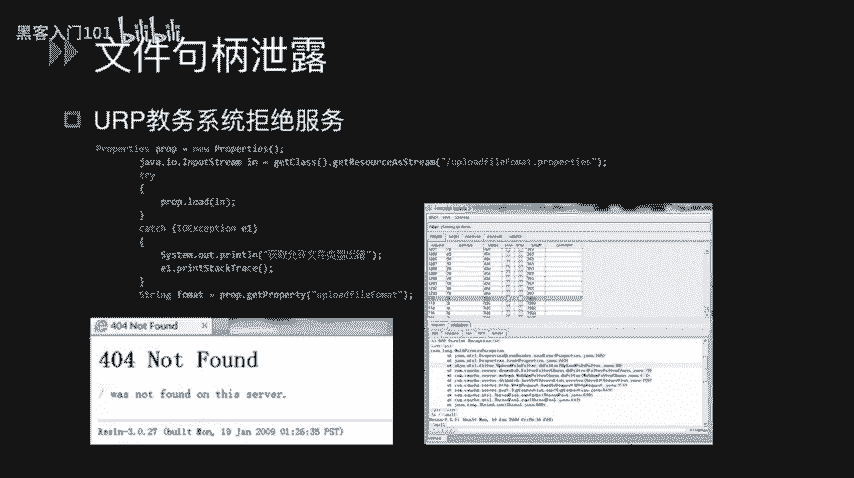
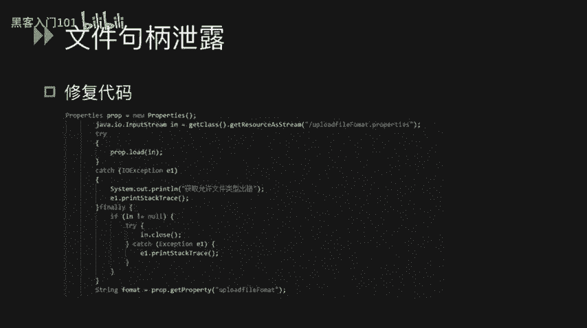

# CTF入门与实战：P29：信息泄漏 🚩


在本节课中，我们将学习CTF比赛中常见的信息泄漏类安全漏洞。这类漏洞通常是解题的第一步，通过它们，我们可以获取出题人留下的关键提示，从而为后续的解题环节铺平道路。

## 代码管理工具泄漏 🔍

上一节我们概述了信息泄漏的重要性，本节中我们来看看由代码管理工具和平台导致的源码泄漏问题。这类问题通常源于备份或更新过程中遗留的配置文件。

以下是几种常见的源码泄漏类型：

*   **Mercurial (.hg) 泄漏**：Mercurial（HG）是一个分布式版本控制系统。使用 `hg init` 初始化项目时，会在网站根目录生成一个 `.hg` 隐藏文件夹，其中可能包含版本信息和配置。攻击者可通过访问 `/.hg` 路径来探测，或使用自动化工具如 `DVCS Ripper` 进行发现。
*   **Git (.git) 泄漏**：运行 `git init` 初始化代码库时，会生成 `.git` 目录。若在发布代码时未删除此目录，攻击者可通过访问 `/.git` 或 `/.git/config` 来恢复源代码。同样可以使用 `GitHack` 或 `DVCS Ripper` 等工具进行探测。
*   **.DS_Store 泄漏**：此文件常见于 macOS 系统，用于存储文件夹的自定义属性（如图标位置）。如果在发布代码时未删除，它可能会泄露目录结构中的文件名等敏感信息。攻击者可通过访问 `/.DS_Store` 路径来探测，也可使用 `ds_store_exp` 等工具。

## 网站备份文件泄漏 📦

在网站运维过程中，管理员可能为了方便回滚而将备份文件（如 `.zip`, `.rar`, `.tar.gz` 等）存放在网站根目录下。这些文件通常使用常见的命名规则（如 `web.zip`, `www.rar`）。

以下是相关的要点：

*   **常见后缀**：`.rar`, `.zip`, `.7z`, `.tar`, `.gz`, `.bak`, `.swp`, `.txt`, `.html` 等。
*   **探测方法**：可以使用 AWVS 等扫描工具或御剑珍藏版等目录爆破工具来发现此类文件。
*   **特殊文件 .swp**：这是 Vim 编辑器的临时交换文件。如果存在，可能通过访问 `index.php.swp` 或 `index.php~` 来获取源码。若只能下载 `.swp` 文件，可使用 Vim 命令恢复：`vim -r index.php.swp`。
*   **SVN 泄漏**：Subversion (SVN) 是另一个版本控制系统。可通过访问 `/.svn` 目录来探测是否存在泄漏，工具如 `DVCS Ripper` 和 `Seay-SVN` 可辅助发现。



## 应用服务层信息泄漏 ⚙️


上一节我们讨论了文件层面的泄漏，本节将关注运行中的应用服务可能产生的信息泄漏。

以下是几个典型的应用层泄漏案例：



*   **DNS 域传送漏洞**：DNS 服务器主从同步时使用“域传送”功能。如果配置不当（`allow-transfer` 设置过于宽松），攻击者可能获取域名的所有子域名记录。利用方式如下：
    ```bash
    dig @ns.example.com example.com AXFR
    ```
*   **Heartbleed 漏洞**：这是一个著名的 OpenSSL 安全漏洞，攻击者可以读取配置了 HTTPS 服务的内存内容，可能窃取用户的会话 Cookie 等敏感信息。
*   **错误信息泄漏**：开发者不当的错误处理（例如使用 `printStackTrace()`）可能导致堆栈跟踪信息直接输出到页面。这些信息可能暴露网站框架（如 Struts2）、数据库类型或部分源码，为攻击者提供进一步利用的线索。
*   **未授权访问/弱口令**：这是指应用服务在启动后未设置任何访问控制，或使用了强度很低的密码。这通常涉及一系列服务：
    *   **未授权访问**：服务无任何认证。
    *   **弱口令**：使用了如 `123456`、`admin` 等简单密码。
    *   **空口令**：用户名为 `admin`，密码为空即可登录。
    *   **硬编码凭证**：在系统或固件中内置了固定的认证凭据。例如，某些设备中存在的默认用户名/密码对。
*   **Redis 未授权访问**：Redis 数据库若绑定在公网 IP（默认端口 6379）且未设置认证，攻击者可直接连接并操作数据。利用方式可能包括写入 SSH 公钥获取服务器权限，基本命令如下：
    ```bash
    redis-cli -h target_ip
    config set dir /root/.ssh
    config set dbfilename authorized_keys
    set crackit "public_key_string"
    save
    ```



## GitHub 信息泄漏 💻



在代码托管平台如 GitHub 上，开发者可能无意间提交了包含敏感信息的文件，例如配置文件、数据库连接字符串、API密钥、SSH私钥等。

以下是相关的发现方法：

*   **手动审计**：下载源码后，仔细检查配置文件（如 `config.php`, `application.properties`）。
*   **自动化工具**：使用如 `GitHub` 搜索语法、`GitLeaks` 或 `GSIL` 等工具，可以自动化地扫描仓库历史提交，寻找潜在的敏感信息泄漏。

## 文件句柄泄漏 🚫

严格来说，文件句柄泄漏不属于信息泄漏，而是一种资源管理漏洞。当程序打开文件（或网络连接等）后，未能正确关闭，会导致系统资源被持续占用。

以下是其原理与影响：



*   **原理**：代码中打开了文件输入输出流（IO），但在操作结束后没有调用 `close()` 方法进行关闭。
*   **影响**：攻击者可以反复请求存在该漏洞的接口，导致服务器打开大量文件句柄，最终耗尽系统资源，造成拒绝服务（DoS）。
*   **修复**：确保在文件操作完成后，在 `finally` 块或使用 try-with-resources 语句中正确关闭资源。
    ```java
    // 修复示例 (Java)
    try (FileInputStream fis = new FileInputStream("file.txt")) {
        // 处理文件
    } catch (IOException e) {
        // 异常处理
    }
    // 流会自动关闭
    ```





## 总结 📝






本节课我们一起学习了CTF中多种类型的信息泄漏漏洞。我们从**代码管理工具泄漏**（如.git, .hg）和**网站备份文件泄漏**入手，学习了如何发现这些遗留的敏感文件。接着，我们探讨了**应用服务层泄漏**，包括DNS域传送、错误信息泄露、以及危害严重的未授权访问漏洞（以Redis为例）。我们还关注了**GitHub等平台的敏感信息泄露**，以及**文件句柄泄漏**导致的拒绝服务问题。理解并掌握这些常见的信息泄漏点，是CTF解题和实际安全评估中至关重要的第一步。