# CTF逆向工程入门：P30：32.二进制_1 - 汇编语言基础 🧠

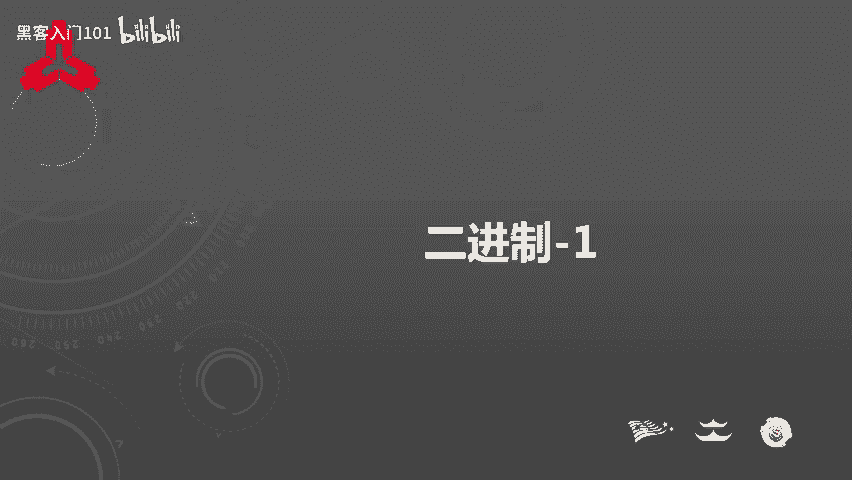

在本节课中，我们将学习CTF逆向工程的基础知识，重点介绍汇编语言的核心概念。逆向工程是分析二进制程序以理解其算法和逻辑的关键技能。

---

## 概述 📋

逆向工程涉及对二进制文件进行分析，以获取其算法并最终找到Flag。其难点在于汇编语言复杂、加密算法多样以及存在反调试和代码混淆等技术。


---

## 汇编语言基础

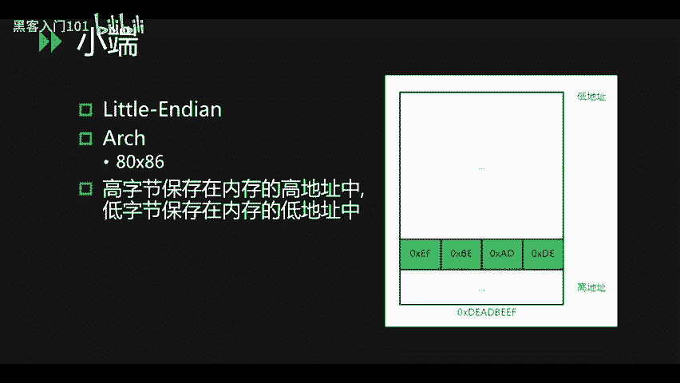

上一节我们概述了逆向工程的挑战，本节中我们来看看其基石——汇编语言的基础知识。

### 字节序：小端模式

我们常见的计算机通常采用小端模式。在这种模式下，数据的高字节保存在内存的高地址中，低字节保存在内存的低地址中。

例如，数据 `0xDEADBEEF` 在内存中的存储顺序如下：
- 低地址：`0xEF` (最低有效字节)
- 次低地址：`0xBE`
- 次高地址：`0xAD`
- 高地址：`0xDE` (最高有效字节)

这看起来像是字节顺序被“倒过来”存储了。

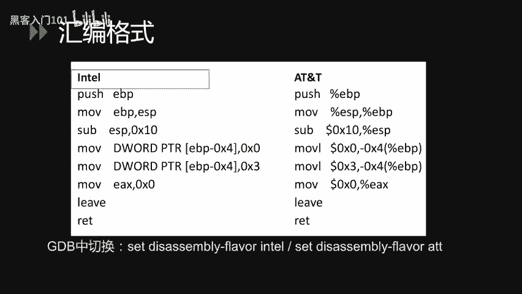

### 汇编格式：Intel 与 AT&T

汇编语言主要有两种格式：Intel 和 AT&T。以下是它们的主要区别：

- **AT&T格式**：在操作数前使用 `%` 符号（如寄存器），在立即数前使用 `$` 符号。源操作数在前，目标操作数在后。
- **Intel格式**：不使用 `%` 或 `$` 符号。目标操作数在前，源操作数在后。

例如，将 `ESP` 的值移动到 `EBP`：
- **Intel**: `mov ebp, esp`
- **AT&T**: `movl %esp, %ebp`

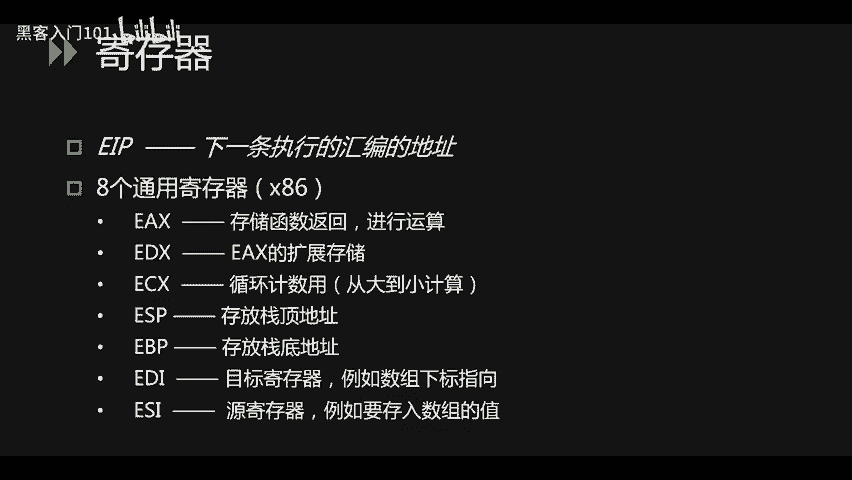

在Linux的GDB调试器中，可以使用 `set disassembly-flavor intel` 命令将反汇编切换为Intel格式。本教程后续将使用Intel格式进行讲解。

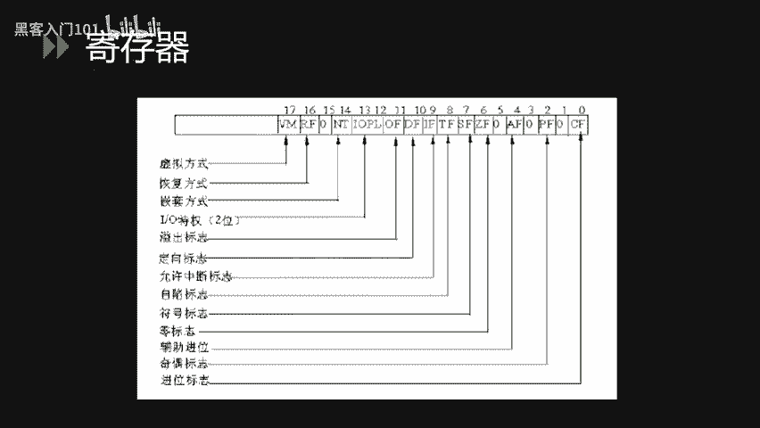

### 寄存器

在汇编中，寄存器是CPU中用于临时存储数据的小型存储单元。以下是X86架构（32位）中一些关键的寄存器：

- **EIP**：指令指针寄存器，存放下一条要执行的指令地址。
- **通用寄存器**：
    - **EAX**：累加器，常用于算术运算和函数返回值。
    - **ECX**：计数器，常用于循环计数。
    - **EDX**：数据寄存器，常作为EAX的扩展。
    - **EBX**：基址寄存器，可用于数组索引。
    - **ESP**：栈指针寄存器，指向当前栈顶。
    - **EBP**：基址指针寄存器，指向当前栈帧的底部。
    - **ESI**：源变址寄存器，常用于数据操作的源地址。
    - **EDI**：目的变址寄存器，常用于数据操作的目的地址。
- **标志寄存器**：包含多个标志位，用于记录CPU的状态，如：
    - **ZF (零标志)**：运算结果为零时置1。
    - **CF (进位标志)**：运算产生进位或借位时置1。
    - **OF (溢出标志)**：有符号数运算溢出时置1。

### 常用汇编指令

以下是汇编语言中一些最常用的指令。

#### 数据传输指令

这些指令用于在寄存器、内存和栈之间移动数据。

- **MOV**: 将数据从源移动到目标。
    ```assembly
    mov eax, DWORD PTR [ebp+8]  ; 将内存地址 ebp+8 处的4字节数据加载到 eax
    ```
    内存操作数大小：
    - `BYTE PTR`: 1字节
    - `WORD PTR`: 2字节
    - `DWORD PTR`: 4字节 (32位常见)
    - `QWORD PTR`: 8字节 (64位常见)

- **PUSH / POP**: 压栈和出栈操作。
    - `push eax`：将 `eax` 的值压入栈顶。
    - `pop eax`：将栈顶的值弹出到 `eax`。
    - `pushad` / `popad`：将所有通用寄存器的值压入/弹出栈。

- **LEA**: 加载有效地址。
    ```assembly
    lea eax, [0xABCD]  ; 将地址 0xABCD 存入 eax，而不是该地址处的值。
    ```

- **TEST / CMP**: 比较指令，用于设置标志寄存器。
    - `test eax, eax`：测试 `eax` 是否为零。
    - `cmp eax, ebx`：比较 `eax` 和 `ebx` 的值。

#### 程序控制指令

这些指令控制程序的执行流程。

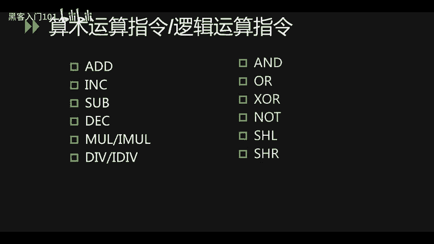

- **无条件跳转**：
    - `jmp <地址>`：直接跳转到指定地址。
    - `call <地址>`：调用函数，会将返回地址压栈，然后跳转。
    - `ret`：从函数返回，相当于 `pop eip`，将栈顶地址弹出到 `EIP`。
    - `leave`：清理栈帧，相当于 `mov esp, ebp` 后接 `pop ebp`。

- **条件跳转**：根据标志寄存器的状态决定是否跳转。
    - `jg` (jump if greater)：大于则跳转。
    - `jge` (jump if greater or equal)：大于等于则跳转。
    - `jl` (jump if less)：小于则跳转。
    - `jle` (jump if less or equal)：小于等于则跳转。
    - `je` (jump if equal)：等于则跳转。
    - `jne` (jump if not equal)：不等于则跳转。

#### 算术与逻辑运算指令

- **算术运算**：
    - `add`：加法
    - `sub`：减法
    - `imul`：有符号乘法
    - `idiv`：有符号除法
    - `inc`：递增 (加1)
    - `dec`：递减 (减1)

- **逻辑运算**：
    - `and`：按位与
    - `or`：按位或
    - `xor`：按位异或
    - `not`：按位取反
    - `shl`：逻辑左移
    - `shr`：逻辑右移

### 高级语言结构在汇编中的表现

理解了基本指令后，我们来看看高级语言中的常见结构如何对应到汇编代码。

#### If 条件判断

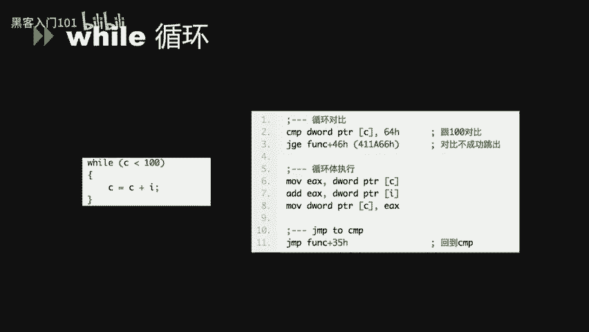

C语言代码：
```c
if (c > 0 && c < 10) {
    printf("c大于0");
}
```
对应的汇编逻辑：
1. 比较 `c` 与 `0`，若 `c <= 0`，则跳转到条件不成立的代码块（标签 `L1`）。
2. 比较 `c` 与 `10`，若 `c >= 10`，则同样跳转到 `L1`。
3. 如果两个条件都满足（即 `c > 0 && c < 10`），则顺序执行 `printf` 调用。

#### For 循环

C语言代码：
```c
for (int i = 0; i < 50; i++) {
    c = c + i;
}
```
对应的汇编逻辑：
1. `mov i, 0`：初始化计数器。
2. 跳转到循环条件判断处（标签 `L2`）。
3. 循环体：执行 `c = c + i`。
4. 循环更新：`inc i` (i++)。
5. 条件判断：比较 `i` 与 `50`，若 `i < 50`，则跳回 `L2` 继续循环；否则退出循环。

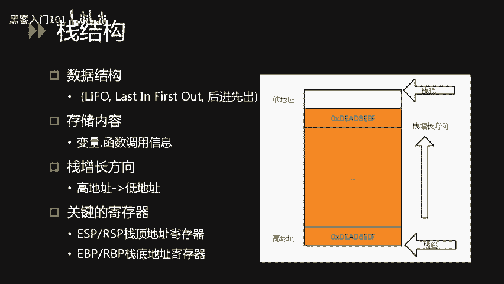

#### Do-While 循环

C语言代码：
```c
do {
    // 循环体
} while (c < 100);
```
对应的汇编逻辑：
1. 首先执行一次循环体。
2. 然后比较 `c` 与 `100`。
3. 若 `c < 100`，则跳回循环体开头继续执行。

#### While 循环

C语言代码：
```c
while (c < 100) {
    // 循环体
}
```
对应的汇编逻辑：
1. 在循环开始前，先跳转到条件判断处（标签 `L3`）。
2. 条件判断：比较 `c` 与 `100`，若 `c >= 100`，则跳转出循环（标签 `L4`）。
3. 若条件满足 (`c < 100`)，则执行循环体。
4. 循环体执行完毕后，无条件跳回 `L3` 进行下一次条件判断。

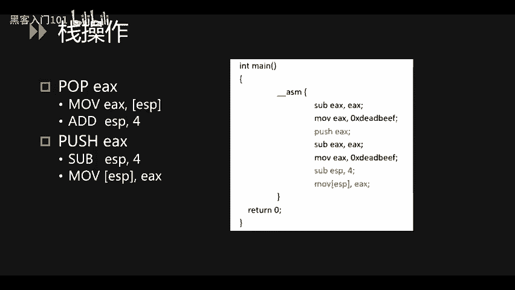

### 栈结构与函数调用

栈是内存中一种后进先出（LIFO）的数据结构，用于存储局部变量、函数参数和返回地址。

- **栈的增长方向**：在X86和X64架构中，栈从高地址向低地址增长。
- **关键寄存器**：
    - **ESP/RSP**：栈指针，始终指向栈顶。
    - **EBP/RBP**：基址指针，指向当前栈帧的底部。

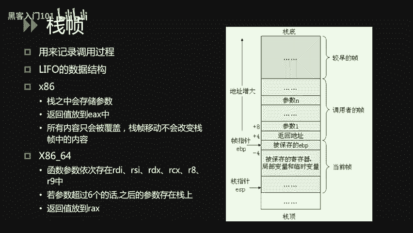

#### 栈操作详解

- **`pop eax` 的操作等效于**：
    1. `mov eax, DWORD PTR [esp]`：将栈顶值读入 `eax`。
    2. `add esp, 4`：栈指针下移4字节（释放空间）。
- **`push eax` 的操作等效于**：
    1. `sub esp, 4`：栈指针上移4字节（分配空间）。
    2. `mov DWORD PTR [esp], eax`：将 `eax` 的值存入新的栈顶。

#### 函数调用与栈帧

函数调用过程会创建一个新的栈帧。以下是一个调用 `add(1, 2)` 的示例：

1. **参数压栈**：参数从右向左压栈。
    ```assembly
    push 2      ; 第二个参数
    push 1      ; 第一个参数
    ```
2. **调用函数**：
    ```assembly
    call add    ; 1. 将下一条指令地址（返回地址）压栈。 2. 跳转到 add 函数。
    ```
3. **函数序言**（在 `add` 函数开头）：
    ```assembly
    push ebp            ; 保存调用者的 ebp
    mov ebp, esp        ; 设置新的栈帧基址
    sub esp, 0x20       ; 为局部变量分配栈空间
    ```
4. **函数体**：执行实际功能代码。
5. **函数尾声**（在 `add` 函数返回前）：
    ```assembly
    mov esp, ebp        ; 回收局部变量空间，esp 指向保存的 ebp
    pop ebp             ; 恢复调用者的 ebp
    ret                 ; 弹出返回地址到 eip，跳回调用者
    ```
6. **调用者清理**：调用者负责清理压入栈的参数。
    ```assembly
    add esp, 8          ; 平衡栈，清理两个4字节参数
    ```

在64位系统中，前6个整数或指针参数通常通过寄存器 `RDI, RSI, RDX, RCX, R8, R9` 传递，超出部分才使用栈。

---

## 总结 🎯

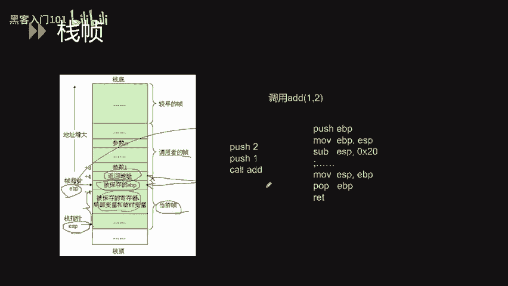

本节课中我们一起学习了逆向工程和汇编语言的基础知识。我们了解了小端字节序、Intel与AT&T汇编格式的区别、核心寄存器的作用以及常用汇编指令。我们还探讨了高级语言控制结构（如if、for、while循环）在汇编层面的实现，并深入分析了栈的结构和函数调用约定（调用约定）。掌握这些基础是理解更复杂二进制程序和分析算法的第一步。