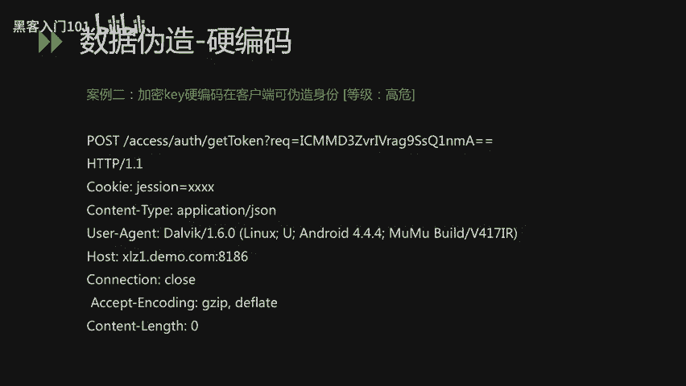
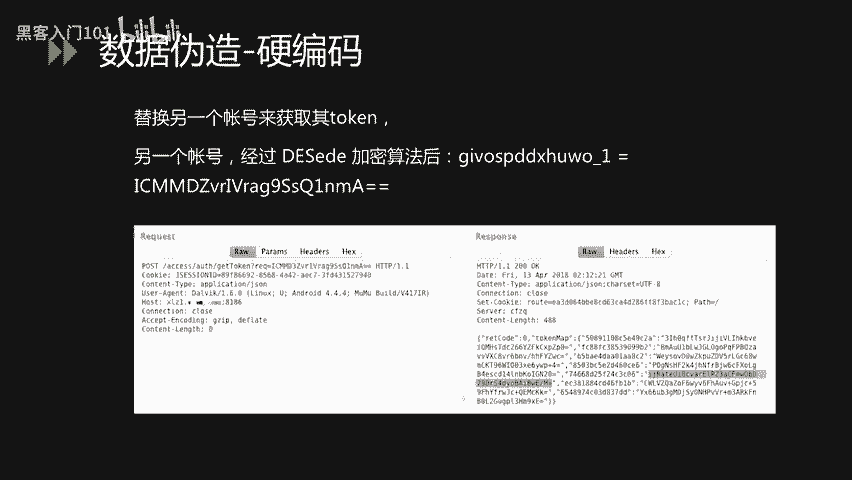
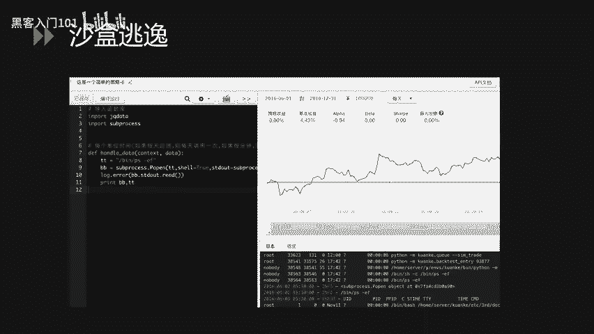
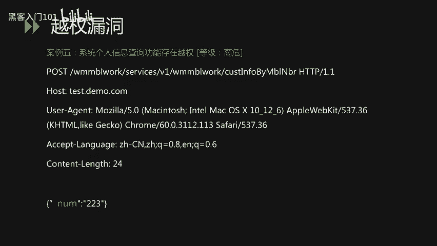
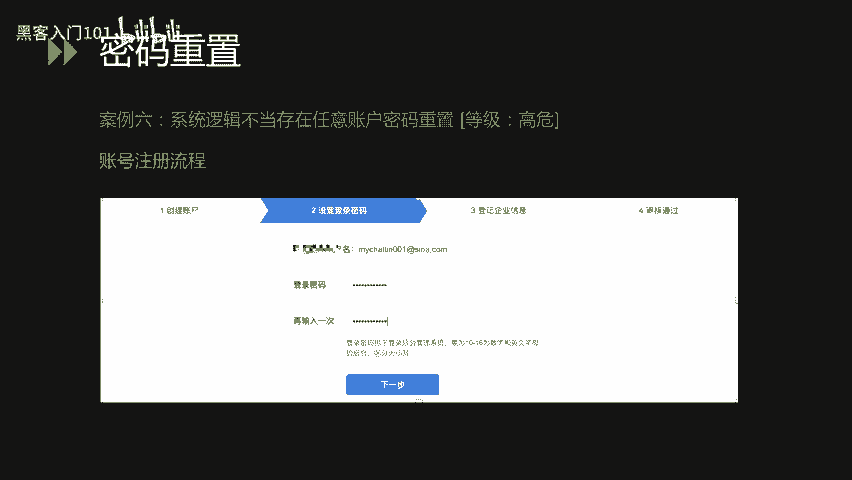
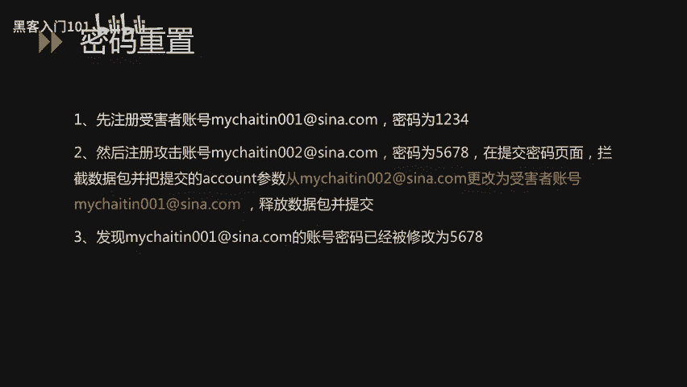
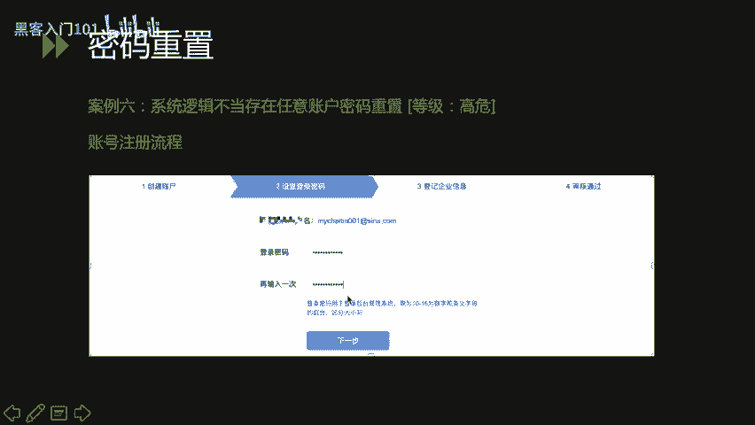
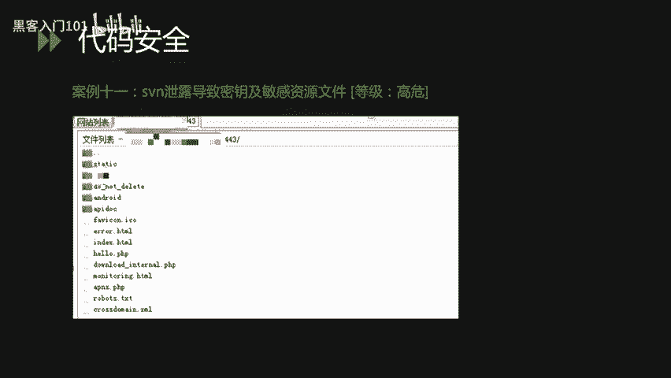
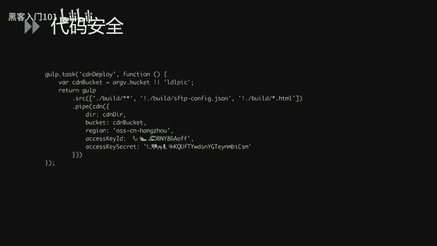
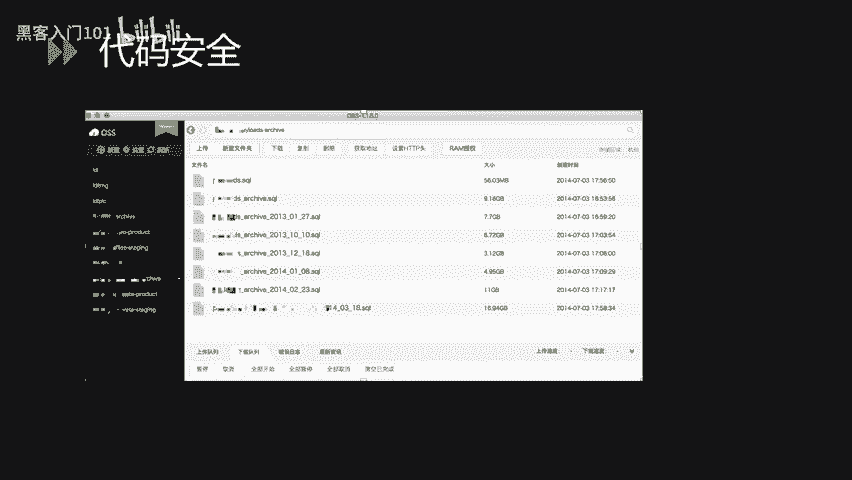

# CTF与网络安全实战：P32：34.金融业网络安全攻防案例剖析 🔐


在本节课中，我们将剖析金融业网络安全攻防中的实际案例。通过学习这些案例，我们可以了解攻击者常用的手法以及防御的关键点，从而提升对网络安全的理解和实战能力。

## 概述：网络攻击中的四类主要漏洞

在所有的网络攻击过程中，主要包含以下四类漏洞。

以下是这四类漏洞的简要介绍：
*   **应用层漏洞**：主要指OWASP Top 10中介绍的漏洞，如SQL注入、XSS、CSRF、SSRF以及文件操作、命令执行等。
*   **业务逻辑层漏洞**：包括越权漏洞、身份认证缺陷、常见的逻辑漏洞（如密码重置逻辑问题）等。
*   **安全运维层漏洞**：由于安全运维人员操作不当或安全意识不足导致的问题，例如软件版本未及时更新、系统未打补丁、配置不当导致信息泄露等。
*   **安全意识层漏洞**：指人员在工作过程中因安全意识不足导致的安全隐患，例如使用通用密码、点击钓鱼邮件、机密文件保管不当等。

本章内容将根据这四部分进行详细描述。

## 第一部分：应用层漏洞剖析

上一节我们概述了网络攻击的主要漏洞类型，本节中我们来看看应用层漏洞的具体案例。应用层漏洞主要介绍以下四类：SQL注入、数据伪造、沙盒逃逸和文件上传。我们将针对每种类型举出一个实际案例。

### 案例一：SQL注入漏洞

首先，在案例一中是一个某系统的SQL Server注入漏洞。这个注入漏洞的后果除了能获取敏感数据外，还能通过向操作系统写入文件达到获取服务器权限的目的。

大家可以先观察这个数据包。在POST数据包中，我们可以看到在`UID=1`后边加入了一个单引号，程序就会报错。我们初步判断这个地方可能存在注入。

经过一系列尝试，我们使用了一个类型转换函数`CONVERT`，将数据库里的`user`参数（`char`类型）转化为`int`类型。当把这个字符串组合在数据包中发给后端处理时，程序报错，提示信息显示将`char`转化为`int`时失败。由此我们可以断定此处存在SQL注入。

经过进一步测试，我们发现当前MySQL的权限是`SA`权限（最高数据库权限），支持`UNION`查询，操作系统的用户权限是`system`权限，并且数据库开启了`xp_cmdshell`函数。开启此函数后，我们就可以通过注入点执行系统命令。

我们观察修改后的数据包，将之前`CONVERT`操作的逻辑改为用`xp_cmdshell`执行一个`whoami`操作，并将结果输出到web目录下的一个txt文件中。发包后发现成功将执行结果写入了该文件。访问该文件，可以看到成功写入了当前操作系统的权限用户信息。

回顾这个漏洞，我们发现通过这个SQL注入，不仅可以获取数据，还可以直接获取操作系统的权限。

**什么是SQL注入？**
SQL注入是指通过构造特殊的输入作为参数传给后端的Web程序，进而执行攻击者所要操作的逻辑。在用户输入没有进行过滤的情况下，就会发生这种形式的注入攻击，导致应用程序的终端用户对数据库上的语句实施非法操作。

根据注入类型不同，SQL注入可分为字符型注入、数字型注入等。SQL注入的危害主要表现在对数据库的信息窃取。在某些条件下，还可以被攻击者写入恶意文件，造成操作系统权限丢失，正如本案例所示。

SQL注入形成的原因主要是开发人员在开发过程中没有严格审核客户端传给服务器的参数，同时该参数被当做SQL语句的一部分执行。当采用字符串拼接的方式执行SQL语句时，攻击者就有机会在参数中插入恶意的SQL查询语句，达到攻击目的。SQL注入漏洞也是发生频率非常高的一类漏洞。

### 案例二：数据伪造漏洞

接下来一个案例中，我们讲解数据伪造漏洞。除了常见的身份伪造，现在很多企业还存在一类漏洞，即加密算法和加密密钥可以被轻易窃取。

大家可以观察这个数据包。这是一个普通的数据包，包含`Host`、`User-Agent`等。唯一不同的是在链接中有一个`getToken`方法，该方法将`req`参数的值传给`getToken`方法，经过一系列处理后返回当前用户的`token`。

在测试过程中发现`req`这个加密密文后，我们猜测它有两种可能：一种是Base64编码，另一种可能是DES加密算法。

**什么是DES加密？**
DES加密是一种密钥加密算法，于1977年被美国联邦政府国家标准局确定为联邦资料处理标准，并授权在非密集政府通信中使用，随后该算法在国际上广泛流传。DES设计过程中使用了分组密码设计的两个原则：混淆和扩散，目的是抗击敌手对密码系统的统计分析。



在观察到`req`参数的特征后，我们逆向分析了当前应用的客户端，很幸运地在客户端里发现了加解密函数代码。在函数中我们看到了`secretKeySpace`这样的参数，这个参数其实就是DES加密和解密过程中使用的密钥。拿到这个密钥后，就可以对链接中的`req`参数进行加密或解密。

我们尝试将`givopddxsuwo_1`这个参数通过刚才发现的密钥进行DES加密，然后粘贴到数据包中重放。重放后，它返回了`givospddxhuwo_1`这个用户的`token`，导致我们可以通过这个`token`获取该用户的身份信息。

像这样的密钥硬编码在客户端里的现象，在当前企业应用中还是非常多的。因为传统加密方式可能已做完善处理，很难找到攻击入口。现在移动端普及，移动端可能更多地成为了攻击入口。我们建议在客户端打包或上线前进行加壳或加固操作。

**什么是加壳？**
加壳就是在二进制程序中植入一段代码，程序在运行时优先获取程序控制权，做一些额外工作。大多数病毒也基于此原理。加壳是应用加固的一种手段，对二进制原始文件进行加密、混淆及隐藏。通过加壳可以有效阻止攻击者对程序的反编译，加大其获取敏感信息的难度。



### 案例三：沙盒逃逸漏洞

案例三中，我们讲一个在金融证券行业经常遇到的安全问题：沙盒逃逸。在讲沙盒逃逸之前，先介绍金融证券行业一个经常会遇到的系统：量化交易系统。

**什么是量化交易系统？**
量化交易系统是指以数学模型替代人为的主观判断，利用计算机技术从庞大的历史数据中海选出能带来超额收益的多种大概率事件策略，减少投资者情绪对选股或走势判断的影响，避免在市场极度狂热或悲观时做出非理性投资决策。此类系统被广泛应用于金融和证券行业。

这样的量化交易系统会给用户提供源码编辑功能，用户可根据需求编写代码来完成自动化的策略选型或构造。这其中存在一个隐患：用户编写的代码运行在系统的沙盒里。一旦沙盒被逃逸，恶意攻击者就可以直接在操作系统层执行命令。

我们来看一个具体案例。在这个量化交易模型中，有一个用户编写源码的界面，用户可以定制化函数来设定要操作的股票或基金。常见的沙盒是一个Python沙盒。我们讲一下Python里的`subprocess`模块。

**什么是subprocess模块？**
`subprocess`模块是Python从2.4版本引入的模块，主要用来取代一些旧方法，如`os.system`、`os.spawn`等。它通过子进程调用来执行外部指令，并通过`input`、`output`或`error`管道获取子进程的返回信息。

我们讲一下如何通过`subprocess`模块进行沙盒逃逸。我们将Payload写在源码里，通过编译运行达到逃逸目的。

以下是我们的Payload：
```python
import subprocess
def handle_data():
    tt = "/bin/ps -ef"
    bb = subprocess.Popen(tt, shell=True)
    log_error(bb)
```
首先引入相关模块，定义`handle_data`方法。在方法里，定义变量`tt`，赋值为`/bin/ps -ef`（Linux常用命令）。然后初始化`subprocess.Popen`方法，将`tt`变量传入，同时设置`shell=True`。当`shell`参数为`True`时，可以直接传入命令字符串。最后在`log_error`方法中打印出执行结果。

我们将Payload放在左边量化交易模型的沙盒中，点击编译运行。在右下角的日志里，可以看到已经输出了当前系统的进程信息，达到了执行操作系统命令的效果，完成了一次沙盒逃逸。除了执行`ps -ef`，还可以执行网络相关命令，如下载恶意文件并反弹shell，达到直接入侵内网的效果。

沙盒逃逸在当前很多证券和金融行业中，沙盒的安全性相对较低。一个原因是之前大家未关注此方面，另一个原因是Python等沙盒的库或模块更新、特性更改时，沙盒没有及时迭代到最新版本，可能遗留一些可导致逃逸的特性。在之后的运维和迭代更新中，需要特别注意基础模块的迭代更新，防止沙盒逃逸。

### 案例四：任意文件操作漏洞

接下来我们介绍另一类漏洞：任意文件操作漏洞。这里我们举一个通过任意文件操作导致getshell的案例。这个案例不仅用到了文件上传，还用到了任意文件读取。

首先看下图，我们通过`curl`一个地址，获取到了一些`bash_history`的内容。这个地方存在一个任意文件读取漏洞，通过在URL里拼接相关文件路径，达到读取文件的操作。

**什么是任意文件操作漏洞？**
任意文件操作漏洞包括文件上传、文件读取、任意文件删除、任意文件下载以及任意文件包含等。其中任意文件上传是渗透测试中经常遇到的安全问题。大多数业务系统都有上传文件功能（如上传头像、资料）。当系统没有对上传文件进行校验或过滤时，就可能导致攻击者直接上传Webshell，进而控制服务器权限。



在这个案例中，我们通过任意文件读取，首先获取了当前Web系统的一些框架代码。对代码进行审计后，发现代码里有一些接口没有在网站上体现出来但可以访问。例如下图中这个接口，它是一个个人资料设置功能，其中的上传头像方法没有对文件类型进行判断，没有限制只能上传JPG或PNG等图片格式。我们直接上传一个JSP的Webshell文件，就可以直接getshell。

我们上传一个`cmd.jsp`后发现文件成功解析，传入参数后直接获得了操作系统的命令执行权限。这里展示了获取当前操作系统IP地址的命令。

## 第二部分：业务逻辑层漏洞剖析

讲完应用层的漏洞，我们再来介绍一下业务逻辑层的一些漏洞。相对于应用层漏洞，业务逻辑层漏洞在自动化检测方面比较难做到，因为它伴随着业务逻辑，需要加入逻辑分析。

### 案例五：越权漏洞

下面这个案例是关于越权漏洞，是一个系统个人信息查询功能的越权。

我们先来看一下这个数据包。这是一个非常普通的数据包，POST的body里有一个`number`参数，其值是`223`。在测试过程中，我们发现这个`number`的值代表了当前用户的UID，后端通过获取这个值去数据库查询用户身份信息。在测试中，通过修改`number`值，比如把`223`改成`220`，就可以获取到其他用户的信息。

这样的漏洞一旦被攻击者检测到，就可以进行自动化批量操作，来获取大量用户信息。例如在下图中，通过遍历`number`参数，可以大批量获取对应账户的姓名、身份证、账户余额、工作单位等信息，对企业和用户都造成非常严重的影响。

越权漏洞在金融和证券领域出现频率相对较高。因为该领域业务非常复杂，有时因接口调用不当或身份没有健全，就很容易出现这种简单易发现的越权漏洞。

### 案例六：密码重置漏洞



接下来我们讲一下密码重置漏洞。密码重置漏洞是业务逻辑漏洞的一种形式。在这个案例中，我们将介绍如何通过在注册账号的过程中重置别人的密码。

首先看下图，它是一个比较标准的开户或注册账号流程：创建账户、设置密码、设置登录个人信息、后续审核。

在这个案例中，我们首先注册一个A用户（如`001`）作为受害者，设置密码为`1234`。同时我们注册一个`002`用户，设置密码为`5678`。在提交密码的这一步，我们对数据包进行拦截，把数据包中关键的`account`参数（即账号信息，如`002`）改为受害者的账户`001`。提交这个数据包后，发现后端成功执行并返回结果。后续登录时，发现`001`的密码已经被设置成了`5678`。

从图中可以看到，把`account`参数改为任意一个想要攻击的账户，就可以将其密码设置为我们可以控制的密码。密码重置漏洞相对来说少一点，但所带来的危害非常严重。



## 第三部分：安全运维层漏洞剖析



接下来第三部分讲一下运维漏洞。运维漏洞里我们主要讲两类：Nday漏洞和配置不当漏洞。



### 案例七：Nday漏洞


所谓Nday漏洞，是区别于0day漏洞来说的。0day漏洞可能是刚爆发的最新安全漏洞，官方可能还没有发布补丁。而Nday漏洞，可能是官方已经发布补丁，或漏洞已爆出很长时间并有了有效防御措施，但依然能通过此漏洞对业务系统造成损害。这就是运维过程中没有及时打补丁、更新系统版本导致的安全问题。

在案例七中，我们介绍一个在金融和证券行业经常会遇到的WebLogic、Struts、Tomcat等中间件或框架的案例。在测试某金融行业网站时，我们在8009端口发现了一些WebLogic的报错信息。尝试通过一些已写好的漏洞利用代码对该WebLogic版本进行测试。发现当输入一些操作系统命令时，当前WebLogic所在的服务器成功执行并返回了结果。这也是一个Nday漏洞的典型案例，在WebLogic、Struts、Tomcat中经常会遇到。

这需要企业的运维人员及时对这些系统的中间件、框架进行信息梳理，建立系统与当前版本的映射关系，以便在这些框架爆发新漏洞时，能够及时对业务系统的版本有详细了解。

### 案例八：配置不当漏洞

另外一部分，我们在运维过程中介绍一个因运维不当导致的安全问题。案例八中我们介绍一个因为备份文件没有删除导致的严重安全问题。

首先，这个漏洞始于一个备份文件没有删除。我们通过`curl`这个文件发现可以下载。下载解压后，发现这个文件夹包含了整个网站的所有代码、配置信息以及日志等。在翻阅备份文件的过程中，我们发现了一个配置文件。从图中可以发现它有数据库的端口、用户名、数据库名、密码等。

虽然数据库可能在内网无法直接连接，但我们可以通过这样的密码找到一些规律，利用这些信息在渗透测试中对攻击者有很大帮助。

## 第四部分：安全意识层漏洞剖析

最后一部分我们介绍一下安全意识。安全意识相对于前面三个技术环节，是最难管理也最难杜绝的一部分。在安全意识里，我们主要介绍两部分：口令相关和代码安全相关。

### 案例九：弱口令漏洞

口令相关我们举一个非常典型的案例：弱口令导致的getshell。

在下图中大家肯定很熟悉，这是一个Tomcat的管理界面。在案例九中，我们首先获取到了一个弱口令，然后登录到系统后台。Tomcat是一个Web容器，可以部署Web应用。登录后台后，我们部署了一个带有恶意文件的Web应用，就直接getshell，获取了当前网站的权限。下图是上传成功后执行命令的结果，可以看到能获取当前目录下的所有文件，还可以新建文件夹、文件，上传文件以及直接执行操作系统命令。

### 案例十：代码仓库配置文件泄露

案例十中我们介绍一下GitHub等代码仓库的配置文件泄露。其实不光配置文件，GitHub上可能还泄露了业务代码。这部分漏洞也是在金融和互联网公司中经常会遇到的状况。可能有开发人员在项目结束后，为了管理代码，将代码上传到一些开放的平台上。如果这些代码被恶意攻击者获取，他能对代码进行白盒审计或直接从代码里获取配置文件，直接对业务系统造成危害。

通过白盒审计的方式，可以发现一些黑盒测试很难发现的高危漏洞。在下图中，我们任意搜了一个`mysql connect`数据库的关键字，可以看到大概有47000多条数据，这里面肯定有很多可以直接连接上。这也是希望我们在开发过程中尽量避免将代码上传到互联网上的不好习惯。

在这个案例中，我们通过一些关键字直接获取到了运维人员的运维手册。在这个手册里，可以清楚地看到它记录了不同操作系统、不同数据库以及不同业务系统的内外网地址，包括数据库的用户名密码、操作系统的用户名密码等，介绍得非常详细。如果这份文件被恶意攻击者拿到，他就可以直接获取操作系统的权限，进而威胁到企业安全。

### 案例十一：SVN泄露漏洞

除了安全意识导致的代码安全隐患，在技术环节也会泄露代码，对业务代码构成威胁。例如在案例十一中，我们介绍SVN泄露这类漏洞。

**什么是SVN泄露？**
SVN泄露是在SVN管理本地代码过程中，会生成一个`.svn`隐藏文件夹，其中包含重要的源代码信息。一些网站管理员在发布代码时，不愿使用导出功能，而是直接复制文件夹到外网服务器，这就使`.svn`隐藏文件夹暴露在外网。黑客可以借助`.svn`文件夹内的文件索引还原出线上代码，进而对代码进行白盒审计或搜索配置文件信息，威胁企业内网安全。

在这个案例中，我们通过一个SVN泄露，成功获取到了线上服务器的代码。在代码里找到了一个配置文件，该配置文件是静态文件存储的一个OSS服务器的密钥（`AccessKey`和`AccessSecret`）。我们通过这个账号直接获取到了企业里的一些敏感数据，包括数据库文件等，都会对企业造成非常致命的影响。





## 总结




本节课中，我们一起学习了金融业网络安全攻防中的四类主要漏洞：应用层漏洞、业务逻辑层漏洞、安全运维层漏洞和安全意识层漏洞。通过十一个具体案例，我们剖析了SQL注入、数据伪造、沙盒逃逸、文件上传、越权、密码重置、Nday漏洞、配置不当、弱口令、代码泄露及SVN泄露等常见攻击手法及其危害。理解这些案例有助于我们构建更全面的安全防御视角，在开发、运维及日常工作中规避类似风险。