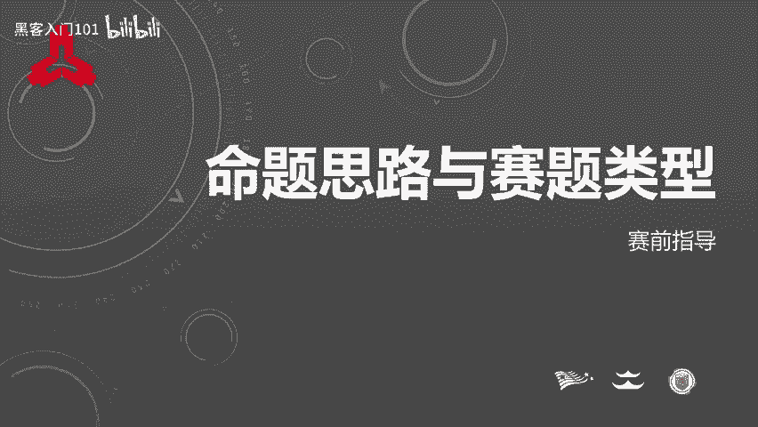
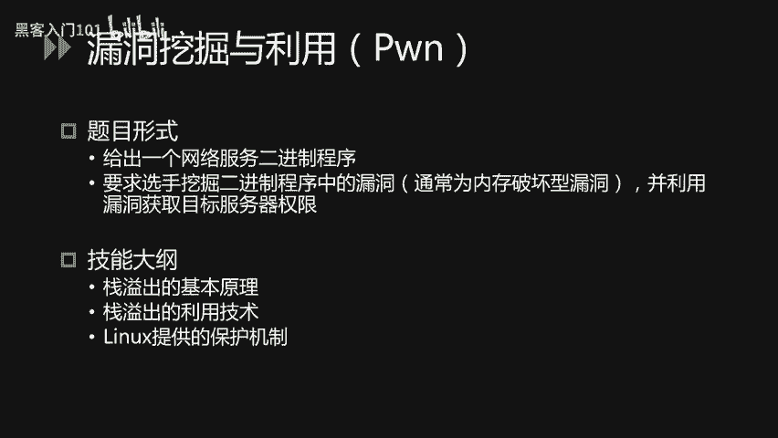
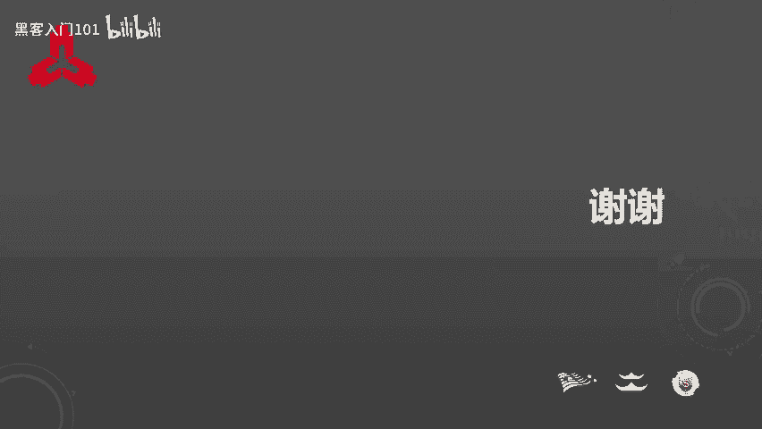

# CTF入门与实战：P33：命题思路与赛题类型 📚

在本节课中，我们将梳理CTF比赛的命题思路与主要赛题类型，帮助初学者了解比赛框架并为实战做好准备。

## 命题思路 🎯

为了最大化参赛选手的收获，命题遵循以下核心要求：

*   **考点设置合理**：题目应有明确目标与合理的预期解题思路，避免纯粹依赖“套路”或大量猜测的“脑洞题”。
*   **贴合实战需求**：考点应能为金融行业的网络安全工作提供帮助，侧重考察实际工作中可能用到的技能。
*   **技术多样性**：题目涵盖的技术点应尽可能丰富，以应对现实中攻击者千变万化的技术手段。同时，知识点比重会大致符合金融业网络安全工作的实际需求，做到学以致用。

本次比赛的所有题目均以金融行业相关业务为背景，并融合了真实的金融业网络安全攻防案例。这些案例源于实际的安全工作，后续会有专门课程介绍。以下是部分命题参考的真实案例：
*   网站入侵
*   恶意软件与勒索软件的清理
*   移动应用破解
*   日志与流量的分析与取证
*   密码保护方式
*   企业信息泄露

## 赛题类型详解 🧩

上一节我们介绍了整体的命题原则，本节中我们来看看具体的赛题类型。本次比赛共设置6种题目类型，其比例如下：

### 1. Web安全 🌐

Web安全题目比重最高，因为Web网站是金融行业应用最广泛的服务形式，一旦被入侵可能导致严重后果。

题目通常给出一个Web网站，要求选手通过信息收集、挖掘并利用漏洞来获取目标权限或数据。

以下是需要准备的核心技能：
*   **漏洞原理**：掌握OWASP Top 10漏洞的原理与利用技巧，特别是SQL注入、XSS、文件上传等。
*   **信息泄露**：了解常见的信息泄露方式。
*   **代码审计**：具备PHP和Java语言的代码审计能力，Java可能需使用反编译工具。
*   **业务逻辑**：题目可能涉及业务逻辑漏洞。
*   **新兴漏洞**：了解近年来出现的著名漏洞，这是应急响应的基础能力。

### 2. 移动安全 📱

移动安全题目比重排名第二，随着移动互联网发展，金融机构的移动应用安全至关重要。

题目通常给出一个安卓应用，常见形式有两种：一是分析算法求解正确输入（Crack Me）；二是分析客户端与服务端的通信以实现指定目标。

以下是需要准备的核心技能：
*   **流量分析**：掌握安卓应用与服务端通信的流量抓取与分析。
*   **逆向调试**：掌握安卓应用的逆向分析与调试技术。
*   **应用修改**：掌握安卓应用的修改方法。

### 3. 取证分析 🔍

取证类题目模拟企业在发现入侵痕迹后的分析工作。

题目通常给出一段日志或网络流量数据包，要求选手分析其中包含的关键信息。

以下是需要准备的核心技能：
*   **日志分析**：具备常见的日志分析能力。
*   **流量分析**：熟悉网络流量抓取和分析的方法。

### 4. 隐写术 🖼️

隐写术题目考察信息隐藏与发现的技巧。

题目通常给出一个多媒体文件（如图像、音频、视频、文档等），要求选手找出其中隐藏的信息。

以下是需要准备的核心技能：
*   **文件格式**：了解常见的文件格式及其结构。

### 5. 逆向工程 ⚙️

逆向工程题目考察对二进制程序的分析能力。

题目通常有两种形式：一是给出程序，通过分析算法求解正确输入（标准Crack Me）；二是要求通过修改二进制程序实现非预期功能。

以下是需要准备的核心技能：
*   **逆向分析**：掌握Windows和Linux软件的逆向分析与调试技术。
*   **二进制修改**：掌握二进制软件的修改方法。

### 6. 密码学 🔐

密码学题目考察加密算法的分析与破解能力。

题目通常给出密文及相关信息（如加密代码、加密方式），要求选手通过分析来破解明文。破解方式可能包括针对算法误用的攻击或加密代码的反推。

以下是需要准备的核心技能：
*   **哈希算法**：了解常见的哈希算法。
*   **对称加密**：掌握分组密码和加密模式，如`ECB`、`CBC`等。
*   **非对称加密**：理解`RSA`等非对称加密算法的原理及相关攻击方式。

### 7. 漏洞挖掘与利用（Pwn） 💥

Pwn题目考察二进制程序漏洞的挖掘与利用能力。

题目通常给出一个网络服务或二进制程序，要求选手挖掘其中的内存破坏型漏洞，并利用该漏洞获取目标服务器的权限。

以下是需要准备的核心技能：
*   **漏洞原理**：掌握栈溢出等漏洞的基本原理。
*   **利用技术**：掌握漏洞利用技术。
*   **系统保护**：最好了解Linux系统提供的安全保护机制及其绕过方法。

---

本节课中，我们一起学习了CTF比赛的命题思路与七大主要赛题类型（Web、移动、取证、隐写、逆向、密码学、Pwn），了解了每种题型的特点和需要掌握的核心技能。希望这些梳理能帮助大家有针对性地备赛。

预祝大家在比赛中取得好成绩！🏆

