# CTF逆向工程：P34：移动安全_1 - 安卓逆向入门与实战 🛡️

在本节课中，我们将学习CTF比赛中逆向工程的一个重要分支——安卓逆向。我们将从安卓开发的基础知识讲起，介绍逆向所需的工具、常见考点，并通过两道实战题目演示静态分析的基本流程。

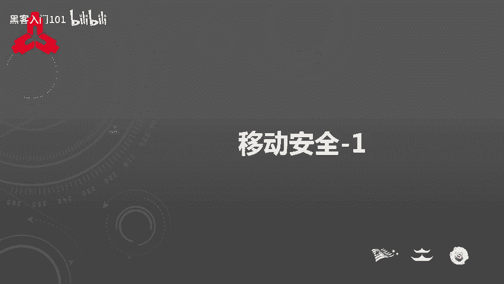

## 概述 📋

安卓逆向在实际应用中非常广泛，例如破解VIP功能、分析通信协议或去除广告等。因此，CTF比赛也将其作为逆向工程的一个重要方向。本节课将从以下三个方面展开：
1.  安卓开发基础（SDK与NDK）。
2.  安卓逆向常用工具与CTF常见考点。
3.  安卓逆向实战演示（静态分析Java层与Native层代码）。

---

## 安卓开发基础 🏗️

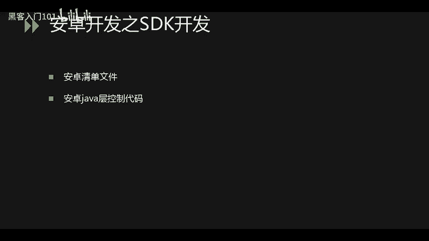

理解安卓逆向，首先需要了解APK文件的结构及其组成部分的来源。反编译APK后会生成多种文件，你需要知道关键信息存放在何处。

### SDK开发（Java开发）

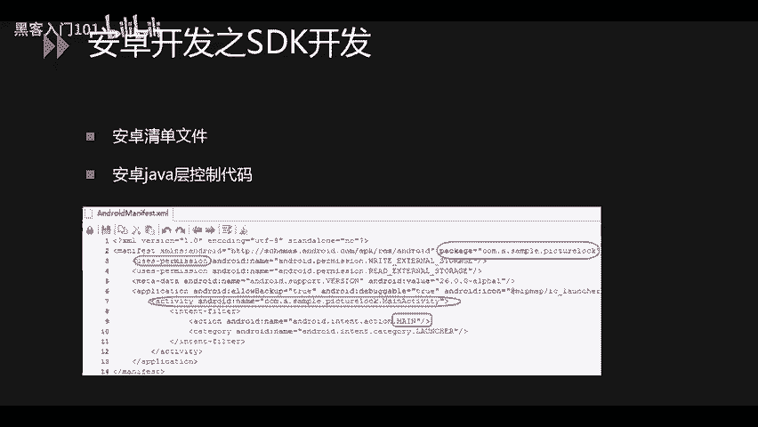

SDK开发即常规的Java开发。逆向时，有两个文件至关重要：**AndroidManifest.xml**（清单文件）和由Java代码编译生成的 **.dex** 文件。

**AndroidManifest.xml** 是安卓应用的核心配置文件。


从图中可以看出，它包含了应用的包名、声明的权限（安装时申请的权限即来源于此）以及程序入口等信息。在逆向前后，此文件都存放在项目根目录，区别在于：编译后生成的文件是二进制、不可读的；逆向工具通过解析文件格式，将其恢复成开发者编写时的样子。

**Java代码** 编译后会生成 **.dex** 可执行文件。


同样，逆向工具会解析.dex文件，生成 **smali** 文件夹，里面存放的是逆向出来的汇编级代码。我们可以使用工具将其转换为更易读的Java伪代码进行查看。

### APK文件结构

APK文件本质上是一种压缩包格式，使用解压软件即可打开。以下是其内部的关键文件和目录：

*   **assets/**：存放资源文件（如图片、数据库），不参与编译。
*   **lib/**：存放NDK开发中，由C/C++代码编译生成的 **.so** 动态库文件。
*   **META-INF/**：存放APK的签名信息。
*   **res/** 和 **resources.arsc**：存放字符串、布局等资源文件，需要解析后才能读取。
*   **AndroidManifest.xml**：即上文提到的清单文件。
*   **classes.dex**：Java代码编译后的可执行文件，需要逆向解析。

### NDK开发（Native开发）

NDK开发使用C或C++语言编写核心代码，目的是为了保护代码。因为Java层代码逆向相对容易，而C语言逆向得到的是汇编代码，理解难度更大，从而增加了逆向成本。

在NDK开发中，核心逻辑写在 **.so** 库文件中，在Java层进行声明和调用。
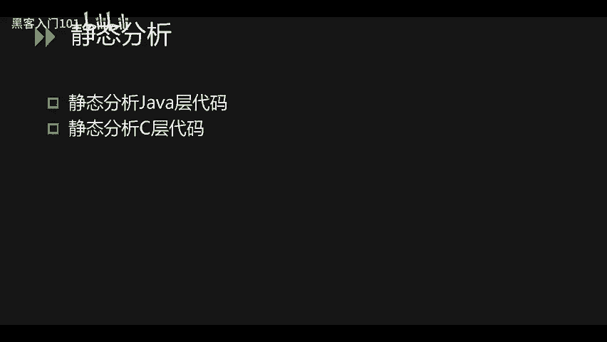

如上图所示，`System.loadLibrary()` 用于加载.so文件（注意加载时省略了“lib”前缀和“.so”后缀），而 `native` 关键字用于声明本地方法。

---

## 逆向工具与考点分析 🔧

上一节我们介绍了安卓开发的基础，本节中我们来看看进行安卓逆向需要哪些工具，以及CTF比赛中常见的考察点。

### 常用逆向工具

以下是安卓逆向中常用的几类工具：

**反编译工具**
用于将APK文件解包并反编译出资源、清单文件和代码。
*   **Android Killer**：功能强大的集成化逆向工具。
*   **APKIDE**：同样集成了反编译、编辑、重打包等多项功能。
*   **JADX**：专注于将.dex文件反编译为Java代码，查看代码非常方便，但不提供重打包功能。


**代码分析工具**
用于深入分析反编译后的代码，特别是Native层代码。
*   **IDA Pro**：逆向分析的利器，主要用于分析.so等二进制文件，支持反汇编和伪代码生成（F5键功能）。
*   **十六进制编辑器**（如010 Editor、WinHex）：用于查看文件头，快速判断文件类型（如APK文件以`PK`开头），确定逆向方向。

**动态调试环境**
*   **Root权限的安卓手机或模拟器**：用于对应用进行动态调试，获取运行时的内存数据。

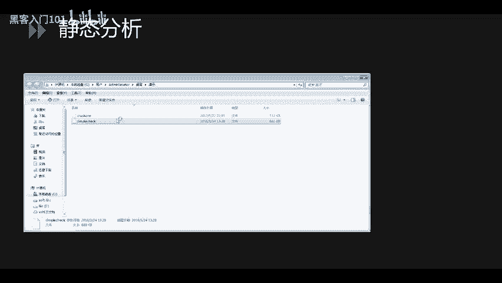

### CTF安卓逆向常见考点

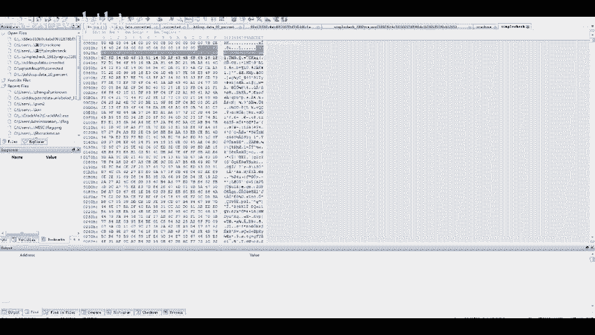

CTF中的安卓逆向题目通常遵循从易到难的规律：

1.  **初级**：Flag直接存放在资源文件或备份文件中。
2.  **中级**：需要对Java层代码进行逆向分析，编写解密程序即可获得Flag。
3.  **高级**：涉及Native层（C/C++）代码的逆向分析，需要阅读汇编或伪代码，编写逆算法。
4.  **动态调试**：Flag或关键数据隐藏在内存中，必须通过动态调试才能获取。
5.  **加固与混淆**：
    *   **加壳**：应用使用了商业壳进行保护，需要先**脱壳**才能看到原始代码。
    *   **虚拟机混淆**：即使脱壳后，Native代码也经过了混淆处理，极大增加分析难度。

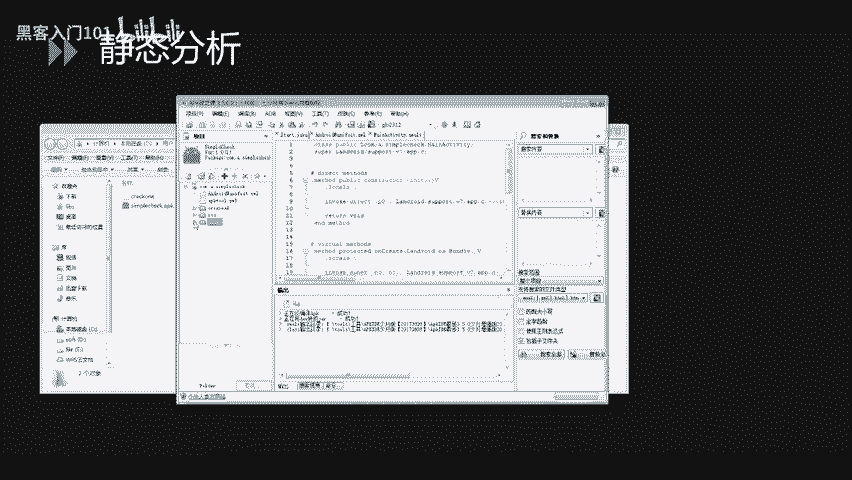

---

## 安卓逆向实战演示 🎯

了解了基础知识和工具后，现在进入实战环节。我们将通过两道题目演示静态分析的基本方法：第一题纯Java层逆向，第二题则需要结合Java层和Native层分析。

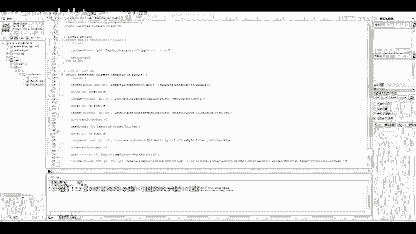

### 实战一：纯Java层逆向分析

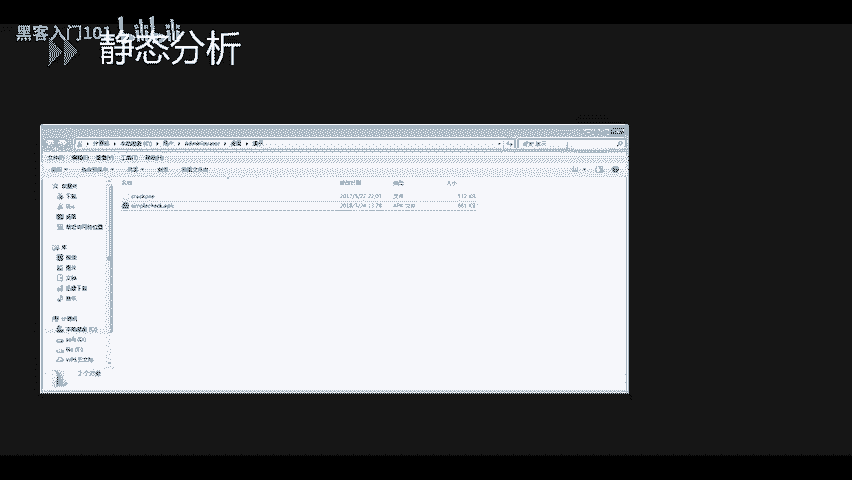

首先，我们拿到一个CTF题目文件。第一步总是使用**十六进制编辑器**查看文件类型。


可以看到文件以`PK`开头，并且包含`AndroidManifest.xml`字符串，确认这是一个APK文件。将其后缀名改为`.apk`。

接下来，使用反编译工具（如APKIDE）打开它。


工具会自动反编译，生成smali代码和资源文件。我们首先查看`AndroidManifest.xml`，找到程序入口（例如`com.a.simplecheck.MainActivity`）。


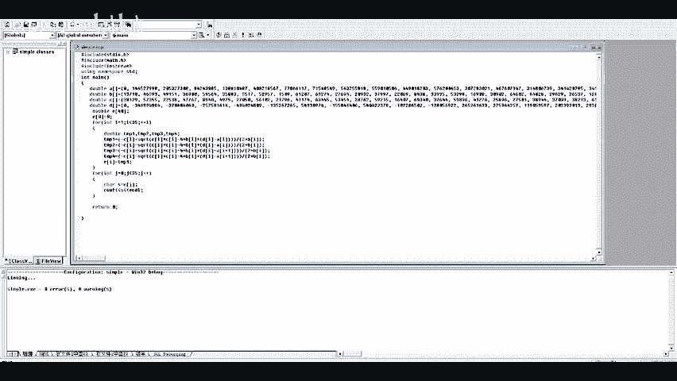

然后，在smali目录或使用工具的Java代码查看功能，找到入口Activity的`onCreate`方法。


分析代码发现，核心是一个`if`判断，其条件依赖于一个函数`a()`的返回值。


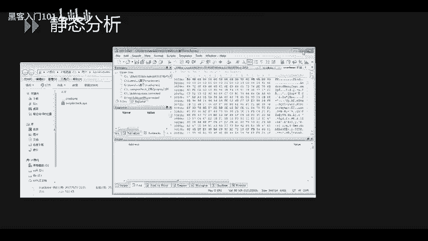

点进`a()`函数分析，发现其实现了一个数学运算（例如解一元二次方程）。我们将关键数组或逻辑复制出来，编写一个简单的解密程序。

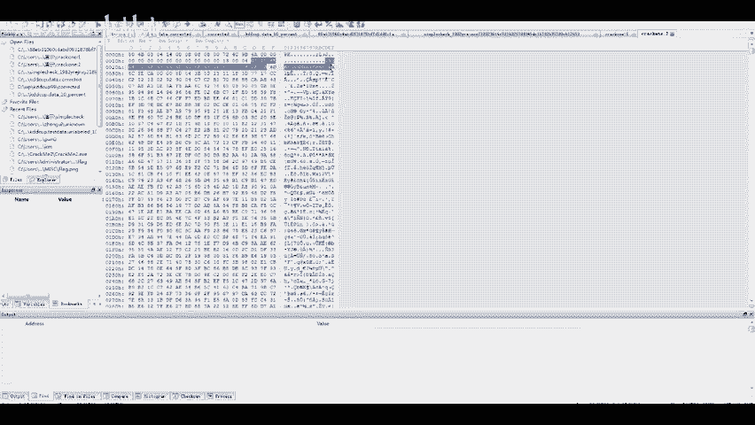

**解密代码示例（C++）:**
```cpp
#include <iostream>
#include <cmath>
int main() {
    // 根据逆向出的算法，计算得到Flag
    double result = ...; // 计算过程
    std::cout << "flag{" << result << "}" << std::endl;
    return 0;
}
```
运行程序，即可得到Flag，格式通常为`flag{...}`。

### 实战二：Java + Native层联合分析

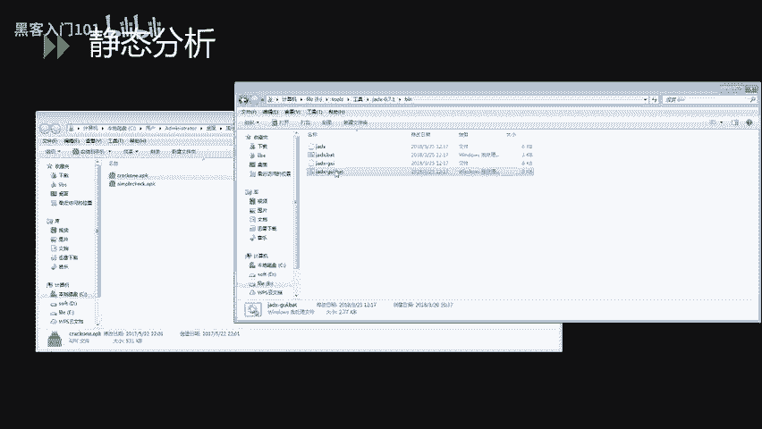

同样，先用十六进制编辑器确认是APK文件。


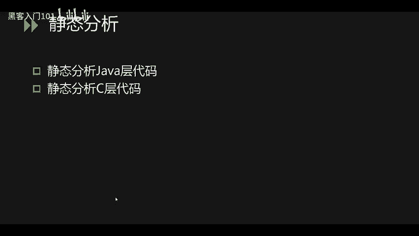

这次我们使用JADX工具打开，查看Java代码。


在`MainActivity`中，我们发现加载了一个名为`ISCC`的.so库（`System.loadLibrary(“ISCC”)`），并且有一个`native`声明的`checkFlag`函数。用户输入经过Base64编码后，传递给这个native函数进行检查。


这说明核心逻辑在Native层。我们需要分析.so文件。从APK的`lib/`目录下提取出对应的.so文件（如`libISCC.so`）。
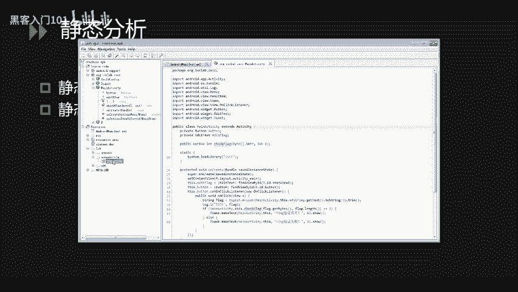

使用IDA Pro打开这个.so文件，找到`Java_com_example_MainActivity_checkFlag`这样的函数名（JNI函数命名规范），或直接搜索`checkFlag`。
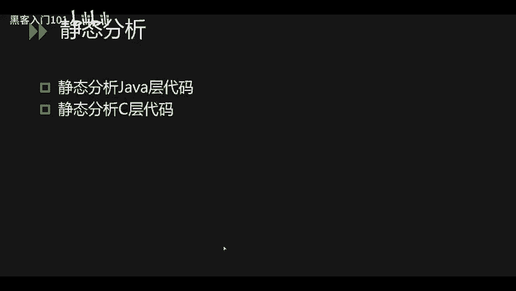

按`F5`键生成伪代码，进行分析。首先可能需要修复JNIEnv*指针的类型，以便正确识别参数。
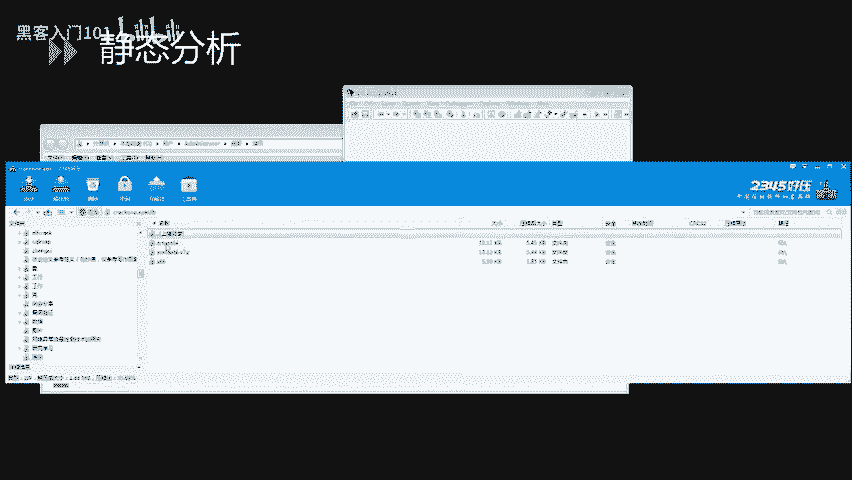


分析伪代码逻辑，发现它是一个循环，对输入字符串的每个字符进行减5操作，然后进行前后位置调换（交换），最后与一个固定字符串比较。
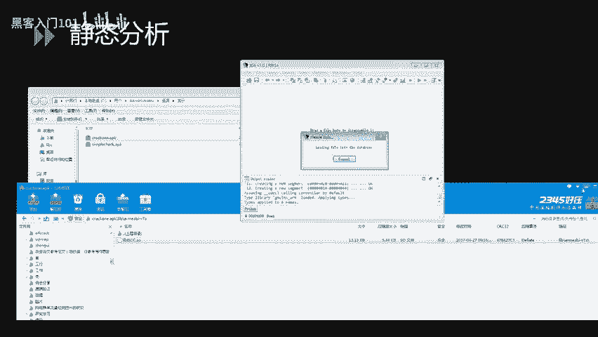


我们编写逆向程序：先复制出比较的字符串，然后**反向执行**核心操作（即先交换位置，再对每个字符加5），最后进行Base64解码。

**解密代码示例（Python）:**
```python
import base64


# 从IDA中复制的比较字符串
encoded_str = “...”
# 1. 交换位置 (假设是前后对称交换)
length = len(encoded_str)
swapped_list = list(encoded_str)
for i in range(length // 2):
    swapped_list[i], swapped_list[length - 1 - i] = swapped_list[length - 1 - i], swapped_list[i]
swapped_str = ''.join(swapped_list)

# 2. 每个字符ASCII值加5
decoded_list = []
for c in swapped_str:
    decoded_list.append(chr(ord(c) + 5))
decoded_str = ''.join(decoded_list)

# 3. Base64解码
flag = base64.b64decode(decoded_str).decode('utf-8')
print(flag)
```
运行脚本，即可得到最终的Flag。
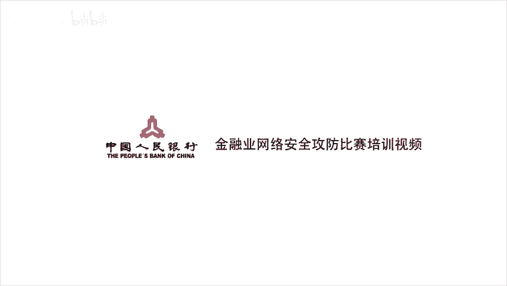

---

## 总结 📝

本节课我们一起学习了安卓逆向的基础知识。我们从**安卓开发**（SDK/NDK）和**APK文件结构**讲起，理解了逆向的对象。然后介绍了常用的**逆向工具链**，包括反编译、静态分析和动态调试工具。接着，梳理了CTF中安卓逆向从易到难的**常见考点**。

最后，通过两道实战题目，我们演示了完整的静态分析流程：
1.  **文件类型确认**（十六进制编辑器）。
2.  **反编译获取代码**（APKIDE/JADX）。
3.  **定位入口与核心逻辑**（AndroidManifest.xml， Java代码）。
4.  **深入分析**（Java层算法或使用IDA分析Native层）。
5.  **编写逆算法程序**，求解Flag。


掌握这些基础步骤和思路，是步入CTF安卓逆向领域的第一步。后续课程将会涉及更复杂的动态调试、脱壳和混淆对抗技术。