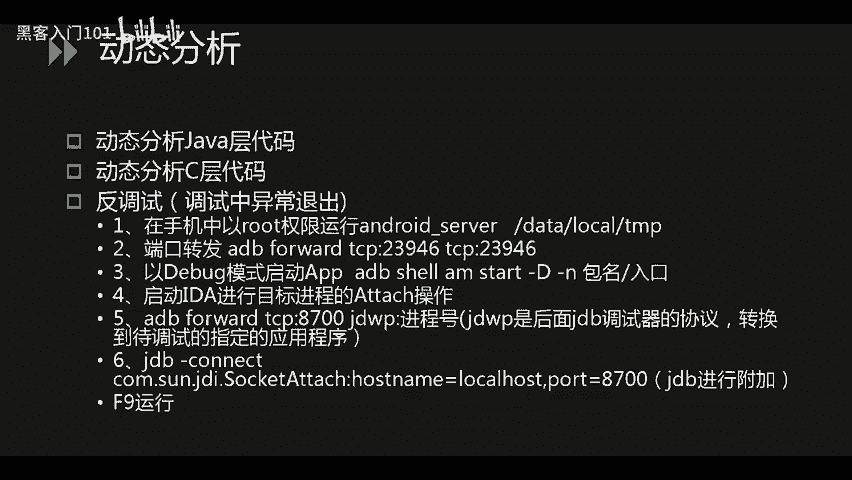
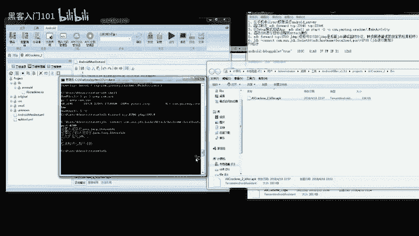
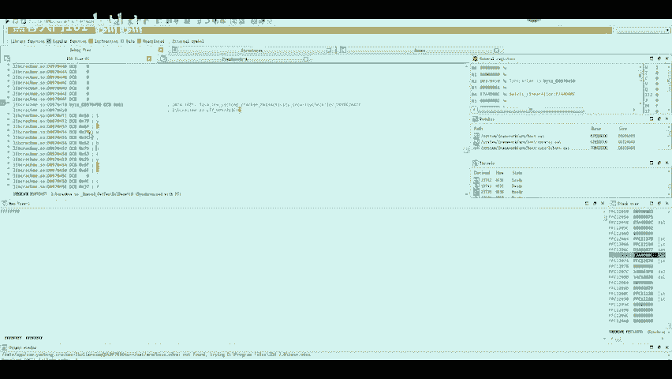
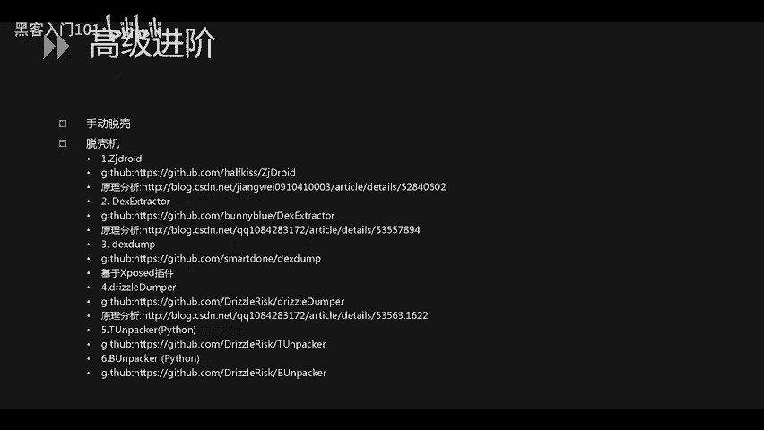
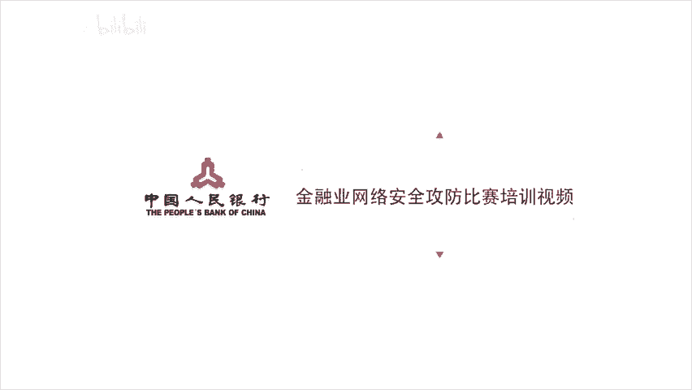

# CTF逆向工程：P35：37.移动安全_2 - 安卓逆向实战与动态调试 🛡️


在本节课中，我们将学习CTF比赛中安卓逆向的核心部分，重点掌握动态调试技术。我们将从简单的算法分析过渡到复杂的动态调试流程，并最终了解如何获取内存中的关键数据以解决题目。

---

上一节我们介绍了静态分析工具的使用，本节中我们来看看如何对安卓应用进行动态调试。动态调试允许我们在程序运行时观察其内部状态，这对于分析加密算法、绕过反调试机制至关重要。

## 动态调试概述

实际比赛中，题目可能涉及AES、DES等对称加密算法。解题关键在于获取密钥，并理解算法流程。动态调试能帮助我们在代码运行时提取这些关键信息。调试过程可能涉及Java层和C语言层（Native层）的代码，并需要应对反调试机制导致的程序异常退出。

以下是进行动态调试的核心步骤。

## 动态调试步骤详解



### 步骤一：部署调试服务器

首先，将IDA工具目录下的安卓调试服务器文件（如 `android_server`）放入手机的指定目录。通常可存放在 `/data/local/tmp` 目录下，并赋予其可执行权限。

```bash
adb push android_server /data/local/tmp/
adb shell chmod 755 /data/local/tmp/android_server
```

### 步骤二：建立端口转发



启动手机端的调试服务器，并将手机端口与电脑端口进行转发，以建立通信链路。

```bash
adb shell /data/local/tmp/android_server
# 新开一个终端窗口，执行端口转发
adb forward tcp:23946 tcp:23946
```

### 步骤三：以调试模式启动目标应用

使用ADB命令以调试模式启动目标安卓应用。

```bash
adb shell am start -D -n com.example.packagename/.MainActivity
```

### 步骤四：附加进程与调试配置

启动IDA，选择 `Debugger` -> `Attach` -> `Remote ARM Linux/Android debugger`。在配置中，主机填写 `localhost`，端口填写 `23946`。附加到目标进程后，需在调试器选项中勾选“在库加载/卸载时暂停”等选项，以确保能在SO文件加载前中断。

### 步骤五：定位与设置断点

附加成功后，程序会暂停。在IDA中按 `Ctrl+S` 查看已加载的模块列表，找到目标SO库的基地址。结合静态分析得到的函数偏移量，计算函数在内存中的实际地址。

**公式：**
`函数内存地址 = SO库基地址 + 函数静态偏移量`

按 `G` 键跳转到计算出的地址，并按 `F2` 在该处设置断点。

### 步骤六：运行与提取数据

按 `F9` 让程序继续运行，直到命中我们设置的断点。此时可以按 `F5` 将汇编代码反编译为更易读的C伪代码。通过单步执行（`F7`/`F8`），观察寄存器和内存的变化，在关键比对或赋值操作处停下，从寄存器或内存中直接提取出Flag值。

---

刚才我们详细讲解了动态调试的流程，接下来通过一个实例演示如何应用这些步骤。

## 实战演示：动态调试获取Flag

本次演示使用工具“安卓杀手”（Android Killer）。首先，将APK文件拖入工具中进行分析。为了启用调试，需要在AndroidManifest.xml文件中添加 `android:debuggable="true"` 权限，然后重新编译并签名APK。

```xml
<application android:debuggable="true" ... >
```

使用ADB命令将修改后的APK安装到已Root的手机上。

```bash
adb install modified_app.apk
```

安装成功后，按照前述步骤启动调试服务器、端口转发，并以调试模式启动应用。在IDA中附加进程时，若第一次附加失败（这是IDA的常见问题），需重新检查调试选项设置并再次附加。

附加成功后，让程序运行直到链接器（linker）加载我们的目标SO文件。此时，按 `Ctrl+S` 找到目标SO库的基地址（例如 `0xD096C000`）。在另一个IDA静态分析窗口中，找到关键函数的偏移量（例如 `0x11A8`）。两者相加得到内存中的函数地址：`0xD096C000 + 0x11A8 = 0xD096D1A8`。

在动态调试的IDA中，按 `G` 跳转到 `0xD096D1A8` 并设置断点。按 `F9` 运行程序，命中断点后按 `F5` 查看C伪代码。通过单步调试，定位到核心的比对循环（如 `while` 循环）。在关键赋值指令处（例如将内存值加载到R3寄存器），暂停执行。



右键点击R3寄存器中的值，选择“跳转到寄存器地址”，即可在内存窗口中看到存储的Flag字符串。将此字符串作为输入，即可通过题目验证。

---

本节课中我们一起学习了安卓逆向中的动态调试技术。我们从调试环境搭建讲起，详细说明了端口转发、进程附加、断点设置等步骤，并通过一个实战案例演示了如何从运行中的程序内存提取Flag。

## 拓展知识：安卓应用脱壳思路

最后，为大家提供一些应对加固（加壳）应用的思路。脱壳的核心是在内存中获取解密后的原始代码。

以下是几种常见的脱壳方法：



1.  **手动脱壳**：通过动态调试，绕过反调试机制，等待原始程序在内存中完全解密后，使用工具（如IDA）或命令从内存中 dump 出解密后的代码。
2.  **基于ZZDroid框架的脱壳机**：一种较老的通用脱壳方案，主要基于内存Dump原理。
3.  **模拟器脱壳**：通过修改模拟器内核中加载SO文件的逻辑，实现自动脱壳。
4.  **基于Xposed模块的内存Dump工具**：在已安装Xposed框架的手机上，使用特定模块来Dump指定应用的内存。
5.  **针对特定壳的脱壳工具**：例如，存在一些专门针对早期版本360加固、腾讯加固、邦邦加固的脱壳工具或脚本。在CTF比赛中，通常不会使用最新的商业壳。



关于安卓逆向的介绍就到这里。掌握静态分析与动态调试，是解开CTF移动安全题目的关键。