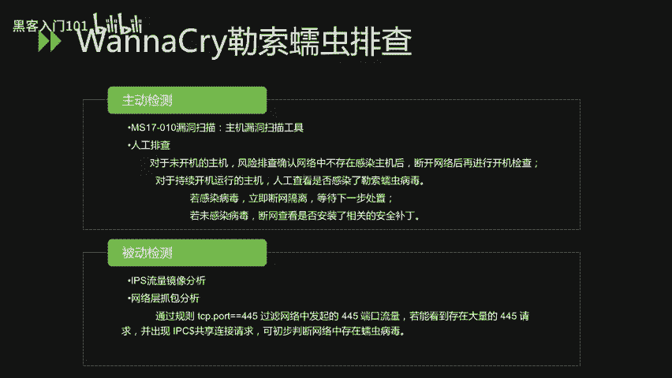
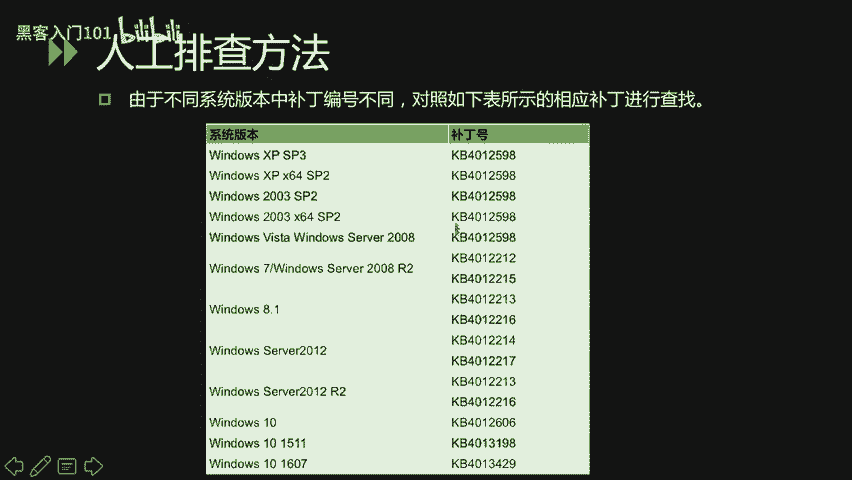
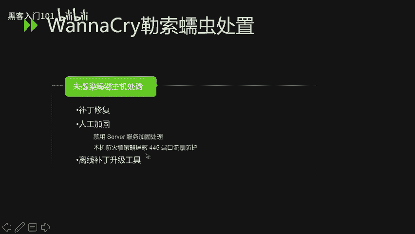

# CTF夺旗赛教程：P37：重点漏洞分析_2 🔍


在本节课中，我们将学习两个历史上影响深远的重点漏洞：Shellshock（破壳漏洞）和 EternalBlue（永恒之蓝）。我们将分析它们的原理、影响范围以及验证和修复方法。

## Shellshock（破壳漏洞）分析 🐚

上一节我们介绍了漏洞分析的基本思路，本节中我们来看看第一个重点漏洞——Shellshock。Shellshock，也被称为“破壳漏洞”，主要影响Bash shell。Bash是大多数Linux系统和macOS默认的命令行解释器。

该漏洞主要涉及两个CVE编号：CVE-2014-6271和CVE-2014-7169。

### CVE-2014-6271漏洞原理

该漏洞允许攻击者通过构造特殊的环境变量值来执行任意命令。当Bash处理这些环境变量时，会执行其中包含的恶意代码。某些服务和应用会接受未经认证的用户提供的环境变量，这使得攻击者能够利用此漏洞在目标系统上执行Shell命令。

其核心原理是，Bash在处理以函数定义形式存在的环境变量时存在缺陷。攻击者可以定义如下形式的环境变量：

```bash
env x='() { :;}; echo vulnerable' bash -c "echo this is a test"
```

在这个例子中，`x`是一个环境变量，其值以函数定义`() { :;};`开头，但后面紧跟了额外的命令`echo vulnerable`。存在漏洞的Bash版本会执行这个额外的命令。

### CVE-2014-6271漏洞验证

以下是验证系统是否存在此漏洞的方法：

在Bash shell下运行以下命令：
```bash
env x='() { :;}; echo vulnerable' bash -c "echo this is a test"
```

验证结果判断：
*   如果输出内容包含 `vulnerable` 和 `this is a test`，则证明系统当前的Bash版本存在漏洞。
*   如果只输出 `this is a test`，则证明不受该漏洞影响。

### CVE-2014-7169漏洞原理

CVE-2014-7169是CVE-2014-6271漏洞补丁不完善导致的绕过漏洞。它允许在环境变量的函数定义后，通过特殊构造的字符串（如换行符）来写入文件或执行其他操作。

验证该漏洞的命令示例如下：
```bash
env X='() { (a)=>\' bash -c "echo date"; cat echo
```

在这条命令中，`X`变量的值被精心构造，目的是让Bash解释器在解析时出错。出错后，缓冲区中会残留特定字符，导致Bash将后续的命令（如`echo date`）放入缓冲区并执行。

### CVE-2014-7169漏洞验证

在Bash shell下运行上述验证命令。

验证结果判断：
*   如果输出了当前日期（即`echo date`命令的执行结果），则证明系统当前的Bash版本存在此漏洞。

### Shellshock漏洞修复方法

对于不同系统的修复方法如下：

以下是主要的修复步骤：
1.  **对于RHEL/CentOS等RedHat系系统**：使用 `yum update bash` 命令更新Bash。
2.  **对于Ubuntu/Debian等系统**：使用 `apt-get update` 然后运行 `apt-get install --only-upgrade bash` 命令更新Bash。

Shellshock漏洞的严重性被定义为最高级别10级。作为对比，2014年爆发的“心脏滴血”漏洞定级为5级，由此可见破壳漏洞的严重性。

## EternalBlue（永恒之蓝）与WannaCry分析 💉

在了解了Shellshock之后，我们来看另一个造成全球性影响的漏洞——EternalBlue。由永恒之蓝漏洞引发的WannaCry勒索蠕虫事件在2017年造成了巨大破坏。

WannaCry是一种蠕虫式勒索病毒，大小约3.3MB。不法分子利用美国国家安全局泄露的“永恒之蓝”武器进行传播。该病毒自2017年5月12日起全球爆发，感染了包括英国、俄罗斯、欧洲多国以及中国众多高校、企业和政府机构的内网，要求支付高额赎金以解密文件。但事实上，即使支付赎金，文件也未必能恢复。

### 漏洞原理与影响范围

该漏洞的原理是，微软服务器消息块协议在处理某些请求时，存在远程代码执行漏洞。成功利用此漏洞的攻击者可以在目标系统上执行任意代码。

其影响范围非常广泛：
*   **影响范围**：所有未安装MS17-010漏洞补丁的Windows操作系统均受影响。

### WannaCry勒索蠕虫排查方法



对于WannaCry的排查，可以从主动和被动两个方向进行。

以下是主要的排查方向：

**主动检测：**
*   **使用工具**：使用主机漏洞扫描工具进行扫描。
*   **人工排查**：
    *   对于未开机的主机：确认网络中没有感染主机后，断开网络再开机检查。
    *   对于已开机的主机：人工查看是否感染勒索病毒。若已感染，立即断网隔离；若未感染，则断网检查是否安装了安全补丁。

**被动检测：**
*   **IPS流量分析**：通过入侵防御系统分析网络流量。
*   **网络抓包分析**：抓取网络数据包，基于规则 `tcp.port == 445` 过滤445端口的流量。如果发现大量445端口请求并出现IPC$共享连接请求，可初步判断网络中存在蠕虫病毒。

### 人工排查补丁方法



不同Windows系统对应的MS17-010补丁编号不同，可以通过查看已安装的更新来确认。

以下是针对不同系统的补丁检查示例：
*   **Windows Server 2003**：在“添加或删除程序”面板中开启“显示更新”，查找是否存在 **KB4012596** 补丁。
*   **Windows 7**：在“控制面板”->“程序和功能”->“查看已安装的更新”中，查找 **KB4012212** 补丁。

如果存在对应的补丁，则说明系统不受该漏洞影响。

### WannaCry勒索蠕虫处置方法

处置方法分为对已感染主机和未感染主机两种情况。

以下是具体的处置步骤：

**对于已感染病毒的主机：**
1.  **断网隔离**：立即断开网络连接。
2.  **评估损失**：判断被加密文件的重要性。
3.  **决定方案**：根据评估结果，决定是否格式化磁盘并重装系统。
4.  **内网防护**：如果内网主机无法访问外网，需在内网DNS中添加解析，将病毒尝试连接的特定域名指向一台可控的内网主机，以阻断传播。
5.  **病毒清除**：
    *   结束 `tasksche.exe` 进程。
    *   删除病毒创建的服务（服务名随机）。
    *   删除磁盘中的病毒文件（文件名随机）。
    *   清理相关的注册表项。

**对于未感染病毒的主机：**
1.  **补丁修复**：安装MS17-010官方补丁。
2.  **人工加固**：
    *   禁用Server服务。
    *   通过本机防火墙策略屏蔽445端口入站流量。
3.  **工具辅助**：可使用离线补丁升级工具进行一键修复。



---


本节课中我们一起学习了Shellshock和EternalBlue两个重大安全漏洞。我们分析了它们的原理、验证方法、影响范围以及具体的修复和处置措施。理解这些历史漏洞有助于我们在CTF比赛中识别类似漏洞模式，并在实际工作中做好安全防护。