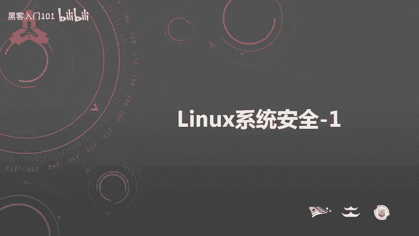
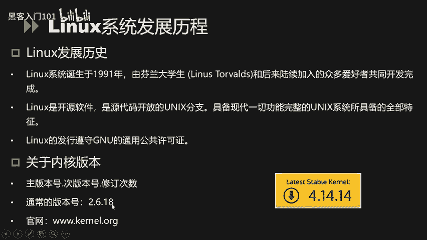
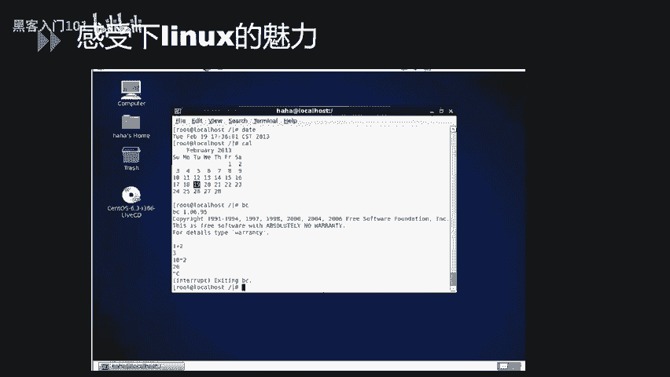
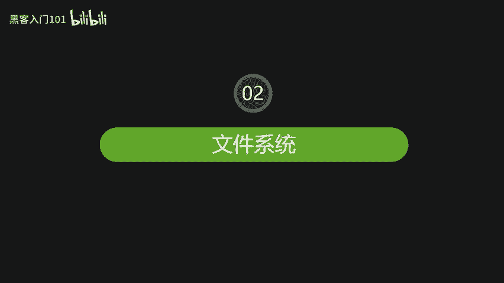
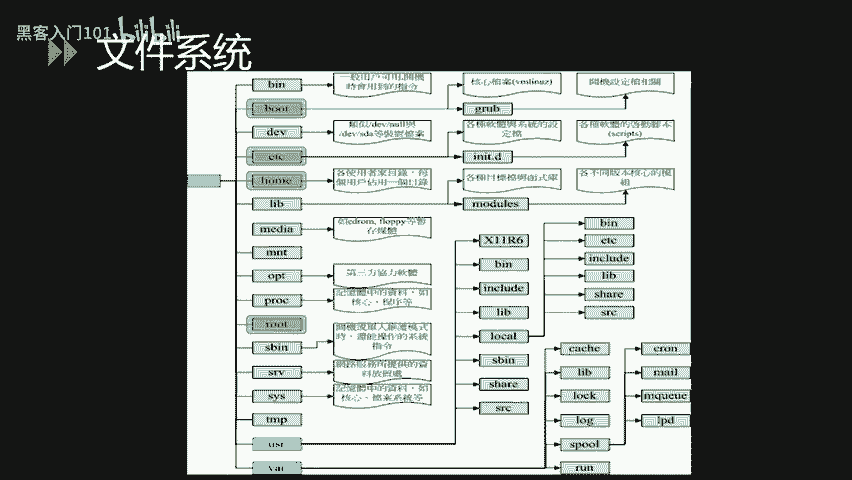
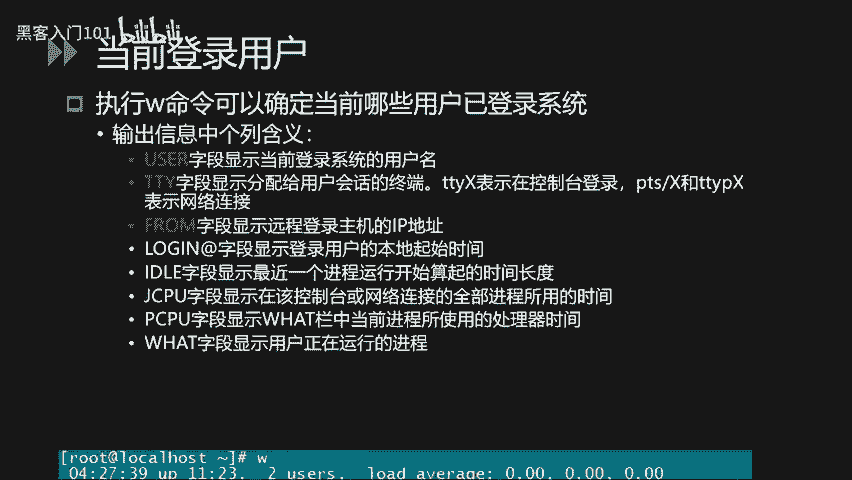
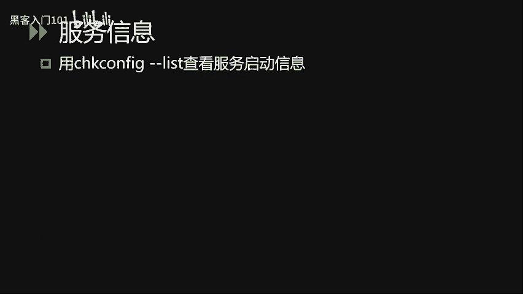
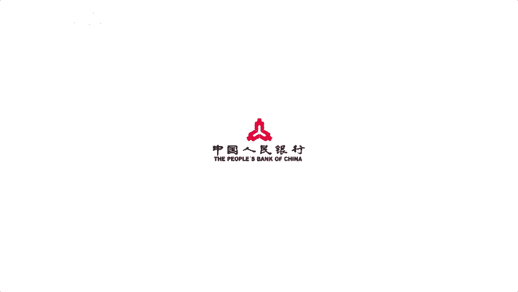

# CTF夺旗赛教程：P3：Linux系统安全入门



在本节课中，我们将学习Linux系统安全的基础知识。课程内容分为三个主要模块：Linux系统简介、Linux文件系统介绍以及Linux基本操作。通过学习，您将对Linux系统有一个初步的了解，为后续的CTF实战打下基础。

## Linux系统简介 🐧

上一节我们概述了课程内容，本节中我们来看看Linux系统的基本情况。

Linux系统诞生于1991年，由芬兰赫尔辛基大学的学生林纳斯·托瓦兹和后来陆续加入的众多爱好者共同开发完成。1994年发布了第一个完整的核心版本。由于Linux是开源软件，任何人都可以通过网络获取其核心源代码，进行修改后再回馈给社区。因此，Linux得以被广泛使用并发展成为一个完整的操作系统。其标志是一只企鹅，象征着开源精神。

Linux系统可以安装在各种计算机硬件设备中，例如手机、平板电脑、路由器、视频游戏控制台以及大型计算机等。Linux是一个领先的操作系统，世界上运行速度最快的10台超级计算机都运行着Linux操作系统。

严格来说，“Linux”一词本身仅指Linux内核，但人们已习惯用它来代指整个基于Linux内核的操作系统。以下是常见的Linux发行版本：
*   **Red Hat**：红帽公司发行的商业版本。
*   **SUSE**：源自德国的发行版。
*   **Debian**：社区维护的发行版，Ubuntu基于它开发。
*   **Ubuntu**：基于Debian的流行桌面发行版。



简单来说，Linux是一个类Unix的开源操作系统。



### Linux内核版本



了解完Linux的发展历程后，这里重点强调一下Linux的内核版本。Linux内核版本号主要由三部分组成：
1.  **主版本号**
2.  **次版本号**
3.  **修订次数**

常见的版本号格式如 `2.6.18`。目前最新的版本号可能是 `4.14.14`。对于版本号，我们需要重点关注第二位，即**次版本号**：
*   如果次版本号是**偶数**，说明这是一个**稳定版**，适合用于生产环境。
*   如果次版本号是**奇数**，说明这是一个**开发版**，可能包含未修复的Bug，不建议用于生产环境。

因此，我们通常选择像 `2.6.18` 这样的稳定版本用于生产环境。

### 学习Linux的方式



对于初学者，可以通过虚拟机安装的方式来学习Linux。现在许多发行版都带有图形界面，例如CentOS，这使得上手操作变得非常容易。

## Linux文件系统 📁

讲完Linux系统概况，我们现在来深入了解一下Linux的文件系统。

Linux的文件目录结构采用树状层次结构。理解Linux系统，需要掌握一些重点目录和配置文件。首先，在Linux系统中有一个非常重要的概念：**一切皆文件**。系统把所有的资源，包括硬件设备，都看作是文件（通常称为设备文件）。这样，用户就可以通过读写文件的方式来实现对硬件设备的访问。

系统启动时，首先挂载的是**根文件系统**，即 `/` 目录。以下是Linux常见的树状目录结构及其简要说明：

以下是主要的一级目录介绍：
*   **/bin**：存放单人维护模式下仍可操作的基本指令。
*   **/boot**：存放开机会用到的文件，包括Linux内核文件以及开机菜单配置文件。
*   **/dev**：存放设备文件，任何装置与接口设备都以文件形态存在于此。
*   **/etc**：存放系统主要的配置文件，例如用户账号密码文件、各种服务的启动脚本等。
*   **/home**：系统默认的用户家目录。
*   **/lib**：存放开机时用到的函数库，以及 `/bin` 和 `/sbin` 目录下指令会调用的函数库。
*   **/media**：用于挂载可移动设备，如软盘、光盘、U盘。
*   **/opt**：给第三方协力软件放置的目录。
*   **/root**：系统管理员（root）的家目录。
*   **/sbin**：存放开机过程中所需要的、包括开机修复和还原系统所需要的指令。
*   **/srv**：可视为“service”的缩写，存放一些网络服务启动后所需的数据目录。
*   **/tmp**：让一般使用者或正在执行的程序暂时放置文件的地方。

下面针对部分重要的二级目录做进一步说明：
*   **/usr/lib**：存放各种应用软件的函式库、目标文件以及不被一般使用者惯用的执行脚本。
*   **/usr/local**：系统管理员在本机自行安装软件时建议的安装目录。
*   **/var/lib**：程序本身执行过程中需要使用到的数据文件放置的目录。
*   **/var/log**：非常重要的目录，用于存放系统的关键日志记录文件。
*   **/etc/init.d**：存放系统服务预设的启动脚本。

### 重要系统配置文件

讲完系统的重要目录，下面对系统内账户相关的重要配置文件做进一步的讲解。

**1. /etc/passwd 文件**
此文件存储用户账户信息。文件中每一行代表一个用户，各字段由冒号 `:` 分隔。例如一行样例：
```
test:x:1000:1000:test user:/home/test:/bin/bash
```
以下是各字段的说明：
*   **字段1 (test)**：用户名。
*   **字段2 (x)**：密码占位符。用户密码已转移到 `/etc/shadow` 文件，此处用 `x` 代替。
*   **字段3 (1000)**：用户的UID（用户ID）。root用户的UID为0。1-499通常为系统账号ID，500-65535为用户账号ID。
*   **字段4 (1000)**：用户的GID（组ID）。
*   **字段5 (test user)**：用户的注释信息。
*   **字段6 (/home/test)**：用户的家目录。
*   **字段7 (/bin/bash)**：用户登录后默认使用的shell。

**2. /etc/shadow 文件**
此文件存储用户加密后的密码及相关信息，权限更为严格。一行样例：
```
test:$6$salt$encrypted:18000:0:99999:7:::
```
我们重点讲解第二个字段，即密码域。它由三部分组成，以 `$` 符号分隔：`$id$salt$encrypted_hash`
*   **id**：加密算法标识。
    *   `1` -> MD5
    *   `5` -> SHA-256
    *   `6` -> SHA-512
*   **salt**：一个固定长度的随机字符串（盐值），用于增加密码破解难度。
*   **encrypted_hash**：结合密码、盐值和指定算法后生成的加密密文。

Linux系统的文件系统讲解到此结束。

## Linux基本操作 💻

上一节我们了解了Linux的文件系统结构，本节中我们来看看Linux的基本操作命令。本小节主要讲解文件和目录管理、用户管理以及系统服务进程和端口的查看。

### 文件与目录管理

在Linux系统中，定位一个文件或目录有两种方式：
*   **绝对路径**：从根目录 `/` 开始写起，例如 `/home/test/file.txt`。
*   **相对路径**：相对于当前工作目录，不是从根开始，例如 `./file.txt` 或 `../dir/file.txt`。

以下是目录的基本操作命令：
*   `cd [目录路径]`：改变当前工作目录。
*   `pwd`：显示当前工作目录的路径。
*   `mkdir [目录名]`：创建一个新目录。
*   `rmdir [目录名]`：删除一个空的目录。
*   `ls [选项] [文件或目录]`：列出文件与目录的信息。

### 文件权限管理

Linux文件系统通过三种权限类别来保护文件：**拥有人**、**拥有组**和**其他人**。可以为每个类别分配读（r）、写（w）、执行（x）权限的组合。
所有文件都归属于一个用户和一个组。可以通过 `ls -l` 命令查看文件或目录的权限属性。

相关操作命令如下：
*   `useradd [用户名]`：创建新用户。
*   `groupadd [组名]`：创建新组。
*   `chown [用户]:[组] [文件]`：更改文件的所有者和所属组。
*   `chgrp [组] [文件]`：更改文件的所属组。
*   `chmod [权限] [文件]`：设置文件的权限。
*   `sudo [命令]`：以超级用户权限执行命令。

### 用户安全管理



以下是用户管理的基本命令：
*   `useradd [用户名]`：添加用户。
*   `userdel -r [用户名]`：删除用户，`-r` 参数表示同时删除用户的家目录和邮件文件。
*   `passwd -l [用户名]`：锁定用户账户。
*   `usermod [选项] [用户名]`：修改用户属性，如有效期、家目录等。
*   `id`：查看当前用户的UID和GID。

Linux是一个多用户操作系统。执行 `w` 命令可以查看当前登录系统的用户信息。输出信息包括：
*   **USER**：登录的用户名。
*   **TTY**：用户使用的终端。`ttyN` 表示控制台登录，`pts/N` 表示网络连接。
*   **FROM**：远程登录主机的IP地址。
*   **LOGIN@**：用户登录的起始时间。
*   **WHAT**：用户正在运行的程序。

### 查看端口与进程

**查看端口开放情况：**
使用 `netstat -tulpn` 或 `ss -tulpn` 命令可以查看当前系统监听的端口及其对应的服务与进程。
例如，输出可能显示系统开放了22（SSH）、80（HTTP）、3306（MySQL）等端口。

**查看进程与端口的对应关系：**
使用 `lsof -i:[端口号]` 或 `lsof -i` 命令可以显示占用特定端口的进程信息，包括进程ID（PID）。
结合 `netstat` 和 `lsof` 的输出，可以通过PID找到对应的服务端口，反之亦然。



**查看进程信息：**
使用 `ps aux` 命令可以查看系统所有进程的详细信息，包括PID、CPU和内存使用率以及启动命令。

**查看服务信息：**
使用 `chkconfig --list`（SysV init系统）或 `systemctl list-unit-files`（systemd系统）可以查看系统服务的启动状态。
Linux有多个运行级别（0-6），此命令会列出每个服务在不同运行级别下的启动设置（开启或关闭）。例如，如果MySQL服务在所有运行级别都是“off”，则表示它不会随系统自动启动，需要手动启动。

---



本节课中我们一起学习了Linux系统安全的基础知识，包括Linux系统的起源与特点、树状文件目录结构、重要的配置文件（如 `/etc/passwd` 和 `/etc/shadow`），以及文件和目录操作、用户管理、端口进程查看等基本命令。掌握这些内容是进一步学习系统安全和CTF竞赛的重要第一步。