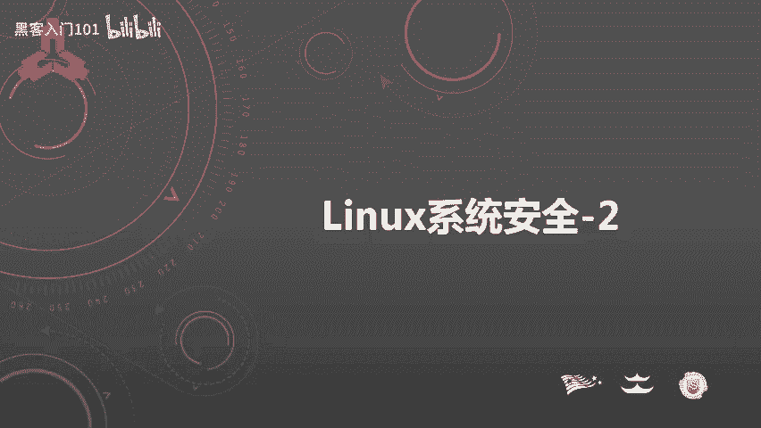
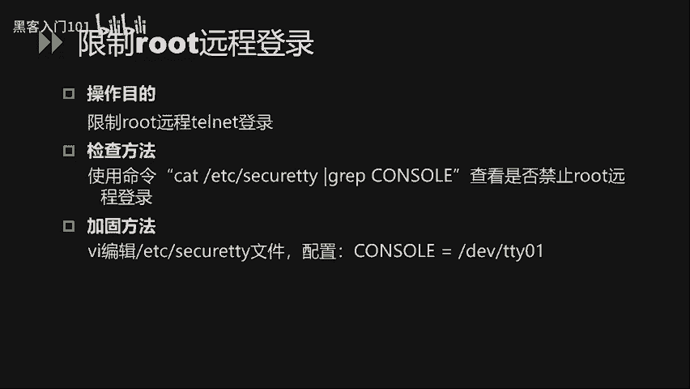
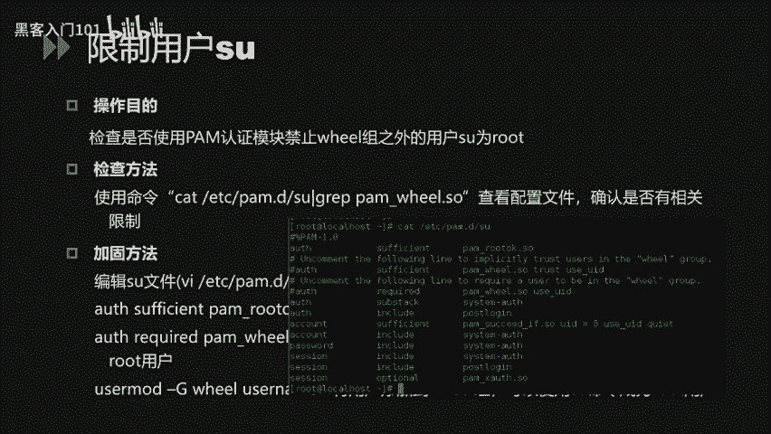
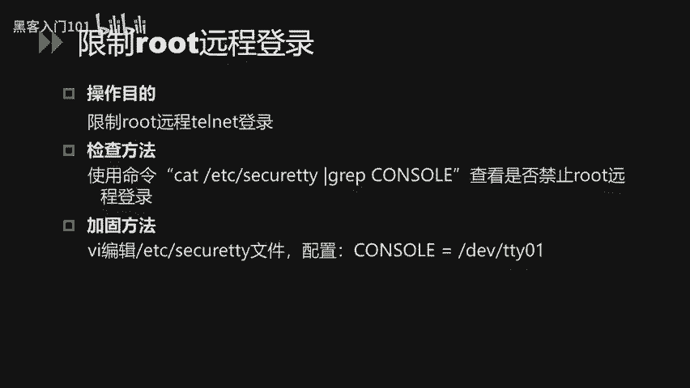
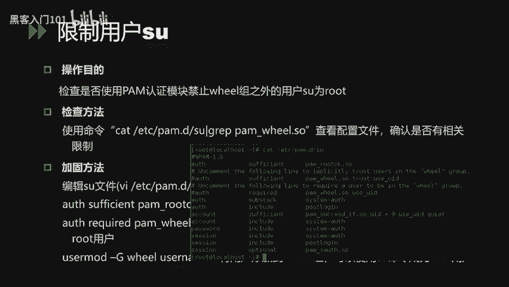
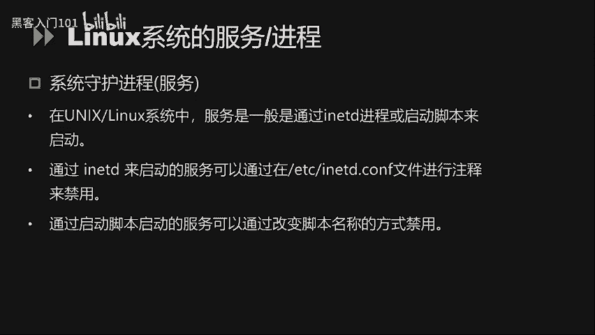
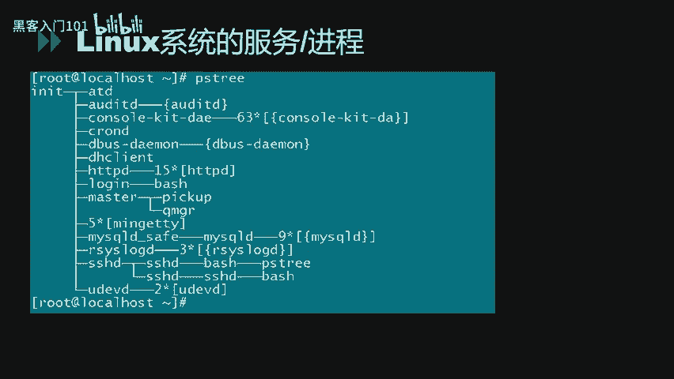
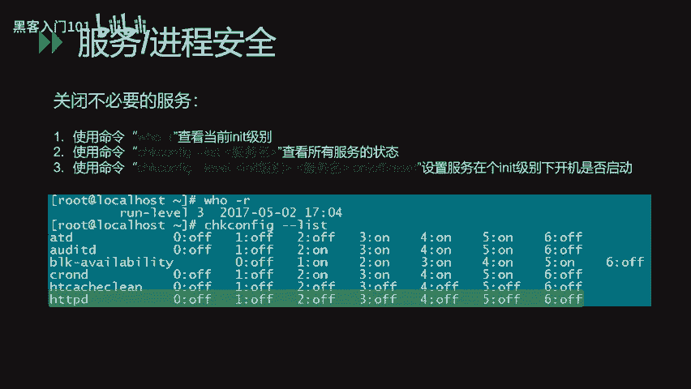
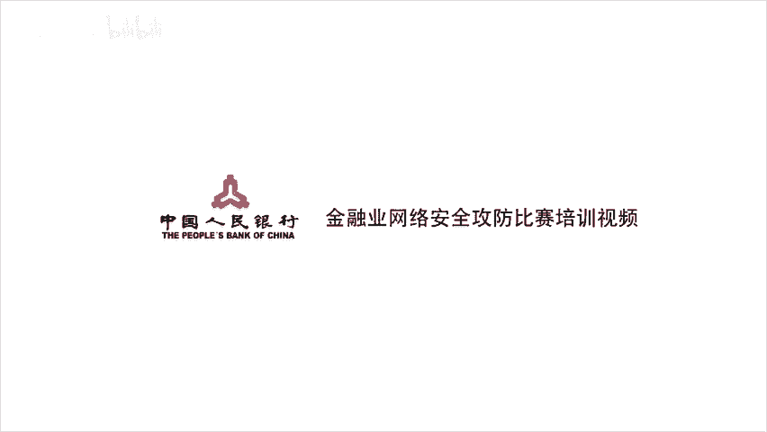

# Linux系统安全：4：Linux系统安全配置实战 🛡️



在本节课中，我们将学习Linux系统安全配置的核心内容，涵盖常规安全设置、账户安全策略以及系统服务与进程的安全管理。通过具体的命令和配置示例，帮助初学者构建安全的Linux环境。

---

## 常规安全配置 🔧

上一节我们介绍了Linux安全的基础概念，本节中我们来看看如何进行常规的安全配置，主要包括文件权限、历史命令管理等。

### 文件与目录权限设置

针对重要的目录和文件，需要合理配置权限以增强安全性。使用 `ls -l` 命令可以查看当前权限。

```
ls -l /etc
```

对于重要目录，可以使用 `chmod` 命令加固。例如，设置 `/etc` 目录权限为 `750`：

```
chmod -R 750 /etc
```

此配置意味着只有 **root** 用户可以读、写和执行该目录下的文件，其他用户无任何访问权限。

### 设置默认权限（umask）

单独设置每个文件权限繁琐，可通过配置 `umask` 值来定义新建文件和目录的默认权限。系统默认 `umask` 值为 `022`。

修改 `/etc/profile` 文件中的 `umask` 值可增强安全性。例如，设置为 `027`：

```
umask 027
```

此设置下，新建文件属组有读写执行权限，同组用户只有读和执行权限，其他用户无任何权限。

### 限制历史命令记录

Bash系统默认记录历史命令于 `~/.bash_history` 文件。为防信息泄露，可限制其记录总数。

修改 `/etc/profile` 文件中的 `HISTFILESIZE` 和 `HISTSIZE` 值。例如，均设置为 `5`：

```
HISTFILESIZE=5
HISTSIZE=5
```

此配置仅保留最新执行的5条命令。

### 设置连接超时

为增加安全性，可配置终端连接超时时间。修改 `/etc/profile` 中的 `TMOUT` 值，单位是秒。例如，设置为 `180`：

```
TMOUT=180
```

这意味着3分钟内无任何操作，系统将自动断开会话连接。

### 环境变量PATH安全

Root用户的 `PATH` 环境变量不应包含当前目录 `.`，否则可能执行恶意脚本。查看当前 `PATH`：

```
echo $PATH
```

若包含 `.`，需修改 `/etc/profile` 文件将其移除，以防安全风险。

---

常规安全设置主要围绕文件权限、默认权限、历史记录、超时和环境变量进行加固。下面，我们将深入探讨Linux系统的账户安全设置。

## 账户安全设置 👤

账户是系统安全的第一道防线。本节将从禁用无用账号、配置口令策略等方面进行讲解。

### 禁用无用账号

减少系统无用账号可以降低风险。首先，查看所有系统账号：

```
cat /etc/passwd
```

与管理员确认后，锁定不必要的账号：

```
passwd -l [用户名]
```

对于仅用于服务（如FTP）且无需登录的账号，应将其shell设置为 `/sbin/nologin`。

### 配置账户锁定策略

为防止口令爆破，可配置账户锁定策略。编辑 `/etc/pam.d/system-auth` 文件。

例如，设置连续输错10次密码后锁定账户5分钟：

```
auth required pam_tally2.so deny=10 unlock_time=300
```

其中，`deny=10` 表示最大错误尝试次数，`unlock_time=300` 表示锁定时间（秒）。

### 检查空口令与特权账号

空口令和具有root权限的账号是重大安全隐患。

检查空口令账号（`/etc/shadow` 文件）：

```
awk -F: '($2=="") {print $1}' /etc/shadow
```

检查UID为0的特权账号（`/etc/passwd` 文件）：

```
awk -F: '($3==0) {print $1}' /etc/passwd
```

发现此类账号必须立即整改。

### 配置口令周期策略

强制用户定期修改密码，可配置口令周期策略。编辑 `/etc/login.defs` 文件。

关键参数包括：
*   `PASS_MAX_DAYS`: 密码最长使用天数。
*   `PASS_MIN_DAYS`: 密码最短使用天数。
*   `PASS_WARN_AGE`: 密码到期提前提醒天数。

也可针对特定用户设置，例如，设置用户 `testuser` 的密码策略：

```
chage -M 30 -m 0 -W 7 -E 2025-01-01 testuser
```



### 配置口令复杂度策略

避免弱口令，需强制口令满足一定强度。编辑 `/etc/pam.d/system-auth` 文件。

添加类似如下规则，要求口令至少8位，且包含大小写字母和数字：



```
password requisite pam_cracklib.so minlen=8 ucredit=-1 lcredit=-1 dcredit=-1
```



### 限制Root远程登录

禁止root用户通过SSH远程登录。编辑 `/etc/ssh/sshd_config` 文件：

```
PermitRootLogin no
```



### 控制SU命令的使用

通过PAM模块控制可使用 `su` 命令切换为root的用户。首先，编辑 `/etc/pam.d/su` 文件，在开头添加：

```
auth required pam_wheel.so group=wheel
```

然后，将允许使用 `su` 的用户加入 `wheel` 组：

```
usermod -aG wheel [用户名]
```

### 保护系统引导（GRUB）

为防止通过单用户模式重置root密码，可为GRUB引导管理器设置密码。编辑 `/etc/grub.conf` 文件，添加：

```
password --md5 [加密后的密码字符串]
```

### 安全配置SNMP服务

修改SNMP默认的公共只读团体字（public）和私有读写团体字（private）。编辑 `/etc/snmp/snmpd.conf` 文件。如非必要，建议禁用SNMP服务。

### 弱口令审计

可使用第三方工具（如 `john`）对系统账号口令进行审计。例如，使用“简单”模式（尝试用户名变体）或指定密码字典进行检测。

---

账户安全配置涉及权限、口令、审计等多个层面。接下来，我们将学习如何对Linux系统的服务和进程进行安全配置。

## 服务与进程安全配置 ⚙️

系统服务是潜在的攻击入口，合理配置至关重要。本节将介绍进程查看方法及常见服务的安全配置。

### 查看系统进程

每个服务都对应一个进程。常见服务及其默认端口如下：
*   FTP: 21
*   SSH: 22
*   Telnet: 23
*   SMTP: 25
*   HTTP: 80
*   MySQL: 3306

查看进程树状关系：



```
pstree
```

查看进程详细信息（PID、用户、资源占用）：

```
ps aux
```

### 服务管理



服务通常由 `init` 进程或启动脚本启动。
*   对于 `init` 启动的服务，可修改 `/etc/inittab` 文件来配置。
*   对于脚本启动的服务，可通过重命名或修改脚本文件来禁用。

### SSH服务安全配置

SSH是重要的远程管理服务，其配置文件为 `/etc/ssh/sshd_config`。

关键安全配置：
1.  禁止root远程登录：`PermitRootLogin no`
2.  使用SSH协议版本2：`Protocol 2`
3.  限制登录尝试次数以防爆破：`MaxAuthTries 3`

配置后需重启服务生效：

```
service sshd restart
```

### TCP Wrappers访问控制

`TCP Wrappers` 可对特定服务进行基于主机名的访问控制。配置文件为 `/etc/hosts.allow` 和 `/etc/hosts.deny`。

例如，在 `/etc/hosts.allow` 中添加：
```
sshd: 192.168.1.100
```
在 `/etc/hosts.deny` 中添加：
```
sshd: ALL
```
此配置将只允许IP `192.168.1.100` 访问本机的SSH服务。

### NFS文件共享服务安全

使用 `showmount -e` 查看当前NFS共享列表。编辑 `/etc/exports` 文件，删除不必要的共享目录，并为必要共享设置严格的访问权限（如只读、指定IP）。

### 系统日志安全配置

`syslog` 是系统日志守护进程，配置文件为 `/etc/syslog.conf`。应确保关键事件（如认证、权限变更）被记录。

例如，将认证相关日志记录到独立文件：
```
auth.*;authpriv.* /var/log/security
```

### 禁用危险快捷键

禁用 `Ctrl+Alt+Del` 快捷键防止误操作重启系统。编辑 `/etc/inittab` 文件，注释掉（在行首加`#`）相关行：

```
#ca::ctrlaltdel:/sbin/shutdown -t3 -r now
```

然后运行以下命令使配置生效：

```
telinit q
```

### 关闭不必要的服务

暴露的服务越多，风险越高。定期排查并关闭非必需服务。

1.  查看当前运行级别：

    ```
    who -r
    ```

2.  查看该级别下自动启动的服务：

    ```
    chkconfig --list | grep 3:on
    ```

3.  禁用指定服务在指定级别的自动启动：

    ```
    chkconfig --level 3 [服务名] off
    ```

---

## 总结 📝



本节课我们一起学习了Linux系统安全配置的三个主要方面：
1.  **常规安全配置**：包括文件权限管理、umask设置、历史命令限制、会话超时和环境变量安全。
2.  **账户安全设置**：涵盖禁用无用账号、配置账户锁定与口令策略、检查特权账号、限制root远程登录及SU命令使用。
3.  **服务与进程安全**：涉及进程查看、SSH/TCP Wrappers/NFS等关键服务的安全配置、日志管理以及关闭非必要服务。



通过实施这些配置，可以显著提升Linux系统的安全性，为后续的CTF实战打下坚实的基础。