# Linux系统安全：5：Linux系统安全_3 🔐


在本节课中，我们将要学习Linux系统安全的三个核心部分：网络安全配置、日志审计安全以及系统安全工具的使用。我们将从网络参数调整和防火墙规则讲起，接着探讨如何通过日志发现攻击行为，最后介绍一些用于系统安全检查和分析的实用工具。

## 网络安全配置 🔧

上一节我们介绍了Linux系统的基础安全概念，本节中我们来看看如何配置网络以增强安全性。这部分主要包括网络参数配置和iptables自定义防火墙规则。

### 网络参数配置

系统中提供了`sysctl`命令，可以查看当前的网络参数。我们可以使用`sysctl -a`查看当前的网络参数配置。然后我们可以通过修改`/etc/sysctl.conf`这个文件内的参数来调整当前系统的网络参数配置。

以下是常见的配置示例：
*   **忽略ICMP广播**：配置`net.ipv4.icmp_echo_ignore_broadcasts = 1`，这样系统就不会对ping广播请求做出回应，使攻击者无法通过ping扫描发现该主机。
*   **修改TTL值**：通过修改`net.ipv4.ip_default_ttl`的值，可以隐藏当前操作系统的正确类型，因为有些扫描器是通过系统返回的TTL值来判断操作系统类型的。

完成修改配置后，我们可以通过`sysctl -p`命令来使配置生效。

### iptables防火墙规则


iptables是Linux内核集成的IP信息包过滤系统。如果系统连接到互联网或局域网，则可以利用iptables更好地控制IP信息包过滤，实现防火墙功能。

下面讲一下Linux的iptables命令选项的输入顺序。基本语法结构如下：
`iptables -t <表名> <命令> <链名> <规则号> <匹配条件> -j <动作>`

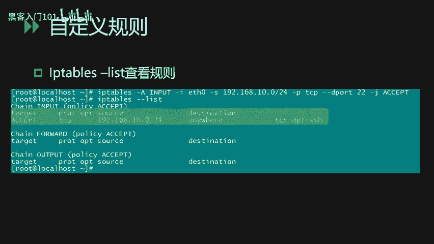

以下是常见的参数选项：
*   `-A`：向规则链末尾**添加**一条规则。
*   `-D`：从规则链中**删除**一条规则。
*   `-I`：在规则链中**插入**一条规则。
*   `-L`：**查看**当前已有的防火墙规则策略。
*   `-p`：匹配具体的**协议**，如tcp、udp。
*   `-s`：匹配数据包的**源IP地址**。
*   `-j`：指定要**跳转**的目标（动作），如ACCEPT、DROP。
*   `-i`：指定数据包**进入**本机的网络接口。
*   `-o`：指定数据包**离开**本机所使用的网络接口。

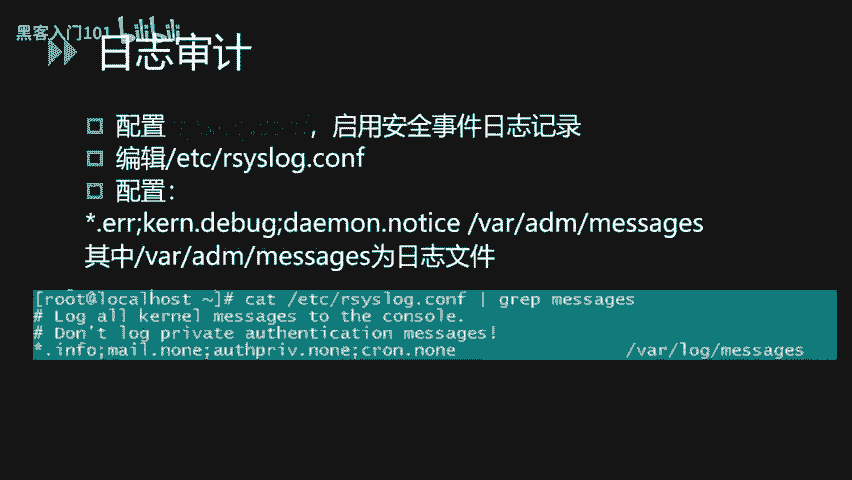

规则链（Chain）主要包括：
*   **INPUT链**：处理**输入**的数据包，即系统接收的数据包。
*   **OUTPUT链**：处理**输出**的数据包，即本系统向外发送的数据包。
*   **FORWARD链**：处理**转发**的数据包。

常见的动作（Action）有：
*   **ACCEPT**：接收该数据包。
*   **DROP**：丢弃该数据包。
*   **REJECT**：拒绝该数据包，并返回错误信息。

下面我们看几个具体的iptables例子。

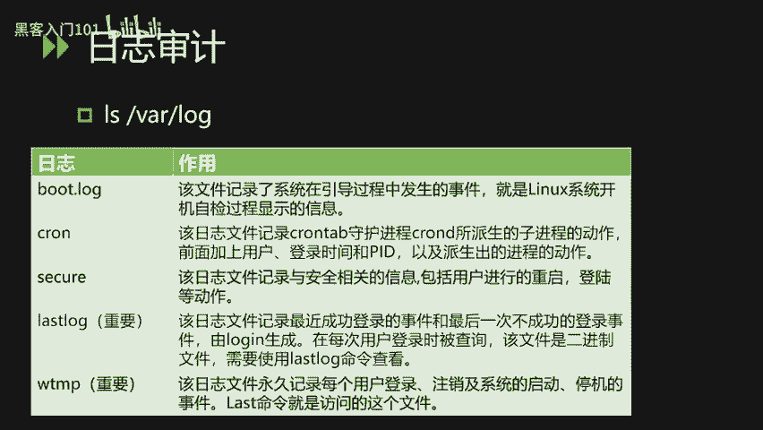

**示例1：限制SSH访问**
```bash
iptables -A INPUT -s 192.168.0.0/24 -p tcp --dport 22 -j ACCEPT
iptables -A INPUT -p tcp --dport 22 -j DROP
```
这条规则链的含义是：仅允许`192.168.0.0/24`网段内的IP地址连接到本机的22端口（SSH服务），其他来源的SSH连接请求一律丢弃。这样就达到了对SSH服务访问控制的效果。

**示例2：限制外发UDP连接**
```bash
iptables -A OUTPUT -o eth0 -p udp -j DROP
```
这条规则是向OUTPUT链添加条目，限制本机通过eth0网卡**向外发起**的所有UDP连接，即所有外发的UDP数据包都会被丢弃。

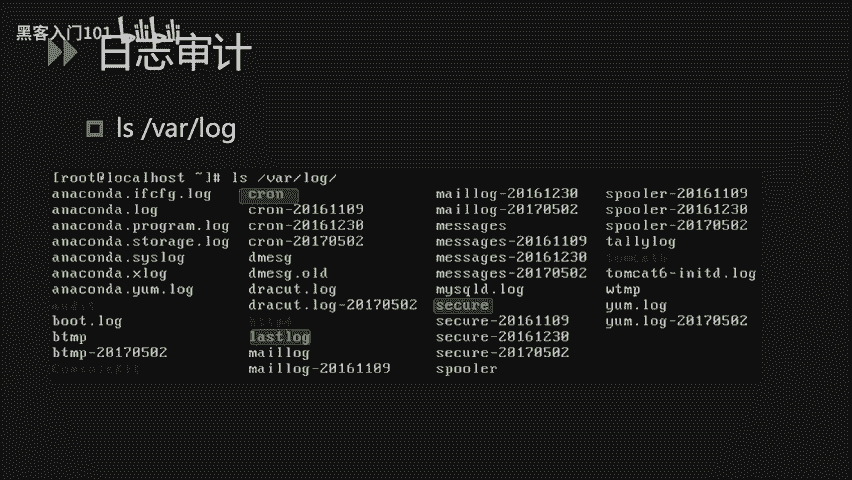

添加完自定义规则后，我们可以通过`iptables -L`命令来查看当前的所有规则链。规则链通常分为三块：INPUT（进入）、FORWARD（转发）和OUTPUT（输出）。

## 日志审计安全 📝

上一节我们介绍了如何通过网络配置加固系统，本节中我们来看看如何通过日志审计来发现潜在的安全威胁。这部分主要讲解日志审计功能配置和日志的简单分析。

### 启用与配置审计日志

首先，我们需要启用Linux系统的安全日志审计功能。通过配置`/etc/rsyslog.conf`文件来启动审计功能。系统的错误日志、内核日志、调试日志等通常都会被记录到`/var/log/messages`或`/var/log/syslog`文件中。

系统的日志默认情况下都保存在`/var/log`目录下。该目录下一些常见的重要日志文件包括：
*   **`boot.log`**：该日志文件记录了系统在引导过程中发生的事件，即Linux系统开机自检过程显示的相关信息。
*   **`cron`**：该日志记录了cron守护进程所派生的子进程的相关动作。
*   **`secure`** 或 **`auth.log`**：该日志记录了与安全相关的信息，包括用户的登录、认证等动作内容。
*   **`lastlog`**：这是一个比较重要的日志。该文件记录了所有用户最近一次成功登录的事件。因为该文件是一个二进制文件，所以我们需要使用`lastlog`命令来查看。
*   **`wtmp`**：该日志永久记录每个用户的登录、注销及系统启动、停机等事件。我们可以使用`last`命令来访问这个文件的信息。


除了这些系统日志外，第三方服务（如Apache、Nginx、SSH）的日志也会保存在该目录或其子目录中。

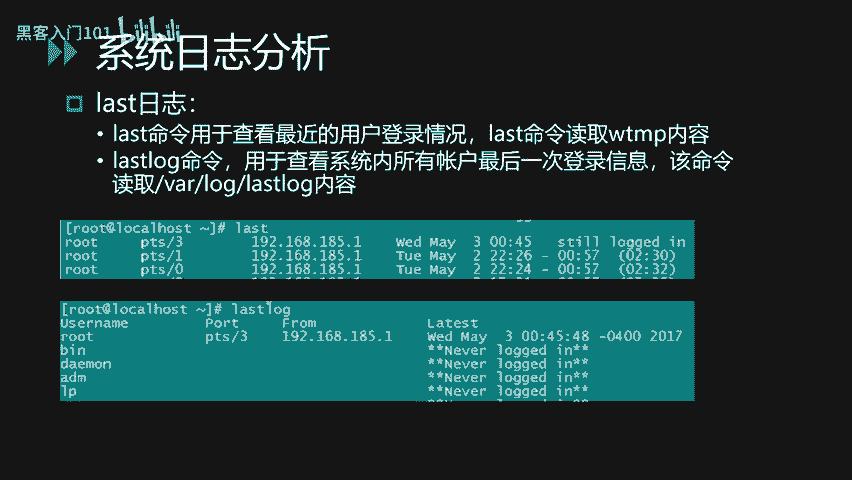

### 日志分析实战


开启对应的日志审计功能后，我们就可以通过日志分析来发现恶意的攻击行为或者非法的登录行为。

**1. 分析SSH异常登录（暴力破解）**
我们可以通过命令查看SSH日志的内容。使用`grep`命令匹配`sshd`服务的相关日志。
```bash
cat /var/log/secure | grep sshd
```
通过观察日志，如果发现短时间内有大量来自相同或不同IP的登录失败记录（状态为`Failed password`），且频率异常密集，就可以初步断定这是一个SSH口令暴力破解行为。

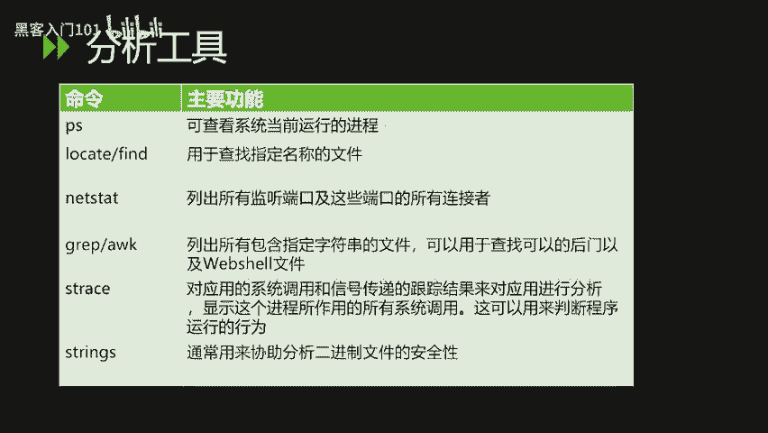

**2. 使用`last`和`lastlog`命令**
*   `last`命令：查看最近用户的登录情况，包括登录账号、登录位置（终端或IP地址）、登录时间等。
*   `lastlog`命令：查看系统内所有账号的最后一次登录信息。通过该命令可以发现长期未登录的账号突然有登录记录等异常行为。

在日常运维中，如果通过日志分析发现可疑行为，建议将相关日志导出，进行批量分析，检查是否有登录成功的情况，并定位到具体的用户账号，及时采取改密、封锁IP等措施。

## Linux下的安全工具 🛠️

讲完系统日志分析之后，我们再讲一下Linux下的安全工具。这些工具主要分为系统自带命令和专用的安全检测工具。

### 系统自带命令

通过系统自带命令，我们可以对可疑的进程和文件进行定位分析。
以下是几个关键命令：
*   **`ps`命令**：用于查看当前运行的进程状态。
*   **`find`或`locate`命令**：用于查找定位指定名称的文件。可以通过关键字进行全系统搜索。
*   **`netstat` 或 `ss` 命令**：列出所有监听的端口和这些端口当前的连接状态。
*   **`grep`命令**：一个强大的文本搜索工具，可以用于在文件中查找特定关键字，常用于定位恶意代码或配置。
*   **`lsof`命令**：显示进程所打开的所有文件、网络连接等，可以用来帮助我们判断程序的运行行为。
*   **`strings`命令**：可以用来查看二进制文件中的可打印字符串，协助分析文件的安全性。

**实战示例：排查Webshell**
假设我们知道一句话木马（Webshell）中包含`eval(`和`POST`这两个关键字。
我们可以使用`grep`命令对Web应用目录进行检查：
```bash
# 方法一：直接使用grep递归搜索
grep -r -i “eval(.*POST” /var/www/html/

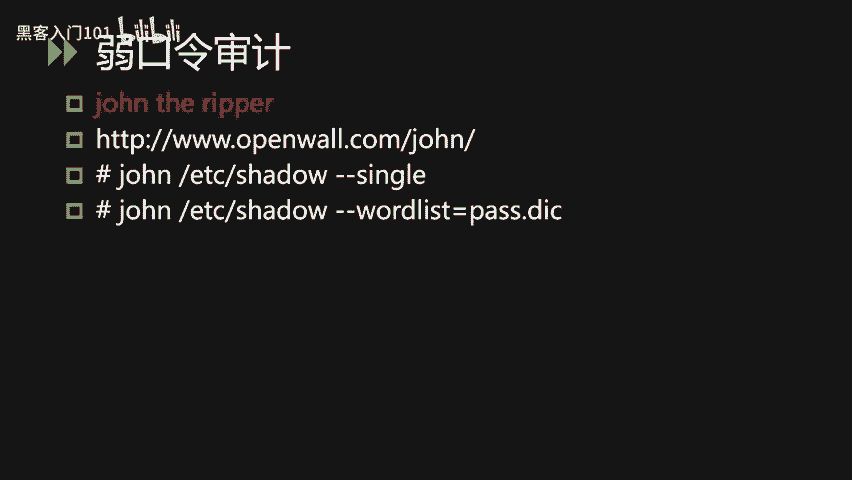

# 方法二：结合find命令
find /var/www/html/ -type f -name “*.php” | xargs grep -l “eval(.*POST”
```
`-r`参数表示递归搜索子目录，`-i`参数表示不区分大小写。通过这种方式，可以手工筛查目录下所有文件是否包含恶意代码特征。

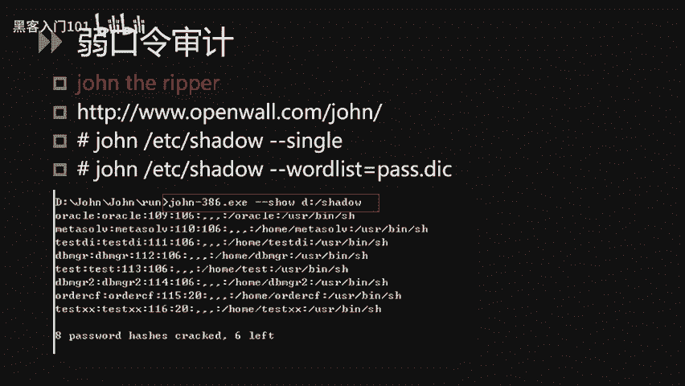

### 专用安全工具

**1. 口令审计工具：John the Ripper**
John the Ripper 是一个快速的口令破解工具，能够对Linux系统的`/etc/shadow`文件进行口令审计。使用该工具时，必须能获取到目标系统的密码哈希文件。
常见使用方法：
```bash
# 方式一：使用简单规则，尝试用户名的变体作为密码
john --single /etc/shadow

# 方式二：使用密码字典进行爆破
john --wordlist=password.txt /etc/shadow
```

**2. 口令审计工具：Hydra**
Hydra（九头蛇）是一个支持多种协议的在线口令爆破工具。与John的区别在于它不需要提取密码哈希文件，而是直接向目标服务发起登录尝试。
注意：在线爆破可能触发账户锁定策略，使用前需确认。
```bash
# 爆破FTP服务
hydra -l username -P passlist.txt ftp://192.168.1.1

# 爆破SSH服务
hydra -l root -P passwords.txt ssh://192.168.1.1
```

**3. 后门检测工具：chkrootkit**
chkrootkit 是一个用于本地检查rootkit（系统后门）的工具。它能检测60多种已知的rootkit。
使用方法简单，安装后运行：
```bash
sudo chkrootkit
```

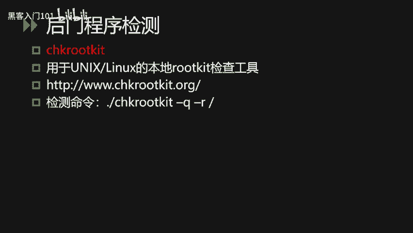

**4. 后门检测工具：rkhunter**
rkhunter（Rootkit Hunter）是另一个常用的rootkit检测工具。它会检查系统二进制文件、隐藏文件、异常进程等。
安装后运行检查，报告会生成在`/var/log/rkhunter.log`。
```bash
sudo rkhunter --check
```

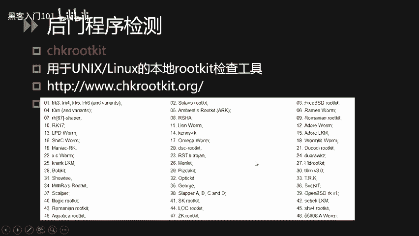

## 总结 📚

本节课中我们一起学习了Linux系统安全的三个重要方面。
1.  **网络安全配置**：我们学习了如何使用`sysctl`调整网络参数以增强隐蔽性，以及如何使用`iptables`配置精细的防火墙规则来控制网络流量。
2.  **日志审计安全**：我们了解了如何启用系统审计日志，熟悉了关键日志文件的位置和含义，并掌握了通过分析`secure`、`last`、`lastlog`等日志来发现暴力破解和异常登录行为的方法。
3.  **安全工具使用**：我们介绍了`ps`、`grep`、`find`等系统命令在安全排查中的应用，并学习了`John the Ripper`、`Hydra`、`chkrootkit`和`rkhunter`等专用工具，用于进行口令审计和后门检测。

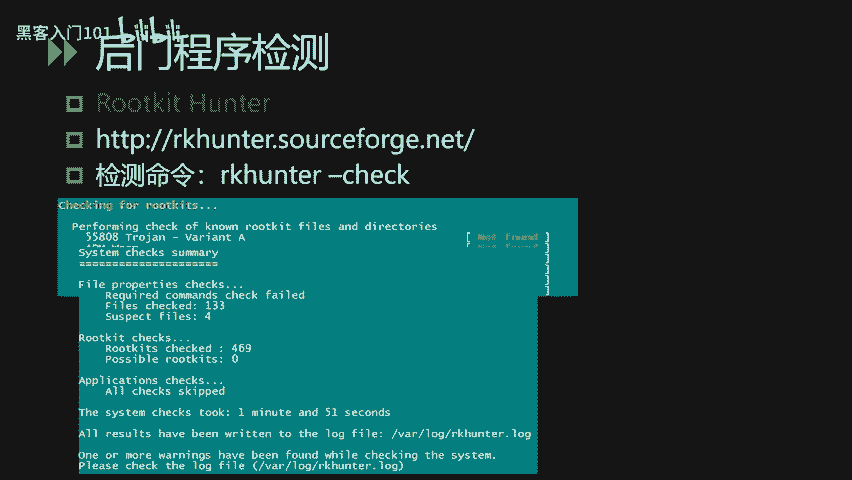


通过掌握这些知识，你可以初步构建起Linux系统的安全防护与检测能力。