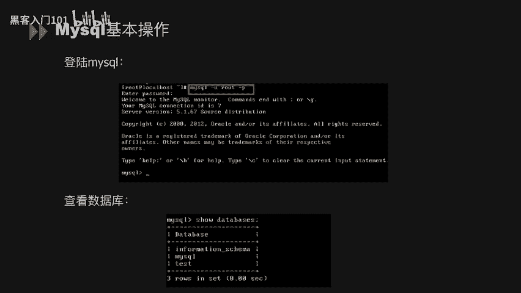
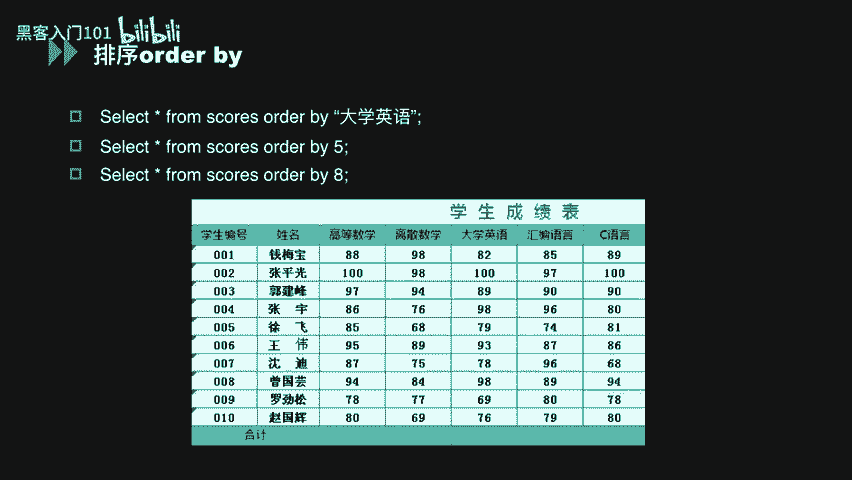
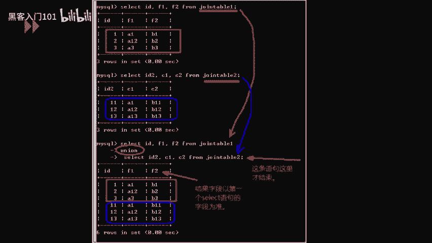
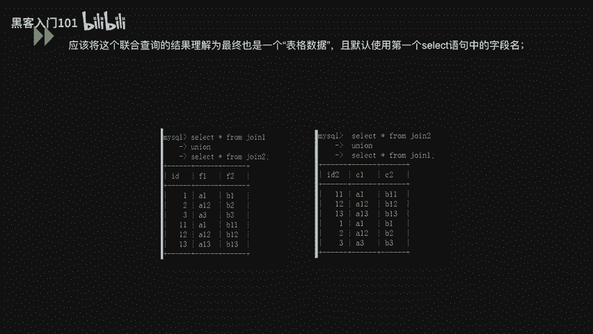

# MySQL数据库安全入门：P6：MySQL常用命令 🗄️


在本节课中，我们将学习MySQL数据库的基本操作命令。掌握这些命令是进行数据库管理和后续安全测试的基础。我们将从登录数据库开始，逐步介绍用户管理、数据库的增删改查（CRUD）操作、排序以及联合查询等核心功能。

## 登录与查看数据库



上一节我们介绍了数据库的基本概念，本节中我们来看看如何操作MySQL。首先需要登录到MySQL服务器。

登录MySQL可以使用以下命令，其中`-u`指定用户名，`-p`表示需要输入密码。
```bash
mysql -u username -p
```
输入正确密码后，即可进入MySQL命令行界面。进入后，可以使用以下命令查看当前服务器上的所有数据库。
```sql
SHOW DATABASES;
```

## 用户与权限管理 🔐

成功连接数据库后，管理用户和权限是首要任务。以下是相关的操作命令。

**新建用户并授权**
创建新用户时，通常需要同时设置密码和授予权限。
```sql
CREATE USER 'newuser'@'localhost' IDENTIFIED BY 'password';
GRANT ALL PRIVILEGES ON database_name.* TO 'newuser'@'localhost';
```

**查询、授予与撤销权限**
以下是管理用户权限的常用命令。
*   **查询权限**：`SHOW GRANTS FOR 'username'@'localhost';`
*   **授予权限**：`GRANT SELECT, INSERT ON database_name.* TO 'username'@'localhost';`
*   **撤销权限**：`REVOKE ALL PRIVILEGES ON database_name.* FROM 'username'@'localhost';`

**查看系统信息**
有时需要查看数据库的版本、当前时间或日志信息。
*   **查看版本**：`SELECT VERSION();`
*   **查看当前时间**：`SELECT CURRENT_DATE();`
*   **查看日志文件位置**：`SHOW VARIABLES LIKE ‘%log%’;`

**查看用户信息**
要查看所有用户及其主机信息，可以查询系统表。
```sql
SELECT user, host, password FROM mysql.user;
```

## 数据库的增删改查（CRUD）操作

掌握了用户管理后，我们来学习对数据本身的核心操作：增（Create）、删（Delete）、改（Update）、查（Read）。

### 增加数据（Create）

增加操作主要涉及创建表（CREATE）和插入数据（INSERT）。

**创建表**
使用`CREATE TABLE`语句可以定义一张新表的结构。
```sql
CREATE TABLE scores (
    id INT,
    name VARCHAR(50),
    grade INT
);
```
上述代码创建了一个名为`scores`的表，包含`id`、`name`、`grade`三个字段。

**插入数据**
创建表后，使用`INSERT INTO`语句向表中添加数据。
```sql
-- 指定列名插入
INSERT INTO student (name, money, sex, phone) VALUES (‘HK’, 100, ‘M’, ‘123456’);
-- 省略列名插入（值必须与所有列顺序严格对应）
INSERT INTO student VALUES (‘HK’, 100, ‘M’, ‘123456’);
```

### 删除数据（Delete）

删除操作包括删除整张表（DROP）和删除表中的特定行（DELETE）。

以下是删除操作的命令。
*   **删除表**：`DROP TABLE table_name;` （此操作会直接删除表结构和所有数据）
*   **删除表中特定行**：`DELETE FROM table_name WHERE id = 1;` （此操作仅删除`id`为1的那一行数据）


### 修改数据（Update）

修改操作分为修改表结构（ALTER）和修改表中的数据（UPDATE）。

以下是修改操作的命令。
*   **修改表结构**：`ALTER TABLE student ADD COLUMN email VARCHAR(100);` （此命令为`student`表新增一个`email`字段）
*   **修改表中数据**：
    ```sql
    -- 将表中所有记录的money字段改为100
    UPDATE student SET money = 100;
    -- 仅将name为‘HK’的记录的money改为200
    UPDATE student SET money = 200 WHERE name = ‘HK’;
    ```

### 查询数据（Select）



查询是数据库最常用的操作，主要通过`SELECT`语句实现。


以下是查询操作的常用命令。
*   **查看表结构**：`DESC table_name;`
*   **查看所有表名**：`SHOW TABLES;`
*   **限制查询条数**：
    ```sql
    SELECT * FROM student LIMIT 5; -- 查询前5条
    SELECT * FROM student LIMIT 1, 5; -- 从第2条开始（跳过1条），查询5条
    ```
*   **查询指定字段**：`SELECT id, name, sex FROM student;`
*   **查询所有数据**：`SELECT * FROM student;`

## 数据排序与联合查询

在熟练进行基本查询后，我们可以学习更高级的数据组织和组合方式。

### 数据排序（ORDER BY）



使用`ORDER BY`子句可以对查询结果进行排序。排序可以依据列名或列的序号。
```sql
-- 按“大学英语”这一列的值升序排序
SELECT * FROM scores ORDER BY 大学英语;
-- 按第5列（假设“大学英语”是第5列）的值升序排序
SELECT * FROM scores ORDER BY 5;
```
**注意**：如果`ORDER BY`后面的数字超过了表的列数，数据库会报错。这个特性在后续的安全测试中可能会被用到。

### 联合查询（UNION） 🔗

联合查询用于将两个或多个`SELECT`语句的结果集合并成一个结果集。要成功进行联合查询，必须满足两个条件：
1.  每个`SELECT`语句查询的**列数必须相同**。
2.  每个`SELECT`语句查询的对应列，其**数据类型应该兼容**。

联合查询的基本语法如下：
```sql
SELECT column1, column2 FROM table1
UNION [ALL]
SELECT column1, column2 FROM table2;
```
*   `UNION`默认会**去除**重复的行。
*   使用`UNION ALL`会保留所有行，包括重复的。
*   最终结果的显示顺序，与`SELECT`语句在`UNION`中的书写顺序有关。

**示例**：
假设有两个结构相同的表`table1`和`table2`。
```sql
-- 查询并合并两个表的数据
SELECT id, f1, f2 FROM table1
UNION ALL
SELECT id, c1, c2 FROM table2;
```
这条语句会将`table1`和`table2`的所有行上下堆叠在一起输出。



---


本节课中我们一起学习了MySQL数据库的常用命令。我们从登录数据库开始，逐步掌握了用户权限管理、对数据进行增删改查（CRUD）的基本方法，以及如何使用`ORDER BY`进行排序和`UNION`进行联合查询。这些命令是操作和理解MySQL数据库的基石，务必熟练掌握。在接下来的课程中，我们将基于这些知识，探索数据库安全相关的更多内容。