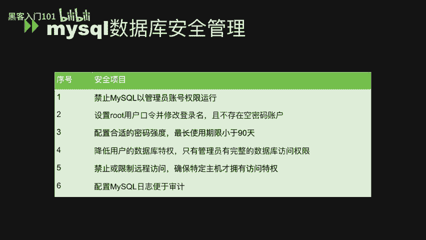
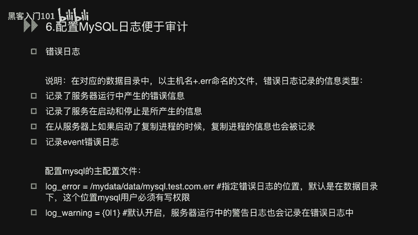
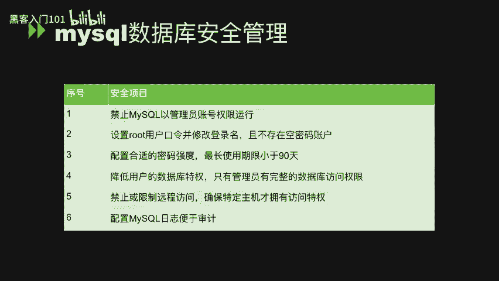

# MySQL数据库安全管理与优化：P7：MySQL数据库系统安全管理与优化


在本节课中，我们将要学习MySQL数据库安全管理的核心知识，包括安全配置规范、基本操作命令以及SQL注入原理的初步理解。课程内容分为三个主要部分，我们将逐一进行讲解。




## 第一部分：MySQL数据库安全管理

上一节我们介绍了课程的整体结构，本节中我们来看看MySQL数据库安全管理的具体规范。这部分内容旨在通过一系列安全基线配置，提升数据库系统的安全性。

以下是六个关键的安全配置点及其详细说明：

1.  **禁止MySQL以管理员账号权限运行**
    MySQL数据库应使用非管理员账号运行，以普通账户安全运行。这样做的目的是在数据库出现漏洞时，将影响范围控制在MySQL用户权限内，而不至于危及整个操作系统。
    *   **加固方法**：在MySQL的配置文件 `my.cnf` 中添加 `user = mysql` 配置，然后重启数据库服务。

2.  **设置root用户口令，修改登录名，且不存在空密码账户**
    首先，为root用户设置强密码。登录数据库后，使用以下命令修改密码：
    ```sql
    SET PASSWORD FOR 'root'@'localhost' = PASSWORD('new_password');
    ```
    其次，为提高安全性，可以修改root用户的用户名：
    ```sql
    USE mysql;
    UPDATE user SET user = 'new_username' WHERE user = 'root';
    FLUSH PRIVILEGES;
    ```
    最后，确保所有数据库用户均设置了密码，不存在空密码账户。检查空密码用户的命令如下：
    ```sql
    SELECT * FROM mysql.user WHERE password = '';
    ```
    安全系统中，此命令应无返回结果。

3.  **配置合理的密码强度与最长使用期限（小于90天）**
    密码应具备复杂性，包括长度、大小写、数字和特殊字符。可通过全局策略启用密码复杂度插件并设置规则，例如最小长度14位。
    同时，需限制密码的最长使用期限不超过90天。
    *   **加固方法**：在数据库中配置全局策略。
    ```sql
    SET GLOBAL default_password_lifetime = 90;
    ```

4.  **降低用户的数据库特权，仅管理员拥有完整访问权限**
    `mysql.user` 和 `mysql.db` 表中列出了各种权限，这些权限通常不应授予每个用户，而应只保留给管理员使用。
    *   **加固方法**：审计非管理员用户的权限，并使用 `REVOKE` 语句移除其不必要的权限。需要重点关注 `FILE_PRIV`（读本地文件）、`PROCESS_PRIV`（查看进程信息）、`SUPER_PRIV`（高级权限）、`SHUTDOWN_PRIV`（关闭数据库）、`CREATE_USER_PRIV`（创建用户）和 `GRANT_PRIV`（授权）等权限。
    *   **检查命令示例**：
    ```sql
    SELECT user, host FROM mysql.user WHERE file_priv = 'Y';
    ```
    *   **权限回收命令示例**：
    ```sql
    REVOKE SHUTDOWN ON *.* FROM 'user'@'host';
    ```

5.  **禁止或限制远程访问，确保特定主机才拥有访问权限**
    从外部网络直接访问生产数据库是危险的。应避免使用 `GRANT ALL ON *.* TO 'root'@'%'` 这类完全开放权限的命令。
    *   **加固方法**：将访问权限限制在特定的IP地址，并仅授予必要的最小权限。
    ```sql
    GRANT ALL ON *.* TO 'root'@'specific_ip';
    GRANT SELECT, INSERT ON mydb.* TO 'some_user'@'some_host';
    ```

6.  **配置MySQL日志便于审计**
    MySQL应配置相关日志功能，如错误日志、二进制日志、慢查询日志和通用查询日志等，以便于问题排查和安全审计。
    *   **加固方法**：在主配置文件 `my.cnf` 中设置相关参数，例如指定错误日志路径：
    ```
    log-error = /var/log/mysql/error.log
    ```
    错误日志记录了服务器运行中的错误、启动/停止信息、复制进程信息以及事件调度错误等信息。

以上便是MySQL数据库安全管理方面的全部内容。我们回顾了从运行账户、密码策略、权限管理到访问控制和日志审计的六个关键安全实践。

## 第二部分：MySQL常用基本命令

在了解了安全配置后，我们需要掌握与数据库交互的基础。本节将介绍MySQL的增删改查基本操作，以及`ORDER BY`、联合查询等内容，这是后续理解SQL注入的必备知识。

（*注：由于提供的原始内容未展开此部分细节，此处根据章节标题进行过渡性描述。实际教程应在此处详细讲解`SELECT`, `INSERT`, `UPDATE`, `DELETE`, `ORDER BY`, `UNION`等命令的用法和示例。*）

## 第三部分：SQL查询及手工注入执行

掌握了基本命令后，本节我们将进入实战环节。通过手动在数据库中执行SQL注入语句，并观察数据库的回显，来深入理解SQL注入的攻击原理与实现过程。

（*注：由于提供的原始内容未展开此部分细节，此处根据章节标题进行过渡性描述。实际教程应在此处演示如何构造注入Payload，利用`UNION`查询、报错信息等获取数据，从而阐明SQL注入的核心机制。*）



---




本节课中我们一起学习了MySQL数据库的安全管理基线配置，强调了以最小权限原则运行服务、强化认证与授权、以及启用审计日志的重要性。这些是构建安全数据库环境的基石。同时，我们也概述了进行数据库操作和安全性研究所需的基本命令与概念框架。