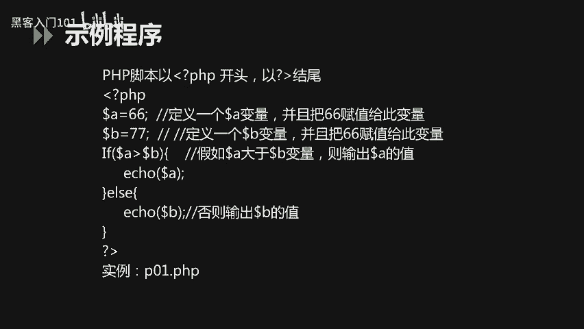
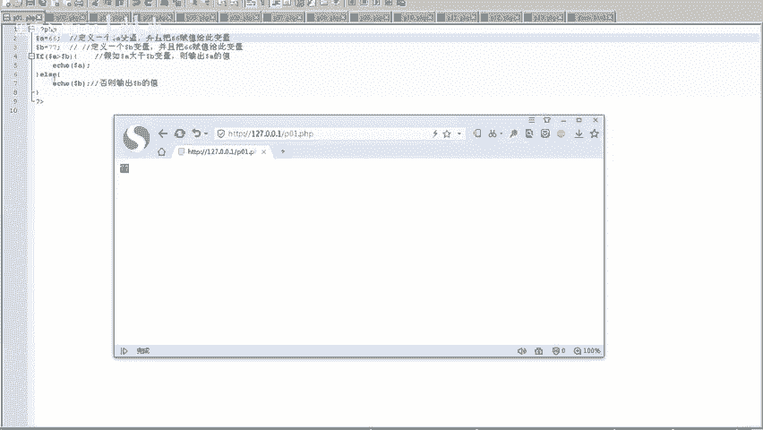
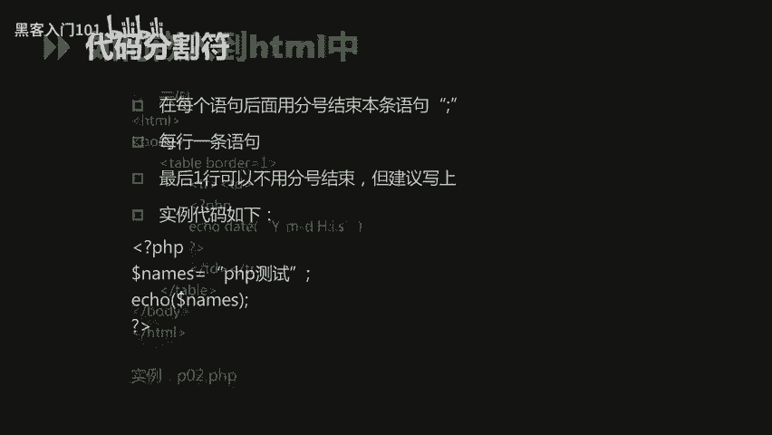
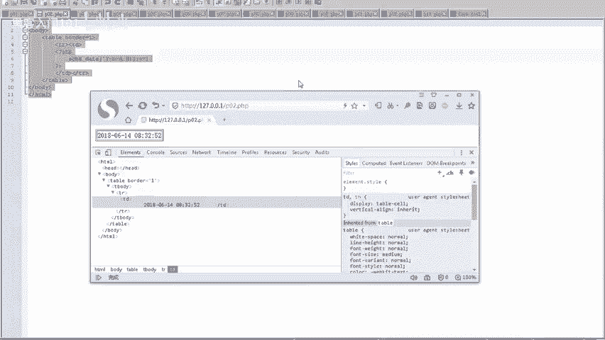
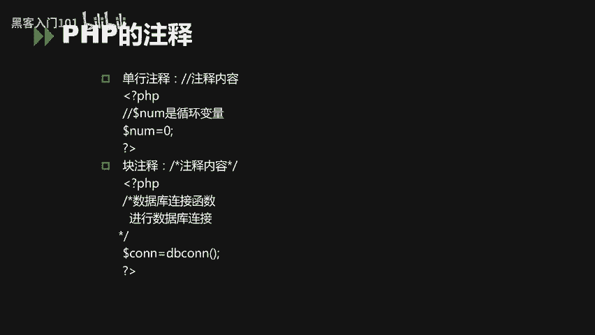

# PHP入门教程：第8章：PHP基础知识（一）📘


在本节课中，我们将要学习PHP的基础知识，包括其基本概念、开发环境以及核心语法。我们将从最简单的示例开始，逐步理解PHP脚本的结构和运行方式。

---

## PHP的基本常识

上一节我们介绍了课程的整体结构，本节中我们来看看PHP的基本常识。这部分内容旨在帮助你建立对PHP的初步认识。

### PHP的定义与现状

PHP的原始定义是“Personal Home Page Tools”。目前，PHP被定义为“超文本预处理器”（Hypertext Preprocessor）的递归缩写。PHP本身是一种被广泛应用的、开放源代码的多用途脚本语言。

在2017年12月的编程语言排名中，PHP处于第九位。与前两年相比，其排名有所下降。

### PHP的定位与竞争

PHP是服务端的脚本语言，它返回的是HTML代码。与PHP竞争的主要语言有三类：
*   微软的C#语言。
*   Oracle的Java语言。
*   谷歌的Python语言。

这三类语言与PHP都是当前软件开发领域很流行并被广泛使用的语言。

### PHP的主要应用领域

PHP的开发领域主要应用在服务端脚本，更多是应用于Web开发，特别是中小型网站的Web开发。其他两种应用场景如下：
*   命令行脚本：直接在命令行下执行PHP程序。
*   客户端GUI开发：但当前应用场景较少。

主流的应用仍然是服务端脚本开发和Web开发。

### PHP的运行环境与支持

在软件开发中，程序开发人员大部分使用Windows操作系统。因此，开发人员需要熟练掌握Windows下的PHP开发运行环境。PHP也可以在其它操作系统上进行开发，包括Linux、Unix和Mac操作系统。

支持PHP运行的服务器包括Apache和Nginx。PHP本身支持多种数据库，主流的有MySQL、SQL Server和Oracle。

---



## PHP的基本语法

了解了PHP的基本情况后，本节中我们将深入其核心语法，这是今天需要重点掌握的内容。

### PHP脚本示例

PHP脚本以 `<?php` 作为开头，以 `?>` 作为结尾标签。



以下是第一个示例程序。该程序定义了两个变量，并比较它们的大小，输出较大的值。

```php
<?php
$a = 88;
$b = 77;
if ($a > $b) {
    echo $a;
} else {
    echo $b;
}
?>
```

**程序运行结果说明：**
当 `$a=88`, `$b=77` 时，输出结果为 `88`。因为88大于77，所以输出变量 `$a` 的值。
如果将 `$a` 的值改为66，那么66小于77，输出结果将变为 `77`，即变量 `$b` 的值。

### PHP与HTML的融合



PHP代码可以嵌入到HTML页面中。以下示例展示了如何在HTML表格中插入PHP脚本来输出当前系统时间。

```php
<!DOCTYPE html>
<html>
<body>
<table>
    <tr>
        <td>当前时间是：</td>
        <td><?php echo date("Y-m-d H:i:s"); ?></td>
    </tr>
</table>
</body>
</html>
```

**程序运行结果说明：**
这段代码会在网页的表格单元格中显示当前的系统时间，格式为“年-月-日 时:分:秒”。PHP的 `date()` 函数获取时间，并直接输出到HTML结构中。



### 语句结束与注释

在PHP代码中，每个语句后面都必须用分号 `;` 结束。最后一条语句后的分号可以省略，但建议始终写上。

注释对程序编写和维护非常重要。PHP支持两种注释方式：

以下是两种注释的示例：
*   **单行注释**：使用双斜杠 `//`。
    ```php
    // 这是单行注释
    $name = “PHP测试”; // 为变量赋值
    ```
*   **块注释（多行注释）**：使用 `/*` 和 `*/` 包裹。
    ```php
    /*
    这是一个多行注释，
    可以跨越多行。
    常用于解释复杂代码块的功能。
    */
    ```

### 学习资源参考

在以后针对PHP开发过程中遇到的问题，可以参考PHP中文参考手册，并到PHP官网下载最新的文档。

在PHP的参考手册中，共有189类函数，超过5000个函数。其中开发中常用的函数大约有100个左右。

---



## 总结


本节课中我们一起学习了PHP的基础知识。我们首先了解了PHP的定义、现状、应用领域以及运行环境。接着，我们重点学习了PHP的基本语法，包括脚本结构、变量使用、与HTML的融合方法、语句结束规则以及代码注释的写法。通过简单的示例，我们看到了PHP代码是如何运行并生成动态内容的。掌握这些基础知识是后续深入学习PHP编程和Web开发的关键。