# PHP基础知识：2：变量、常量与字符串操作


在本节课中，我们将继续学习PHP的基础知识，主要包括PHP的变量、常量以及字符串操作函数。这些是构建PHP程序的基础构件。

上一节我们介绍了PHP的基本语法，本节中我们来看看PHP支持的各种数据类型。

## 数据类型

PHP支持8种原始数据类型，包括4种标量类型、2种复合类型和2种特殊类型。

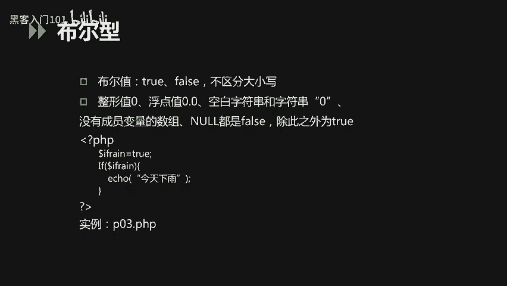

以下是四种标量类型：
*   **布尔型**：表示真或假。
*   **整型**：表示整数。
*   **浮点型**：表示小数。
*   **字符串型**：表示文本。

以下是两种复合类型：
*   **数组**：存储多个值的有序集合。
*   **对象**：存储数据和功能的实例。

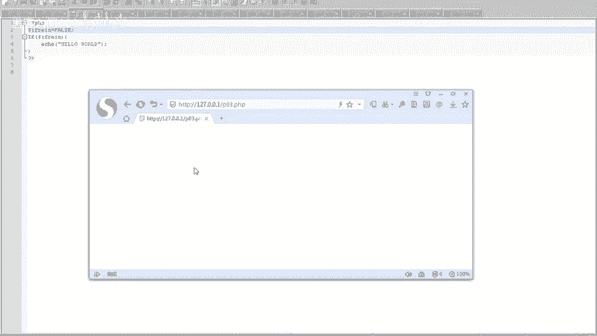

以下是两种特殊类型：
*   **资源**：表示外部资源（如数据库连接）。
*   **空**：表示没有值。

### 布尔型

布尔型只有两个值：`true` 和 `false`，不区分大小写。以下值在条件判断中会被视为 `false`：
*   布尔值 `false`
*   整型值 `0`
*   浮点值 `0.0`
*   空字符串 `""` 和字符串 `"0"`
*   没有成员变量的数组
*   特殊类型 `null`

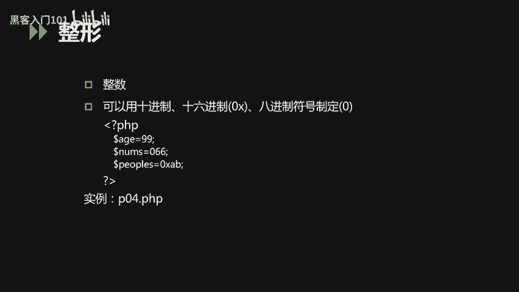

除此之外，其他值都被视为 `true`。

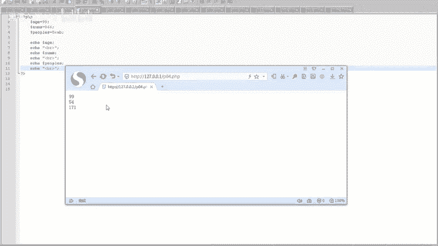

我们来看一个示例代码：
```php
<?php
$is_raining = true;
if ($is_raining) {
    echo "今天下雨";
}
?>
```
在这段代码中，变量 `$is_raining` 被设置为 `true`，因此 `if` 语句的条件成立，会输出“今天下雨”。如果将 `$is_raining` 改为 `false`，则不会输出。

### 整型

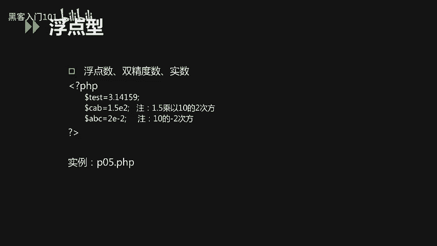

整型用于表示整数，可以用十进制、十六进制（以 `0x` 开头）或八进制（以 `0` 开头）表示。

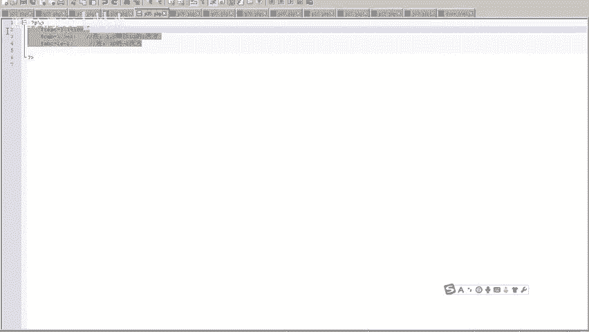

以下是定义不同进制整数的示例：
```php
<?php
$age = 99;          // 十进制
$number = 066;      // 八进制，等于十进制的54
$hex = 0xAB;        // 十六进制，等于十进制的171
echo $age, $number, $hex;
?>
```
代码运行后，三个变量都会以十进制形式输出。

### 浮点型

浮点型用于表示小数（实数），包括单精度和双精度浮点数。

以下是定义浮点数的示例：
```php
<?php
$test_float = 3.14159;
$test_double = 1.2e3; // 科学计数法，等于1200
$test_real = 7E-10;   // 科学计数法，等于0.0000000007
?>
```
定义成功后，可以直接访问或输出这些变量。

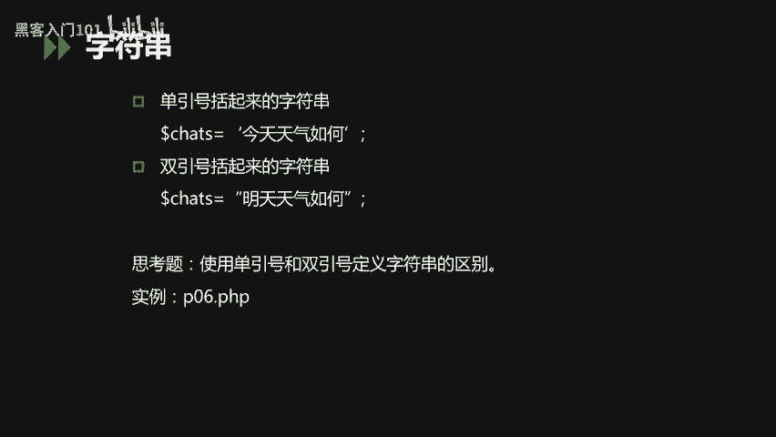

### 字符串型

字符串是PHP中常用的数据类型，可以用单引号或双引号定义，两者有重要区别。

以下是字符串定义的示例：
```php
<?php
$str = 6;
echo ‘$str\n‘;  // 输出：$str\n
echo “$str\n”;  // 输出：6 （并换行）
?>
```
*   **单引号**：内部所有内容（包括变量名和转义字符如 `\n`）都会作为普通字符串原样输出。
*   **双引号**：会解析内部的变量（如 `$str`）和转义字符（如 `\n` 会换行）。

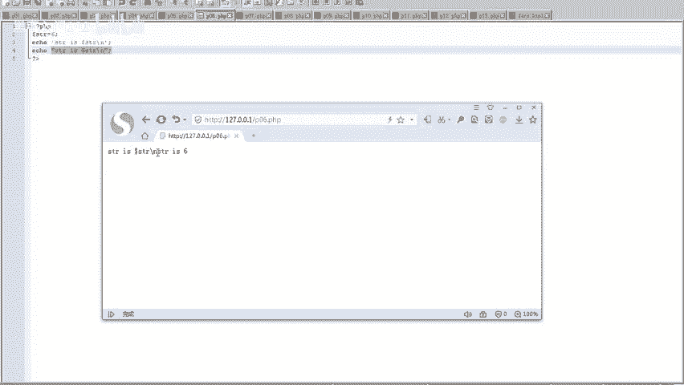

### 数组

数组用于在单个变量中存储多个值，主要分为两类。

以下是定义数组的示例：
```php
<?php
// 1. 索引数组：下标为数字，默认从0开始
$names = array(“Peter”, “Joy”, “Lily”);
echo $names[0] . “ and ” . $names[1] . “ are ” . $names[2] . “’s neighbors.”;

// 2. 关联数组：下标为自定义的键名（字符串）
$ages = array(“Peter”=>35, “Ben”=>37, “Joe”=>43);
echo “Peter is ” . $ages[‘Peter’] . “ years old.”;
?>
```
索引数组使用数字作为键，而关联数组使用自定义的字符串作为键。

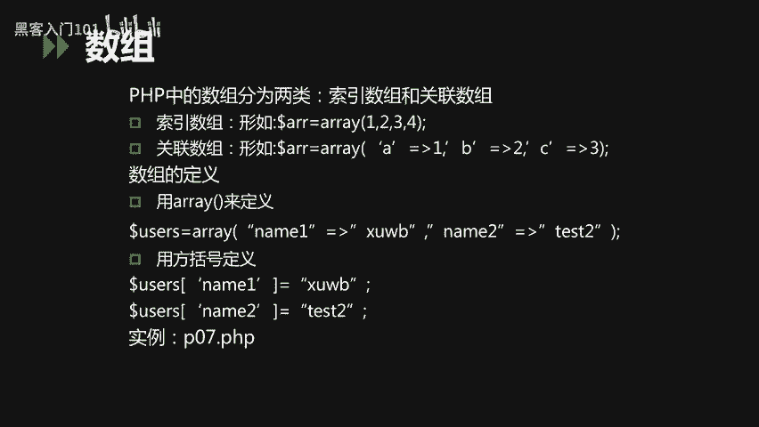

### 空类型

空类型 `null` 表示一个变量没有值，不区分大小写。以下情况变量值为 `null`：
*   变量被显式赋值为 `null`。
*   变量尚未被赋值。
*   变量被 `unset()` 函数销毁。

以下是空类型的示例：
```php
<?php
$var1 = null;        // 显式赋值为null
var_dump($var1);     // 输出：NULL

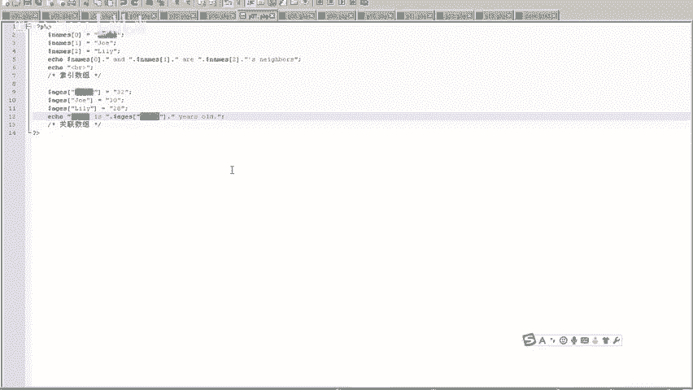

var_dump($var2);     // 未赋值的变量，输出：NULL

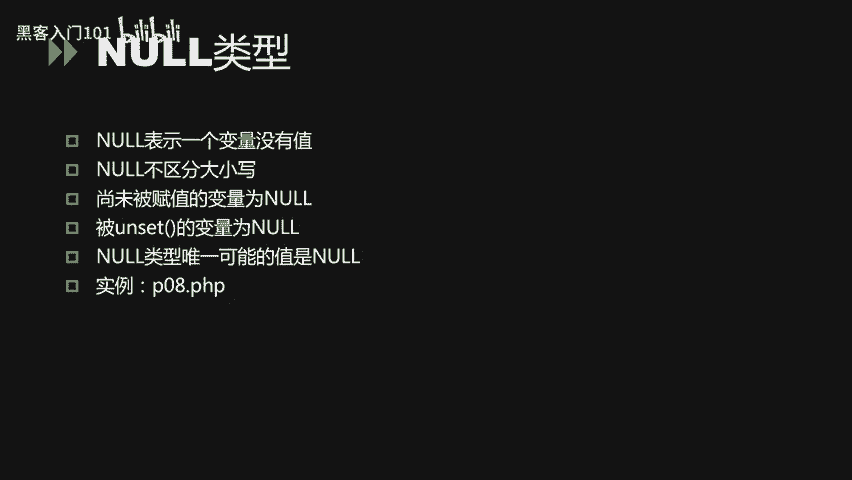

$var3 = “test”;
unset($var3);        // 销毁变量
var_dump($var3);     // 输出：NULL
?>
```

以上我们介绍了PHP中的主要数据类型，包括整型、浮点型、字符串、数组和空类型。接下来，我们看看在代码中如何使用这些数据，即变量的概念。

## 变量

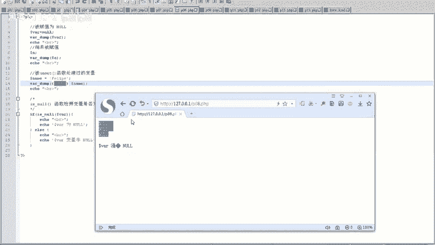

变量以美元符号 `$` 开头，名称区分大小写。变量名通常以字母或下划线开始，后跟字母、数字或下划线。

### 预定义变量

PHP提供了一些预定义变量，用于获取特定信息，例如服务器信息、请求参数等。

以下是使用预定义变量的示例：
```php
<?php
print_r($_SERVER); // 包含头信息、路径、脚本位置等信息的数组
print_r($_COOKIE); // 获取当前页面的Cookie信息
?>
```
`$_SERVER` 和 `$_COOKIE` 是常见的预定义变量。

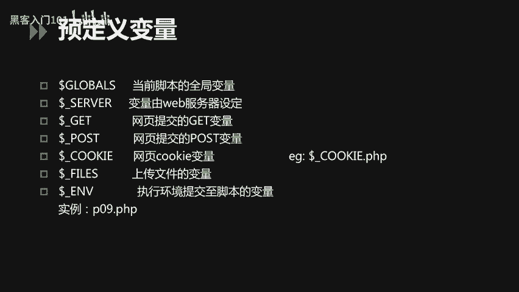

### 变量作用域

变量的有效范围称为作用域。
*   **全局变量**：在函数外定义，通常在脚本全局有效。
*   **局部变量**：在函数内定义，只在该函数内有效。
*   在函数内部使用 `global` 关键字可以引用函数外部的全局变量。
*   **静态变量**：在函数内用 `static` 声明，函数执行结束后其值不会丢失。

以下是变量作用域的示例：
```php
<?php
$dd = 2; // 全局变量
function aa() {
    global $dd; // 使用global关键字引用全局变量$dd
    echo $dd;
}
aa(); // 输出：2
?>
```

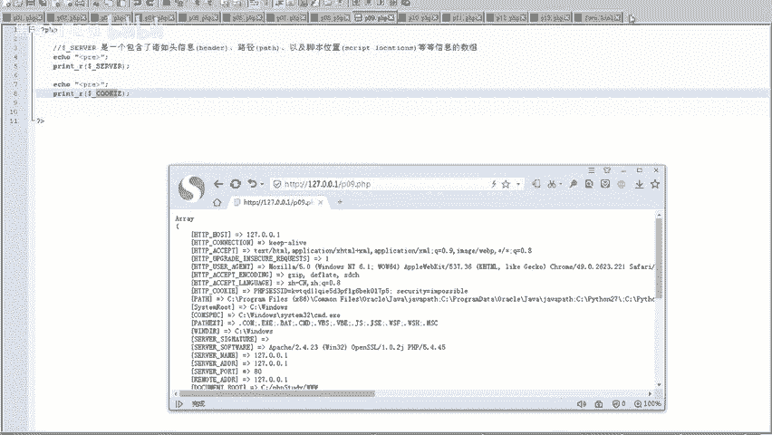

### 外部变量

当HTML表单提交给PHP程序时，表单中的数据会自动成为PHP可用的变量。

以下是处理表单数据的示例：
**HTML表单 (form.html):**
```html
<form action=“p11.php” method=“get”>
    姓名：<input type=“text” name=“fname”>
    年龄：<input type=“text” name=“age”>
    <input type=“submit”>
</form>
```
**PHP处理脚本 (p11.php):**
```php
<?php
echo “姓名：” . $_GET[‘fname’];
echo “年龄：” . $_GET[‘age’];
?>
```
通过 `$_GET` 数组可以获取通过GET方法提交的参数值。同理，`$_POST` 用于获取POST方法提交的数据。

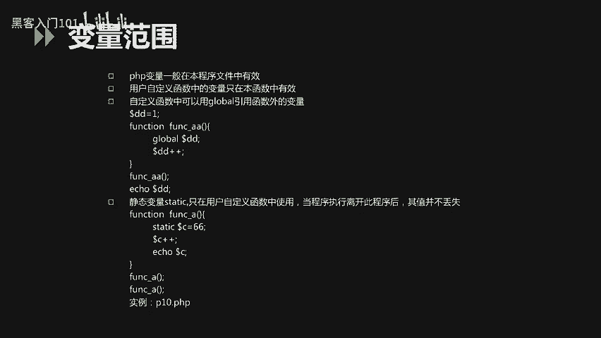

了解了变量之后，我们再来看看另一种存储数据的方式——常量。

## 常量

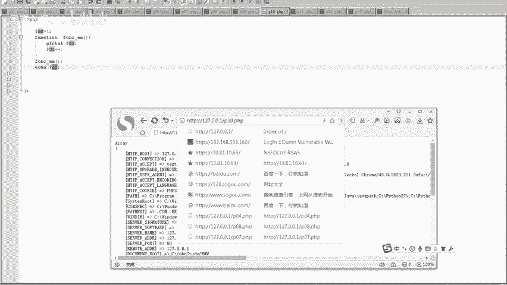

常量用于存储不变的值，一旦定义就不能被改变或重新定义。常量名前面没有 `$` 符号，默认区分大小写。

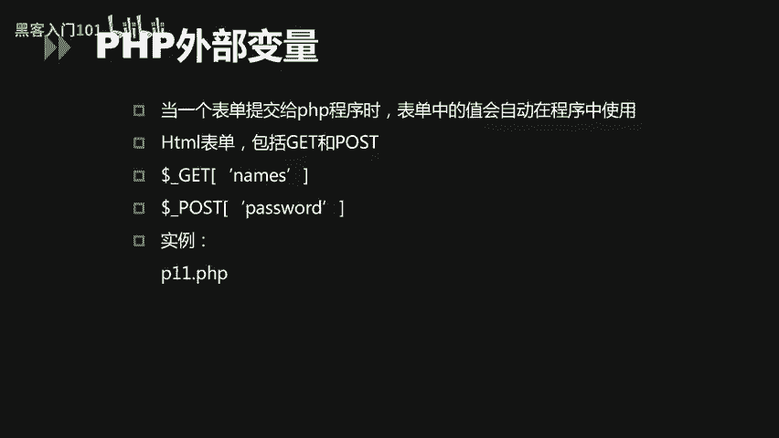

定义常量使用 `define()` 函数：
```php
<?php
define(“SITE_NAME”, “我的网站”);
echo SITE_NAME;
?>
```
常量的值只能是标量（布尔、整型、浮点、字符串）。常量的作用域是全局的。

PHP也提供了一些预定义常量，例如 `PHP_VERSION`（PHP版本）和 `__FILE__`（当前文件路径）。

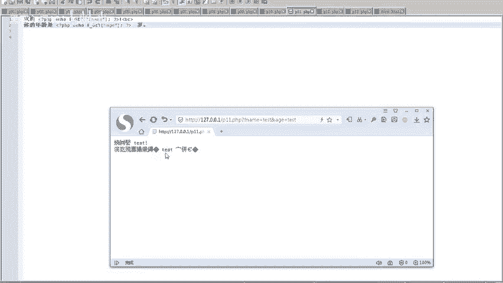

最后，我们来了解一些PHP中常用的函数。

## 常用函数

PHP内置了大量函数，以下是一些字符串操作和输出相关的常用函数：

以下是部分常用函数示例：
*   `strlen($string)`：获取字符串长度。
    ```php
    echo strlen(“Hello”); // 输出：5
    ```
*   `strpos($haystack, $needle)`：在字符串中查找子串首次出现的位置。
    ```php
    echo strpos(“Hello world”, “world”); // 输出：6
    ```
*   `print` / `echo`：输出一个或多个字符串。
    ```php
    echo “Hello”, “ World”; // 输出：Hello World
    ```
*   `var_dump($variable)`：打印变量的详细信息，包括类型和值，常用于调试。

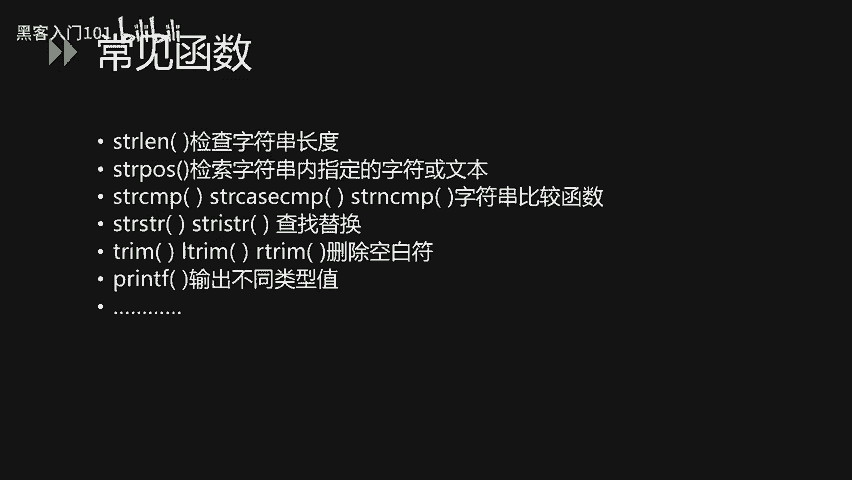

---


本节课中我们一起学习了PHP的核心基础知识。我们详细探讨了PHP的八种数据类型，包括布尔型、整型、浮点型、字符串、数组和空类型的使用方法。接着，我们深入了解了变量的定义、作用域以及如何通过预定义变量和外部变量获取数据。然后，我们学习了常量的定义及其与变量的区别。最后，我们介绍了一些在PHP开发中常用的字符串操作和输出函数。掌握这些内容是编写PHP程序的重要基础。