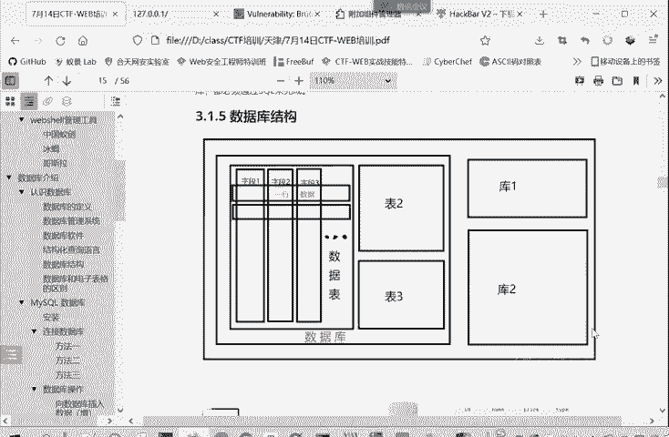
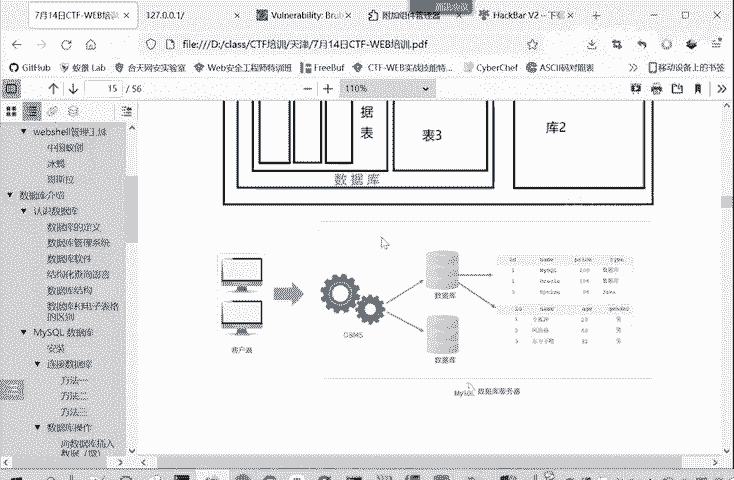
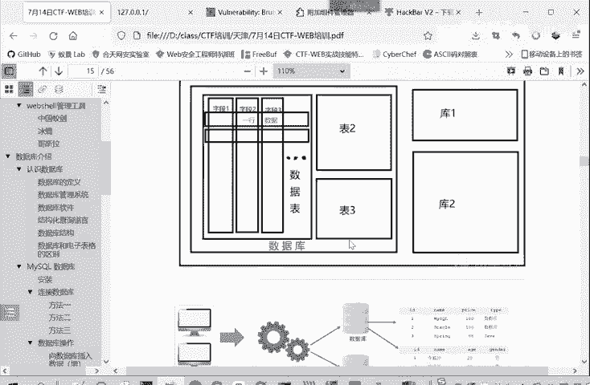
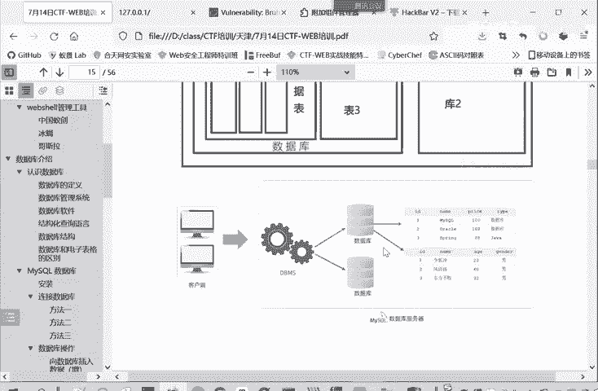
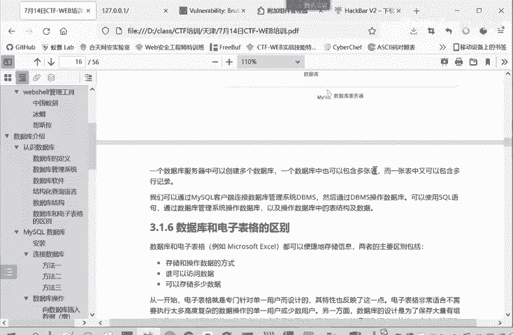

# CTF入门教程：P11：web-数据库结构 🗄️

在本节课中，我们将要学习数据库的基本结构。理解数据库的组成是进行Web安全测试，尤其是SQL注入等漏洞挖掘的基础。我们将从宏观到微观，逐步拆解数据库的层级关系。

## 数据库系统的层级结构

数据库管理系统（DBMS）负责管理多个数据库。每个数据库内部又包含许多数据表。这类似于一个文件系统中包含多个文件夹，每个文件夹里又有多个文件。

## 数据表的构成

每个数据表由行和列构成，其结构类似于一个Excel表格。以下是数据表的核心组成部分：

*   **字段（列）**：定义了表中数据的类别，例如 `ID`、`姓名`、`性别`、`年龄`。
*   **记录（行）**：代表一条具体的数据，例如第一行可能是“张三”的信息，第二行是“李四”的信息。

## 访问数据库的视角

上一节我们介绍了数据库的静态结构，本节中我们来看看如何动态地操作它。客户端或应用程序通过数据库管理系统（如MySQL）来访问具体的数据库。

这个过程可以描述为：连接DBMS -> 选择目标数据库 -> 操作特定的数据表 -> 对表中的记录进行增、删、改、查（CRUD）操作。

## 两种视角的关系

以上两种描述——层级结构和访问流程——其核心内容是一致的，只是从不同角度呈现了数据库的组成与操作方式。这有助于我们更全面地理解数据库。

## 核心概念总结

为了帮助大家更好地记忆，我们可以将数据库的结构总结为以下递进关系：
*   一个**数据库服务器**中包含多个**数据库**。
*   一个**数据库**中包含多张**数据表**。
*   一张**数据表**中包含多个**字段**和多条**记录**。

本节课中我们一起学习了数据库的基本结构。我们了解到数据库是一个层级化的系统，从数据库服务器到具体的记录，每一层都有其明确的定义。掌握这些概念是后续学习SQL语言和CTF-Web题目中数据库相关挑战的关键第一步。