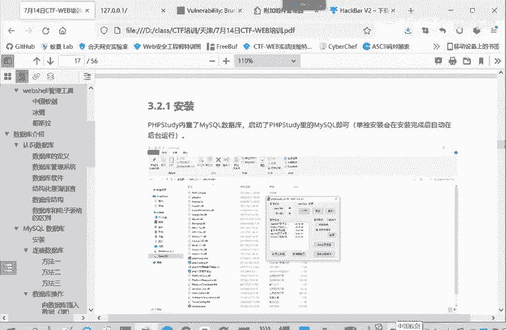

# CTF入门教程：P13：web-MySQL数据库安装 🗄️

在本节课中，我们将要学习MySQL数据库的基本概念及其在Web开发环境中的安装与启动方法。MySQL是CTF Web类题目中非常常见的后端数据库，理解其基本操作是入门的关键一步。

## 什么是MySQL？ 🤔

上一节我们介绍了Web应用的基本构成，本节中我们来看看其中至关重要的数据存储部分——数据库。

MySQL是一种开源的、基于SQL的关系型数据库管理系统。它专门针对Web应用进行了优化。MySQL可以在任何平台上运行，包括Windows、Linux和macOS。MySQL的一个特点是灵活多变。

互联网的兴起带来了许多新的和不同的需求。MySQL因此开始成为Web开发人员和基于Web的应用的首选平台。灵活、随心应变的特性是MySQL的一个主要特点。

所以就有很多顶级的互联网网站和基于Web的应用，都采用了MySQL作为数据库管理系统。

## MySQL的安装与启动 🚀

了解了MySQL的重要性后，我们下面看一下MySQL数据库的安装和使用。

关于安装，如果大家之前已经安装了PHPStudy，就不需要再专门进行MySQL数据库的安装了。因为PHPStudy是一个集成环境，它集成了MySQL。它就是一个WAMP环境。

以下是关于WAMP环境的解释：
*   **W** 代表 Windows 操作系统。
*   **A** 代表 Apache Web服务器。
*   **M** 代表 MySQL 数据库。
*   **P** 代表 PHP 后端语言。

PHPStudy是一个集成了Apache、MySQL和PHP的集成环境。只要启动了PHPStudy，就等于启动了MySQL数据库。

本节课中我们一起学习了MySQL数据库的基本概念、特点以及如何在集成环境（如PHPStudy）中启动它。掌握这些是后续进行数据库操作和解决CTF相关题目的基础。