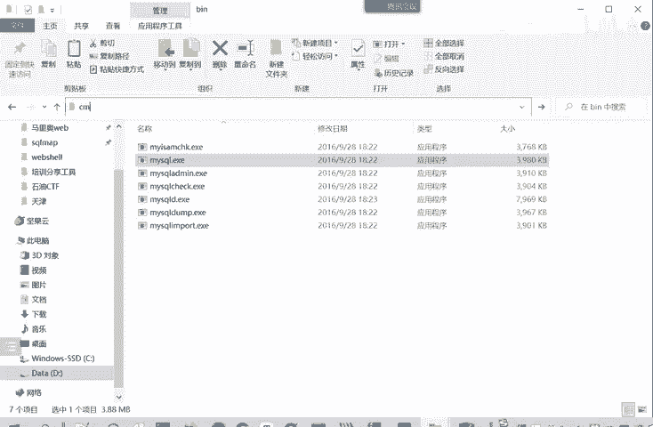
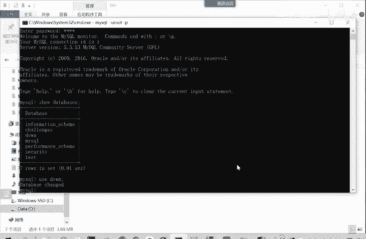
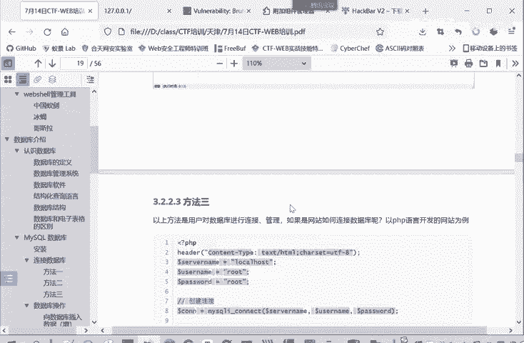

# CTF入门教程：P14：web-连接数据库 🗄️

在本节课中，我们将学习如何连接MySQL数据库。连接数据库是Web应用开发和安全测试中的基础操作，掌握多种连接方式对于后续学习和实战至关重要。

## 连接数据库的三种方法

上一节我们介绍了如何启动数据库服务，本节中我们来看看如何与已启动的MySQL数据库建立连接。主要有三种方法。

### 方法一：通过命令行工具连接



第一种方法是通过MySQL自带的命令行客户端进行连接。在PHP study的安装目录中，可以找到`mysql`目录下的`bin`文件夹，其中包含`mysql.exe`程序。

以下是使用命令行连接数据库的步骤：
1.  打开命令行工具。
2.  导航到`mysql.exe`程序所在目录，或将其路径添加到系统环境变量。
3.  使用命令 `mysql -u 用户名 -p` 进行连接。
4.  输入密码后，即可成功连接到数据库服务器。

连接成功后，可以使用SQL命令进行操作，例如：
*   `show databases;` 查看所有数据库。
*   `use 数据库名;` 切换到指定数据库。

例如，使用 `use dvwa;` 命令即可进入DVWA靶场的数据库。这就是通过命令行工具连接数据库的方式。



### 方法二：通过数据库管理软件连接

第二种方式是通过图形化的数据库管理软件进行连接，这种方式更为直观便捷。例如，PHP study自带了一个名为`MySQL-Front`的管理工具。

以下是使用数据库管理软件连接的步骤：
1.  打开PHP study，找到并启动`MySQL管理器`中的`MySQL-Front`。
2.  首次连接时，需要新建一个连接配置。
3.  在配置中，连接地址填写本地地址（如`localhost`或`127.0.0.1`），并输入正确的用户名和密码。
4.  保存配置后，以后每次只需打开该配置即可快速连接。

连接后，在软件界面中可以清晰地看到所有数据库。以DVWA靶场为例，其数据库`dvwa`中包含两个表：
*   `guestbook` 表：存储留言信息，包含`comment`、`name`等字段。
*   `users` 表：存储用户信息，包含`user_id`、`first_name`、`last_name`、`user`、`password`、`last_login`等字段。

除了MySQL-Front，PHP study中的`phpMyAdmin`（一个基于网页的数据库管理工具）也可以用来连接和管理数据库。但通常我们更习惯使用独立的客户端软件进行操作。

### 方法三：通过编程语言连接（以PHP为例）

以上两种方法是供开发者或管理员直接管理数据库时使用的。那么，当一个网站需要为访问它的用户查询数据库数据时，应该如何连接呢？这就需要通过服务器端的编程代码来实现。

以下是以PHP语言为例的数据库连接代码，其他如JSP等语言原理类似，核心在于连接命令。

```php
<?php
$servername = "localhost"; // 数据库服务器地址
$username = "your_username"; // 数据库用户名
$password = "your_password"; // 数据库密码

// 创建连接
$conn = mysqli_connect($servername, $username, $password);

// 检测连接
if (!$conn) {
    die("连接失败: " . mysqli_connect_error());
}
echo "连接成功";
?>
```

**关键连接函数**：`mysqli_connect()`。只需将数据库服务器地址、登录用户名和密码作为参数传入该函数，即可建立连接。这是网站开发时，后端代码与数据库交互所必需的连接方式。

对于普通用户或学习者而言，主要掌握命令行和图形化软件这两种连接方式即可。

## 总结



本节课中我们一起学习了连接MySQL数据库的三种主要方法：
1.  **命令行连接**：使用`mysql -u 用户名 -p`命令，适合快速操作和脚本编写。
2.  **图形化软件连接**：使用如MySQL-Front等工具，适合直观地管理和浏览数据。
3.  **编程语言连接**：以PHP的`mysqli_connect()`函数为例，这是Web应用程序后端与数据库交互的标准方式。

理解并掌握这些连接方法是进行后续数据库操作、Web应用开发和CTF-Web安全挑战的基础。下一节，我们将开始学习对数据库的基本操作。