# CTF入门教程：P15：数据库操作（增、改、查、删）📊

在本节课中，我们将要学习数据库的基本操作，即增、删、改、查。这些操作是理解后续SQL注入攻击的基础。我们的重点不是网站开发，而是学习如何在安全测试中获取和操作数据库中的数据。

## 概述：数据库操作的核心

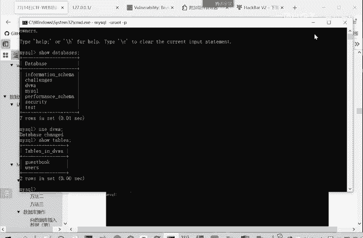

操作数据库的核心可以概括为四个字：**增、删、改、查**。在CTF比赛或安全测试中，我们主要关注如何从数据库中**获取数据**，而不是维护其稳定性或创建新表。

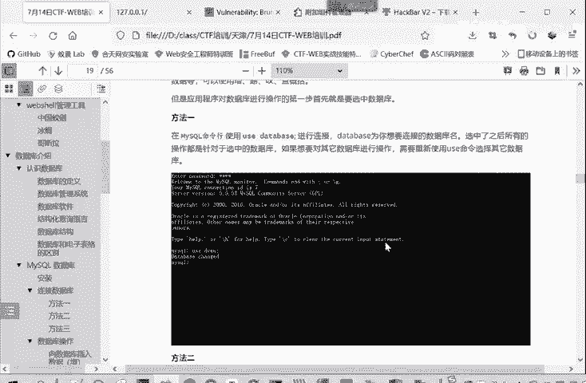

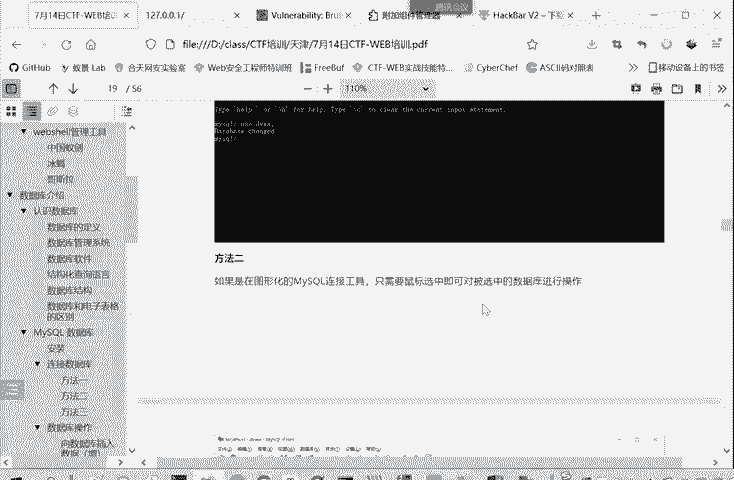

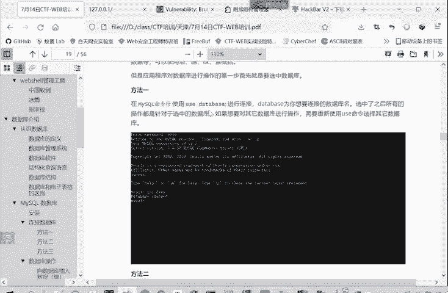

进行任何数据库操作的第一步，都是**选中目标数据库**。后续的所有操作都将在选中的数据库内进行。

## 选中数据库

有三种常见的方法来选中或使用数据库：
1.  在命令行中使用 `USE` 语句。
2.  在图形化管理软件中直接用鼠标点击选择。
3.  在网站开发代码中，通过特定函数（如PHP的 `mysqli_select_db`）进行选择。

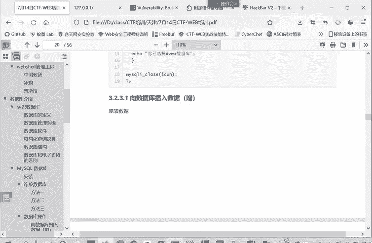

我们作为安全测试人员，主要关注**命令行操作**，因为这在CTF解题和渗透测试中最为常用。

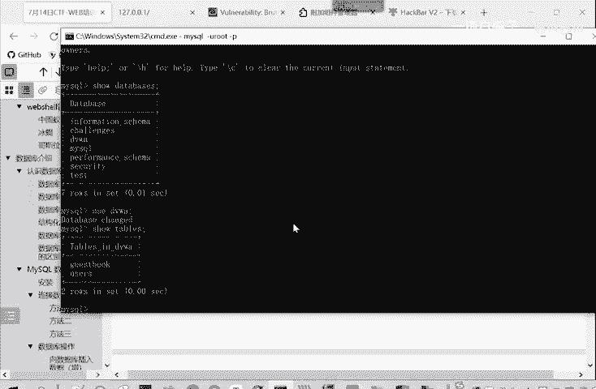

## 命令行下的增删改查操作

以下我们将重点讲解在命令行中如何执行增、删、改、查操作。我们以 `guestbook` 表为例，它包含 `comment_id`, `comment`, `name` 三个字段。

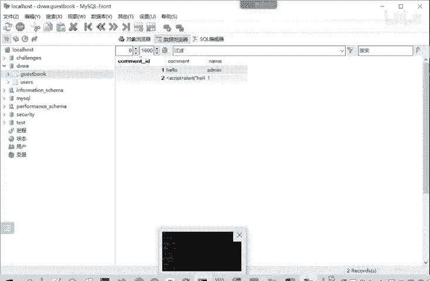

### 增加数据 (INSERT)

增加数据使用 `INSERT INTO` 语句。你需要指定表名、字段名以及要插入的值。

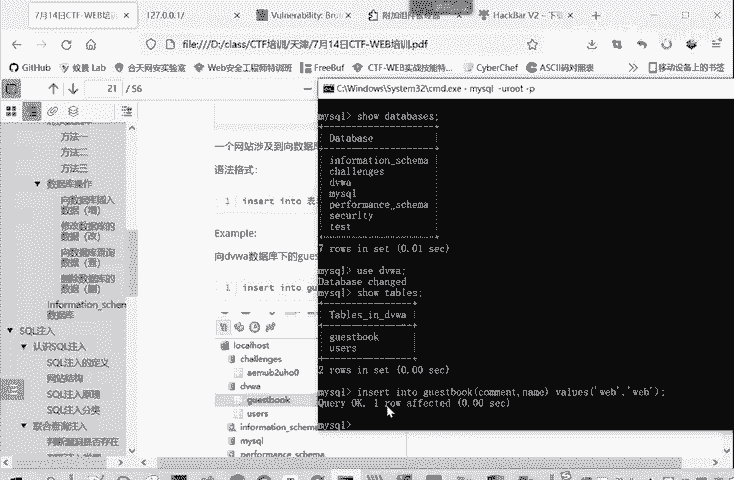

以下是向 `guestbook` 表插入一条记录的示例：
```sql
INSERT INTO guestbook (comment, name) VALUES (‘hello world‘, ‘test‘);
```
执行后，一条新记录就被添加到表中。请注意，数据库名称、表名、字段名不需要引号，而你要输入的字符串值需要引号。

### 修改数据 (UPDATE)

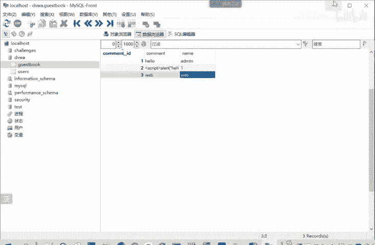

修改数据使用 `UPDATE` 语句，配合 `SET` 来指定修改内容，并用 `WHERE` 来限定修改范围。

以下是修改 `guestbook` 表中所有记录的 `name` 字段的示例：
```sql
UPDATE guestbook SET name = ‘admin‘;
```
如果不加 `WHERE` 条件，表中所有记录都会被修改。

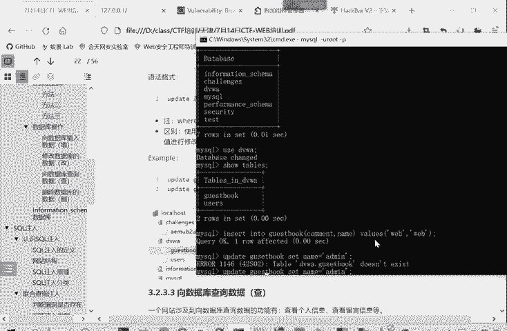

如果只想修改特定记录，需要加上 `WHERE` 条件：
```sql
UPDATE guestbook SET name = ‘where‘ WHERE comment_id = 1;
```
这样，只有 `comment_id` 等于1的那一行数据会被修改。在CTF中，我们可能利用此操作来修改管理员密码。

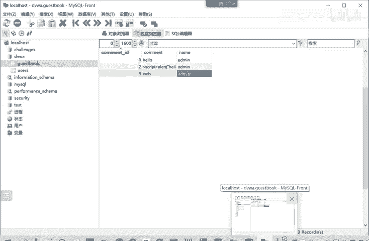

### 查询数据 (SELECT)

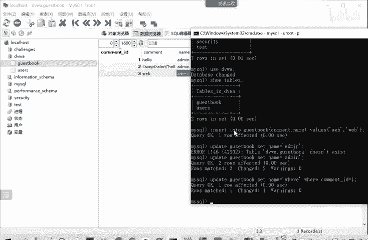

查询数据是最常用的操作，使用 `SELECT` 语句。你可以选择查看所有字段或指定字段，并可以用 `WHERE` 进行条件过滤。

查看 `guestbook` 表的所有信息：
```sql
SELECT * FROM guestbook;
```
`*` 代表所有字段。

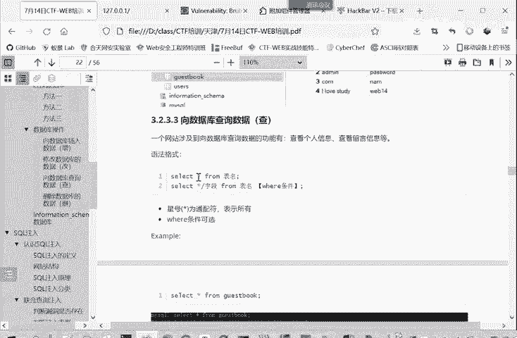

如果只想查看 `name` 和 `comment` 字段：
```sql
SELECT name, comment FROM guestbook;
```
加上 `WHERE` 条件进行筛选：
```sql
SELECT * FROM guestbook WHERE comment_id = 2;
```
这将只输出 `comment_id` 等于2的记录。

### 删除数据 (DELETE)

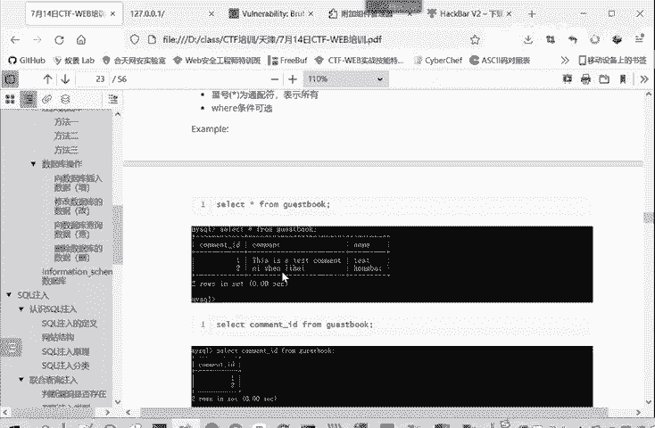

删除数据使用 `DELETE FROM` 语句，同样可以配合 `WHERE` 条件来删除特定记录。

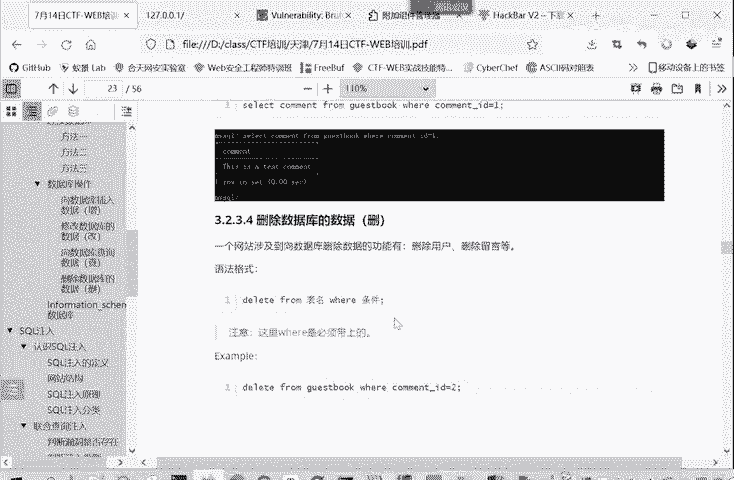

删除 `guestbook` 表中 `comment_id` 等于2的记录：
```sql
DELETE FROM guestbook WHERE comment_id = 2;
```
执行后，该条记录将从表中永久移除。

## 总结

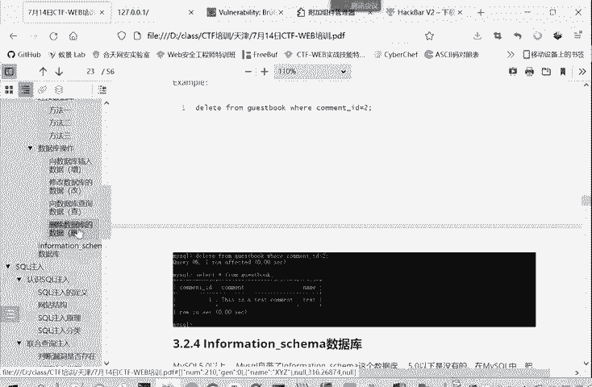

本节课中，我们一起学习了数据库的四种基本操作：
*   **增 (INSERT)**：向表中插入新记录。
*   **改 (UPDATE)**：修改表中已有的记录。
*   **查 (SELECT)**：从表中查询获取数据。
*   **删 (DELETE)**：从表中删除记录。

掌握这些命令是理解SQL注入原理的必要前提。在下一节中，我们将介绍一个在数据库系统中非常重要且常用的自带数据库——`information_schema`。