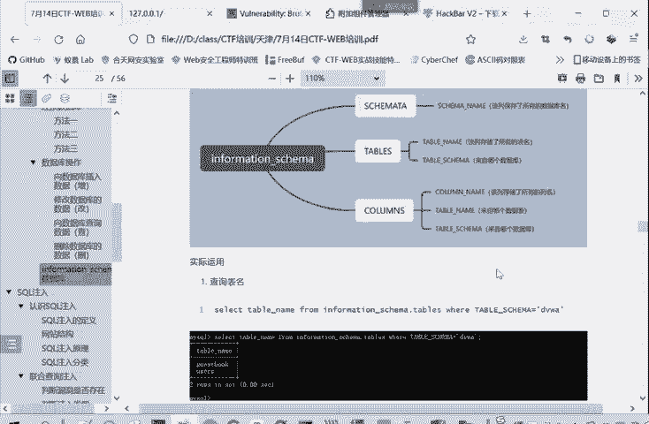
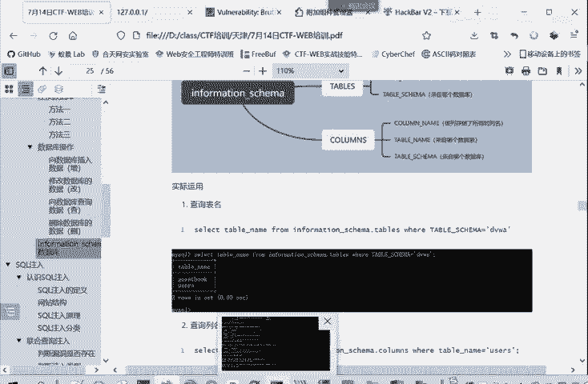
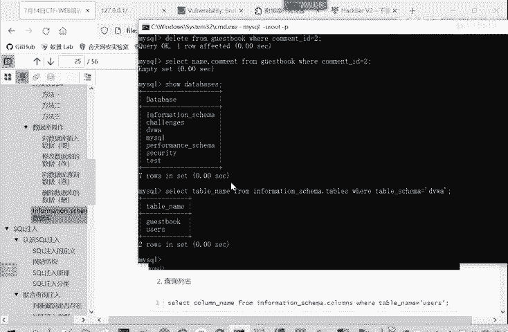
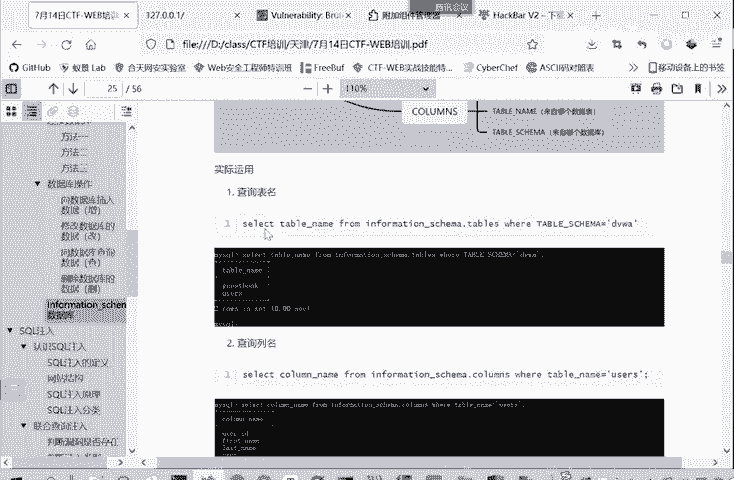
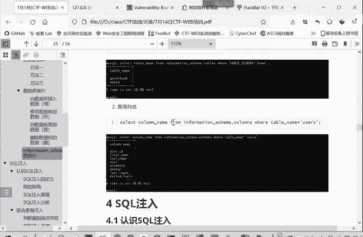
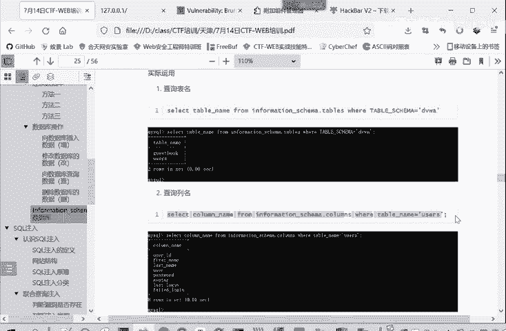
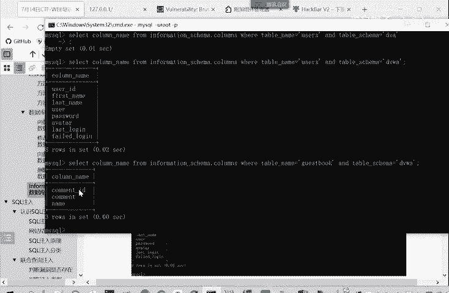
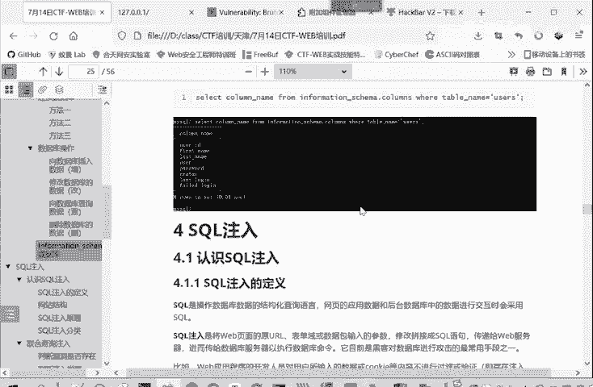

# CTF入门教程：P16：web-information-schema数据库 🗄️

在本节课中，我们将要学习MySQL数据库中的一个核心系统数据库——`information_schema`。理解这个数据库的结构和用法，是进行CTF Web安全挑战，特别是SQL注入攻击的关键基础。我们将了解它是什么、包含哪些重要表，以及如何利用它来查询数据库、表和字段的信息。

## 什么是information_schema？ 🤔

我们直接打开数据库查看。MySQL数据库都自带了一个名为`information_schema`的数据库。这是一个MySQL 5.0及以上版本自带的系统数据库。

这个数据库保存着MySQL服务器的相关信息。例如，它记录了数据库管理系统所管理的所有数据库、表和字段的元数据。

## information_schema的核心结构 🏗️

`information_schema`数据库包含许多表，但对于初学者和CTF中的SQL注入，我们重点掌握前三个表就足够了。讲太多内容容易让人感到困惑。

以下是三个最重要的表：

### 1. SCHEMATA表
`schemata`表保存了当前MySQL实例中所有数据库的信息。也就是说，整个数据库系统中存在的所有数据库名称，都记录在这个表里。

**核心字段**：
*   `SCHEMA_NAME`：数据库的名称。

### 2. TABLES表
顾名思义，`tables`表保存了所有数据库中所有表的信息。

**核心字段**：
*   `TABLE_SCHEMA`：表所属的数据库名。
*   `TABLE_NAME`：表的名称。



### 3. COLUMNS表
`columns`表提供了表中所有列（即字段）的信息。字段可以理解为Excel表格中的列。



**核心字段**：
*   `COLUMN_NAME`：字段的名称。
*   `TABLE_NAME`：该字段所属的表名。
*   `TABLE_SCHEMA`：该字段所属的数据库名。

上一节我们介绍了`information_schema`的三个核心表，本节中我们来看看如何在实际查询中应用它们。

## 如何使用information_schema进行查询？ 🔍

在SQL注入中，我们常常无法直接使用像`SHOW DATABASES;`这样的命令。这时，`information_schema`数据库就成为了我们获取信息的关键。



以下是具体的查询方法：



### 查询所有数据库
当无法使用`SHOW DATABASES;`命令时，可以通过查询`schemata`表来获取数据库列表。
```sql
SELECT SCHEMA_NAME FROM information_schema.SCHEMATA;
```



### 查询指定数据库中的所有表
假设我们想查询`DVWA`这个数据库中有哪些表。
```sql
SELECT TABLE_NAME FROM information_schema.TABLES WHERE TABLE_SCHEMA='dvwa';
```
这条语句从`information_schema.tables`表中，筛选出`TABLE_SCHEMA`字段值为`'dvwa'`的记录，并只显示这些记录的表名(`TABLE_NAME`)。



### 查询指定表中的所有字段
现在，我们进一步查询`dvwa`数据库中`users`表包含哪些字段。
```sql
SELECT COLUMN_NAME FROM information_schema.COLUMNS WHERE TABLE_SCHEMA='dvwa' AND TABLE_NAME='users';
```
这条语句从`information_schema.columns`表中，筛选出同时满足`TABLE_SCHEMA='dvwa'`和`TABLE_NAME='users'`条件的记录，并显示其字段名(`COLUMN_NAME`)。

如果想查询另一个表（例如`guestbook`）的字段，只需修改`TABLE_NAME`的条件即可。
```sql
SELECT COLUMN_NAME FROM information_schema.COLUMNS WHERE TABLE_SCHEMA='dvwa' AND TABLE_NAME='guestbook';
```



## 总结 📝



本节课中我们一起学习了MySQL的`information_schema`系统数据库。我们了解到它是一个存储数据库元数据的“信息库”，并重点掌握了其中三个核心表：`SCHEMATA`（存储数据库信息）、`TABLES`（存储表信息）和`COLUMNS`（存储字段信息）。更重要的是，我们学会了在SQL注入场景下，如何通过查询这些表来绕过限制，逐步获取目标数据库的结构信息，这是后续进行高效SQL注入攻击的基石。从下一章开始，我们将正式进入Web漏洞的实战学习。