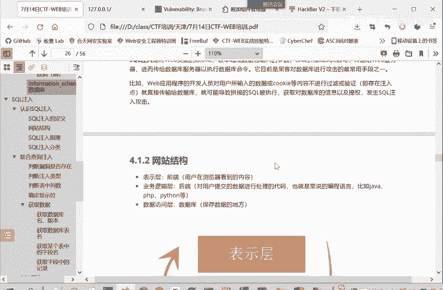
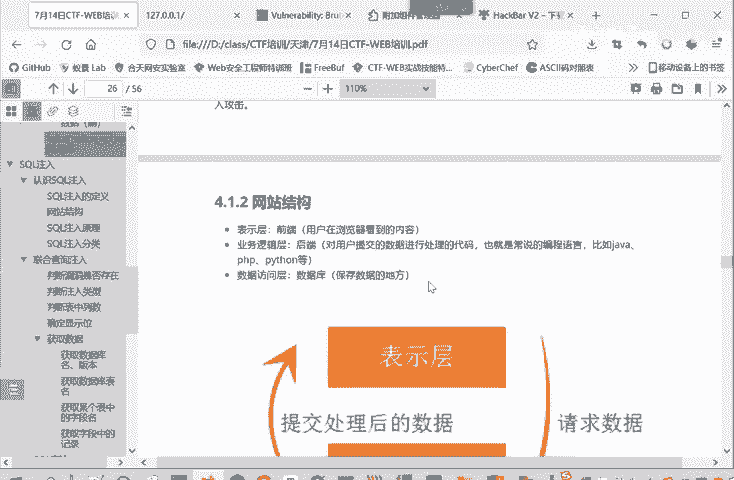
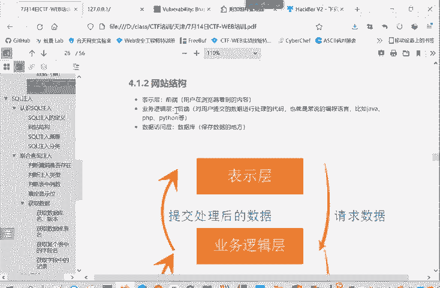
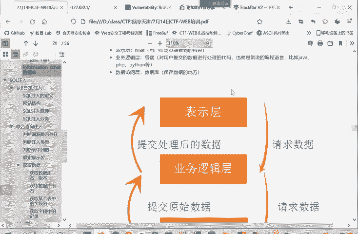
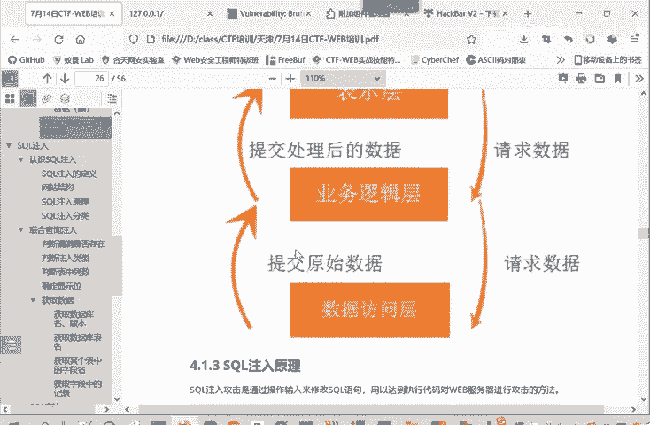
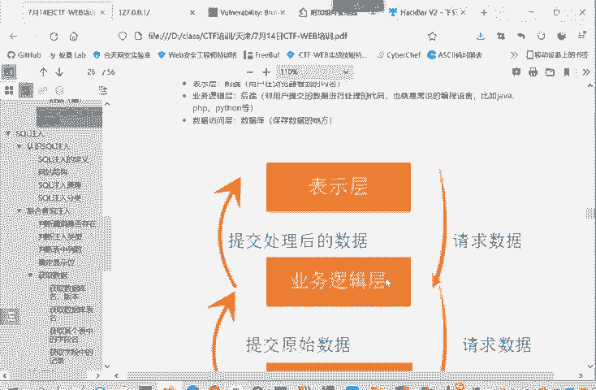
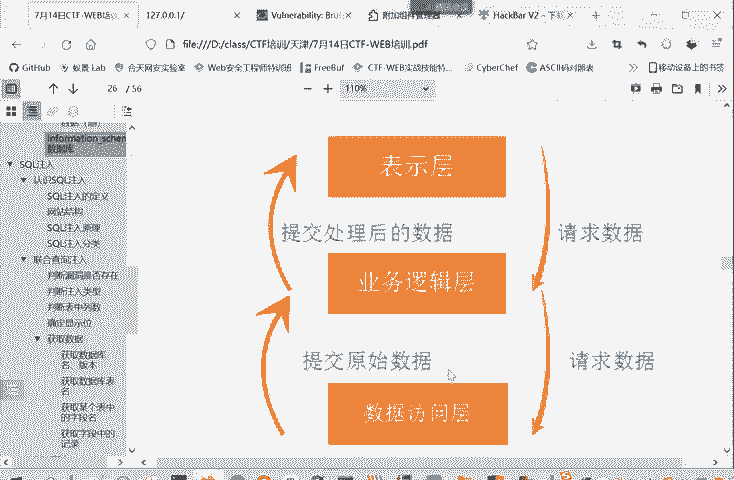
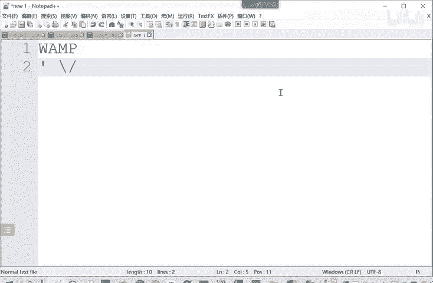
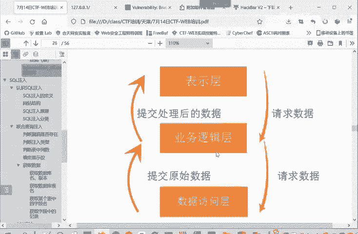

# CTF入门教程：P18：web-网站结构 🏗️



在本节课中，我们将要学习Web应用程序的基本三层结构。理解这个结构是分析Web漏洞（如SQL注入）的基础，因为它清晰地展示了用户输入如何从浏览器传递到数据库。



## 网站的三层结构

为了深入理解SQL注入等漏洞的逻辑，我们首先需要了解一个典型网站的结构。现代Web应用通常采用三层架构，各层分工明确。



### 表示层（前端） 🌐

上一节我们介绍了学习网站结构的目的，本节中我们来看看具体的第一层。表示层，通常被称为前端，是用户直接交互的部分。它运行在用户的浏览器中，负责展示页面和收集用户输入。



### 业务逻辑层（后端） ⚙️


当表示层收集到用户输入（如表单数据）后，它会将这些请求发送到下一层。业务逻辑层，即后端，是网站的核心处理单元。它由服务器端的编程语言（如Java、Python、PHP等）编写，负责处理具体的业务逻辑。


以下是业务逻辑层的主要职责：
*   对用户提交的数据进行验证和处理。
*   根据业务规则执行相应的操作。
*   在需要时，向下一层请求或存储数据。

### 数据访问层（数据库） 💾



业务逻辑层并非全能，它无法存储所有数据。当需要查询或存储持久化数据时，就会与数据访问层交互。数据访问层通常指数据库（如MySQL、PostgreSQL），它负责数据的存储、检索和管理。

整个数据流转过程如下：
1.  用户在前端（表示层）输入数据并提交。
2.  请求被发送到后端（业务逻辑层）。
3.  后端处理逻辑时，如需数据，则构造查询语句向数据库（数据访问层）发起请求。
4.  数据库执行查询并将结果返回给后端。
5.  后端将处理后的结果返回给前端。
6.  前端将最终结果渲染展示给用户。



## SQL注入漏洞的产生原理 🔍



正是由于上述三层结构的数据流转，才产生了SQL注入的风险。关键在于，用户在前端输入的数据，最终可能被后端用来拼接成查询数据库的SQL语句。



考虑一个简单的登录场景，后端代码可能这样拼接SQL语句：
```sql
query = “SELECT * FROM users WHERE username = ‘“ + user_input + “’ AND password = ‘…'”
```
如果用户输入的数据中包含特殊的SQL元字符，例如**单引号（‘）**、**注释符（– 或 #）**，就可能改变原SQL语句的结构。

例如，用户输入 `admin’ — `，拼接后的SQL语句变为：
```sql
SELECT * FROM users WHERE username = ‘admin’ — ‘ AND password = ‘…’
```
这里的 `—` 将后面的密码验证部分注释掉了。攻击者通过精心构造的输入，可以“闭合”原有的SQL语句，并“注入”新的恶意指令，从而欺骗数据库执行非预期的查询，这就造成了SQL注入漏洞。



本节课中我们一起学习了Web应用的三层基本结构：表示层、业务逻辑层和数据访问层，并了解了数据是如何在三层之间流动的。更重要的是，我们明白了SQL注入漏洞的根源在于：不可信的用户输入被直接拼接到了SQL查询语句中，破坏了原语句的逻辑，从而被攻击者利用。理解这一原理是后续学习和防御Web漏洞的关键。