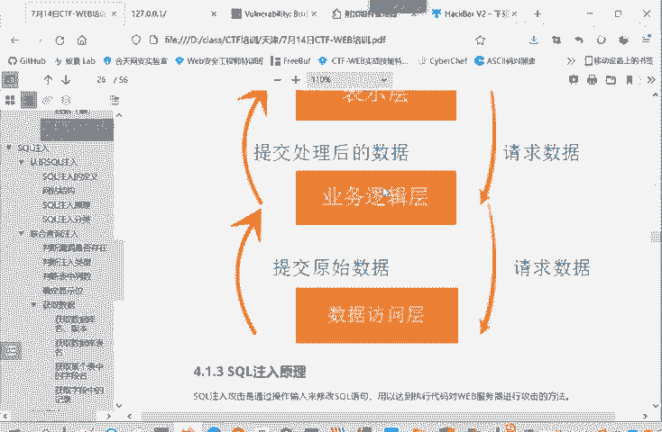
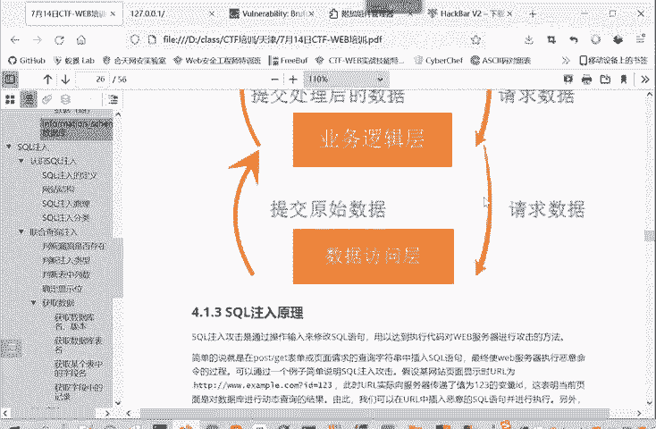

# CTF入门教程：P19：web-SQL注入原理

在本节课中，我们将要学习CTF-Web方向中一个非常核心且常见的漏洞类型：SQL注入。我们将深入探讨其基本原理，并通过一个简单的例子来理解攻击是如何发生的。

## 概述

SQL注入是一种通过用户输入来修改后端SQL语句，从而达到执行恶意代码、攻击服务器或数据库的攻击方法。理解其原理是Web安全入门的关键一步。

## SQL注入原理详解

上一节我们介绍了SQL注入的基本概念，本节中我们来看看其具体的工作原理。

SQL注入主要发生在Web应用程序与数据库交互的过程中。当程序将用户输入的数据直接拼接到SQL查询语句中，并且没有进行充分的恶意命令检查或过滤时，攻击者就有可能注入恶意的SQL代码。

简单的来说，攻击者主要在POST或GET请求的表单中（有时也在Cookie中），将恶意的SQL语句插入到请求参数里。由于服务器端没有进行有效的恶意命令检查，这些被插入的恶意SQL语句就会进入服务器，并被数据库当成合法命令的一部分来执行。

造成SQL注入的根本原因在于：程序在执行过程中动态地构造了SQL语句。具体流程是，业务逻辑层根据用户的输入，向数据访问层请求数据。它请求的不是固定的数据（例如“请求张三的数据”），而是根据输入动态变化的数据（例如“请求用户输入ID所对应的数据”）。这种动态拼接的方式，容易引发SQL语句结构（如引号）的闭合问题，从而改变整个SQL语句的语义，让业务逻辑层执行了非预期的命令。

## 一个简单的例子



以下是理解SQL注入的一个典型场景。



假设我们访问一个网站，URL为：`http://example.com/page?id=123`。

*   这实际上使用了GET请求方式，参数`id`及其值`123`被传递在URL中。
*   网站后端处理这个请求的SQL语句可能如下所示：
    ```sql
    SELECT * FROM articles WHERE id = '我们传进来的ID值'
    ```
*   在实际执行时，程序会将用户输入的`123`替换进去，形成：
    ```sql
    SELECT * FROM articles WHERE id = '123'
    ```

现在，思考一个问题：如果攻击者传入的ID值本身包含一个单引号，例如输入`123'`，会发生什么？

拼接后的SQL语句将变为：
```sql
SELECT * FROM articles WHERE id = '123''
```
这里的第一个单引号（程序添加的）与攻击者输入中的单引号`‘`闭合了，这使得原本用于结束字符串的第二个单引号变成了一个多余的单引号，通常会导致语法错误。更危险的是，攻击者可以在此基础上构造更复杂的输入，例如`123' OR '1'='1`，来改变查询逻辑。

通过这种方式，攻击者将恶意命令“注入”到了原有的SQL语句结构中。因此，这类问题就被称为SQL注入，即利用结构化查询语言本身的特点进行代码注入攻击。

## 总结

本节课中我们一起学习了SQL注入的基本原理。我们了解到，SQL注入是由于程序动态拼接用户输入来构造SQL语句，且未做充分过滤所导致的。攻击者通过精心构造的输入，可以改变SQL语句的原始意图，从而执行非授权的数据库操作。理解这一原理是后续学习如何挖掘、利用以及防御SQL注入漏洞的基础。