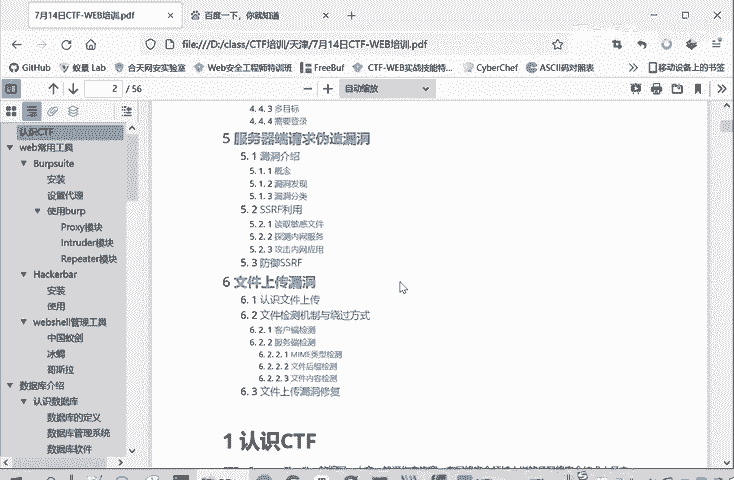
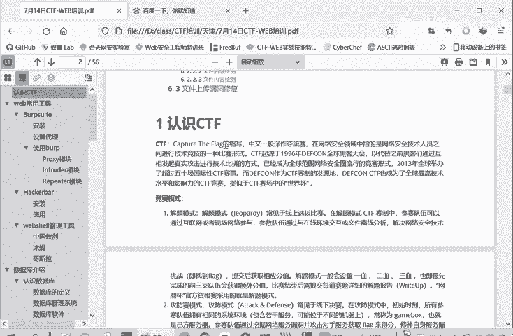

# CTF入门教程：1：认识CTF 🚩

在本节课中，我们将要学习CTF（夺旗赛）的基本概念，包括其定义、主要竞赛模式以及涵盖的核心技术领域。通过本节内容，你将建立起对CTF竞赛的整体认知框架。

## 什么是CTF？

CTF是“Capture The Flag”的缩写，中文称为“夺旗赛”。这是一种网络安全竞赛形式。竞赛的核心目标是寻找并获取一个被称为 **`flag`** 的特定字符串。

参赛者通过发现并利用目标系统（如网站服务、二进制程序）中的漏洞来获取这个flag。成功获取并提交flag，即代表成功完成了一道赛题。

## CTF的三种竞赛模式

CTF竞赛主要采用三种不同的模式，每种模式都有其独特的特点和规则。

以下是三种主要的竞赛模式介绍：

1.  **解题模式**
    *   此模式常见于线上选拔赛。参赛者通过互联网或现场网络参与。
    *   参赛者需要分析题目文件，解决其中蕴含的网络安全技术问题，即找到 **`flag`** 并提交。
    *   题目通常设有“一血”、“二血”奖励，越早解出题目，获得的分值越高。
    *   比赛后通常需要提交详细的解题报告（Write-up），以防止选手仅提交他人获取的flag。

2.  **攻防模式**
    *   此模式常见于线下决赛。参赛队伍分为攻击方和防守方。
    *   攻击方需要攻击对手队伍维护的系统环境和服务。
    *   防守方则需要修复自身漏洞，并防御来自攻击方的攻击行为。
    *   比赛中，各队伍通常会轮流扮演攻击和防守的角色。

3.  **混合模式**
    *   这是一种较为新颖的模式，也称为“分享赛”或“出题赛”。
    *   参赛队伍之间互相出题和解题。出题可以得分，解出别人的题目也可以得分。
    *   比赛结束后，需要分享出题思路、学习过程和解题报告。
    *   最终根据出题得分、解题得分和分享得分进行综合评价。

## CTF竞赛的核心内容

上一节我们介绍了CTF的竞赛模式，本节中我们来看看CTF竞赛具体考察哪些技术领域。CTF的题目内容广泛，主要分为以下几个板块：

以下是CTF竞赛涵盖的六大技术板块：

1.  **Web（网络攻防）**
    *   主要考察Web应用中常见的漏洞，例如：
        *   **SQL注入漏洞**
        *   **XSS（跨站脚本）漏洞**
        *   **CSRF（跨站请求伪造）**
        *   文件包含漏洞
        *   文件上传漏洞
        *   代码审计
        *   PHP弱类型问题
    *   本课程后续将重点讲解Web安全相关的内容。

2.  **Reverse Engineering（逆向工程）**
    *   考察软件逆向分析能力，包括常见题型、工具使用和解题思路。
    *   进阶部分涉及更高难度的技术，如：
        *   软件保护技术
        *   反汇编与反调试
        *   加壳与脱壳技术

3.  **Pwn（二进制漏洞利用）**
    *   主要考察二进制程序漏洞的发现和利用能力。
    *   常见的利用方式包括通过**栈溢出**、**堆溢出**等技术，来获取程序控制权，进而读取或获取 **`flag`**。

4.  **Crypto（密码学）**
    *   考察密码学知识，内容包括：
        *   古典密码
        *   现代密码

5.  **Mobile（移动安全）**
    *   随着移动设备普及而兴起的板块，主要考察：
        *   Android系统安全
        *   iOS系统安全（题目相对较少）
    *   目前考题以Android系统为主。

6.  **Misc（安全杂项）**
    *   范围非常广泛，涉及多个安全相关领域，内容比较繁杂，例如：
        *   信息搜集
        *   编码解码
        *   数字取证
        *   隐写术分析

## 总结

本节课中我们一起学习了CTF的基础知识。我们明确了CTF是旨在寻找 **`flag`** 的网络安全竞赛，了解了其三种主要竞赛模式：解题模式、攻防模式和混合模式。最后，我们梳理了CTF竞赛涵盖的六大核心技术领域：Web、逆向工程、Pwn、密码学、移动安全和Misc安全杂项，为后续深入学习各个方向打下了基础。