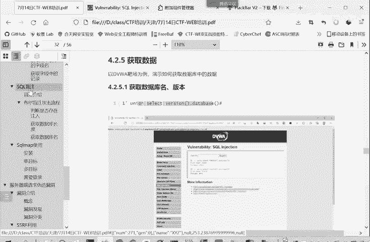
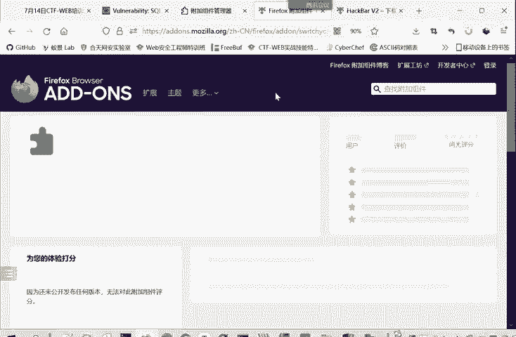
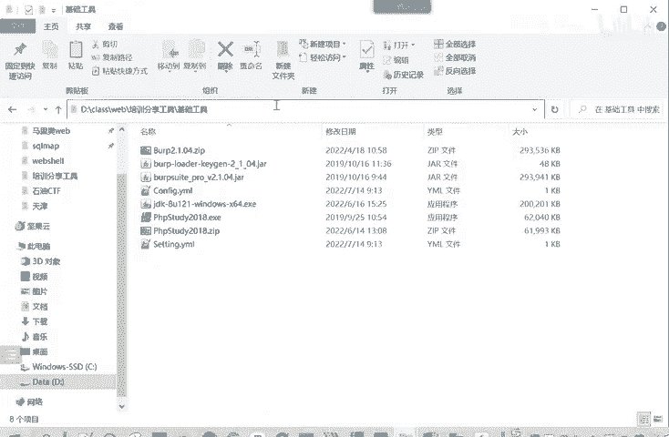
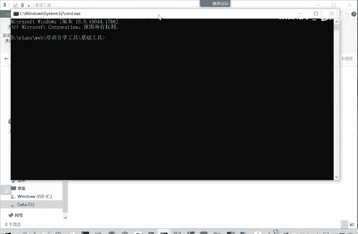
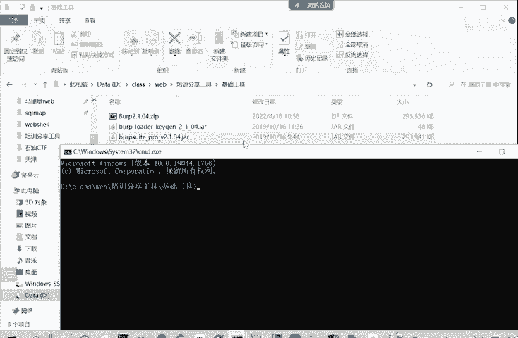
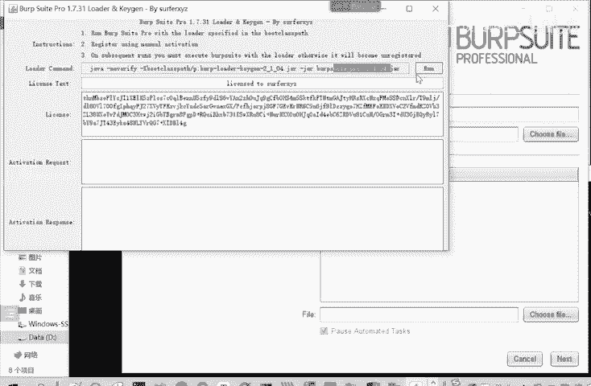
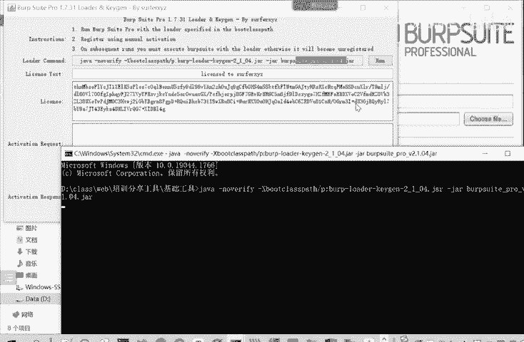
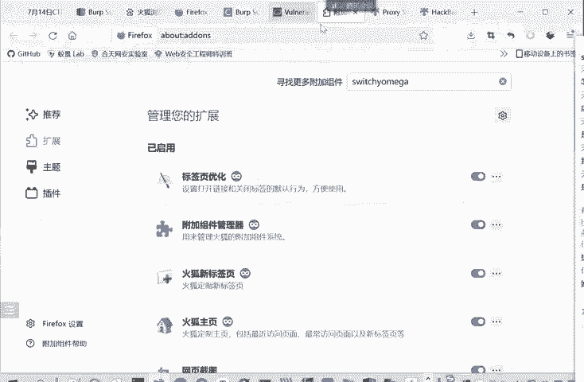

# CTF入门教程：P22：web-获取数据

在本节课中，我们将学习在SQL注入漏洞中，如何利用联合查询（Union Select）从数据库中逐步获取信息，包括数据库版本、库名、表名、字段名以及具体数据记录。

上一节我们介绍了联合查询的基本原理和利用方法。本节中我们来看看如何利用它来获取数据库中的具体信息。

## 确定回显位置与获取基本信息

首先，需要确定网页中哪些位置会回显我们查询的数据。确定显示位置后，就可以开始获取数据。

例如，获取数据库版本信息和当前数据库名称。对应的SQL语句如下：
```sql
1' union select 1, version() -- -
1' union select 1, database() -- -
```
这里使用一个浏览器插件（如HackBar）可以更方便地操作和测试。

执行第一条语句，第一项是占位符“1”，第二项输出`version()`函数的结果，即数据库版本。
执行第二条语句，第二项输出`database()`函数的结果，即当前数据库名称。

执行后，我们得到版本信息是`5.5.53`，数据库名称是`DVWA`。



## 获取数据库中的表名

获取数据库名称之后，下一步是获取该数据库中有哪些表。

MySQL数据库有一个系统数据库叫`information_schema`，其中的`tables`表存储了所有表的信息。我们可以从这个表中查询目标数据库的表名。



以下是查询语句：
```sql
1' union select 1, table_name from information_schema.tables where table_schema='dvwa' -- -
```
在这个语句中：
*   第一项 `1` 是占位符。
*   第二项 `table_name` 是我们需要输出的表名字段。
*   `where table_schema='dvwa'` 条件用于指定只查询数据库`dvwa`中的表。

执行该语句，就可以看到`dvwa`数据库中存在哪些表，例如`guestbook`和`users`。

## 获取表中的字段名

知道表名后，可以进一步获取表中包含哪些字段（列名）。







以下是查询语句：
```sql
1' union select 1, column_name from information_schema.columns where table_name='users' -- -
```
这个语句从`information_schema.columns`表中，查询`users`表的所有字段名。



有时，网站可能只回显一行数据。为了将所有字段名在一行内输出，可以使用`group_concat()`函数：
```sql
1' union select 1, group_concat(column_name) from information_schema.columns where table_name='users' -- -
```
`group_concat()`函数的作用是将多行查询结果合并为一行字符串输出。



## 获取表中的数据记录

最后，我们可以获取字段中的具体数据记录。

例如，获取`users`表中`user`和`password`字段的数据：
```sql
1' union select user, password from users -- -
```
这条语句会输出`user`和`password`两列的所有记录。

在实际的安全测试（如挖掘SRC漏洞）中，一般证明到能够获取数据库版本和名称，就足以说明漏洞存在，可以进行提交。务必遵守法律法规，不要修改、删除或泄露他人数据。



本节课中我们一起学习了利用SQL联合查询注入，从确定回显位置开始，逐步获取数据库版本、库名、表名、字段名以及最终数据记录的完整过程。这是CTF Web题目和实际渗透测试中一项非常基础且重要的技能。