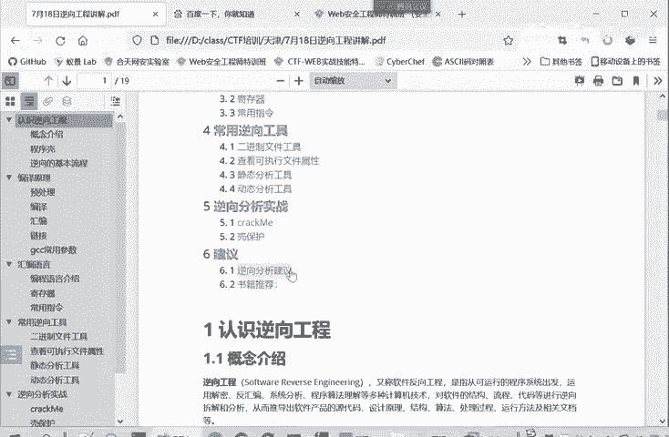
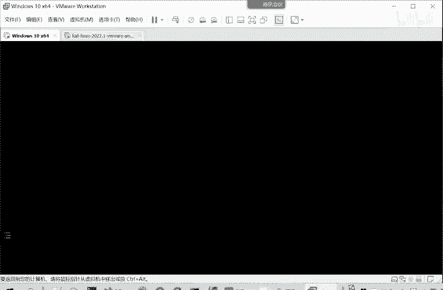
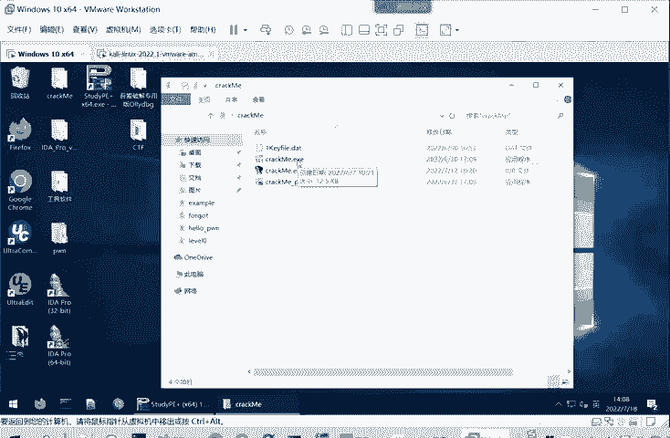
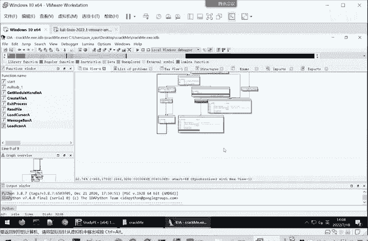

# CTF逆向入门：P23：什么是逆向工程 🧩

在本节课中，我们将要学习CTF逆向工程的基础概念。我们将从逆向工程的定义开始，逐步了解其原理、常用工具和分析方法，为后续的实战分析打下坚实的理论基础。

## 逆向工程的概念

上一节我们介绍了课程的整体结构，本节中我们来看看逆向工程的核心概念。

所谓逆向工程，英文称为Software Reverse Engineering，即软件逆向工程，也叫软件反向工程。它是指从可运行的系统出发，运用解密、反汇编、系统分析、程序理解等多种计算机技术，对软件的结构、流程、代码等进行逆向拆解和分析。其目的是推导出软件产品的源代码、设计原理、结构、算法或处理过程。

例如，常见的360杀毒软件之所以能检测病毒，正是因为它对病毒样本进行了逆向工程，提取了病毒的特征码。当用户下载软件时，杀毒软件检测到这些特征码，就会报告该软件存在风险。

那么，CTF比赛中的逆向工程又是什么呢？根据全国大学生信息安全竞赛（即CTF比赛）的参赛指南，逆向工程涉及Windows、Linux、安卓等多种平台的编程技术。参赛者需要利用常见工具对源代码及二进制文件进行逆向分析，掌握安卓APK文件的逆向分析，并理解加解密、内核编程、算法、反调试及代码混淆等技术。

## 逆向工程的用途

了解了逆向工程是什么之后，我们来看看它具体有哪些应用场景。

以下是逆向工程的主要用途：

1.  **分析已编译的软件**：对二进制可执行文件进行分析，并使用高级语言重现其逻辑。这正是“逆向”一词的体现，因为它与正常的编译过程（高级语言 -> 二进制）相反。
2.  **分析病毒与开发杀毒软件**：通过逆向分析恶意软件，提取其特征码，用于开发或更新杀毒软件的病毒库。
3.  **高级代码审计**：在无法获取源代码的情况下，直接审计二进制可执行程序。在汇编层面分析程序，以发现其中可能存在的安全漏洞。
4.  **软件破解与外挂开发**：用于破解商业软件的注册机制、制作游戏外挂，同样也可用于开发反外挂软件。
5.  **分析嵌入式设备漏洞**：随着物联网设备增多，嵌入式系统的安全性日益重要。逆向工程可用于分析嵌入式设备中固件或程序的安全漏洞。

## 如何进行逆向分析：静态与动态

明确了逆向工程的用途，接下来我们探讨实现这些目标的具体方法。逆向分析主要依赖于两种核心技术：静态分析和动态分析。

### 静态分析技术

静态分析是指在**不实际执行**计算机程序的情况下，对其代码进行分析以发现缺陷。当我们无法获得源代码时，通常使用静态分析工具将二进制可执行文件“翻译”成可读的汇编代码或C语言伪代码。

因为直接的机器码（二进制）几乎无法被人理解，必须转换成汇编或高级语言形式的代码才能进行分析。这里提到的“C语言伪代码”并非程序原始的源代码，而是像IDA Pro这样的工具根据二进制文件逻辑重构出的、具有相同执行效果的C代码。

静态分析技术具有以下优点：

*   **直接面向代码**：可以分析源代码或由反汇编/反编译生成的伪代码。
*   **全局视野**：能够同时看到程序所有可能的执行路径，便于快速、准确地把握整体逻辑。
*   **安全性高**：由于不执行程序，分析人员不会受到恶意代码的攻击。

通过静态分析工具（如IDA）打开一个程序，我们可以一目了然地查看其控制流图，理解程序在不同条件下的执行分支，从而从总体上把握程序的运行逻辑。

### 动态调试技术

与静态分析相对的是动态调试技术。如果说静态分析是“看图研究”，那么动态分析就是“动手实践”。

动态调试是指在**执行程序**的过程中，利用调试器跟踪软件的运行状态。分析人员通过观察程序运行时的寄存器值、函数输入输出、内存使用情况等，来分析函数功能、明确代码逻辑，并挖掘潜在漏洞。

动态调试重点关注两个方面：
1.  **代码流**：程序实际执行了哪些指令，具体走了哪个分支。
2.  **数据流**：输入的数据（如用户名、密码、激活码）在程序中是如何被传递、处理和验证的。

动态调试技术的优点包括：

*   **明确执行流程**：可以清晰地看到程序实际的执行路径，而非所有可能路径。
*   **跟踪数据流向**：能够实时监控数据在程序中的处理过程。
*   **观察运行时状态**：可以直接查看内存地址信息、寄存器内容、函数栈等。
*   **交互与修改**：可以动态修改寄存器或内存中的值，从而改变程序的执行走向，这对于理解程序机制和构造攻击payload非常有用。

通常，静态分析和动态调试会结合使用。分析一个复杂软件时，往往需要先通过静态分析获得全局认识，再通过动态调试验证具体逻辑，如此反复，才能彻底厘清软件的运行机制。

## 总结

本节课中我们一起学习了逆向工程的基础知识。我们首先定义了逆向工程，即从二进制程序反向推导其设计逻辑的过程。接着，我们探讨了逆向工程在病毒分析、漏洞审计、软件破解等多个领域的实际用途。最后，我们详细介绍了逆向分析的两种核心方法：在不运行程序的情况下进行代码审查的**静态分析**，以及在程序运行时进行跟踪和调试的**动态分析**。理解这两种方法的原理与优缺点，是成为一名合格CTF逆向选手的第一步。