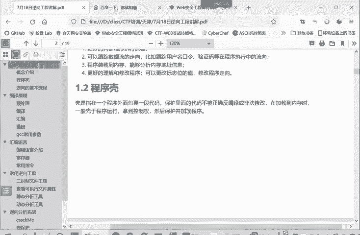
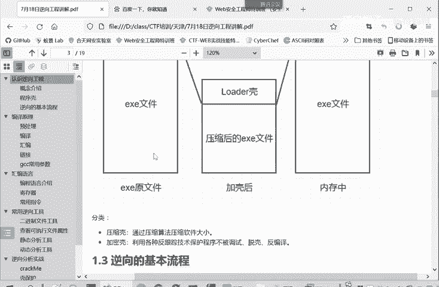

# CTF逆向入门：P24：程序壳

## 概述
在本节课中，我们将要学习CTF逆向工程中的一个重要概念——程序壳。我们将了解什么是程序壳、它的工作原理、分类以及为什么它在逆向分析中是一个关键的障碍。

## 什么是程序壳？
上一节我们介绍了逆向工程的基础概念，本节中我们来看看程序壳。程序壳是指包裹在原始程序外部的一层代码，其目的是保护内部的代码不被轻易地反编译或非法修改。

当程序被加载到内存中时，壳的代码会先于原始程序运行，取得控制权，然后负责加载并执行真正的程序。

我们可以通过上图来理解这个过程。一个正常的可执行文件（例如 `program.exe`）在未加壳时可以直接执行。加壳的过程是：首先对这个 `EXE` 文件进行压缩，然后在压缩后的数据外部，添加一层 `loader`（加载引导区）。

这样就得到了一个新的、加壳后的可执行文件。当用户执行这个加壳后的文件时，会首先运行 `loader` 部分。`loader` 的功能是在内存中将压缩的 `EXE` 数据解压，恢复出原始的程序文件，然后再跳转执行它。

## 壳对用户和分析者的影响
对于普通用户而言，使用原始文件和加壳后的文件几乎没有差别。尽管加壳文件需要经历引导和解压步骤，但这个过程的耗时对用户体验来说是可以忽略不计的。

然而，对于逆向工程的分析人员来说，情况则完全不同。调试原始文件时，无论是静态分析（直接查看代码）还是动态分析（运行调试），都相对容易。但如果面对加壳的文件，分析就会变得非常困难。

因为静态分析时，你看到的是 `loader` 的代码和一堆被压缩、加密的数据，而非程序真正的逻辑。动态调试也会因为壳的干扰而变得复杂。因此，壳的主要作用就是增加逆向分析和调试的难度。

遇到加壳的程序时，逆向分析人员的首要任务就是“脱壳”，即手动或借助工具去除这层外壳，得到原始的可执行文件，然后再进行后续的静态或动态分析。

## 壳的工作原理与分类
所谓的壳，本质上是利用特殊算法（如压缩算法或加密算法）对可执行文件（`.exe`）或动态链接库（`.dll`）等程序资源进行处理。它类似于 `WinZip` 的压缩，但关键区别在于，加壳后的文件可以独立运行，其解压过程在内存中隐秘完成，对用户透明。

加壳可以保护程序，避免其被轻易调试和分析。当然，有盾就有矛，程序可以加壳，也可以被脱壳。

壳主要分为两大类：

以下是两种主要的壳类型：

1.  **压缩壳**
    这是最常见的一种。如上图所示，它将原始文件压缩后包裹在壳内。`loader` 负责在内存中解压并运行。这类壳的主要目的是减小程序体积，并附带一定的保护作用。我们后续的示例将主要围绕这种壳展开。

    

2.  **加密壳**
    这种壳的难度更大。它不仅仅进行压缩，还会运用各种加密算法以及反调试、反跟踪技术来保护程序，使其难以被分析和破解。这类壳的保护强度更高，分析起来也更为复杂。我们将在后续课程中深入学习。

## 总结
本节课中，我们一起学习了CTF逆向中的“程序壳”概念。我们了解了壳是保护程序的一层外部代码，它先于主程序运行，负责解压或解密真正的代码。壳分为压缩壳和加密壳两类，它们的主要目的是增加逆向分析的难度。在实战中，面对加壳的程序，第一步往往是脱壳以获取原始程序再进行深入分析。在接下来的例子中，我们将实际操作一个压缩壳的保护案例，学习如何进行分析和利用。