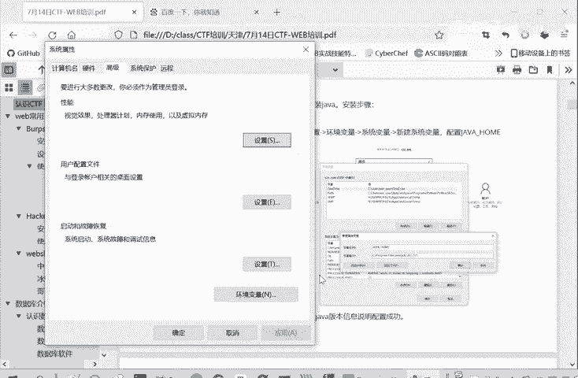
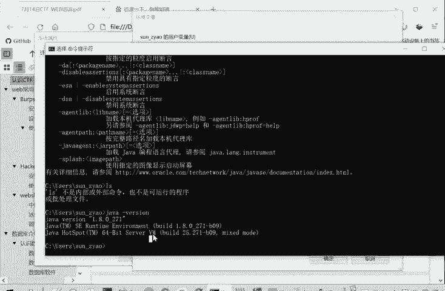
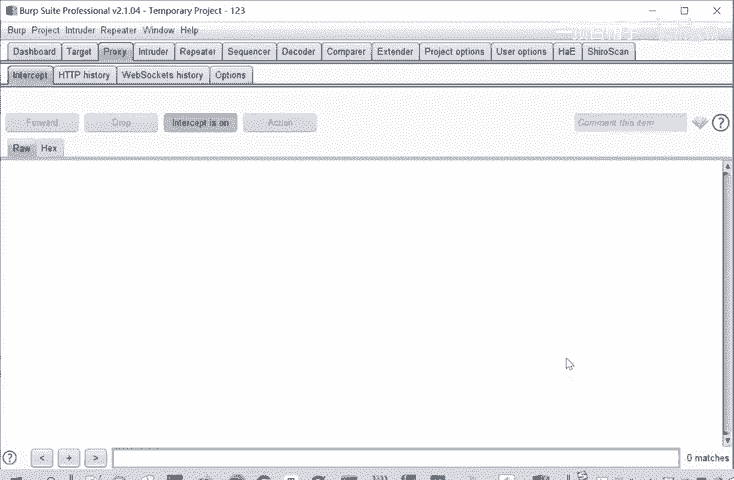

# CTF入门教程：P2：Web常用工具-BurpSuite安装 🛠️

在本节课中，我们将要学习CTF-Web方向一个至关重要的工具——BurpSuite的安装与配置。BurpSuite是进行Web安全测试、抓包和改包的必备工具。我们将从Java环境的安装开始，一步步完成BurpSuite的配置与激活。

## 安装Java环境

BurpSuite的运行依赖于Java环境，因此首先需要安装Java开发工具包（JDK）。

以下是安装Java的步骤：

1.  **获取安装程序**：JDK安装程序（例如 `jdk-8u121-windows-x64.exe`）通常包含在工具包中。
2.  **运行安装程序**：双击安装程序，按照向导提示进行安装。安装过程中可以选择默认路径或自定义安装路径。
3.  **配置环境变量**：这是关键步骤，确保系统在任何位置都能识别Java命令。
    *   打开“系统属性” -> “高级” -> “环境变量”。
    *   在“系统变量”区域，点击“新建”。
    *   变量名设置为 `JAVA_HOME`。
    *   变量值设置为JDK的安装路径（例如 `C:\Program Files\Java\jdk1.8.0_121`）。
    *   在“系统变量”中找到 `Path` 变量，点击“编辑”，在末尾添加 `;%JAVA_HOME%\bin`。
4.  **验证安装**：打开命令行终端，输入 `java -version`。如果成功显示Java版本信息，则说明安装和配置成功。

上一节我们介绍了Java环境的安装，这是运行BurpSuite的基础。本节中我们来看看BurpSuite本身的安装与激活流程。

## 安装与激活BurpSuite

成功安装Java后，即可开始安装BurpSuite。

以下是BurpSuite的安装与激活步骤：

1.  **解压文件**：将获取到的BurpSuite压缩包解压，通常会得到 `burp-loader-keygen.jar`（激活工具）和 `burpsuite_pro_vX.X.X.jar`（主程序）等文件。
2.  **运行激活工具**：直接运行 `burpsuite_pro_vX.X.X.jar` 会要求激活。为了学习目的，我们需要使用激活工具。
    *   双击运行 `burp-loader-keygen.jar` 文件（确保Java环境已配置好）。
    *   点击工具界面上的 **Run** 按钮，这将启动BurpSuite。
3.  **执行激活流程**：首次启动BurpSuite会进入激活向导。
    *   在激活界面，将 `license` 文件中的激活密钥全部复制，粘贴到“License Key”输入框。
    *   选择 **Manual activation**（手动激活）。
    *   在手动激活界面，将 `Activation Request` 框中的全部内容复制。
    *   回到激活工具 `burp-loader-keygen.jar` 的界面，将复制的内容粘贴到工具中对应的 `Request` 框内。
    *   激活工具会自动在 `Response` 框中生成响应内容，将此框内的全部内容复制。
    *   回到BurpSuite的激活界面，将复制的内容粘贴到 `Activation Response` 框中，点击“Next”。
4.  **完成激活**：激活成功后，后续使用BurpSuite时，只需运行 `burp-loader-keygen.jar` 并点击 **Run** 即可启动已激活的BurpSuite，无需重复激活。

本节课中我们一起学习了BurpSuite的完整安装与配置过程。首先，我们安装了必要的Java运行环境并配置了系统变量。然后，我们逐步完成了BurpSuite的解压、通过加载器启动以及关键的手动激活流程。掌握这些步骤后，你就拥有了进行Web安全测试和CTF解题的强大工具。