# CTF入门教程：P3：web-设置代理 🛠️

在本节课中，我们将学习如何为Burp Suite配置代理，这是进行Web安全测试和CTF解题的关键步骤。我们将了解代理的概念、如何在浏览器中设置代理以避免无关流量干扰，以及如何安装证书以抓取HTTPS流量。

## 代理与监听的概念

上一节我们介绍了Burp Suite是一个抓包和改包的工具。为了实现其功能，需要配置代理。代理设置包含两部分。

第一部分是浏览器或操作系统需要配置一个代理概念。第二部分是Burp Suite需要监听这个代理服务器。配置代理意味着浏览器将流量发送到代理服务器。监听则是Burp Suite接收这些代理流量。

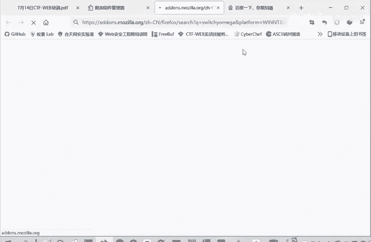

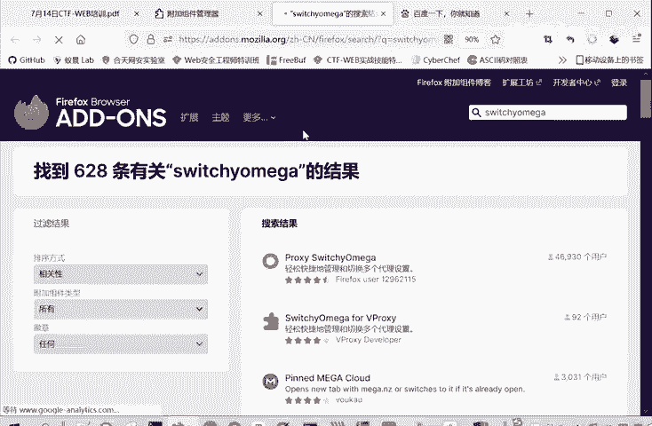

## 在浏览器中设置代理

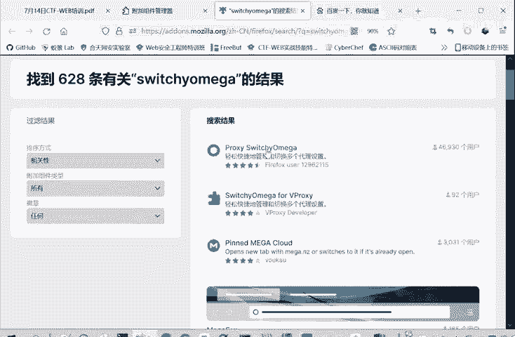

虽然可以在Windows系统中设置全局代理，但不推荐这样做。因为在抓包过程中，Windows系统自身及其他浏览器的联网流量（如系统更新）也会被捕获，导致流量过多，干扰分析。

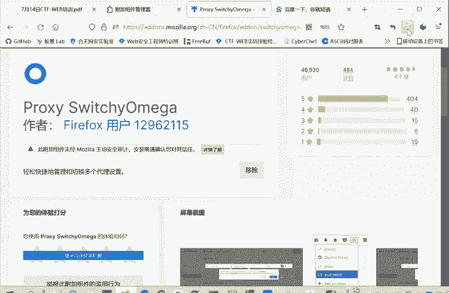

推荐在浏览器内部设置代理。这样，只有该浏览器的流量会经过Burp Suite，避免了无关流量的干扰。

以下是设置浏览器代理的步骤：

1.  安装Proxy SwitchyOmega插件。在火狐浏览器中，进入“扩展”页面进行搜索和安装。安装后，浏览器右上角会出现一个圆形图标。
2.  点击该图标进入“选项”，新建一个情景模式（例如命名为“bp”）。
3.  在该情景模式中设置代理。协议选择HTTP，代理服务器填写`127.0.0.1`，端口填写`8080`（与Burp Suite默认监听端口一致）。
4.  将“不代理的地址列表”中的`127.0.0.1`删除，以确保能捕获本地靶场流量。
5.  可以根据需要设置多个代理配置，并通过点击插件图标快速切换。

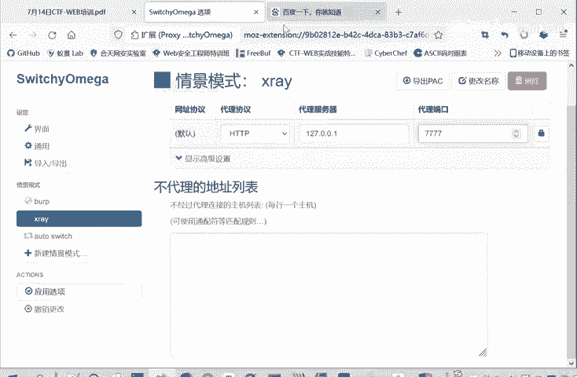

## 在Burp Suite中设置监听

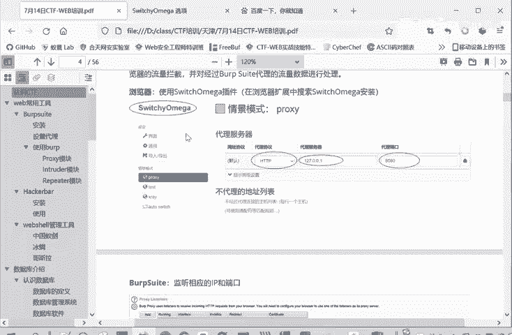

在浏览器设置好代理后，需要在Burp Suite中设置对应的监听器。

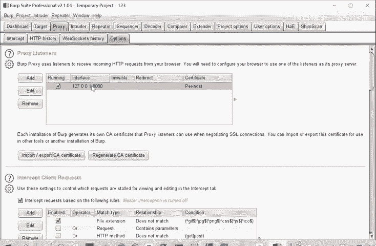

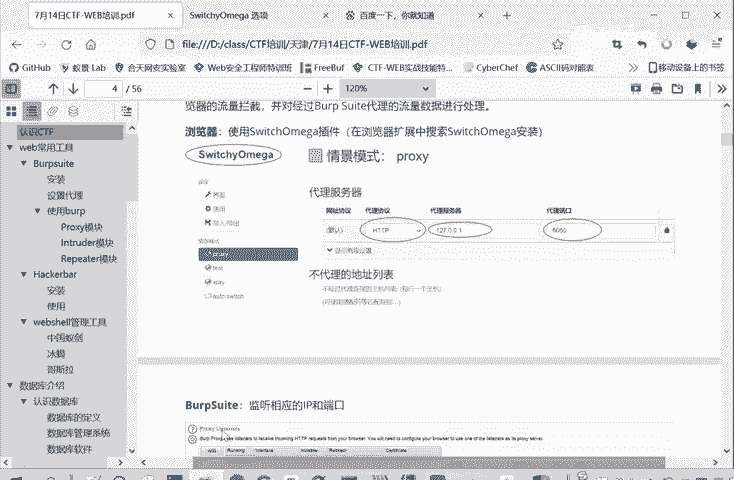

1.  打开Burp Suite，进入 **Proxy** -> **Options** 选项卡。
2.  在 **Proxy Listeners** 部分，确保监听器已启用（前面有勾选）。
3.  检查或设置监听器的IP地址（通常为`127.0.0.1`）和端口（例如`8080`），确保与浏览器中设置的代理信息一致。

经过以上设置，Burp Suite就能捕获和分析HTTP流量了。

## 安装证书以抓取HTTPS流量

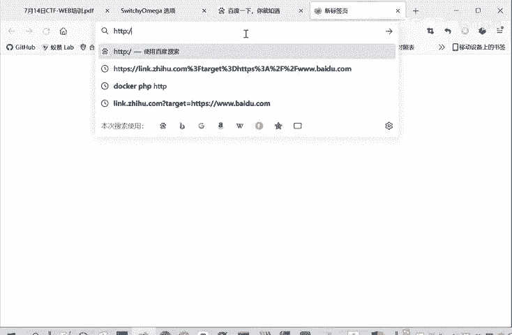

目前HTTPS应用广泛，仅进行上述代理设置无法抓取其加密流量，因为缺少合法证书。Burp Suite通过伪造证书来获得客户端信任，从而解密HTTPS流量。

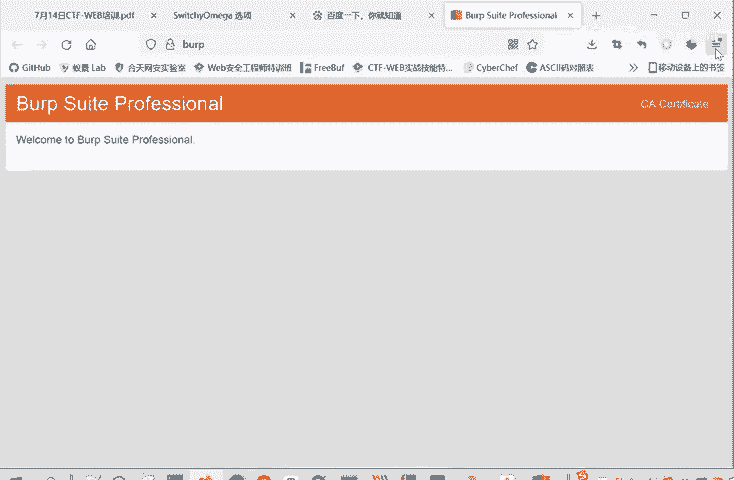

以下是安装证书的两种方法：

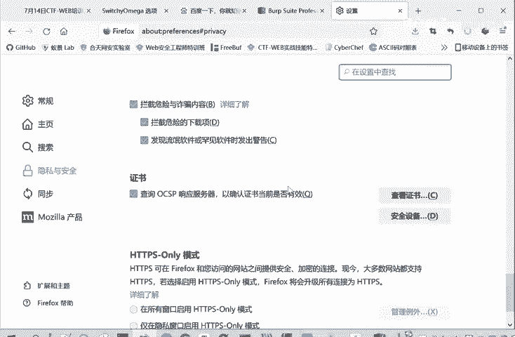

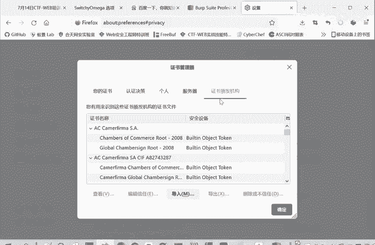

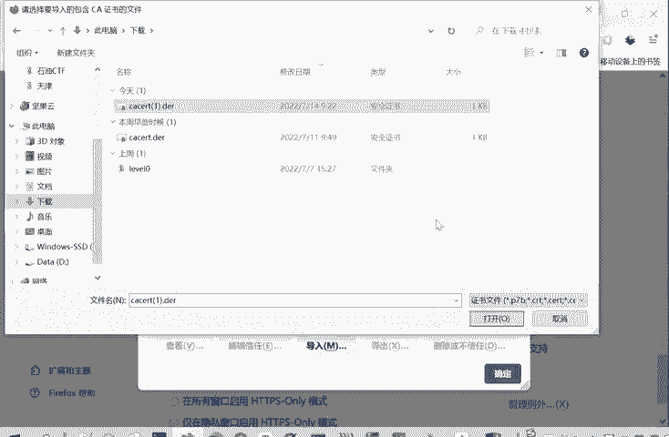

**方法一：在操作系统中安装证书（推荐）**
此方法使证书对整个系统生效，方便切换不同浏览器进行抓包。
1.  确保Burp Suite代理已开启，在浏览器中访问 `http://burp`。
2.  点击页面上的 **CA Certificate** 按钮下载证书文件（如`cacert.der`）。
3.  双击下载的证书文件，在打开的窗口中点击“安装证书”。
4.  选择“将所有的证书都放入下列存储”，然后点击“浏览”，选择“受信任的根证书颁发机构”。
5.  点击“确定”，并完成后续安装步骤。

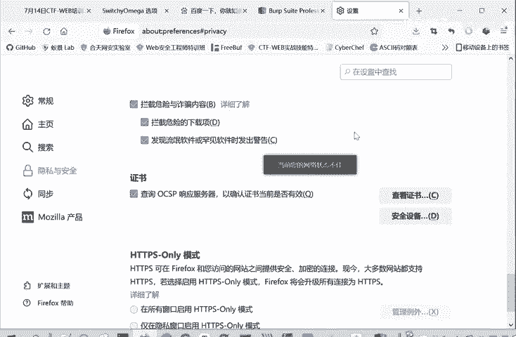

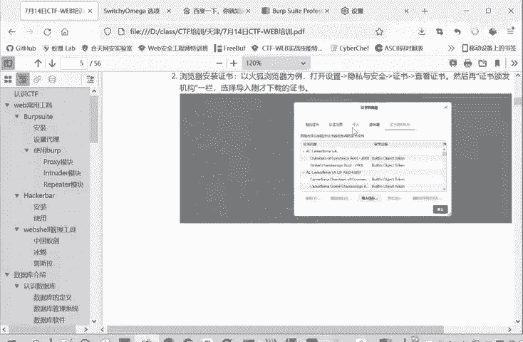

**方法二：在单个浏览器中导入证书**
此方法仅对当前浏览器生效。
1.  同样从 `http://burp` 页面下载CA证书。
2.  在浏览器设置中（如火狐浏览器的“隐私与安全”->“证书”->“查看证书”），进入“证书颁发机构”选项卡。
3.  点击“导入”，选择下载的证书文件并导入。

安装证书后，Burp Suite即可成功拦截和解密HTTPS流量。

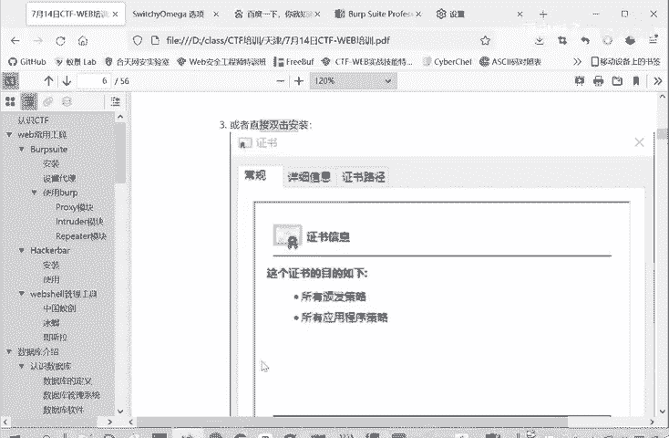

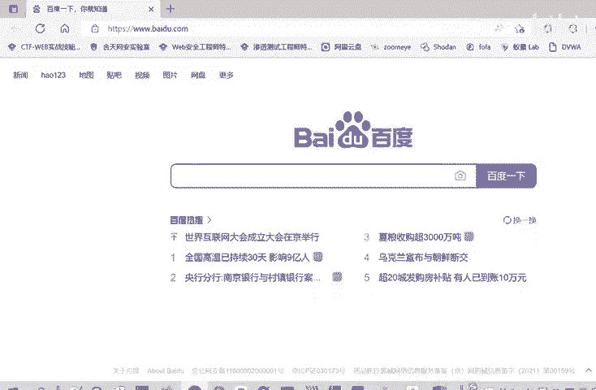

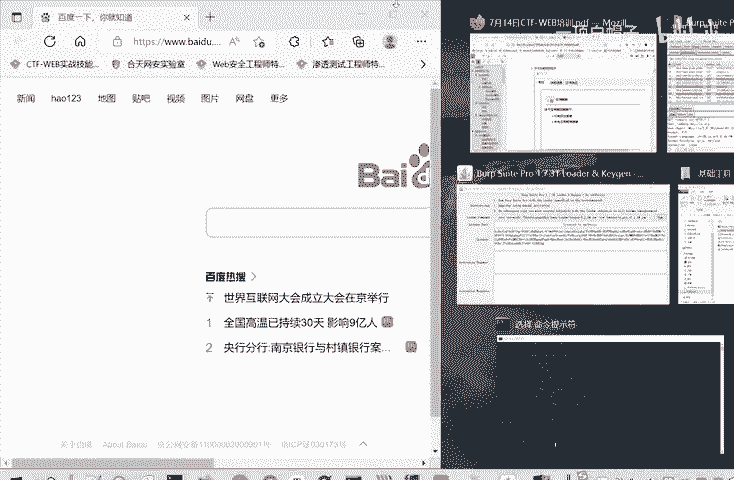

## 总结

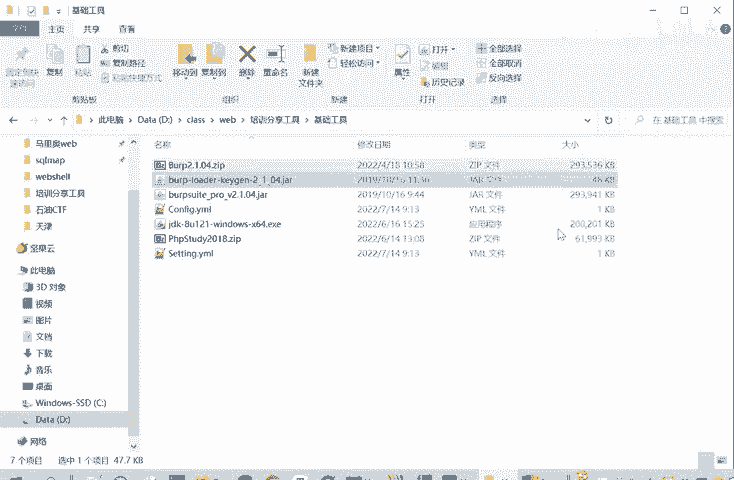

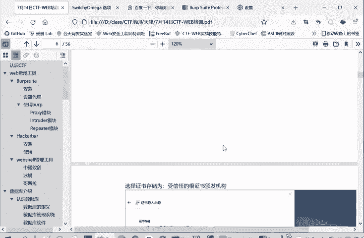

本节课中我们一起学习了Web安全测试的基础——代理设置。我们理解了代理与监听的工作原理，掌握了在浏览器中使用Proxy SwitchyOmega插件配置代理的方法，以及在Burp Suite中设置对应监听器的步骤。最后，为了应对加密流量，我们学习了如何为Burp Suite安装CA证书以抓取HTTPS数据包。正确配置这些环境是后续进行漏洞挖掘和CTF解题的基石。