# CTF入门教程：P4：Web安全工具Burp Suite使用指南 🛠️

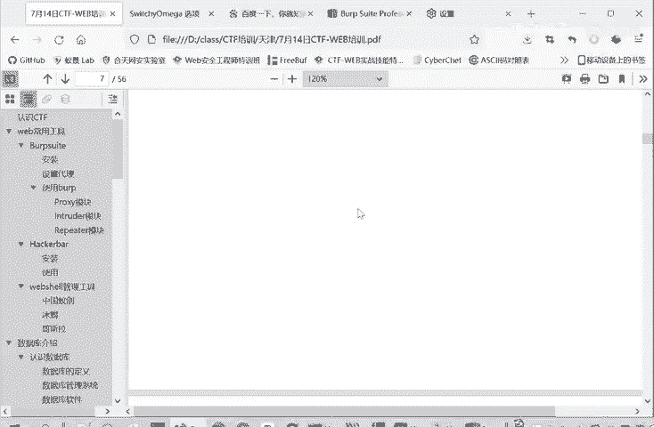

在本节课中，我们将要学习网络安全测试中一个至关重要的工具——Burp Suite。我们将详细介绍它的核心功能模块，特别是代理、爆破和重放功能，并通过一个实际的密码爆破案例来演示其使用方法。

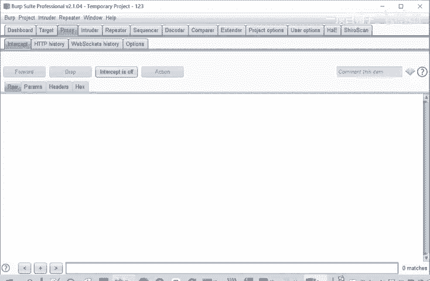

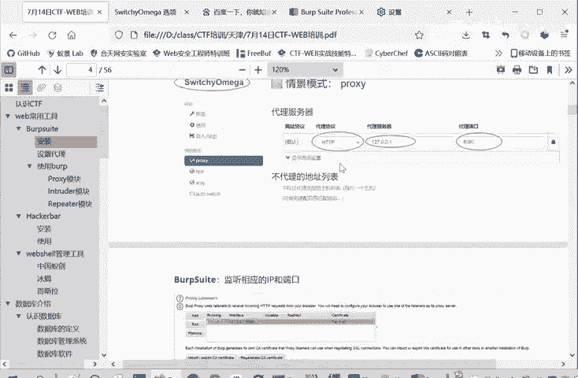

## Burp Suite的工作模式

上一节我们介绍了Burp Suite的安装，本节中我们来看看它的核心工作原理。

Burp Suite本质上是一个**中间人代理**。在正常情况下，浏览器直接与服务器通信。当启用Burp Suite代理后，所有网络流量会先经过Burp Suite，再由它转发给服务器。这使得Burp Suite能够拦截、查看和修改所有的HTTP/HTTPS请求与响应。

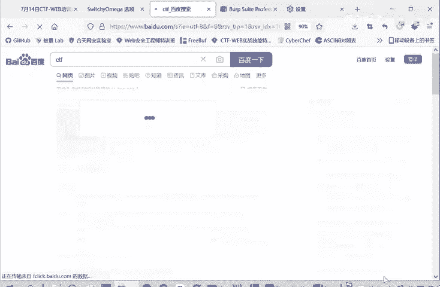

其工作流程可以用以下伪代码表示：
```
# 正常流程
浏览器 -> 服务器
服务器 -> 浏览器

# 启用Burp Suite代理后的流程
浏览器 -> Burp Suite -> 服务器
服务器 -> Burp Suite -> 浏览器
```

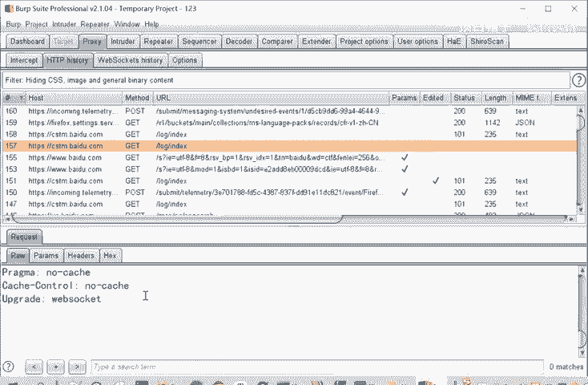

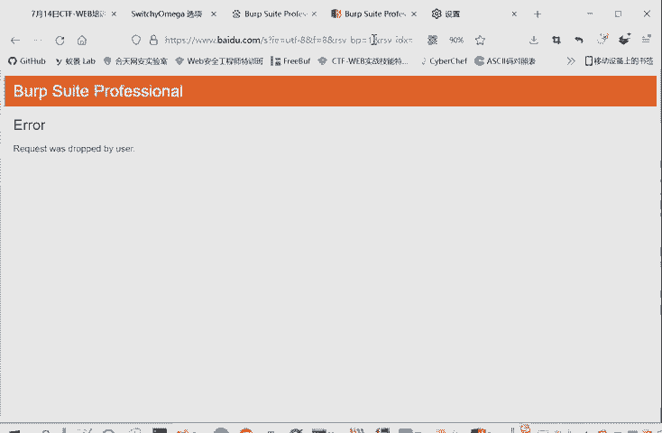

## 核心功能模块详解

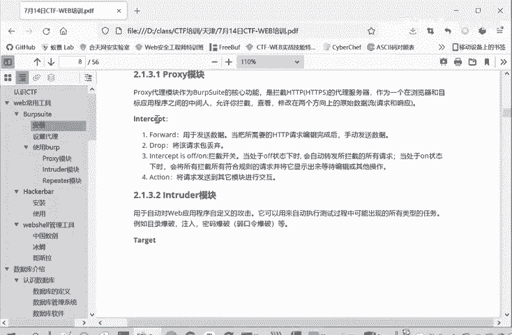

Burp Suite界面包含多个模块，其中最常用的是Proxy、Intruder和Repeater。

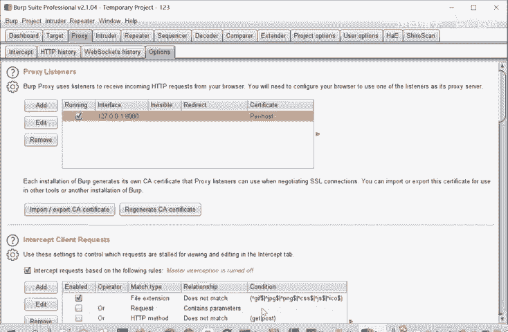

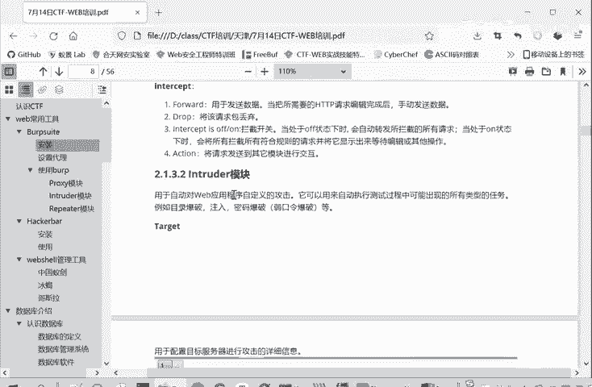

### 1. Proxy（代理）模块

Proxy模块是Burp Suite的核心，用于拦截和查看流量。它包含几个子面板。

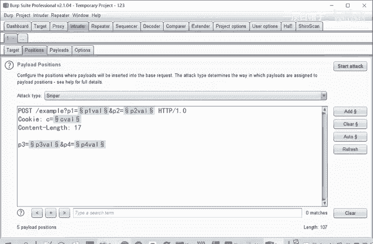

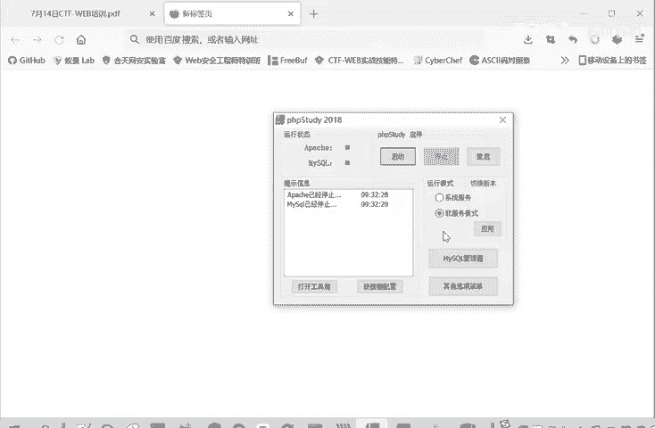

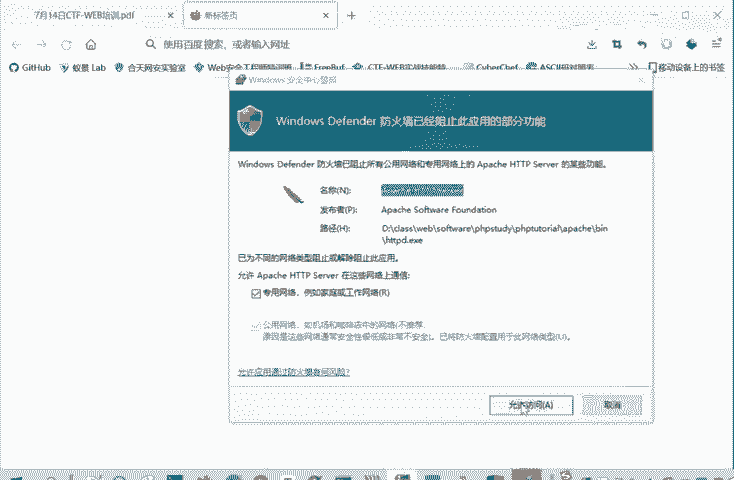

以下是Proxy模块的主要功能：
*   **Intercept（拦截）**：控制是否拦截请求。开启时，请求会在Burp Suite中暂停，允许用户查看和修改后再转发（Forward）或丢弃（Drop）。
*   **HTTP history**：记录所有经过代理的HTTP/HTTPS请求历史，无论拦截是否开启。
*   **WebSockets history**：记录WebSocket通信，使用较少。
*   **Options（选项）**：用于配置代理监听设置（如监听端口）和其他代理相关选项。

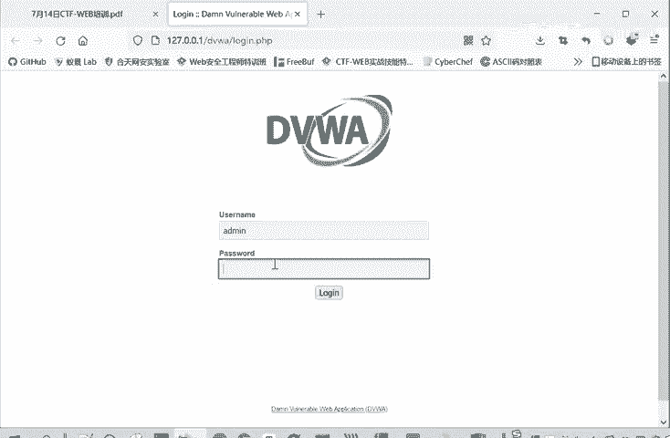

### 2. Intruder（入侵者）模块

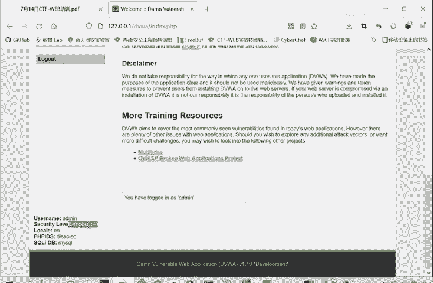

Intruder模块用于自动化攻击，如密码爆破、验证码测试等。它通过重复发送带有不同参数的请求来实现。

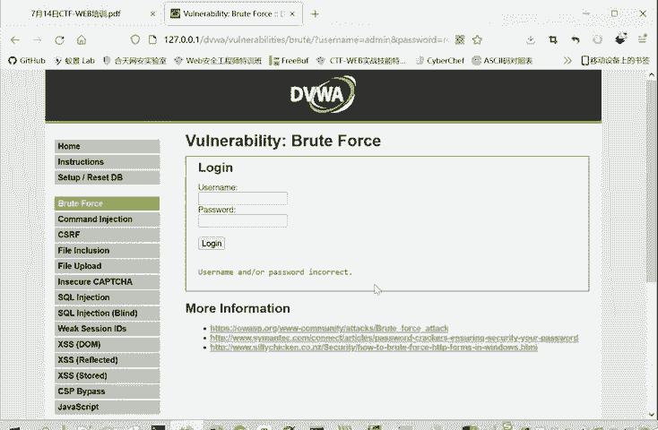

Intruder模块包含四个主要部分：
*   **Target（目标）**：设置要攻击的目标服务器的地址和端口。
*   **Positions（位置）**：定义请求中需要爆破的变量位置。用户可以在参数值前后添加特殊符号（如`§`）来标记变量。
*   **Payloads（有效载荷）**：设置爆破时使用的字典或规则。可以手动添加，也可以从文件导入。
*   **Options（选项）**：配置攻击的线程、速率等高级设置。

Intruder支持四种攻击模式：
1.  **Sniper（狙击手）**：对单个位置使用一个字典进行遍历。
2.  **Battering ram（攻城锤）**：对多个位置使用同一个字典。
3.  **Pitchfork（草叉）**：对多个位置使用不同的字典，按顺序一一对应进行测试。
4.  **Cluster bomb（集束炸弹）**：对多个位置使用不同的字典，进行交叉组合测试。

### 3. Repeater（重放器）模块

Repeater模块用于手动修改和重复发送单个HTTP请求，非常适合对请求进行精细调整和测试。

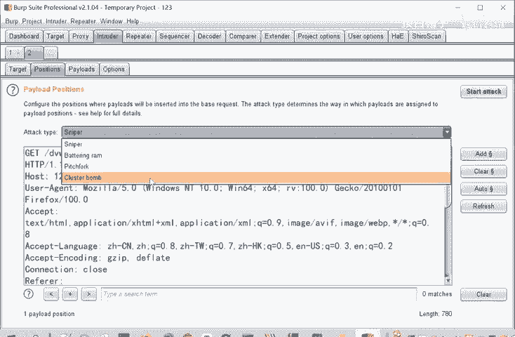

其操作流程是：从Proxy的HTTP history中选中一个请求，发送到Repeater。在Repeater界面中，可以自由修改请求的任何部分（如参数、请求头），然后点击“Send”发送，并即时查看服务器的响应结果。这在CTF解题中，用于测试各种Payload或绕过特定限制（如`User-Agent`检查）时非常方便。

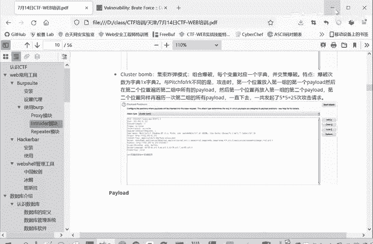

## 实战演练：使用Intruder进行密码爆破

上一节我们介绍了各个模块的功能，本节我们通过一个实际案例来演示Intruder模块的使用。

我们使用DVWA（Damn Vulnerable Web Application）靶场进行演示。首先，确保DVWA运行在本地（例如使用PHPStudy），并将安全级别设置为“Low”。

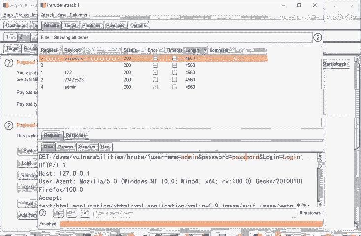

1.  **定位爆破点**：访问DVWA的“Brute Force”模块，随意输入用户名和密码（如`admin/root`）并点击登录，同时确保Burp Suite代理开启。
2.  **捕获请求**：在Burp Suite的Proxy -> HTTP history中找到刚才登录的POST请求。
3.  **发送到Intruder**：右键点击该请求，选择“Send to Intruder”。
4.  **设置攻击位置**：
    *   在Intruder的Positions标签页，点击“Clear §”清除所有自动标记。
    *   只选中密码（`password`）参数的值，点击“Add §”将其标记为需要爆破的变量。攻击类型选择“Sniper”。
5.  **配置Payload字典**：
    *   切换到Payloads标签页。
    *   在Payload Options中，添加或导入一个简单的密码字典，例如：`password`, `123456`, `admin`, `root`。
6.  **开始攻击**：点击右上角的“Start attack”按钮。
7.  **分析结果**：攻击完成后，会弹出结果窗口。通过观察响应长度（Length）或状态码的差异，可以找出可能正确的密码。通常，响应长度与其他请求明显不同的那个，就是成功的尝试。

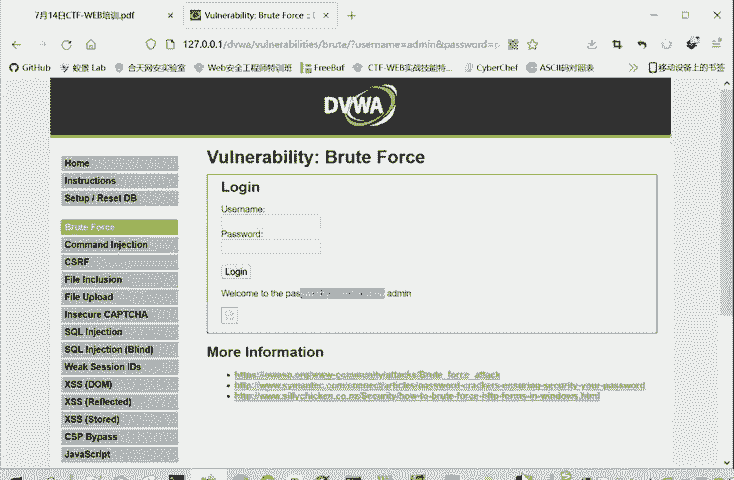

## 其他实用模块

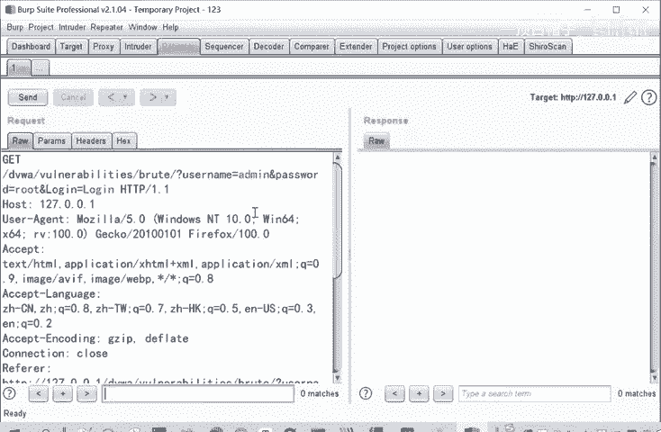

除了上述三个核心模块，Burp Suite还有其他有用工具：
*   **Decoder（解码器）**：用于对各种编码（如URL编码、Base64、十六进制）进行编解码操作，在分析数据时非常实用。

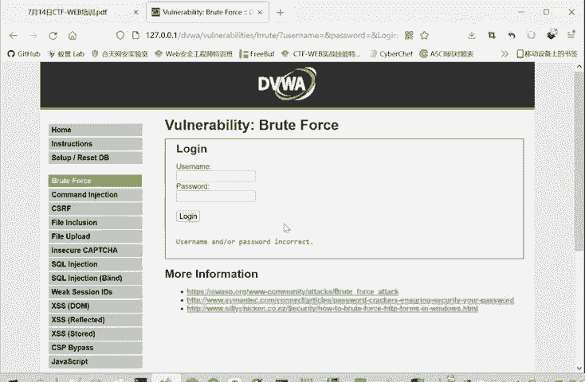

## 总结

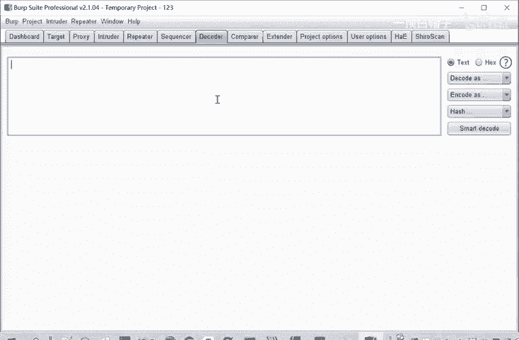

本节课中我们一起学习了Burp Suite这一强大的Web安全测试工具。我们重点掌握了它的三大核心模块：**Proxy**用于拦截和查看流量，**Intruder**用于自动化爆破攻击，**Repeater**用于手动重放和修改请求。通过DVWA靶场的密码爆破实战，我们完整演练了利用Burp Suite发现和利用漏洞的基本流程。熟练掌握这些工具的使用，是步入CTF-Web和实际安全测试领域的关键一步。