# CTF入门教程：P5：Web-Hackerbar的安装及使用 🔧

在本节课中，我们将要学习第二个重要工具——Hackerbar插件的安装与基本使用方法。这是一个在Firefox浏览器中非常实用的插件，能帮助我们更方便地进行Web安全测试。

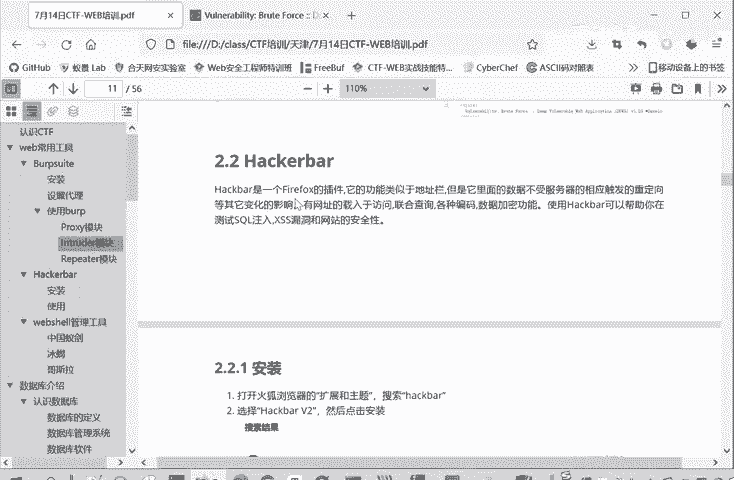

上一节我们介绍了SwitchOmega代理插件的安装，本节中我们来看看另一个强大的辅助工具Hackerbar。

## 插件简介与获取

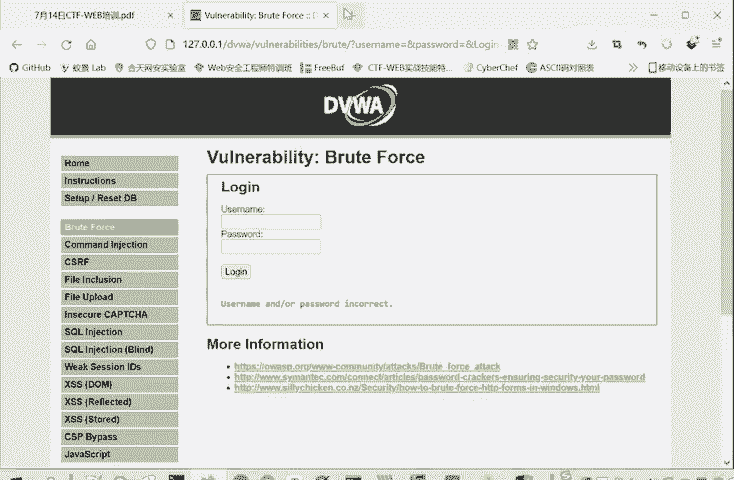

Hackerbar是Firefox浏览器的一个插件。这里推荐使用Firefox，因为它安装插件非常方便。虽然谷歌浏览器也能使用，但经常需要特殊网络条件，这对部分同学可能不太方便。

因此，我们选择在Firefox浏览器中进行安装。

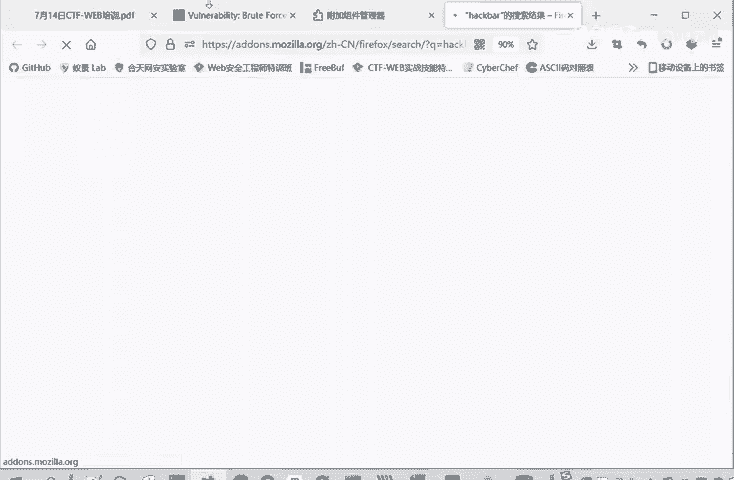

以下是安装步骤：

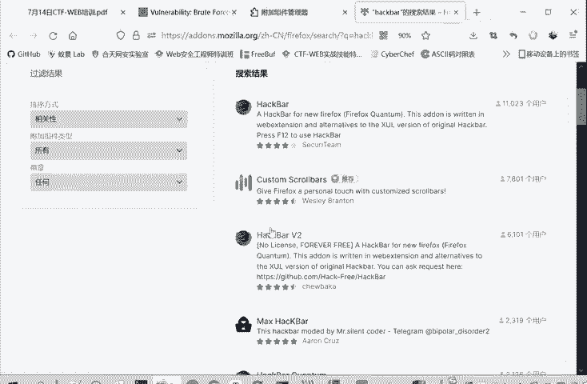

1.  打开Firefox浏览器，进入扩展管理页面。
2.  在扩展搜索框中输入“Hackerbar”进行搜索。
3.  在搜索结果中，请注意区分版本。“Hackerbar”下面的版本可能需要收费，而“Hackerbar V2”通常是免费的。请根据自身情况选择合适的插件。
4.  点击进入插件详情页，点击“添加”按钮进行安装。
5.  若想删除插件，在扩展管理页面点击“移除”即可。

## 插件的启用与界面

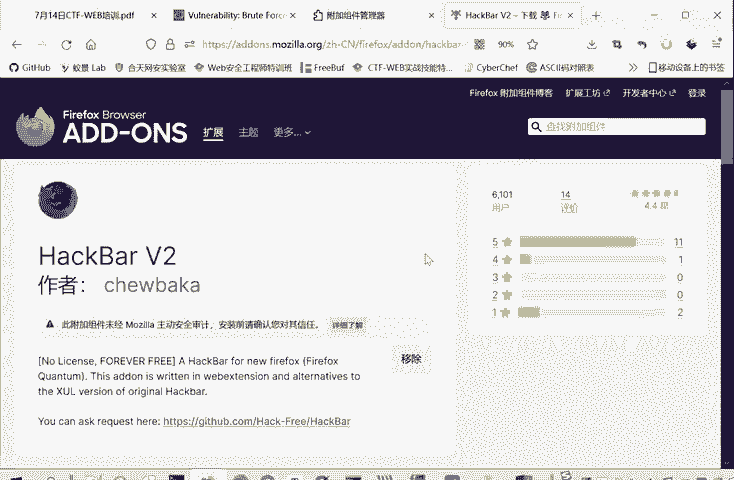

安装完成后，Hackerbar不会像SwitchOmega那样直接显示在工具栏上。它的启用方式有所不同。

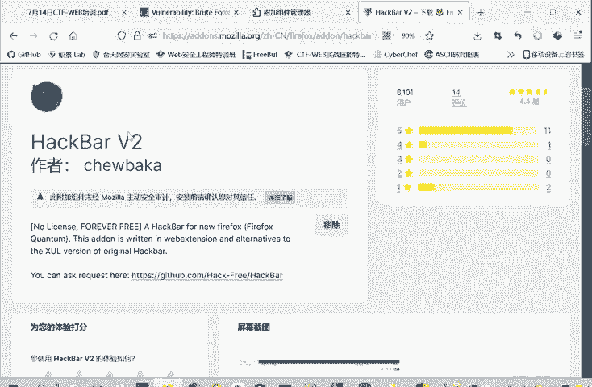

以下是启用方法：

1.  在网页任意位置点击鼠标右键，选择“检查元素”，或直接按键盘上的 `F12` 键，打开开发者工具。
2.  在开发者工具的面板中，会出现“Hackerbar”或类似标签页，点击即可进入插件主界面。

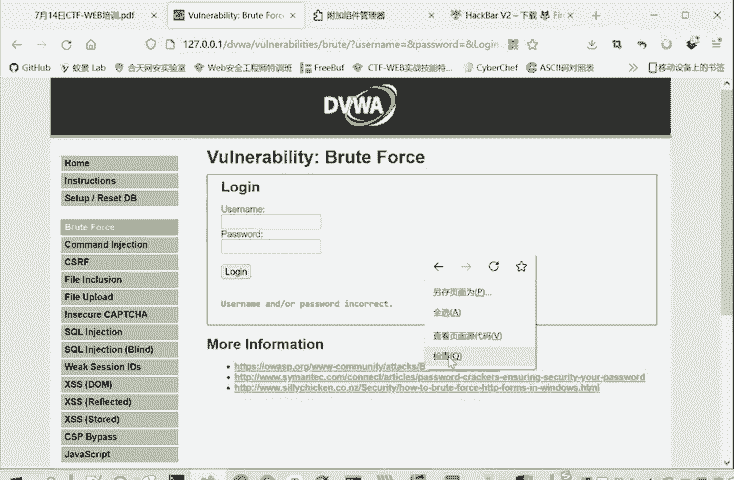

## 核心功能与使用演示

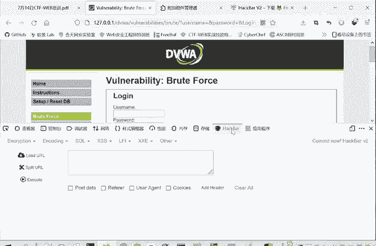

Hackerbar的核心功能是方便地修改和重发HTTP请求，这对于测试Web漏洞非常有用。

例如，当我们需要测试某个URL时，可以点击 `Load URL` 按钮将当前页面的地址导入。如果不使用Hackerbar，我们可能需要手动在地址栏尝试，而使用Hackerbar则可以直接在其界面内进行操作。

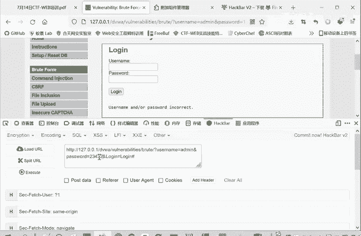

点击 `Execute` 按钮，就相当于让浏览器重新访问了这个URL。

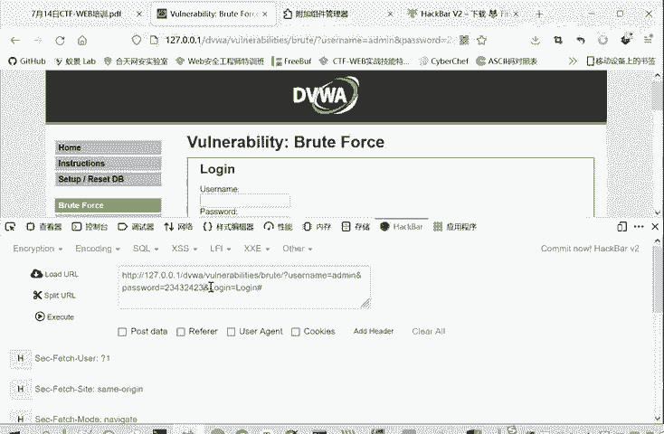

虽然直接在浏览器地址栏修改也能达到类似效果，但使用Hackerbar修改时，浏览器地址栏的URL会保持稳定不变。这使得测试过程更加清晰和方便。

此外，Hackerbar还提供了更多高级功能，可以修改HTTP请求的各个部分。

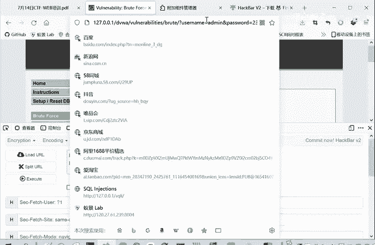

以下是其主要可修改的字段：

*   **Post Data**：修改POST请求提交的数据。
*   **Referer**：修改请求头中的来源页面信息。
*   **User-Agent**：修改客户端浏览器标识。
*   **Cookies**：修改请求携带的Cookie信息。

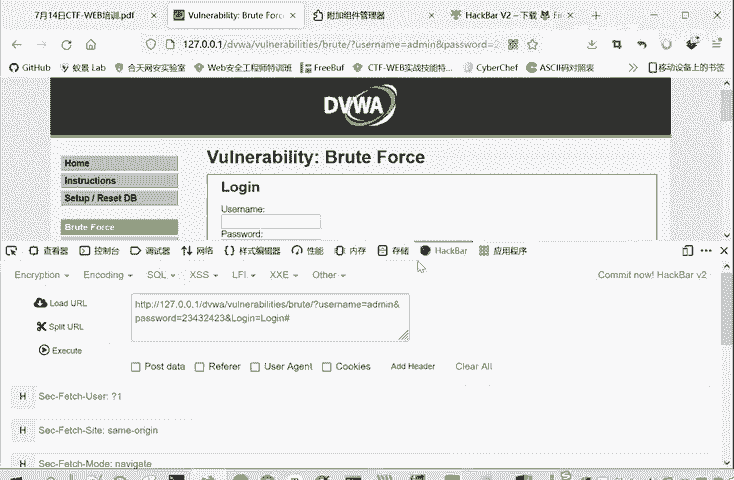

这些功能使得Hackerbar成为一个在Web安全测试中非常有用的插件。

## 总结

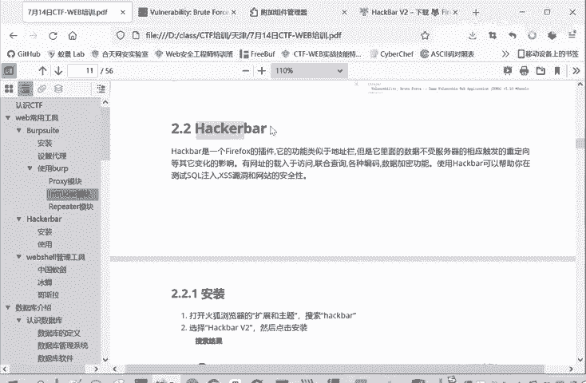

本节课中我们一起学习了Hackerbar插件的安装与基本操作。我们了解了如何在Firefox中安装它，如何通过开发者工具启用它，并掌握了其加载URL、执行请求以及修改关键HTTP头（如Referer、User-Agent）等核心功能。该插件能极大提升我们进行Web安全测试的效率，强烈推荐大家安装并使用。