# CTF入门教程：P6：Webshell管理工具 🛠️

在本节课中，我们将要学习CTF中Web安全方向的一个重要概念——Webshell管理工具。攻击者在入侵网站时，通常会写入Webshell（网络木马）以获取服务器控制权限。为了方便管理这些Webshell，会使用专门的工具。本节将介绍Webshell的基本原理和三种主流管理工具的使用方法。

## 什么是Webshell？🐚

上一节我们介绍了CTF的基本概念和常用工具，本节中我们来看看Webshell。Webshell是一种被上传到服务器上的恶意脚本文件，攻击者通过它可以远程控制服务器。

### 一句话木马解析

为了方便管理Webshell，存在各种管理工具。以下是常见的“一句话木马”示例：

```php
<?php @eval($_POST['password']); ?>
```

这是一个典型的PHP一句话木马。将其上传到目标服务器后，如果服务器能够解析该文件，攻击者就可以通过管理软件控制目标服务器。

我们来解析一下这段代码的含义：
*   `<?php ... ?>`：这是PHP语言的开始和结束标记。
*   `$_POST['password']`：获取通过POST方式传递的、名为 `password` 的参数值。
*   `eval()`：函数的作用是将传入的字符串当作PHP代码来执行。
*   `@`：符号用于抑制错误信息显示。攻击者为了避免在目标服务器上暴露错误信息，通常会使用它。

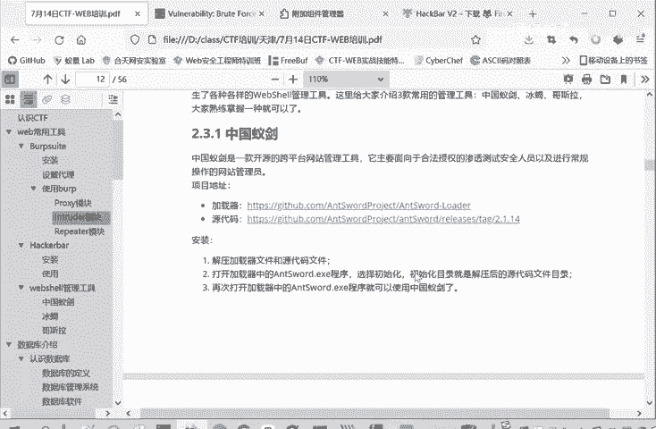

因此，这段代码的意思是：接收POST请求中 `password` 参数的值，并将其作为PHP代码执行。

## 主流Webshell管理工具 🧰

如果一句话木马上传成功，我们如何进行利用？主要有三种工具可以进行连接和管理。

### 中国蚁剑 🐜

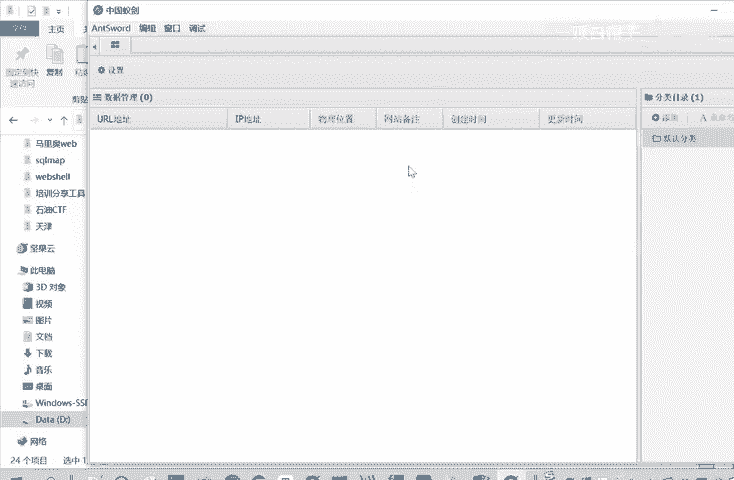

我们重点讲解中国蚁剑这一种工具。


以下是使用中国蚁剑的步骤：

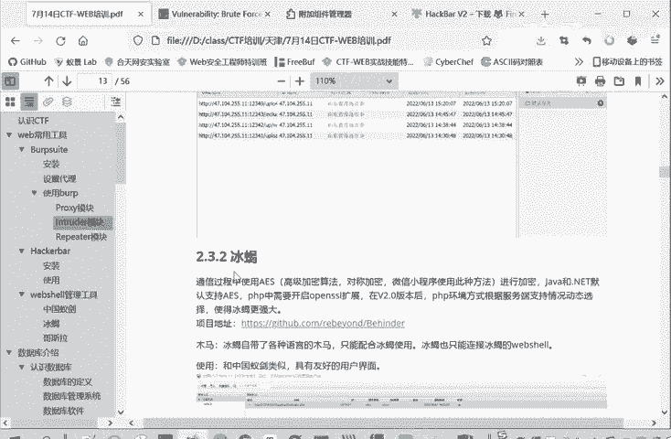

1.  **解压与初始化**：在提供的工具包中找到“中国蚁剑”的压缩文件并解压。解压后目录中包含 `loader`（加载器）和源代码文件夹。
2.  **启动程序**：首次运行需要初始化。双击打开 `loader` 目录下的 `AntSword.exe` 程序。
3.  **设置工作目录**：程序会提示选择工作目录进行初始化。请选择解压后的源代码文件夹（例如 `antword` 目录）。
4.  **添加目标**：初始化完成后，再次打开程序即可正常使用。在界面中可以添加数据，需要填写目标的URL、连接密码（即一句话木马中的参数名，如 `password`）等信息。


连接成功后，即可管理目标服务器的Webshell，进行文件查看、命令执行等操作。在后续文件上传漏洞的实战中，我们会具体演示如何使用中国蚁剑进行连接。

### 冰蝎 🦂

冰蝎是另一种常用的Webshell管理工具。


冰蝎的特殊之处在于：
*   **加密通信**：它在通信过程中使用了AES高级加密算法，隐蔽性更好。
*   **专用木马**：冰蝎不能管理普通的“一句话木马”，它需要使用自己专用的木马。这些木马与工具一一对应，冰蝎工具只能管理它自己生成的木马。
*   **基于Java**：冰蝎是一个Java程序，运行需要Java环境。
*   **密码设置**：冰蝎的连接密码设置在木马文件的密钥（Key）部分。默认密码是 `rebeyond`。如果想修改密码，例如改为 `test`，则需要计算字符串 `test` 的32位MD5值，并取前16位填入木马文件的Key处，此时连接密码就是 `test`。

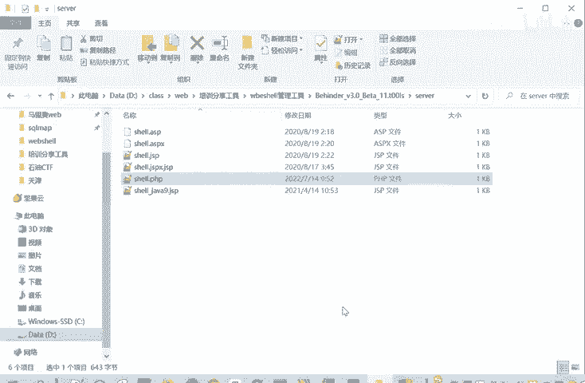

### 哥斯拉 🦖

哥斯拉是第三种主流工具。


它的利用方式与前两者类似：上传木马，然后使用工具连接。哥斯拉可以使用通用的木马，不一定需要专用马。

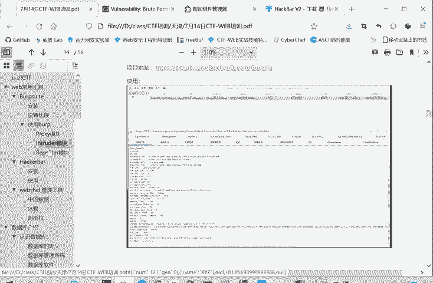

我们介绍这三种功能类似的工具，是为了提高大家在实战中的适应性。在CTF比赛或实际环境中，可能会遇到某种工具被安全设备拦截的情况，掌握多种工具的使用可以确保在一种失效时仍有备选方案。

## 本地环境搭建：PHPStudy 🌐

在学习了Webshell管理工具后，我们需要一个本地环境进行练习。最后给大家介绍一个基础工具——PHPStudy。


PHPStudy是一个集成了Apache服务器、MySQL数据库和PHP环境的软件包，可以快速在本地搭建Web服务器。

以下是使用步骤：
1.  解压提供的PHPStudy压缩包。
2.  双击安装程序进行安装，**安装路径不能包含中文或空格**。
3.  安装完成后启动PHPStudy。
4.  点击界面上的“启动”按钮，当Apache和MySQL旁边的圆点变为绿色时，表示服务启动成功。

启动成功后，你的本机就成为了一个Web服务器。默认访问地址是 `http://127.0.0.1` 或 `http://localhost`。

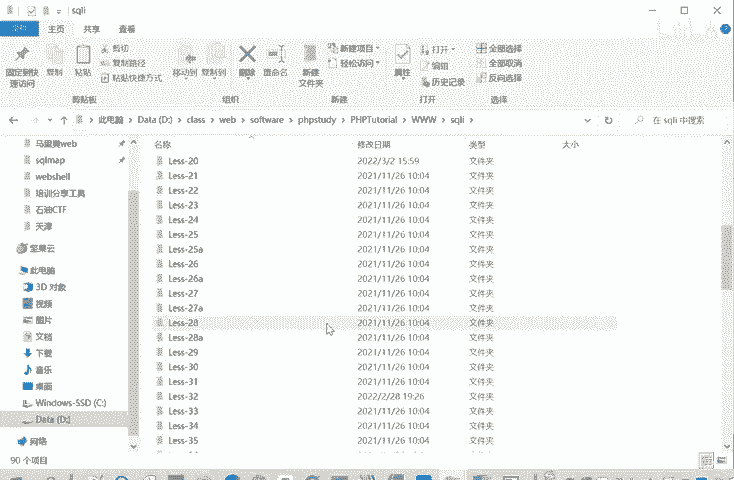

网站的根目录通常位于PHPStudy安装目录下的 `www` 文件夹中。例如，你可以修改 `www/index.php` 文件的内容，然后在浏览器中刷新页面，就能看到变化。

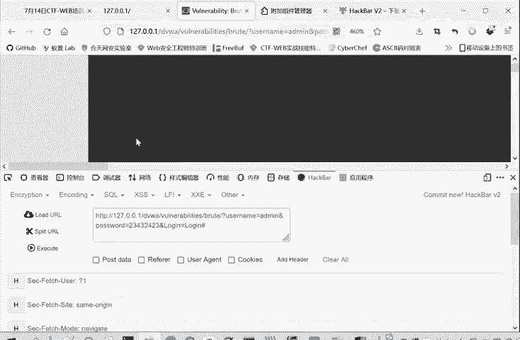


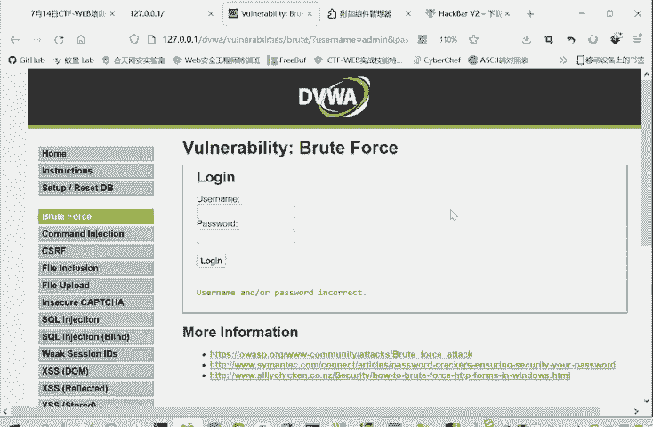

搭建好PHPStudy环境后，可以非常方便地部署各种漏洞靶场（如DVWA、Upload-Labs、SQL注入靶场等），只需将靶场文件放入 `www` 目录即可访问，为后续的漏洞学习与实践提供了便利。

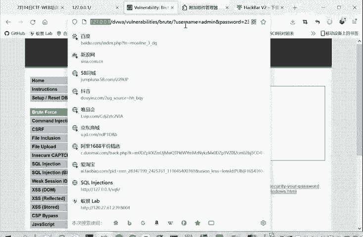


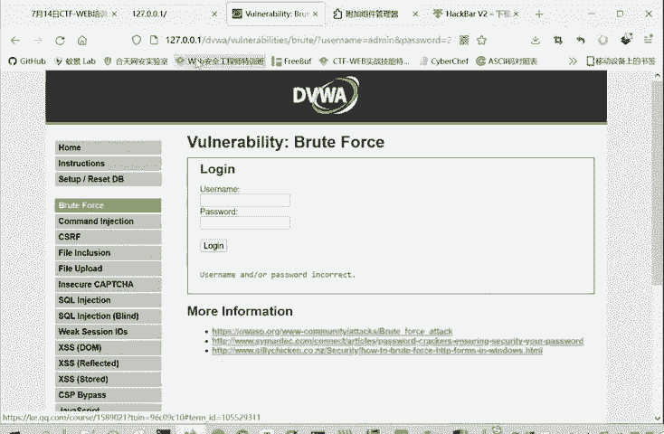
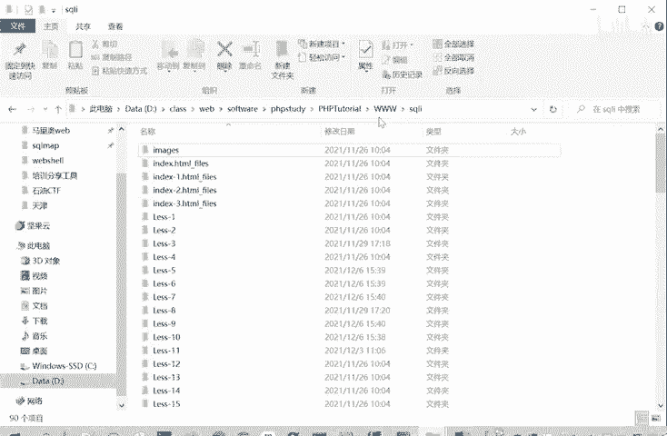
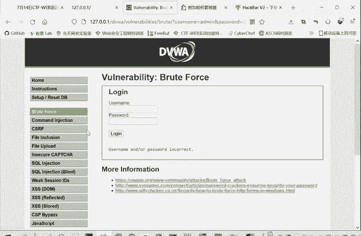


## 总结 📝


本节课中我们一起学习了CTF-Web方向中Webshell管理工具的相关知识。我们首先解析了“一句话木马” `<?php @eval($_POST['password']); ?>` 的工作原理。接着，详细介绍了三种主流的Webshell管理工具：**中国蚁剑**、**冰蝎**和**哥斯拉**，了解了它们的基本用法和特点。最后，我们讲解了如何使用 **PHPStudy** 在本地快速搭建Web服务器环境，为后续的漏洞靶场学习和实战操作做好准备。掌握这些工具和环境是进行Web安全学习和CTF解题的重要基础。