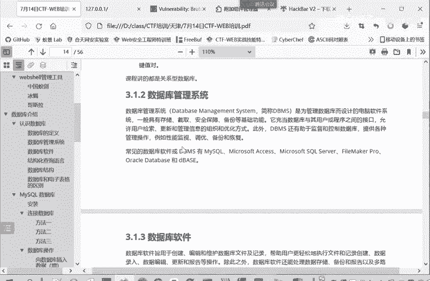
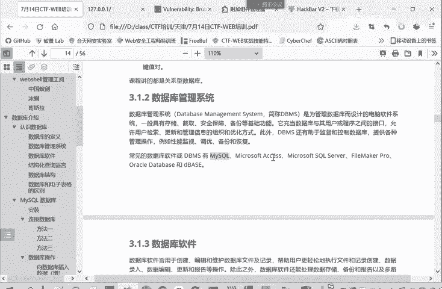

# CTF入门教程：P8：web-数据库管理系统

在本节课中，我们将要学习数据库管理系统的基本概念。数据库管理系统是Web安全领域，特别是CTF-Web题型中一个至关重要的组成部分。理解它有助于我们分析涉及数据库的漏洞。

## 什么是数据库管理系统？

上一节我们介绍了关系型数据库，本节中我们来看看管理这些数据库的软件系统。

数据库管理系统是为了管理数据库而设计的电脑软件系统。它具有存储、截取、安全保障和备份等基础功能。它实际上是充当数据库和用户或者是程序之间的接口。

用户或者程序通过数据库管理系统来使用数据库并控制数据库。

## 常见的数据库管理系统

以下是几种常见的数据库管理系统：

*   **MySQL**：这是我们课程重点讲解的数据库管理系统。
*   **Microsoft SQL Server**：由微软公司开发的关系型数据库管理系统。
*   **Oracle Database**：由甲骨文公司开发的大型商业数据库系统。



## 核心功能与角色

数据库管理系统的核心角色可以用一个简单的**接口模型**来描述：

```
用户/应用程序 <---> [数据库管理系统] <---> 数据库文件
```



它接收来自用户或应用程序的指令（例如SQL查询语句），将这些指令转换为对底层数据库文件的操作，并将结果返回给请求者。这个过程实现了对数据安全、高效的管理。

本节课中我们一起学习了数据库管理系统的定义、常见类型及其核心功能。数据库管理系统作为用户与数据库之间的桥梁，是理解后续SQL注入等Web安全漏洞的基础。下一节，我们将开始学习与数据库交互的核心语言——SQL。