# 护网行动红蓝攻防教程：P10：蓝队应急响应-9.入侵排查实战 🛡️

在本节课中，我们将学习蓝队应急响应中一个核心环节：入侵排查实战。我们将通过一个模拟的网站被攻击案例，一步步演示如何发现入侵痕迹、清除恶意代码、排查系统后门，并最终恢复系统安全。整个过程将帮助你建立起面对真实安全事件时的基本排查思路和操作流程。

## 检测阶段：发现问题

上一节我们介绍了应急响应的基本流程，本节中我们来看看如何在实际场景中应用。首先，我们举一个实际的例子。很多刚入门网络安全的同学都会遇到一件事情。大家喜欢把自己的靶场、网站或博客搭建在云服务器上，并开放给同学或其他互联网用户使用。你有没有想过，一个开放在公网的网站，会不会有人攻击你？有经验的同学应该知道，只要服务器搭建在公网上，就无时无刻不在被攻击。无论是国内的测试，还是一些境外的未知攻击，都在持续进行。

我们现在要讲的是，如果被攻击了怎么办？首先，站在新手角度，如果被攻击了，第一件事你应该感到高兴。😊 因为现在有一个非常好的应急响应排查实例摆在面前。你难道不想去分析黑客是如何攻破你的，如何分析黑客留下的挖矿木马？看到黑客控制你的服务器，你不想探究原理，找出远控木马并尝试逆向分析吗？你应该有这种兴趣和爱好，才能把网络安全的路走好。不能说被打了就关机，或者以后不敢再搭建了。这种态度无法学好网络安全。首先兴趣就不够。😊

## 案例引入：网站被篡改

我举一个简单的例子。这个例子是我搭建的一个Windows服务器。在这个Windows服务器里，我安装了一个非常常见的DVWA。很多同学应该听说过DVWA。如果你没听说过，现在可以了解一下。它是一个用PHP编写的网站，可以用作渗透测试的靶场。现在我这个网站出现了一定的问题。😊 它被黑客攻击了。什么意思呢？比如我现在去访问这个DVWA。访问之后，它会输出一个“hello stupid”的弹窗。在这个弹窗出现后，我们只要点击确定，就会发现它进行了相应的跳转。它跳转到了“核天火案实验室”。因为我这里是做教程，不可能真的跳转到一个恶意网站。那样的话，警察可能会给我送一副“银手镯”，这可就不好了。所以我这里模拟的是被入侵后，跳转到了另外一个网站。😊 这一点在我们实际的上网过程中，是不是经常遇到？经常遇到吧。你打开一个网站，它突然跳走了，很多同学都见过。那这是什么原因呢？很明显，你觉得是啥原因？那肯定是你的网站被黑客改了呀？😊

## 初步排查：定位问题文件

那被改了怎么办？我们要学会排查。首先有同学说到“被劫持”、“被重定向”。那我们就要想，黑客是怎么进行劫持和重定向的？第一个方向，我们先考虑一件事情：他到底是怎么打到我的？这样我才可以进行规范的排查。第一件事不要急，我们一定要慢慢去做。第一件事就是：怎么打的？😊 怎么打的？我们想象一下。😊 有同学说劫持，比如像DNS劫持、ARP攻击。但这些在2023年其实非常少见，你家里的小路由器都能够防御这些流量攻击。所以我们最先考虑的事情就是：网站被攻击了。

攻击之后现在怎么办呢？我们第一件事，就是要确定它的入侵行为。现在我的网站被攻击了，被挂了黑页。那我们第一件事，就是要找到这个被攻击的网站页面在哪里，然后尝试恢复它。我们一起来看一下。

首先，这个被攻击的页面是DVWA。它会跳转到DVWA里面的一个叫做`login.php`的文件。然后它会有一个弹窗。所以我们第一件事就是把关注点集中在`login.php`这个文件上。

这时候有同学又要问了：老师，我不会PHP怎么办？这里请大家注意，不要求你有编程语言能力。你有也没有用。因为你实际遇到的客户、遇到的排查，它可能是PHP，可能是Java（可能是Spring，可能是Struts），也有可能是Go、Node.js写的，也有可能是Python（Flask, Django）。那你要是都学，那我也只能说是佩服你。不可能说语言有成千上万种，你都会。所以说你没有必要去掌握它。

“浮夸浮夸”同学给大家提供了一个思路：咱们ChatGPT虽然写报告很垃圾，但是它解读代码还是有点用处的。😊 所以说，你可以用ChatGPT去解读代码。

好，我们一起来看一下。这里我就给大家简单演示。第一件事就是要找到咱们的`login.php`在哪儿。在哪儿呢？你其实用搜索软件搜索一下就能看到，它在这个位置。我们打开它之后找特征。第一个特征就是咱们的弹窗，弹窗里面是一句脏话“stupid”。我们看到这个脏话之后，就可以在这个代码里面去搜索“stupid”这个单词。我们就可以看到第一行，他就做了这一件事情。

很多的😊网站劫持都是因为被植入了这样一段代码：
```javascript
window.location.href = "http://恶意网站地址";
```
就是使用`window.location.href`把网站跳转到了一个用户不想访问的网站。就比如说你现在去访问一个正常的教程网站，结果给你跳转到黄色网站、电信诈骗网站，这是你想访问的吗？很明显不是。所以说，我们并不需要去了解这段代码，只需要你看到这里有个链接，并且这边出现了“hello stupid”这些关键字，你就可以把它删掉了。删掉就行。

但是，如果你是给客户做排查，我跟你讲，你千万别去删他的源代码。他们都有备份，你要去恢复备份，不要在他的源代码上直接删。万一没删干净呢？或者你自己技术不行，删错了怎么办？有的同学手特别抖，删了之后多删一行，那你就凉了。到时候客户非得告你，把你告上法庭。所以说，如果你非常清楚，就可以把它删掉。删掉之后就不会出现这个东西了。😊 是吧？就不会出现了，咱们就可以正常打开了。

## 深入思考：攻击是否仅止于此？

但是，就如这样一位QQ用户所说一样。😊 他今天删了，明天又有了。我们在删除之后，你要想象一下。😊 哎，那我为啥会被黑客打进来呢？我到底做了什么？到底做了什么事情会被打进来？打进来之后，黑客难道就只给我写了这样一个后门吗？他除了去写这样一个跳转，有没有对我们的操作系统做其他事情？我们就需要逐一去排查。这里你千万不要去瞎想，我们要去逐一排查。大家觉得除了这之外，黑客还有可能植入哪些东西呢？

第一个，我们来回顾一下刚刚的课程。就是说，它除了植入网站篡改之外，还会有Webshell。Webshell是什么？Webshell就是咱们的网站后门。

这个同学提到了一个非常好的关键点：查看文件的修改时间。你要注意，在正常的网站中，很多大学生会遇到一个比赛叫做“攻防赛”。或者是你的服务器无缘无故多出来一个文件。你想象一下，这个文件是好的吗？它八成是病毒文件。或者说，你看你云服务器哪一天突然蹦出来一个文件，自己也不认识。那我告诉你，它八成是木马。😊 啊，这也要告诉你，靶场是什么？啊，这是一些思路。

那这里呢，我们来看一下。在这个靶场中，除了被植入了跳转代码，还有这位同学说的对，文件时间可以修改。所以说我们会讲多种方法，这是一个对抗的过程。你说文件时间可以修改。那上面还有同学说，我可以做内存马，不让它有文件，就是说系统里面没有文件。😊 说看日志，我日志也可以删掉是吧？日志我能删掉。你说你有360，我360都给你卸载。你备份日志，我备份也给你删掉。那你这时候有同学就说了，哎，那完了，这蓝队还做个屁呀。其实啊，你要知道这是一个对抗的过程。还是这样说，红队就是想着怎么打穿你。😊 蓝队就是想着怎么能防好。大家这种思维是非常好的，但是你千万不要被它纠结住了。

## 发现Webshell

好，那除了在`login.php`我们被修改之后，其实在这个文件夹下，它还有一个`webshell.php`，是黑客传入的一句话木马，被写在这里。我们也可以把它找出来。

首先怎么去找？按照第一件事，就是有同学说出来的：按照修改时间。我们能够明显看到这个`webshell.php`是8月22号创建的。那你没事儿，你说是咱们网站怎么会多出来一个东西呢？是吧？它肯定😊是一个坏东西。所以说它就是一个木马。

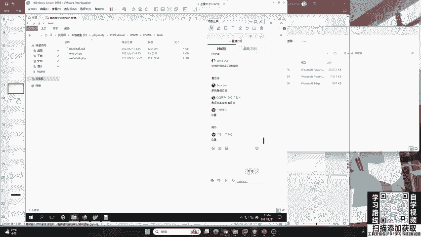

## 自动化排查工具

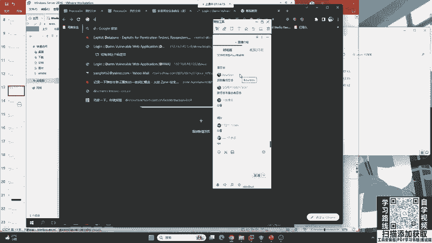

好，那现在我想去问大家，怎么才能自动化的去查找这个后门？我们不可能每个文件都点开看一看吧？是吧？那看死了呢？那花的时间太多了。

有同学提到了第一个：D盾。可以看到很多同学对于网络安全还是有一定了解的。还有同学说到了IPS，非常好。首先，咱们的D盾是可以去查询的。我在上面搜吧。😊

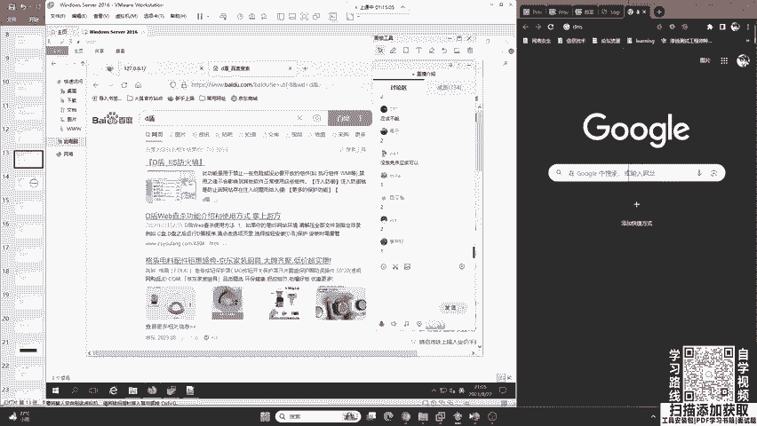

第二件事，我想问大家，咱们的火绒和360能不能去查询这样一个`webshell.php`？大家觉得360和火绒能不能做到？你觉得能做到，可以扣1；觉得做不到，可以扣2。好的，那大家觉得没做免杀。我们现在讲的就是不免杀的情况下。

很多同学持有不同的意见。那其实呢，二一老师这里要告诉大家，现在的360和火绒，它不仅能够查杀系统木马，咱们的Webshell（针对网站的木马）它也可以查杀。你可以去试一试，包括Windows Defender也可以。因为它太常见了，很多人被挂黑页，或者被打穿，都是因为这个原因。就是因为自己这个网站被挂马了，所以说这个😊安全防护软件非常重视这个方向。

## 对抗免杀与杀毒软件选择

那如果说用了免杀怎么办？好，现在遇到了一个问题：你这个火绒也好，腾讯管家也好，如果黑客做了免杀，绕过了咱们的火绒，你有什么办法？或者你知道哪些比较厉害的杀毒软件？大家应该都知道咱们的360。

我们来看一下。同学们说的我想了解一下。大家可以说一下自己知道的杀毒软件。😊 非常好。

首先我先提出一个表扬，就是咱们的“卡哇伊选择子”同学。他说到了“比特梵德”。这个杀毒软件是罗马尼亚开发的一个非常厉害的杀毒软件，在国外用的很多。他很厉害，他要比火绒在木马查杀方面要强一些。不是说火绒不行。

还有人说“金山毒霸”。啊，你没有听过没关系，这里就是让你去听。大家不要担心。第一个，比特梵德。第二个呢，就是360安全卫士。这个同学说到EDR，EDR是咱们的终端防御了，咱们一般不说这些，就是家用款杀毒软件，360安全卫士非常好。Windows Defender静态杀毒，他说一没人敢说，就是Windows自带的。卖咖啡啊，非常好。卡巴斯基，俄罗斯的非常厉害的杀毒软件。还有哪些？哎，卡巴斯基、金山毒霸、金山毒霸哎瑞星啊。金山毒霸和瑞星现在，你尽量不要去用。对，360是不差的。奇安信天擎啊，非常好。天擎的防火墙。

除了这些之外，还有哪些呢？首先给大家介绍一下，大家说的非常好。第一个就是比特梵德。第二是卡巴斯基、卖咖啡。其次呢，就是咱们这个360。360以前😊去做这样一个杀毒，他所用的杀毒引擎叫做“小红伞”。小红伞这个同学说的非常对。小红伞。还有这位同学说的“诺顿”，诺顿也是非常火的杀毒软件，在国外。还有一个就是现在很多做红队都非常头疼的，它叫做“趋势”杀毒，趋势防病毒软件。他是咱们对岸的软件开发者开发的，叫做趋势防病毒软体。他被很多的红队都害怕，因为它的杀毒能力非常强，很难去绕过。你要是说360，360它的业务能力确实很厉害。首先它有云大脑，其次它有小红伞这个国际一流的杀毒引擎。那360还是非常难绕过的。但是依然可以掌握绕过方法。但是说实话，如果把这些杀毒软件换成卡巴斯基，或者是趋势科技的杀毒软件，又或者是比特梵德，那对于咱们红队来说，就不太友好了。

所以说，你选择一个正确的杀毒软件也尤为重要。那有同学就会问，那我现在要把360给卸载，我要换成趋势。这里要告诉大家，这些好用的杀毒软件都是收费的。它一般不像360，咱们的周鸿祎免费给大家用，你只需要看一些广告就行了。它免费为我们的个人终端做安全防护。但是呢，国外的都是收费的。

这个同学说“全部装一遍”。那这时候你不要去做这件事情。有一句成语叫做“猛药去疴”。它的作用就是说你这个药用的太猛了。就像我们如果去治病的话，如果你用药太猛，你可能就把自己给😊整坏了，把自己的身体给整坏了。所以说，全装一遍是肯定不行的。就比如说像360和火绒，他们两个是水火不容的。这同学我不多说了哈，这个你再问我就不能再说了。好吧，咱们360还是非常厉害的，作为个人的终端安全防护，还是有举足轻重的地位的。😊

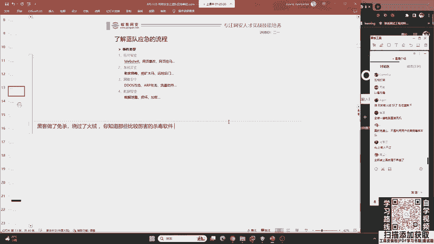

好的，我们继续来看。刚刚讲了咱们的一个😊杀毒软件。其实，你选择一个正确的杀毒软件事半功倍。这些网站根本就不可能被挂马。比如说我现在在我的这个Windows Server上面安装卡巴斯基的专业版，基本上这个被挂黑页的行为就不可能存在。

## 系统层面排查：临时目录与可疑文件

好，咱们这是第一件事，叫未雨绸缪。但是现在已经被攻击之后，我们要把黑页恢复。黑页恢复之后，我们要想：为什么会被入侵？黑客有没有留下其他的后门木马？有没有对我的操作系统做篡改？

首先第一件事，我们发现了一个木马。😊 叫做`webshell.php`。你要做的就是把它删掉，这很简单，把它复制一份备份，然后删掉。

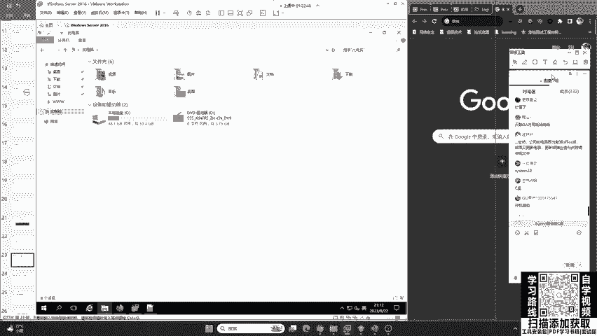

然后大家再想一下，我们除了这个`webshell.php`，这个黑客在攻破你的电脑之后，如果是我就是二宇老师，我最想做的事情就是打开你的摄像头给你拍个照，看看你是不是在划水。😊 这是我最想做的事情。那Webshell能不能做到这一点呢？很明显是不行的，它需要一些高级的系统木马。

那现在我想问大家一个问题。😊 你作为一个黑客，咱们首先排查的系统木马，黑客一般都会放到哪儿？我想问一下大家，大家有没有知道的？很多同学有网络安全基础，我想问一下你。就是说咱们黑客他会把木马放到哪儿，或者是你你会把木马放到哪？开机启动？桌面啊？这有同学说的非常多啊。

我们看到了一个正确的答案。😊 首先同学们的解答都不错，但是只有侧重点。第一个同学说桌面。哎，这个桌面哈，你放到桌面上，咱们红队可喜欢了。😊 包括二宇老师做渗透期间，也经常会在受害者的桌面上面发现很多的好东西。有的人他的桌面上面就放了一个`password.txt`，我们只要双击打开一看，他的个人密码都保存在这一个桌面的TXT上面。😊 我见过不止一个这样。😊 可能是这些员工年龄比较大，这个四十来岁，他比较喜欢这样去做，把一些企业的内部文件都放到桌面上面。

好，第二个就是有同学说的`regedit`。`regedit`它被称为注册表编辑器。其实Windows的注册表，它也是有实体的文件存在的。它并不属于文件路径。

我们再来看。😊 `C:\Windows\Temp`，这是一个正确答案。这是临时文件目录。放到这个目录，我们不需要考虑权限的问题，也不需要考虑咱们有没有写入这个功能。就是说你去往C盘里面传，如果你打掉的服务器，它的网站运行权限比较低，那你就写不进去。所以说，咱们一般都是写到`C:\Windows\Temp`这个目录。它被称为Windows的临时文件目录。你一定要注意，这个东西以后可有用了，一定要注意这个目录。

好的，我们再来看。有同学说被清除了怎么办？Linux在`/tmp`也是有这个临时文件目录。

我们来看一下`Windows\Temp`，找一下。`Temp`在这儿。好，大家要注意哈，在这个`Temp`中，咱们蓝队做溯源红队的一些工具，就是遗留工具。他比如说想去打你，他会使用一些工具，都会在这个目录。你一定要注意。那这个目录被清除了怎么办？我等一下回来讲。这个红队做的坏事儿可多了，他不是说只给你传木马，他还会给你的系统中留下一些后门。

好，在这个`Temp`目录中，它默认情况下，它是不会有`.exe`文件的。它里面都是一些日志，包括临时文件。你只要在这里面看到`.exe`，我告诉你，那就是木马。你现在可以打开看一下，这里面是不会出现360、`.exe`的。当然，如果你安装了某数字系列的输入法，你好像在这里面😊会发现一些输入法、看图王的`.exe`。那为什么他们有这些软件会放到这里呢？你自己去猜，我这里就不多讲了。😊

好的，那些临时文件啊，大家不用去删掉它。其实咱们用这些升级软件，这些不用去删掉它。它升级软件也写到了这个临时文件目录，其实这种不规范。😊 腾讯会议的升级文件居然写到了这个目录中。其实，不能写到里面了，或者写到里面，你在升级之后，他要去删掉。那很明显，腾讯会议的开发者并没有意识到这个问题。😊 那没关系，咱们很多的开发都这样，没办法。

好，那在这里呢，我们要把这个`360cf.exe`，你要注意，你不要把它删了，你要把它备份一下出来，留有备份。去交给你自己不会溯源、不会逆向的人没有关系，咱们交给会逆向的人去做病毒分析，把这个红队抓住，我们是可以加分的，知道不？咱们是可以加分的。你不要把他动手删了，删了就没了。

好的。这么多`.exe`呀，你这都什么软件装的呀？😊 你的这个老哥，你这是什么软件会有这么多`.exe`？😊 咱们可以去用火绒的一些垃圾清理，其实都能清理掉这个`Temp`目录。

## 系统用户排查

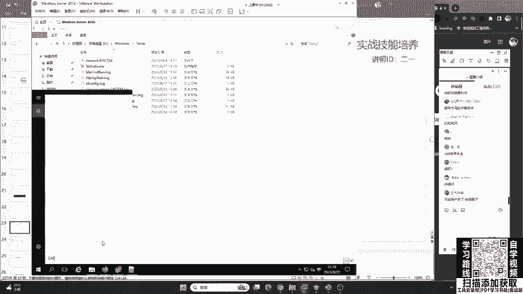

好的，我们继续来看。我们发现了1个`360cf.exe`。这时候要问一件事情：这个黑客有没有反其道而行，把这个`.exe`放到其他的文件夹里面呢？当然有可能。这时候又要用到咱们的杀毒软件进行全盘查杀。所以说选择对一个杀毒软件尤为重要，不要去轻视它。很多人用一些不知道从哪里搞到的一些不知名的杀毒软件，或者是你电脑自带的。很多人去买一些品牌电脑，他可能会自带一些电脑管家。这些电脑管家都不是专业做杀毒软件的，他可能防病毒的能力不是特别好。😊

那除了这个之外，我们还要去想：他会不会去对你的操作系统做了修改？那这里呢，我去留了一个简单的后门。就是说一般的黑客他都会做的一件事情，就是给你去加用户。去给你加用户。什么叫做加用户呢？他就是说我创建一个新的用户，以后我想去进行相应的对你的操作系统进行远程登录也好，进行相应的内网渗透也好，都比较简单。就是说它可能会加用户。

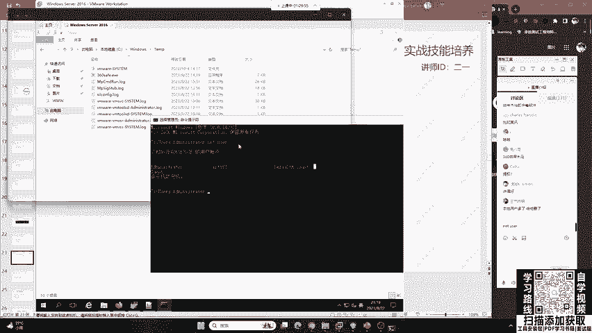

这时候就要用到咱们命令提示符的一个命令，叫做`net user`。

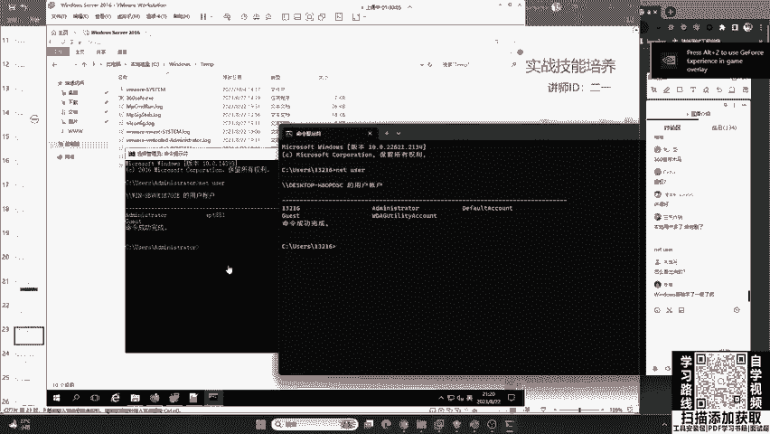

`net user`好的。我们来看一下这个`net user`，就是看到我们这个当前的操作系统有哪些用户。哎，大家来看一下。😊 这些你们觉得哪一个是后门用户啊？哪一个会是后门用户？很明显有一个奇怪的是吧？`IPT881`，这是个后门用户。我就不给大家留悬念了。那这个后门用户，我们一定要知道谁是后门用户。

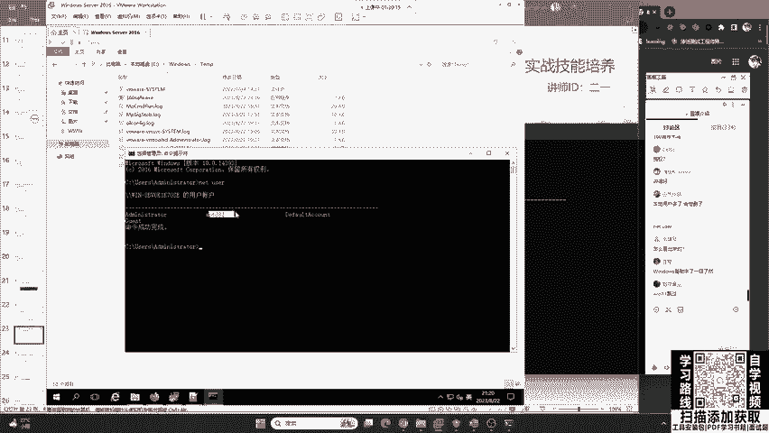

好吧，有的同学看到`DefaultAccount`，他会说这是后门用户。尤其是现在，咱们同学们很多人都去使用Windows 11操作系统。我们来看一下Win11的哈，Win11的，我这里就是Win11。来给大家一起看一下。怎么看出来的？怎么看出来的？我告诉你好吧，我告诉你怎么看出来的。

这里首先`Administrator`他是管理员用户，`DefaultAccount`是默认的服务用户，`Guest`是我们的来宾用户，还多出来一个你不知道的。你说他是什么用户啊？好的，来大家看一下二一老师的Windows 11操作系统，这是大家经常用的。我现在想问各位，你们来听课的很多人有安全基础。我想问一下大家，这个玩意儿它是后门用户吗？大家可以告诉我，他是不是？可以扣1，也可以扣2，1是“是”，2是“不是”。😊 很多同学都扣了2。都扣了2啊，为什么你扣2啊？因为你知道那是二宇老师在讲课的电脑。😊 那怎么可能会有这个后门呢？

好，首先我们就要知道他不是后门用户。其次，这个“贝塔”同学说“长得很规整”。那我作为一个黑客，我也可以去起一个很规整的用户名啊，是吧？我那里为什么要起`IT881`啊？就是为了给大家有一个凸显的概念。因为今天来听课的很多高中生，你们可能对系统不是😊特别的了解，我要有这种突出的思维去跟你讲。

好，其次我们再来看。这个`WDAGUtilityAccount`用户是什么呢？好，这我要告诉大家哈，就是咱们Windows 10在2020年做了一次更新。就是说如果这个系统启用了Windows Defender，他就会创建一个Windows Defender的防病毒用户。也就是说，这个用户它是属于Windows防火墙的用户，是自带的。你千万不要把它给删了，你删了你的电脑可能就要出一些问题了。不过你也删不掉它。

那这个我们已经知道了。`DefaultAccount`这个默认用户，`Administrator`管理员用户，`Guest`来宾用户。好，我再来问，这里我们看到了一个数字用户`13216`。哎，大家觉得它是后门用户吗？“小丫”同学，`Administrator`不能删了。大家觉得这个东西是不是后门用户啊？是扣1，不是扣2。我有没有可能就是说在上课之前，我创建的一个用户呢？有同学扣1，有同学扣2。这里告诉大家哈，有一个同学他非常厉害，他说到了“这就是我自己的用户”。因为现在我们正常的Windows 11家庭版，😊 你都是用自己的微软账户去登录，而不是用`Administrator`。只要你用的是正版的操作系统，我这里就是正版。所以说这是我自己的微软账户。

那这个微软账户又出现了一定的问题。就是大家小时候第一个注册的微软账户，它都需要邮箱。那所以说呢，你只能用QQ邮箱去注册。那这里呢，被一个同学发现了，这个就是老师QQ邮箱的前五位数字。😊 啊，就是我前五位数字。这你就会问，那为啥只有前五位数字呢？那后面几位去哪了呢？哦，这里又要告诉大家，在Windows 11的验证中，联网用户验证用户名只会保存前5位。这你又学到了是吧？这你又学到了。其实你针对于Win7、Win10跟Win11，它是不一样的。这是联网用户。😊

好的，“优朗”同学问到了。现在我们能够轻而易举的去看到，在这样一个Windows 7/2012中，我们被植入了`IPT881`，然后我可以把它删掉。以后伪装成5位数字，非常好。QQ用户你学到了，非常好，你有这种思维非常厉害。大家哈也要把这些应用起来。就是说你作为一个红队也好，蓝队也好，你的思维一定要发散起来，包括你们学渗透测试的也好。我就是告诉你们，不是说你这个技术、这个漏洞就这个样。😊 你能够发散的地方特别多，你不要把东西学死了。

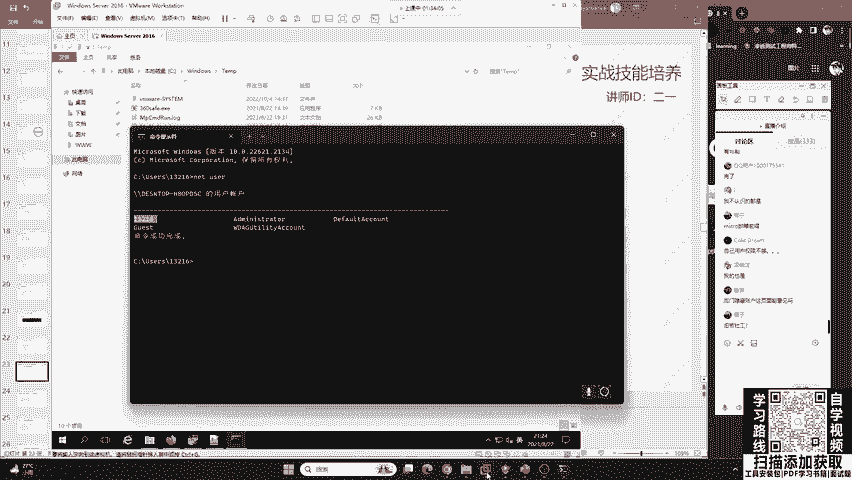

那在这个地方呢，我们可以把这个`IPT881`去删掉。`delete`这个命令啊，大家我说实话你也不要记，为啥呢？因为咱们只要用多了，包括这个基线排查、应急响应都会有相应的文档，那我们就可以去进行相应的复制粘贴就可以了。

## 隐藏用户排查

好，那现在这个问题来了。就是说我把它删掉之后，有同学就觉得哎万事俱备了。你看你留的后门用户被我删掉了吧。但是哈，现在的红队，他都会进行隐藏用户和显示用户的综合利用，就是他会迷惑你。比如说这里你感觉把`IPT881`删掉了，其实啊，他有一个同名的隐藏用户还在你的机器里面呢。当一般的蓝队（咱们的防御方）看到这个`IPT881`，他会觉得哎这个黑客太菜了。你看他这个用户都不会隐藏，直接写到这儿了，我直接给他删掉就行了。然后你就会把它删掉，结果别人留了一个隐藏用户。前面是让你觉得他比较菜。😊 你觉得哎他比较菜，就留了一个显示的用户，我给他删掉。结果呢，他还留了一个😊隐藏的在那。

隐藏的用户怎么去找呢？哎，这里要给大家讲一下啊，这个隐藏的用户，如果你使用咱们的`net user`，它查不出来的。“心理战”啊确实是这样，现在玩的都是社工，都是钓鱼，就是看你怎么上钩。😊 你绝对不要轻视这些东西。

这时候，这个隐藏用户在咱们的CMD中你就看不到了。在哪里呢？在咱们的这个“用户账户”。😊 控制面板 -> 用户账户 -> 管理其他账户，你就能看到。在这里啊，有一个`IPT881$`，后面加一个美元符号`$`，它是一个隐藏用户。这个隐藏用户呢，它主要的就是说，首先它的技术很远古，十年前就有这玩意儿了。你们那个XP年代啊，XP年代就有这玩意儿了。就是说我的黑客，我先给你明摆着给你打一套。对，红队也玩心理战，他给你打一套，就是说你觉得那么简单呀，你就这么垃圾嘛，是吧？他今天给你打一套，但是没想到啊，他这个笑里藏刀啊。😊 好，他还有一套东西藏着呢，你找不到他啊找不到他。这个管理员模式看不到啊，我这里就是管理员模式`net user`，就是咱们这个微软啊，就是比尔盖茨，它这个`net`东西是看不到它的。你为啥看不到呢？那你得去问微软呢，你不能问我是吧？毕竟这个微软它是一个不开源的操作系统，就是说他怎么去做就怎么去做啊。

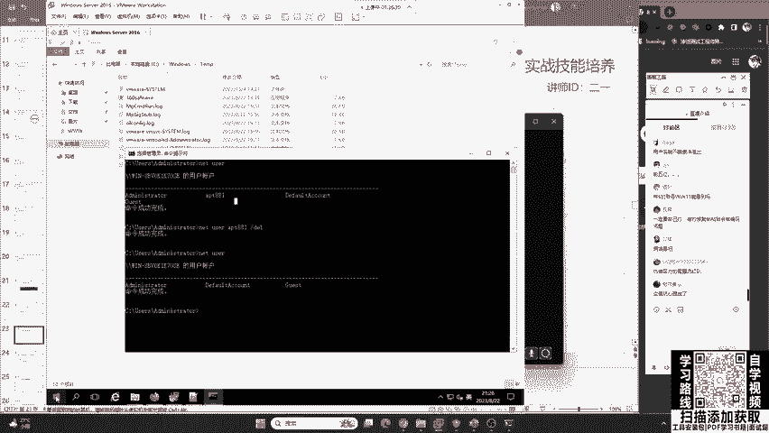

这个“昵称”同学说的对啊，CMD跟PowerShell中都看不到啊。“微软Tbug”，别人说正常功能不接收是吧？啊，微软Tbug，别人不接收你的bug啊。😊 不接受你的建议。

好的，那我们来看一下这里啊，我们就可以找到。第一个就是你要发散一个思维。我这里是给你讲这样一个思路。

## 排查思路总结与扩展

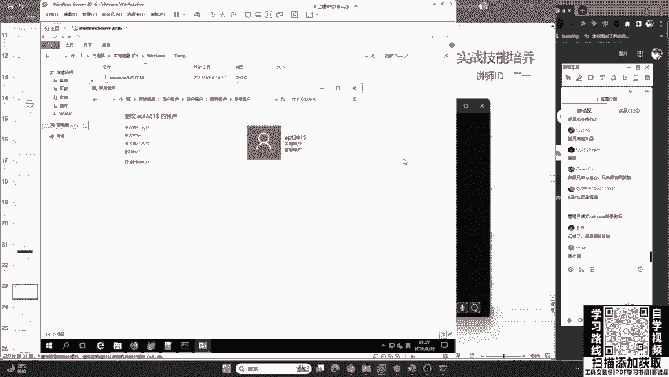

那有同学说我遇到Linux怎么办？那我会反问你，如果你遇到了一个Python网站怎么办？一样的套路。首先你先了解入侵行为，然后你再去做排查。你做排查，第一件事就是说我怎么去恢复它。他有没有做其他的事情，这是第二件事。第三件事再做修复：修复漏洞、配置防火墙，避免再次被入侵。这是我们要做的。

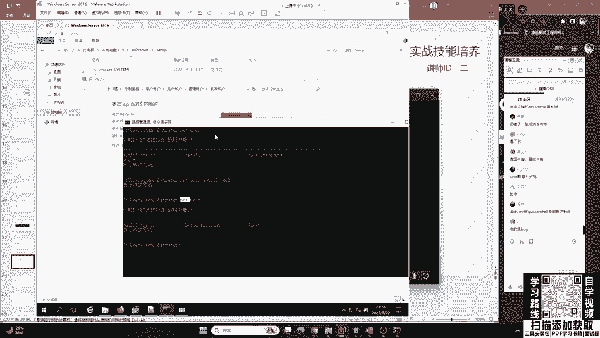

首先怎么去修复它？我来给大家讲一个哈，咱们就是说刚刚讲过安全服务工程师。比如说你以后找到工作了。😊 咱们是一个安全服务工程师，现在客户找你去做应急，去做排查。其实啊，我们只需要干什么？第一件事，问一下客户说，哎，你这个被攻击了，你有没有备份啊？有备份是吧？有备份那先恢复一下备份。那备份恢复一下。然后有备份恢复了之后，哎，给你装一个360，杀一遍，再推销一下我们公司的安全产品：“你看我们公司这个IPS还有蜜罐，还有EDR要不要？😊 买不买是吧？还有防火墙买不买？买的话，我们就给你是吧，咱们就跟销售对接。”😊 就是这样一个过程，其实不是特别难。但是这个流程你要把握好。

我讲的啊，只是一个最基础的。对，就是漏扫搞一下，咱们的软件备一下，就是杀毒软件装一下，其实就能解决很多客户的问题。

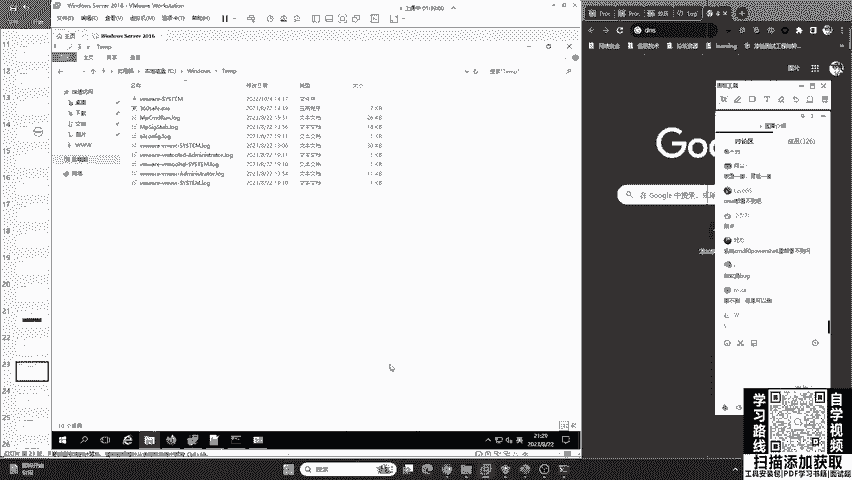

这“兔八哥”问到啊，这个蜜罐还能买？蜜罐当然能买了，很多公司都有蜜罐啊，比如说还有专门做蜜罐的“默安科技”是吧？蜜罐可是一个设备啊。😊 这个兔八哥可能不太理解啊，这个蜜罐啊，不是说一般情况下咱们企业建设中的蜜罐，它不是一个软件，它是一个设备，非常非常大。你一开机那个声音，那个噪音，震耳欲聋的那种声音。😊

“蜜罐是啥？”“百变罐”问，蜜罐是啥？我给你讲一下啊，蜜罐是咱们蓝队做的一件非常好玩的事情。就是说我这个网站啊都是漏洞，而且每一个漏洞啊都看起来很真实。😊 都很真实，就是想让红队去打我们，想让攻击者去打我们。那我们这个里面都是陷阱。“又普气”非常对，就像老鼠夹一样，你打我我就把你抓住，就是钓鱼，或者是反打。

“什么是销售岗？”销售岗就销售岗啊，卖安全产品的。😊

好，再做修复。最后一步呢，就是要修复漏洞，配置防火墙，避免再次入侵，这一点也尤为重要。

## 后续步骤：分析与溯源

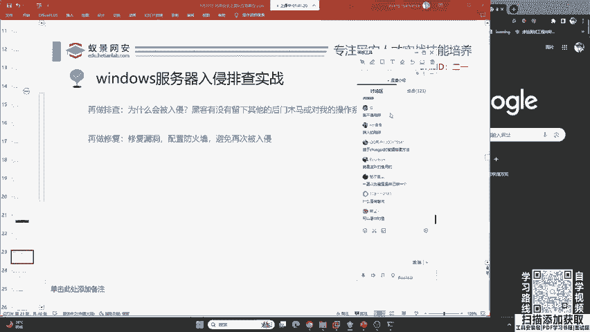

好，那现在大家想象一下，我们讲解的只是一个入侵排查的过程。那其实呢，它只是应急响应的一个阶段。那之后还要干什么？按照我们刚刚讲的一个模型，你会发现，在进行入侵排查之后，我们还需要进行分析，甚至是逆向，然后尝试溯源到攻击者。我要把你抓住，我要去反打你，我要把你的身份证号都报出来。这才是你作为一个高级蓝队的梦想是吧？我要去反打你，我不能说我现在被欺负了，我恢复了，那我还是一个被动的地位，我要占据主动的地位。

那这些怎么办呢？哎，这些东西它需要的基础就比较多。那我们因为今天主要是一个科普性的课程。那我们明天会给大家讲相应的分析溯源的流程技能。还有就是说在后天的时候，我们会讲如何去反制攻击。

---

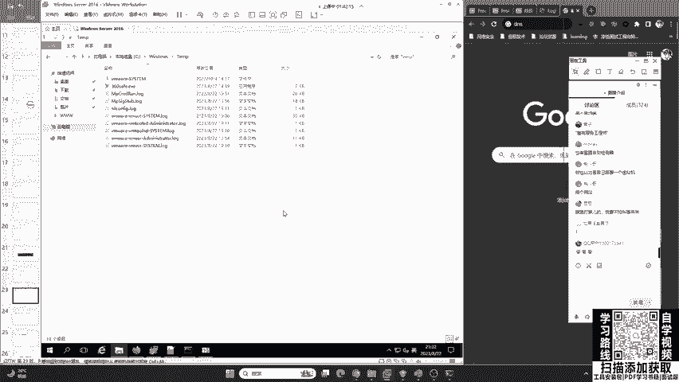

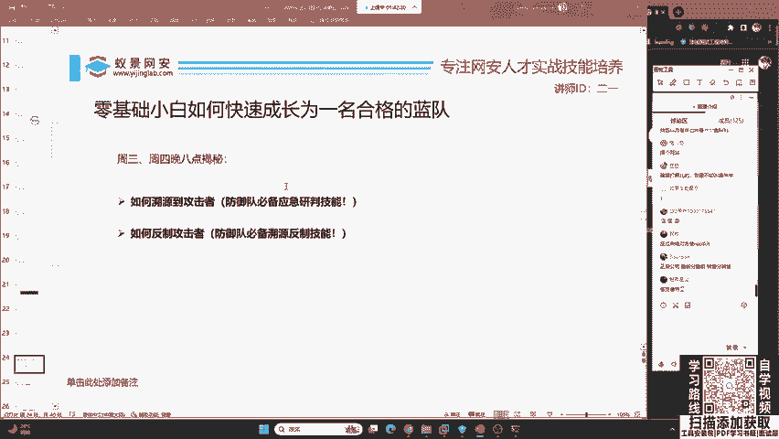

本节课中我们一起学习了蓝队应急响应中入侵排查的完整实战流程。我们从发现网站被篡改开始，逐步定位到恶意代码文件（`login.php`中的跳转脚本和`webshell.php`），并学习了如何清除它们。接着，我们深入系统层面，探讨了在临时目录（`C:\Windows\Temp`）中查找可疑可执行文件的方法，以及如何使用`net user`命令检查并发现黑客添加的后门用户（包括显式的`IPT881`和隐藏的`IPT881$`）。整个过程强调了排查的逻辑顺序：先恢复业务，再深入排查残留后门，最后思考修复与加固。同时，我们也了解了不同杀毒软件的特点和选择的重要性。希望这节课能帮助你建立起面对真实安全事件时的基本排查框架和自信。