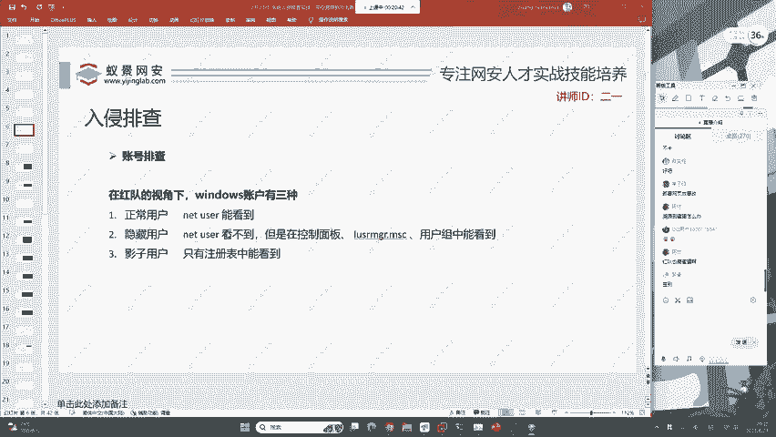
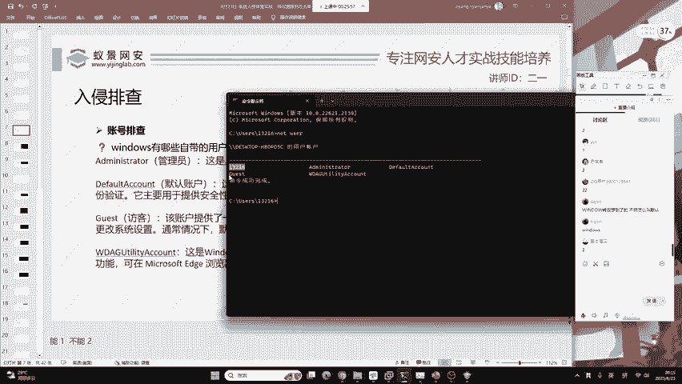
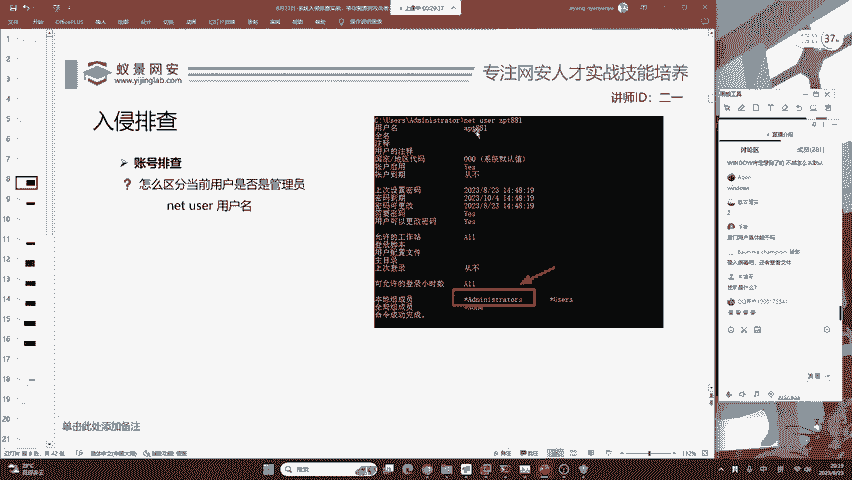
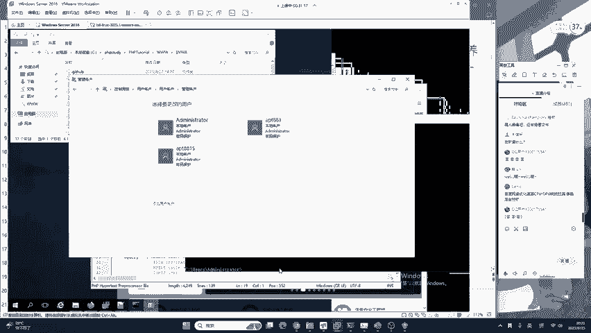
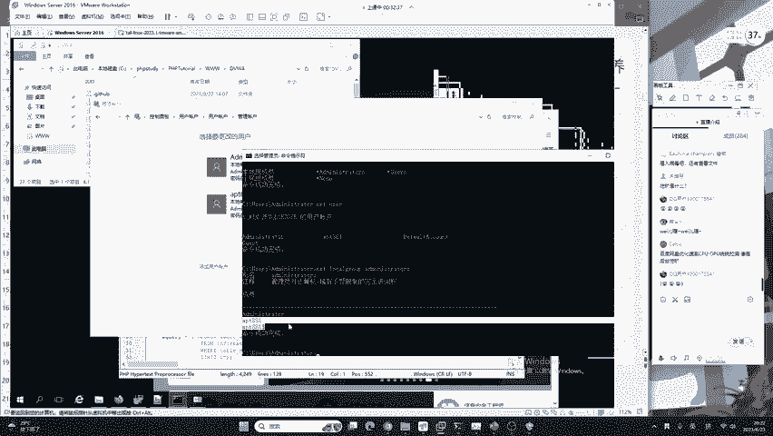
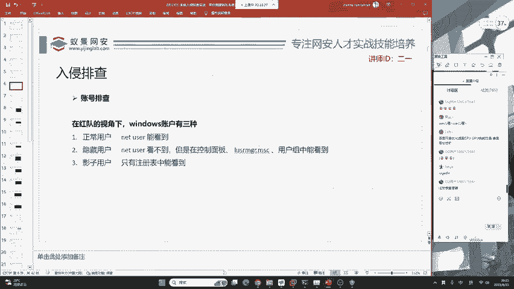
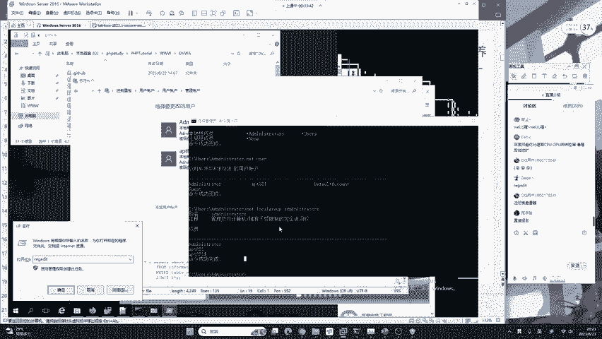
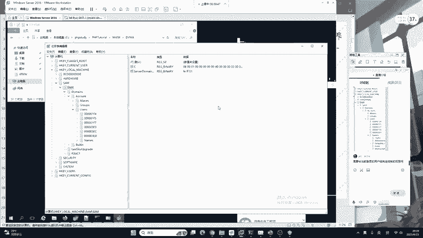
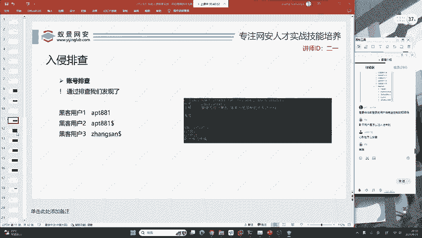

# 护网行动红蓝攻防教程：P11：蓝队应急响应-10.账号排查 🔍

在本节课中，我们将学习蓝队应急响应中的账号排查。账号排查是发现攻击者是否在系统中创建了后门账户的关键步骤。我们将从攻击者（红队）的视角出发，了解他们可能创建的账户类型，并学习如何系统地发现这些恶意账户。

上一节我们介绍了应急响应的基本流程，本节中我们来看看如何针对用户账户进行排查。

---



## 排查规范与视角

排查必须按照相应规范进行，步骤缺一不可。你可以拓展方法，但必须完成基础步骤。现在，我们需要站在攻击者（红队）的视角来思考：如果我攻击了一台服务器，我会做什么？

首先进行的入侵排查就是账号排查。

> 关于蜜罐的说明：蜜罐是蓝队用于诱捕攻击者的工具。溯源是针对攻击者，而非蜜罐本身。红队也可能部署蜜罐进行反制，因此需要学习反蜜罐技术，包括识别蜜罐特征、了解其原理，甚至自己编写蜜罐。

---

## Windows服务器账户类型

在红队视角下，Windows服务器的账户主要分为三种类型：**正常用户**、**隐藏用户**和**影子用户**。昨天我们介绍了正常用户和隐藏用户，今天我们将重点学习如何排查影子用户。

---

## 正常用户排查

正常用户是可以通过系统命令直接查看的用户。

我们可以打开任意Windows操作系统（如Windows 10/11或Windows Server 2016）进行练习。这些技术也能帮助你识别电脑中可能存在的恶意软件。

以下是排查正常用户的步骤：

1.  **打开命令提示符（CMD）**：CMD是Command的简称，即命令提示符。
2.  **使用`net user`命令**：该命令用于查看当前主机上的所有用户。



```cmd
net user
```

执行命令后，你会看到类似以下的用户列表：
*   Administrator
*   DefaultAccount
*   Guest
*   WDAGUtilityAccount
*   （以及其他用户，如`IPT881`）

**如何判断哪些是可疑的后门用户？**

首先，需要了解Windows系统的默认用户。在现代Windows系统（如Win10/11）中，默认存在以下四个用户：
1.  **Administrator**：管理员用户。
2.  **DefaultAccount**：默认用户。
3.  **Guest**：访客用户。
4.  **WDAGUtilityAccount**：基于Windows Defender防火墙创建的用户（Windows 10之后出现）。

**关键点**：系统默认账户**无法被真正删除**。如果强行删除，可能导致系统服务异常。因此，攻击者通常不会删除这些账户，而是创建新的账户。

使用排除法：在`net user`列出的用户中，排除上述四个默认账户。剩余的用户（例如示例中的`IPT881`）就可能是攻击者创建的后门用户。在服务器版Windows中，通常没有首次开机时由用户自己创建的账户，因此可疑度更高。

**进一步确认用户权限**：攻击者通常会将后门账户提升为管理员权限。不能仅凭用户名判断是否为管理员，而应查看用户所属的组。

使用以下命令查看指定用户的详细信息，特别是其所属的组：

```cmd
net user [用户名]
```



例如：
```cmd
net user IPT881
```

在输出信息中，查找“本地组成员”一项。如果其中包含 **`Administrators`**，则该用户属于管理员组，即拥有管理员权限。

> 后门用户拥有管理员权限后，可以控制你的电脑进行任何操作，例如挖矿、破坏系统、监控行为等。

在确定某个用户（如`IPT881`）为后门用户后，第一件事是**保留证据**，先不要立即进行操作。

---



## 隐藏用户排查

隐藏用户是指使用`net user`命令**无法直接看到**的用户。攻击者常创建此类用户以规避基础排查。

以下是发现隐藏用户的两种方法：



**方法一：通过控制面板**
1.  打开“控制面板”。
2.  点击“用户账户”。
3.  点击“管理其他账户”。
4.  在账户列表中，你可能会发现一些在CMD中看不到的用户。攻击者创建的隐藏用户通常以**美元符号（$）** 结尾，例如`IPT881$`。



**方法二：查看管理员组成员**
攻击者创建的隐藏账户为了维持权限，通常也会加入管理员组。因此，我们可以直接查看“Administrators”组中有哪些成员。

使用以下命令：



```cmd
net localgroup Administrators
```

这条命令会列出所有属于管理员组的用户。如果发现有不属于默认管理员的陌生用户（如`IPT881$`），那很可能就是隐藏的后门账户。

通过以上方法，我们就能发现普通后门账户和隐藏后门账户。

---

## 影子用户排查

影子用户是比隐藏用户更隐蔽的存在，在**控制面板**和**CMD命令行**中都**看不到**。这类用户通常是攻击者利用权限维持技术，直接操作系统底层（如注册表）创建的。

排查影子用户需要接触一个新的概念：**注册表（Registry）**。注册表是Windows系统存储配置信息的数据库。

以下是排查影子用户的步骤：

1.  **打开注册表编辑器**：按下 `Win + R` 键，输入 `regedit`，然后回车。
    

2.  **导航到用户账户存储路径**：在注册表编辑器中，依次展开以下路径：
    `HKEY_LOCAL_MACHINE\SAM\SAM\Domains\Account\Users\Names`
    

    > **注意**：默认情况下，当前登录的管理员账户可能没有`SAM`项的读取权限。如果`SAM`项下没有内容，需要先添加权限。
    > **添加权限方法**：右键点击`SAM`项 -> 选择“权限” -> 选中`Administrators`组 -> 勾选“完全控制” -> 点击“确定”。然后按`F5`刷新即可看到内容。

3.  **对比分析**：在`Names`项下，你会看到系统所有的用户名称（包括其对应的唯一标识符）。对比之前在CMD和控制面板中看到的用户列表。如果在这里发现了陌生的用户（例如`法外狂徒张三$`），而这个用户在前两种方法中均未出现，那么它就是一个**影子用户**。

> **原理说明**：操作系统万物基于文件，所有账户信息最终都会以某种形式写入磁盘。因此，通过检查注册表这个核心数据库，可以找到最底层的账户记录。影子用户基本是恶意账户隐藏的极限。

---

## 总结



在本节课中，我们一起学习了蓝队进行账号排查的系统方法。我们站在攻击者的角度，了解了三种可能的恶意账户类型：

1.  **正常后门用户**：使用 `net user` 命令可直接查看，但需通过排除默认用户和检查用户组（`net user [用户名]`）来识别。
2.  **隐藏用户**：在CMD中不可见，可通过**控制面板**或直接查看管理员组（`net localgroup Administrators`）来发现，其名称常以`$`结尾。
3.  **影子用户**：在控制面板和CMD中均不可见，必须通过检查**注册表**路径 `HKEY_LOCAL_MACHINE\SAM\SAM\Domains\Account\Users\Names` 来发现。



按照此规范流程，我们可以系统地发现攻击者可能植入的各类后门账户，为后续的清理和加固工作打下坚实基础。当前，许多安全软件（如360、火绒）也能检测影子账户，因此攻击者会不断研究新的绕过技术，攻防对抗也在持续演进。