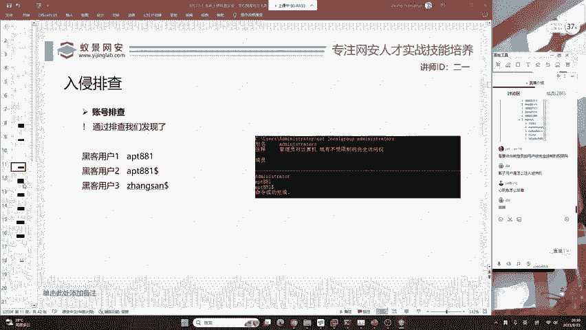
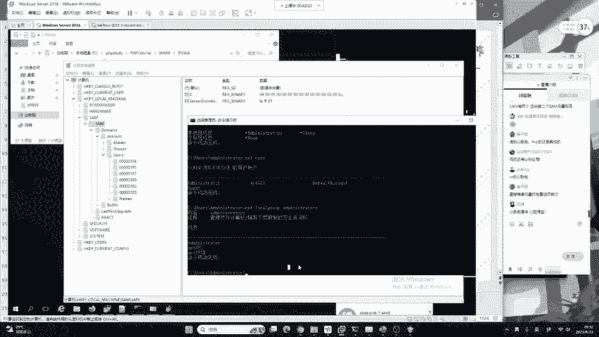
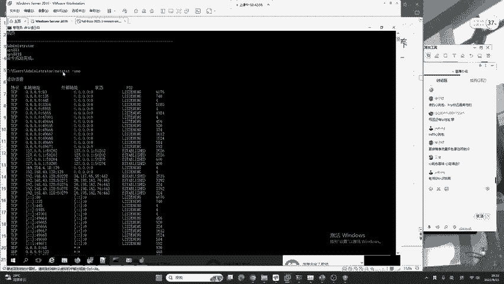
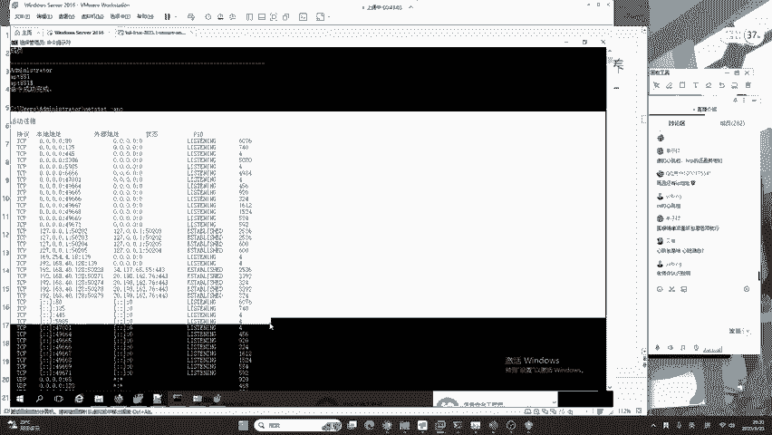
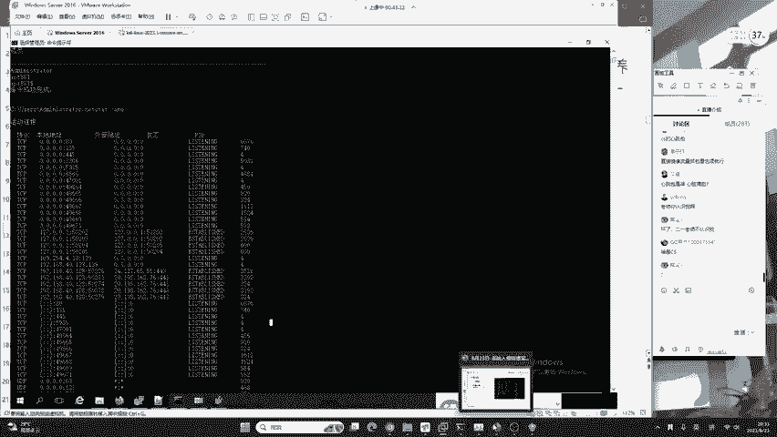
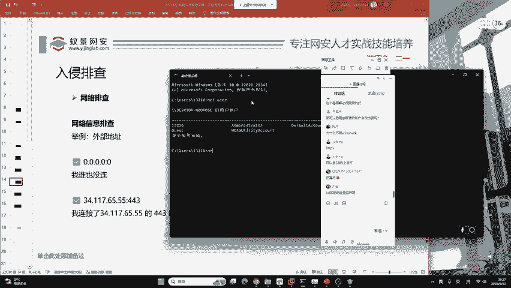
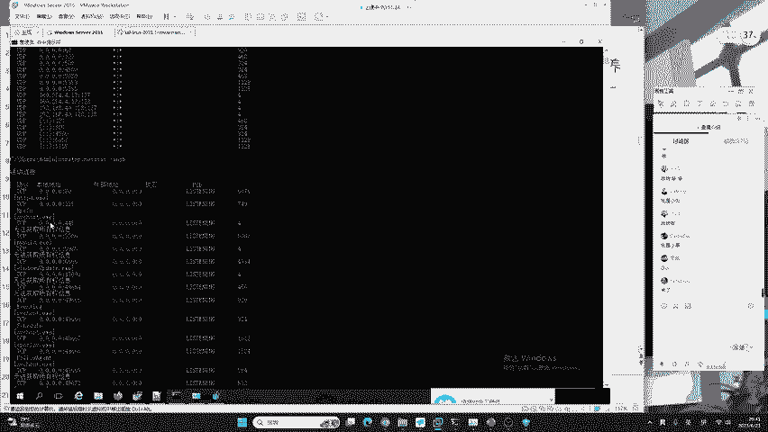
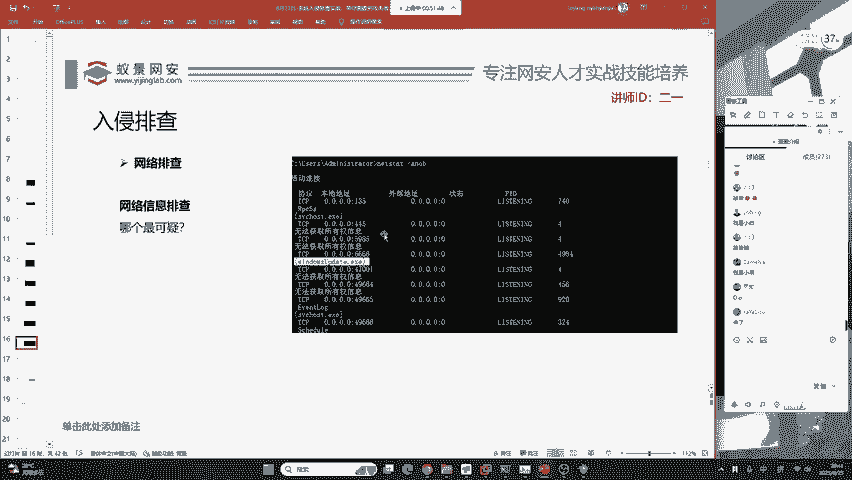
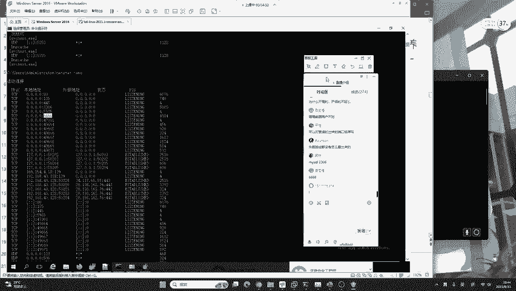
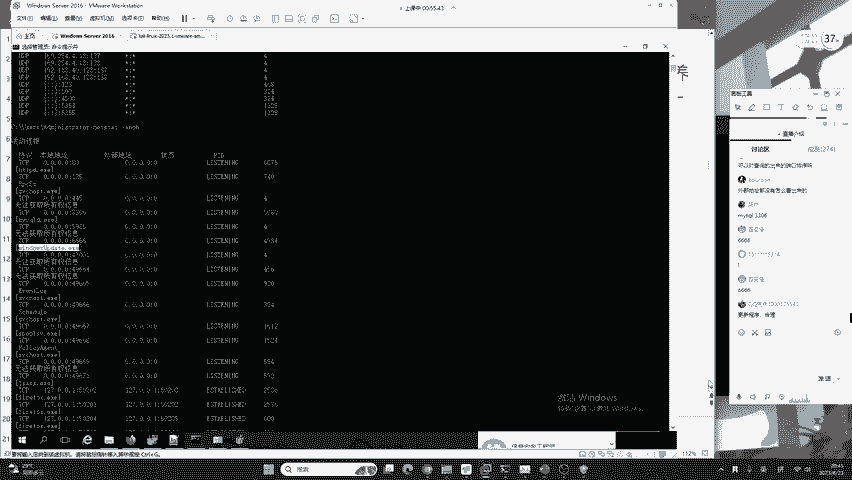

# 护网行动红蓝攻防教程：P12：蓝队应急响应-11.网络排查 🔍



在本节课中，我们将要学习蓝队应急响应中至关重要的一环：网络排查。我们将了解如何通过分析系统的网络连接状态，来发现潜在的后门木马或恶意活动。网络是攻击的必经之路，因此掌握网络排查技能是防御的关键。

## 网络排查的重要性



上一节我们介绍了文件与进程排查，本节中我们来看看网络排查。任何后门木马或远控工具都有一个共同特点：必须进行网络通信。无论攻击者使用了多么高级的免杀技术，如果目标系统无法联网，攻击就无法持续。因此，检查系统的网络连接状态是发现异常活动的有效手段。



## 核心命令：`netstat -ano`



网络排查的核心是使用 `netstat -ano` 命令。这条命令可以显示系统当前所有的网络连接、监听端口以及对应的进程ID。



**命令格式**：
```bash
netstat -ano
```

执行该命令后，你会看到一个列表，其中包含“本地地址”和“外部地址”等信息。理解这两列的含义是分析的基础。

## 理解连接信息：本地地址与外部地址

以下是 `netstat` 命令输出中需要重点关注的两个部分：

*   **本地地址**：表示“我自己开了什么端口，谁能连我”。它描述了本机正在监听的端口以及允许连接的来源。
*   **外部地址**：表示“谁在连接我，或者我正在连接谁”。它描述了当前活跃的网络连接的对端。

我们通过几个例子来具体理解：

*   **例子1：开放给所有人的端口**
    *   `本地地址: 0.0.0.0:135`
    *   这表示本机开放了135端口。`0.0.0.0` 代表监听所有网络接口，意味着任何IP地址的客户端都可以尝试连接此端口。

*   **例子2：仅限本机访问的端口**
    *   `本地地址: 127.0.0.1:80`
    *   这表示本机开放了80端口，但只允许本地回环地址 (`127.0.0.1`) 连接。外部网络无法直接访问此端口，安全性较高。



*   **例子3：发起的对外连接**
    *   `外部地址: 34.117.65.55:443`
    *   这表示本机正在主动连接IP地址 `34.117.65.55` 的443端口（通常用于HTTPS网站）。这可能是正常的浏览器访问行为。

*   **例子4：无连接状态**
    *   `外部地址: 0.0.0.0:0`
    *   这通常表示该监听端口目前没有建立任何连接。

## 进阶排查：`netstat -ano` 与 `-b` 参数结合

仅仅知道端口和连接还不够，我们需要知道是哪个程序发起了这些连接。这时就需要使用 `-b` 参数。

**命令格式**：
```bash
netstat -ano -b
```
**注意**：执行带有 `-b` 参数的命令通常需要管理员权限。



`-b` 参数可以显示建立每个连接或监听端口所关联的可执行程序名称。这能帮助我们直接将可疑的网络活动与特定进程关联起来。



## 如何识别可疑连接

在了解了基础知识后，我们可以开始从 `netstat` 的输出中寻找可疑迹象。以下是一些常见的可疑特征：

1.  **高位端口监听**：许多木马喜欢使用1024以上的高位端口（如40000、50000等）进行监听，以规避常规检查。
2.  **陌生进程的网络活动**：结合 `-b` 参数，查看是否有名称可疑、仿冒系统进程（如 `windows update.exe` 但路径异常）的程序在发起网络连接。
3.  **异常的外部连接**：连接到已知的恶意IP地址、矿池地址或非常用国家的IP。
4.  **大量TIME_WAIT连接**：可能存在端口扫描或爆破行为。
5.  **心跳包连接**：某些远控木马会定期（如每隔数分钟）与控制端建立短暂连接（心跳包），然后断开。这需要持续监控才能发现。

**排查流程建议**：
1.  首先，运行 `netstat -ano` 查看所有连接，重点关注 `LISTENING`（监听）状态的端口。
2.  对可疑的监听端口（特别是高位端口），使用 `netstat -ano -b` 查看关联进程。
3.  将可疑进程与之前“进程排查”章节的知识结合，检查其路径、签名、父进程等。
4.  对于已建立的连接，检查外部IP地址是否属于可信范围。

## 常见问题澄清



在排查过程中，你可能会遇到以下概念或问题：

*   **IPV6地址**：输出中可能包含 `[::]` 或 `[::1]` 等格式的地址，这是IPV6地址。目前大多数环境仍以IPV4为主，分析时可暂时聚焦于IPV4部分。
*   **远控木马 vs. 黑账户**：这是两种不同的攻击方式。“黑账户”指攻击者窃取或创建了系统账户权限。“远控木马”则是在目标系统上安装了一个恶意软件，实现远程控制。
*   **文件不落地的木马**：这类木马只存在于内存中。排查方法包括内存取证分析，或针对特定环境（如Java Web的JVM）分析内存中的类文件。
*   **为什么不直接用Wireshark**：Wireshark是强大的流量分析工具，主要用于深度“研判”和分析数据包内容。而 `netstat` 是系统自带的、用于快速“排查”当前连接状态的轻量级工具，两者场景不同。



本节课中我们一起学习了蓝队应急响应中的网络排查技能。我们掌握了使用 `netstat -ano` 命令查看网络连接状态，理解了“本地地址”和“外部地址”的含义，并学会了通过 `-b` 参数关联进程。同时，我们也了解了如何从端**口号、进程名、连接行为**等多个维度识别可疑的网络活动。记住，网络排查必须与进程、文件排查相结合，才能形成完整的入侵分析链条。