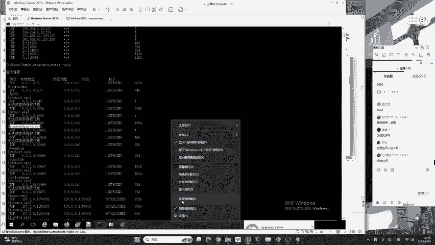
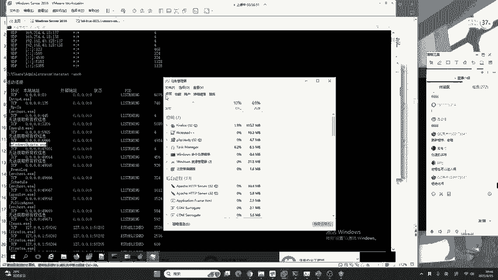
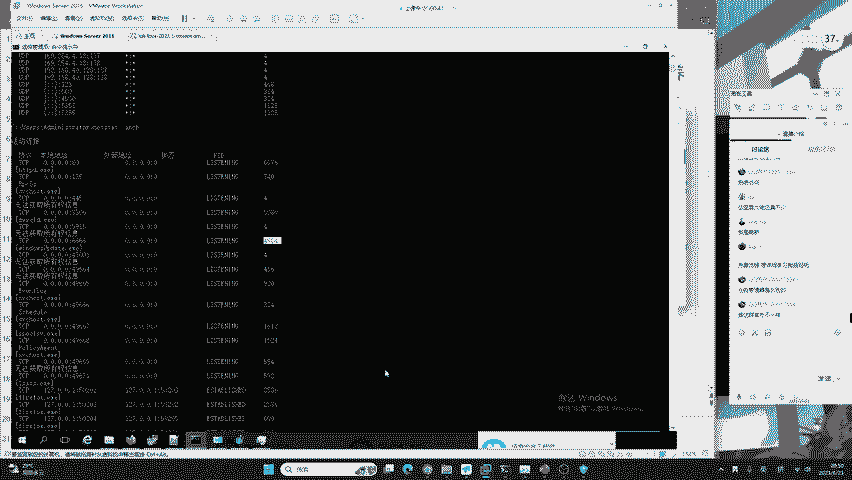

# 护网行动红蓝攻防教程：P13：蓝队应急响应-12.进程排查 🔍

在本节课中，我们将学习蓝队应急响应中一个至关重要的环节：进程排查。我们将了解如何利用系统自带的任务管理器，通过分析进程信息来识别和定位可疑的后门或病毒程序。

---

## 进程排查的核心工具

上一节我们介绍了网络连接排查，本节中我们来看看如何结合进程信息进行深入分析。进程排查最直接有效的工具是系统自带的任务管理器。然而，任务管理器的功能远不止查看运行程序那么简单。

进程本身也可能被注入恶意代码。通过排查线程、句柄等方法，我们可以发现这些隐藏的威胁。排查的深度和广度取决于蓝队工程师的技术水平，这需要时间的积累和磨练。





对于初学者而言，最重要的是掌握基础方法，一步一个脚印地学习，不要被过于复杂的概念带偏方向。

---

## Windows 10/Server 任务管理器详解

以Windows 7/10/Server 2016等系统的任务管理器为例，其界面主要分为以下几个部分：**进程**、**性能**、**用户**、**详细信息**以及**服务**。要进行有效的进程排查，我们需要点击进入“详细信息”选项卡。


在“详细信息”中，一个关键信息是 **PID**，即进程的唯一标识符。有些同学可能发现自己的任务管理器默认不显示PID列。

以下是显示PID列的操作步骤：
1.  在“详细信息”选项卡的列标题区域（如“名称”、“状态”所在行）点击右键。
2.  在弹出的菜单中，选择“选择列”。
3.  在打开的窗口中，找到并勾选“PID (进程标识符)”。
4.  点击“确定”，PID列便会显示出来。

假设我们通过`netstat -ano`命令发现6666端口被一个可疑进程监听，其PID为4984。

```
# 示例命令输出片段
协议    本地地址          外部地址        状态           PID
TCP     0.0.0.0:6666     0.0.0.0:0       LISTENING     4984
```

在任务管理器的“详细信息”中，我们找到PID为4984的进程，其映像名称显示为`windows update.exe`。仅凭名称无法判断其是否为恶意程序。

此时，我们需要右键点击该进程，选择“打开文件所在的位置”。如果该`windows update.exe`文件位于非常规目录，例如`C:\Windows\Temp\`，那么其是后门病毒木马程序的可能性就极高。

这时，我们可以将该文件提交给杀毒软件进行扫描，以最终确认。这个案例揭示了一个重要的排查思维：**不能孤立地看待网络连接或进程**，必须将网络监听、进程信息、文件路径等多维度信息综合起来分析，才能有效完成入侵排查。

---

## 关于进程隐藏的思考

很多同学会问：如果恶意进程做了隐藏怎么办？如果恶意代码没有文件落地（无文件攻击）怎么办？



我们需要理解操作系统的原理：任何希望在内存中执行的命令或代码，最终都必须以**进程**或**线程**的形式运行。不存在其他形式。因此，通过深入分析进程及其资源（如线程、句柄、内存区域），理论上总有可能发现异常。掌握这个底层逻辑，有助于我们建立排查的信心。

---

## Windows 11 任务管理器的新特性

现在我们继续来看，攻击者的手段可能非常复杂。接下来，我们了解一下新版Windows 11任务管理器带来的变化，它让排查工作更加便捷。

Windows 11更新了任务管理器的UI界面和功能。新的任务管理器在“进程”选项卡中，默认以分组树状结构显示进程及其**子进程**。这种视图使得分析父子进程关系、定位注入到正常进程中的恶意线程或模块变得更加直观。


此外，在Windows 11的新版任务管理器中，**PID列默认是开启的**，无需手动设置。我们依然可以运用相同的方法：结合网络连接查到的PID，在任务管理器中定位进程，再检查其文件路径和属性，从而发现后门病毒。

对于使用Windows 10的用户，如果没有特殊需求，不一定需要升级到Windows 11。因为两者在系统底层、安全防御机制以及对内存攻击的检测能力上基本一致，主要区别在于UI界面和动画效果的优化。

---

## 补充说明与总结

**关于Mac电脑学习**：使用Mac电脑（尤其是M系列芯片）的同学，可以通过**Parallels Desktop (PD)** 虚拟机来安装和运行Windows系统，以进行本课程的学习和练习。

本节课中我们一起学习了蓝队应急响应中的进程排查技能。我们掌握了：
1.  使用任务管理器查看和分析进程信息，特别是PID。
2.  通过“打开文件所在位置”检查进程的合法性。
3.  建立了**综合网络、进程、文件路径进行关联分析**的核心排查思维。
4.  了解了Windows 11任务管理器的新特性。
5.  理解了进程是代码执行的最终载体，为应对高级隐藏技术奠定了理论基础。

进程排查是应急响应中不可或缺的一环，结合之前学习的网络排查，你已经能够应对许多常见的入侵场景。请多加练习，巩固这些基础而重要的技能。