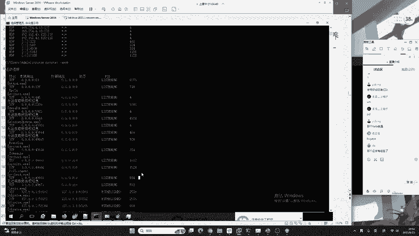
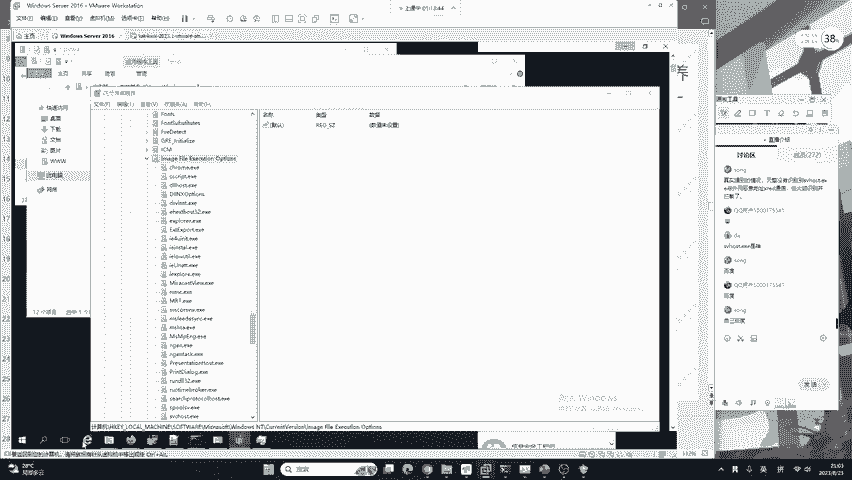
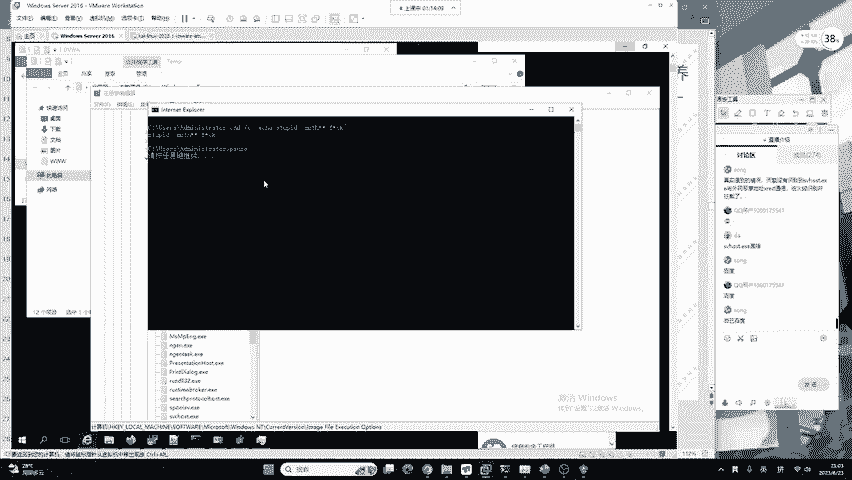
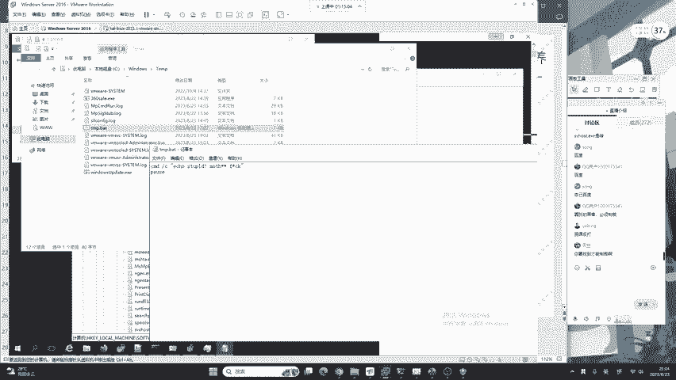
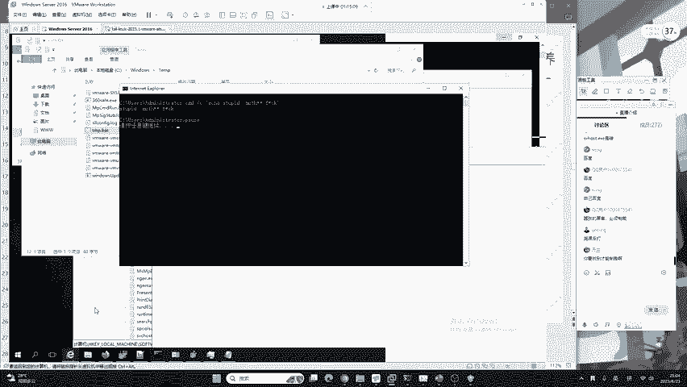
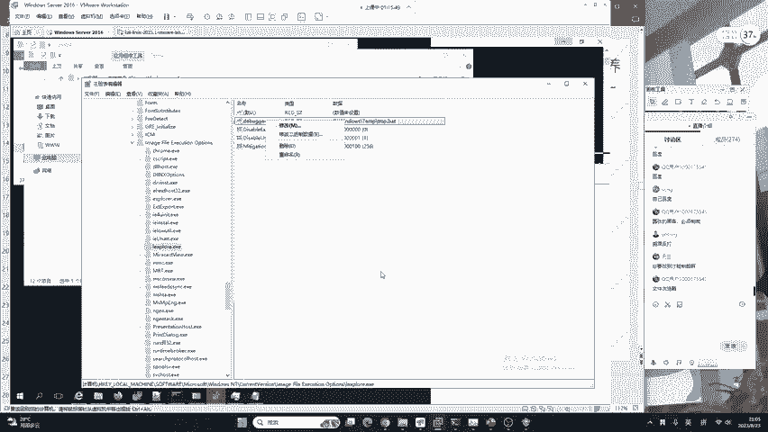

# 蓝队应急响应：P14：注册表排查 🔍

## 概述
在本节课中，我们将学习Windows注册表的基础知识及其在蓝队应急响应中的关键作用。注册表是Windows系统的核心配置数据库，红队攻击者常通过修改注册表来隐藏后门、设置自启动或劫持系统程序。掌握注册表的排查方法，是蓝队分析人员识别和清除入侵痕迹的必备技能。

---

## 注册表简介
上一节我们介绍了通过注册表排查恶意用户（影子用户）。本节中，我们正式讲解注册表及其排查方法。

注册表是Windows操作系统的设置数据库。系统及应用程序的配置信息大多存储于此。我们可以通过修改注册表来调整系统行为。

### 如何打开注册表编辑器
打开注册表编辑器的方法是：按下键盘上的 **`Windows + R`** 组合键，打开“运行”窗口。在运行窗口中输入 **`regedit`** 并点击“确定”。

**`regedit`** 是英文 **Register Editor**（注册表编辑器）的缩写。

---

## 注册表关键排查项
在应急响应中，我们需要重点检查注册表的某些特定路径。以下是红队攻击者最常利用的几个位置。

### 1. 开机自启动项
攻击者喜欢通过注册表设置程序在开机时自动运行，以实现持久化控制。

开机自启动项主要存在于以下三个注册表路径中：

*   **`HKEY_CURRENT_USER\Software\Microsoft\Windows\CurrentVersion\Run`**
*   **`HKEY_LOCAL_MACHINE\Software\Microsoft\Windows\CurrentVersion\Run`**
*   **`HKEY_LOCAL_MACHINE\Software\Microsoft\Windows\CurrentVersion\RunOnce`**

**排查方法**：
以 `HKEY_CURRENT_USER` 下的路径为例：
1.  打开注册表编辑器。
2.  依次展开目录：`HKEY_CURRENT_USER` -> `Software` -> `Microsoft` -> `Windows` -> `CurrentVersion` -> `Run`。
3.  右侧窗格会显示所有设置为开机启动的程序及其路径。

**示例**：
你可能会发现一个名为 `Hello` 的项，其数据值为 `C:\Windows\Temp\360CF.exe`。这是一个可疑项，因为红队常将后门程序放在 `C:\Windows\Temp` 目录（该目录权限宽松，便于读写）。

**处理**：确认可疑后，可以右键点击该项并选择“删除”。但需注意，某些恶意软件或广告程序会反复检测并重新添加此项目。

---

### 2. 镜像劫持
镜像劫持是一种古老但仍有出现的攻击技术。攻击者通过修改注册表，将正常程序的启动路径指向恶意程序。

**劫持原理**：
当用户试图运行某个程序（如 `wechat.exe`）时，系统会根据注册表设置，实际去执行另一个恶意程序（如木马）。

**劫持位置**：
镜像劫持的注册表路径位于：
**`HKEY_LOCAL_MACHINE\SOFTWARE\Microsoft\Windows NT\CurrentVersion\Image File Execution Options`**

**排查方法**：
1.  在注册表编辑器中导航至上述路径。
2.  在 `Image File Execution Options` 文件夹下，你会看到以程序名命名的子项（例如 `iexplore.exe`）。
3.  点击可疑的子项，查看右侧是否存在名为 **`Debugger`** 的字符串值。
4.  `Debugger` 的值就是系统实际会执行的恶意程序路径。

**示例**：
在 `Image File Execution Options` 下发现 `iexplore.exe` 项，其 `Debugger` 值为 `C:\Windows\Temp\tmp.bat`。这意味着当用户打开IE浏览器时，系统会转而执行 `tmp.bat` 这个批处理文件（其中可能包含恶意命令或辱骂性输出）。

**处理**：删除整个可疑的子项（如 `iexplore.exe`）即可清除劫持。

---

## 总结
本节课我们一起学习了Windows注册表在蓝队应急响应中的两项关键排查内容：
1.  **开机自启动项排查**：检查 `Run` 和 `RunOnce` 路径，识别攻击者建立的持久化后门。
2.  **镜像劫持排查**：检查 `Image File Execution Options` 路径，发现被篡改的系统或应用程序启动项。

需要强调的是，安全是一个动态对抗的过程。没有一种技术或工具能提供100%的防护。红队会不断寻找新的攻击面，蓝队则需要持续学习、深入排查，从系统底层（如注册表）发现蛛丝马迹，才能有效应对威胁，提升整体安全防御水平。掌握这些基础但核心的手动排查技能，是每一位蓝队分析人员能力扎实的体现。