# 护网行动红蓝攻防教程：P15：蓝队应急响应-14.系统相关信息排查 🔍

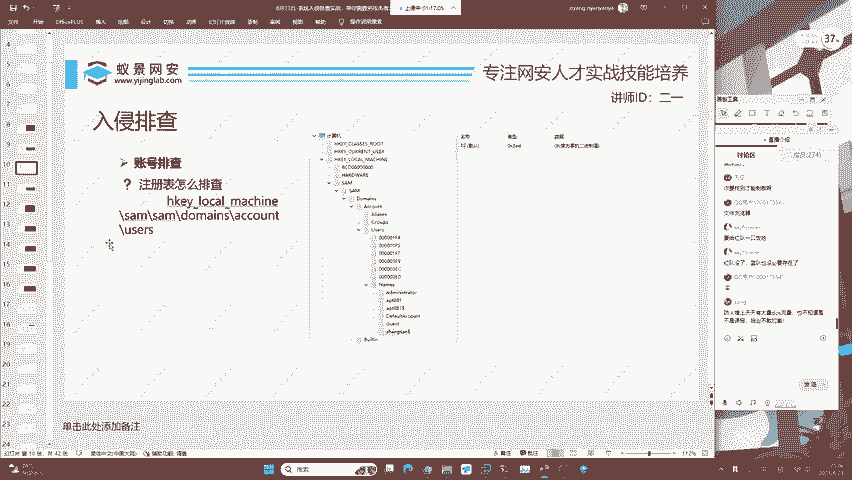

在本节课中，我们将学习蓝队应急响应中关于系统相关信息的排查。我们将重点关注计划任务、系统服务以及可疑文件这三个关键点，掌握如何通过这些信息发现潜在的安全威胁。

上一节我们介绍了注册表的排查方法，本节中我们来看看系统层面的其他关键信息。

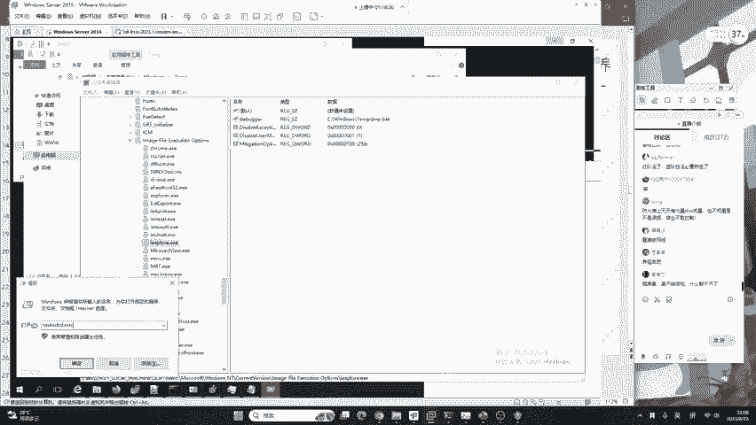

## 计划任务排查 ⏰

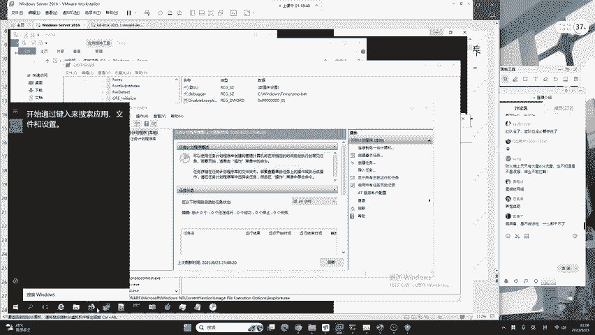

计划任务可以理解为操作系统的“闹钟”，它允许系统在特定时间自动执行预设的任务。无论是Windows还是Linux系统，都存在计划任务功能。攻击者常利用此功能设置后门或恶意程序在特定时间运行。

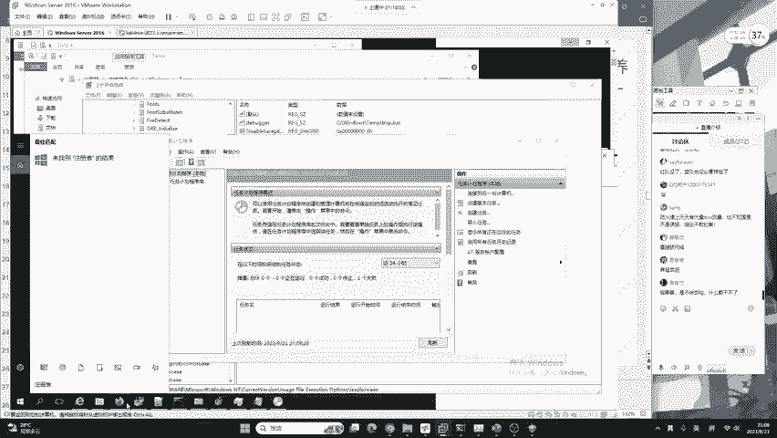

以下是打开和排查Windows计划任务的方法：

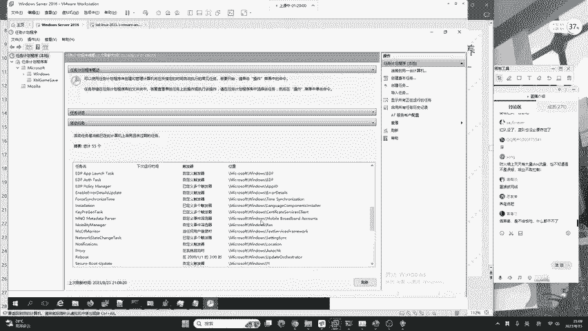

*   **打开方式**：按下键盘的 `Windows + R` 键，在弹出的“运行”对话框中输入 `taskschd.msc` 并回车。
*   **备用方法**：在系统搜索框中直接输入“计划任务”也可打开。
*   **排查重点**：在“任务计划程序库”中，仔细检查所有任务。重点关注那些描述可疑、由非系统用户创建、或在非工作时间（如凌晨）触发的任务。攻击者常伪装成系统更新（如“Security Update”）来隐藏恶意任务。

例如，一个恶意的计划任务可能被设置为每天凌晨3点运行后门程序。在真实的服务器入侵事件中，计划任务也常被用于植入挖矿程序，在管理员休息时启动以隐藏自身。

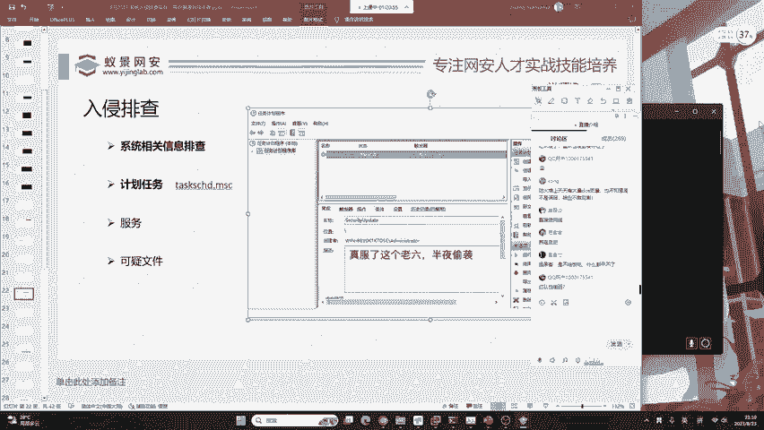

## 系统服务排查 ⚙️

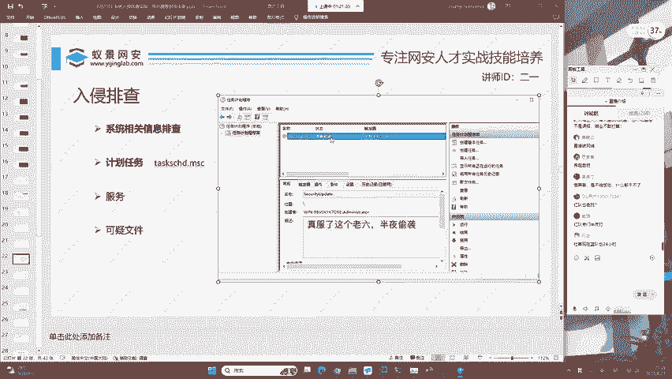

Windows服务是在后台运行的程序，通常随系统启动。攻击者会创建恶意服务，使其具备持久化能力，即使系统重启也能自动运行。

以下是打开和排查Windows系统服务的方法：

*   **打开方式**：按下 `Windows + R` 键，输入 `services.msc` 并回车。
*   **排查重点**：在服务列表中，检查每个服务的“名称”、“描述”、“可执行文件的路径”以及“启动类型”。需要警惕那些描述信息空白或可疑、文件路径指向非常规目录（如临时文件夹 `C:\Windows\Temp\`）、或启动类型被设置为“自动”的未知服务。

通过右键点击服务选择“属性”，可以查看其具体配置，包括执行的程序路径，这是判断服务是否恶意的关键依据。

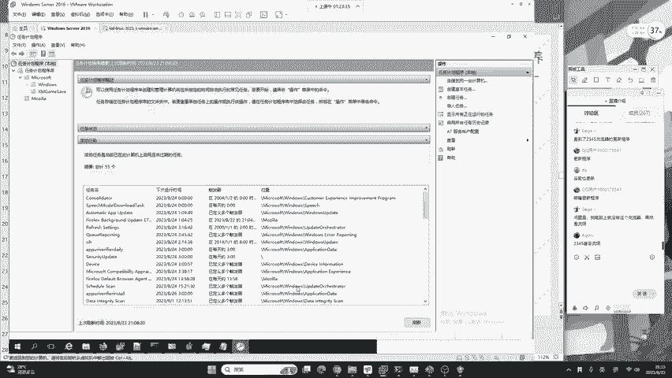

## 可疑文件排查 📁

可疑文件排查是应急响应中直接定位攻击载荷的方法。攻击者留下的后门程序、木马等都需要以文件形式存在于磁盘上。

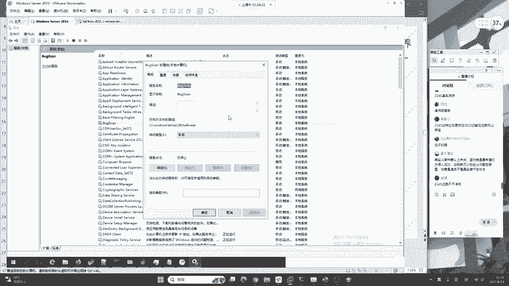

以下是排查可疑文件的常用方法：

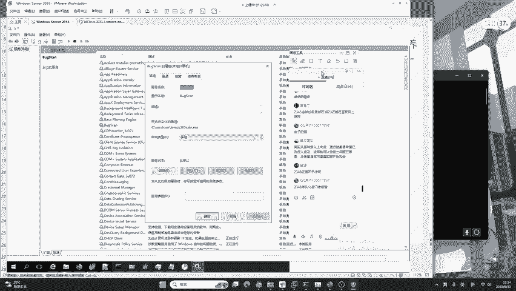

*   **按时间排序**：在文件资源管理器中，可以按照“修改日期”进行排序。如果攻击者没有使用特定技术篡改文件时间戳，近期被创建或修改的可疑文件（尤其是在攻击发生时间段内）很容易被筛选出来。
*   **使用杀毒软件**：最直接有效的方法是使用专业的杀毒软件或EDR（终端检测与响应）工具进行全盘扫描。现代安全软件能够基于特征码和行为分析识别绝大多数已知恶意软件，是蓝队基础且重要的防御手段。

将文件排查与进程、网络连接、计划任务、服务等信息关联分析，能极大地提高威胁发现的准确率。

## 关于“零日漏洞”防御的思考 💭

在排查过程中，可能会遇到利用“零日漏洞”（0-day）的攻击。零日漏洞是指未被公开、因此也没有补丁的漏洞。有同学可能会问，这类攻击能否防御？

答案是：可以通过体系化的安全建设进行有效缓解。一个成熟的企业安全体系不仅仅依赖漏洞补丁，更侧重于：
*   **终端安全**：部署EDR等终端防护软件，即使恶意程序运行，也能通过行为监控进行阻断和告警。
*   **零信任架构**：遵循“从不信任，始终验证”的原则，严格管控网络访问权限，即使攻击者进入内网，其横向移动也会受到极大限制。
*   **纵深防御**：结合网络防火墙、入侵检测系统、安全日志分析等多种手段，构建多层防御体系。

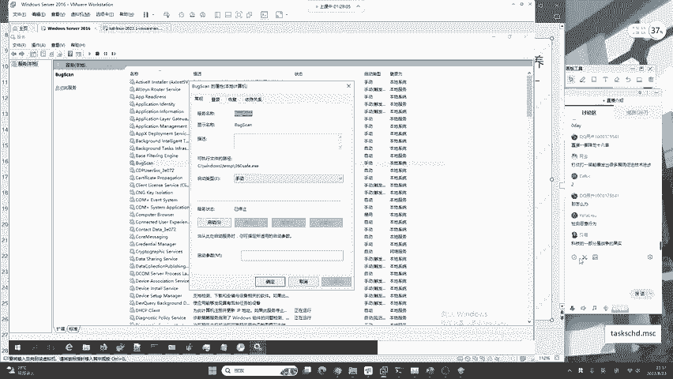

因此，面对零日攻击，蓝队并非束手无策。完善的安全建设和积极的应急响应，能够将攻击带来的危害降至最低。

---

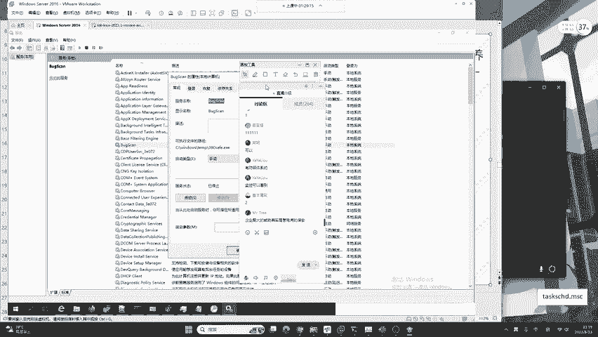

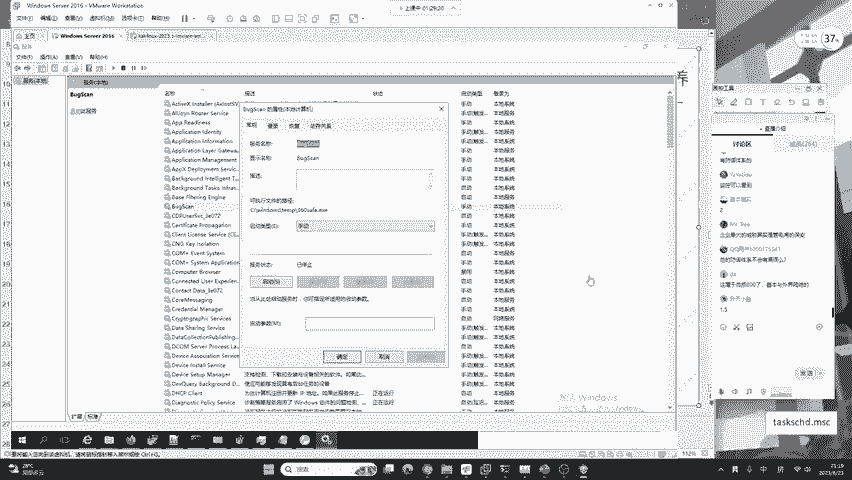

本节课中我们一起学习了系统相关信息排查的三个核心部分：**计划任务**、**系统服务**和**可疑文件**。我们掌握了它们的基本概念、排查方法以及在实际攻防中的意义。请记住，应急响应是一个综合性的过程，需要将系统信息、网络信息、日志信息等结合起来进行关联分析，才能更全面、更准确地识别和清除安全威胁。将手动排查与自动化工具结合使用，是提升蓝队工作效率的关键。