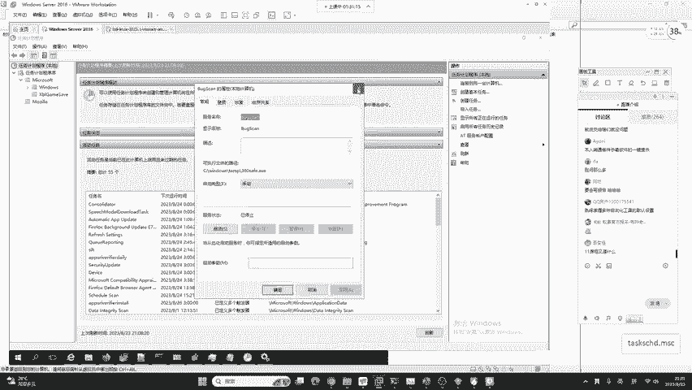
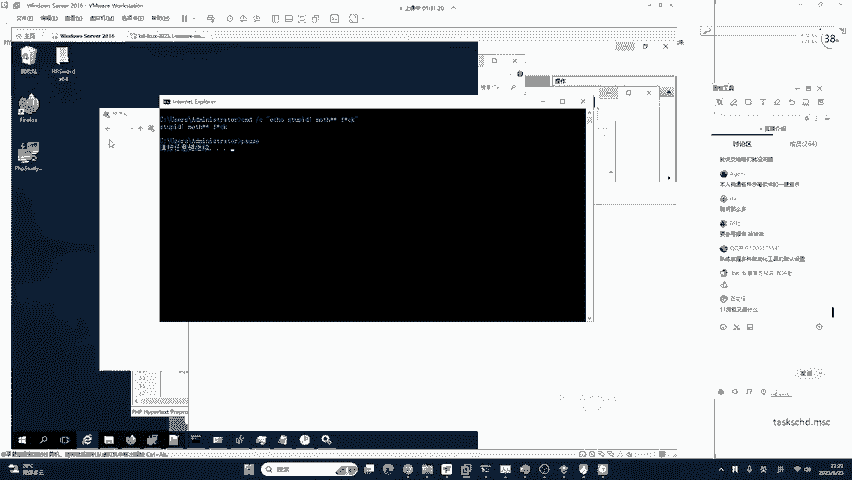
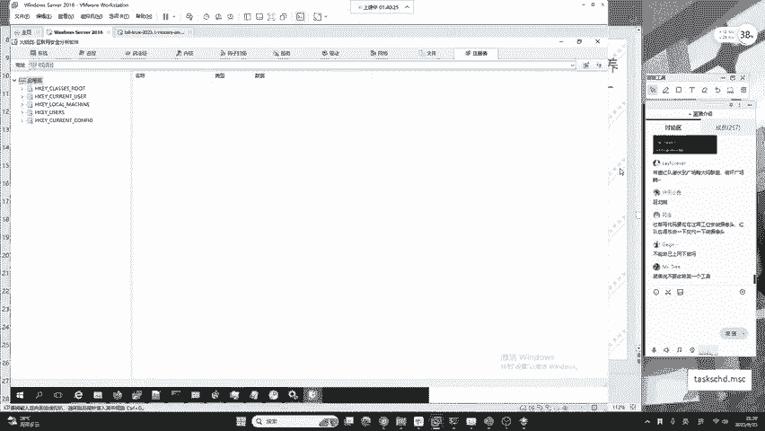

# 护网行动红蓝攻防教程：P16：蓝队应急响应-15.自动化工具火绒剑 🔧

在本节课中，我们将要学习蓝队应急响应中一款重要的自动化分析工具——火绒剑。我们将了解它的功能、使用场景以及如何利用它进行系统入侵排查，同时也会强调理论知识与工具实践相结合的重要性。

上一节我们介绍了手动排查系统入侵痕迹的方法，本节中我们来看看如何利用自动化工具提高排查效率。

## 工具选择与理论基础

对于初学者或刚接触恶意病毒分析的同学，建议使用火绒剑进行分析。

需要注意的是，在实战或面试中，不能只回答“使用火绒剑”。如果甲方询问操作系统入侵排查方式，仅回答工具名称是不够的。必须掌握系统的理论，做到工具会用、手动排查熟练、原理清楚。只有这样，才能向高级蓝队发展。蓝队工作需要全能，不能只会某一点，整个流程都要掌握，并且要会撰写分析报告。

## 火绒剑的获取与启动

火绒剑可以在已安装的火绒安全软件中找到。在安全工具中，有一个名为“火绒剑”的高级工具，可以直接打开。

通常情况下，推荐使用独立版本的火绒剑进行分析。如果需要独立版本，可以课后向班主任索取。软件界面为中文，便于识别和操作。

## 核心功能详解

火绒剑提供了多个维度的系统监控和分析功能，以下是其主要模块的介绍。

### 系统监控

系统行为监控是进行木马病毒查杀中最关键的一点。任何恶意软件要控制系统，都必须通过调用系统驱动接口来完成操作。例如，打开摄像头这个行为，系统是知道的。如果这个行为被火绒剑捕捉到，就能定位恶意软件。这种思路类似于手机系统中监控APP行为的功能，可以揭露某些应用随意获取地理位置、打开麦克风或摄像头的隐私问题。在实际攻击中，黑客工具的操作远不止于此。

### 进程分析

进程分析是排查的基础。火绒剑可以列出所有进程。例如，系统有一个名为 **svchost.exe** 的Windows服务主进程，位于 `C:\Windows\System32\`。很多黑客会将木马命名为相似名称以进行伪装。

**伪装示例：**
*   将字母“o”替换为数字“0”：`svch0st.exe`
*   添加空格或特殊字符

通过查看进程的描述和路径，可以识别出伪装进程。火绒剑还支持查看进程注入、模块列表（调用的动态库）、句柄信息以及内存分布，这些可用于高级防御、内存取证或逆向分析。

### 启动项、服务与驱动

以下是其他重要的监控项：

*   **启动项**：可以直接查看随系统启动的程序，这里是后门病毒的常见藏身之处。
*   **服务**：可以清晰看到系统中注册的服务，包括恶意服务及其对应的文件路径（例如 `C:\Windows\Temp\360c.exe`）。
*   **驱动**：可以监控系统中安装的设备驱动。历史上存在过驱动软件被植入后门的案例。在正规红蓝对抗中，红队通常不会破坏系统内核或驱动文件，因为这类破坏性操作不合规且需承担法律责任。

### 网络与文件监控

网络监控功能可以直接查看进程的网络连接情况。例如，可以发现未知文件打开了异常的端口（如6666端口），从而快速定位病毒文件。

文件监控和注册表监控也是重要功能。注册表监控界面提供搜索框，可以直接输入关键词进行查询，非常便捷。

## 学习建议与总结

火绒剑是一个中文软件，功能直观。建议领取软件后自行点击查看，能够快速建立对进程分析和网络分析的基础认知。

但是，**切勿只依赖或只记住火绒剑**。市场上还有许多其他优秀的分析工具，例如 **Process Hacker** 等。大家可以从网上下载学习。

当前行业竞争日益激烈，仅会使用工具很难找到高薪工作。安全工作者必须做到：原理清晰、流程熟悉、工具熟练、能说会答。既要懂理论，又要会实战，这是必备的综合技能。

本节课中我们一起学习了自动化分析工具火绒剑的核心功能与应用场景。我们明白了工具能极大提升排查效率，但强大的理论基础和系统化的知识体系才是蓝队工程师的核心竞争力。切记不要成为只依赖单一工具的“工具小子”，而应追求全面发展和持续学习。