# 护网行动红蓝攻防教程：P17：蓝队应急响应-16.溯源 🎯

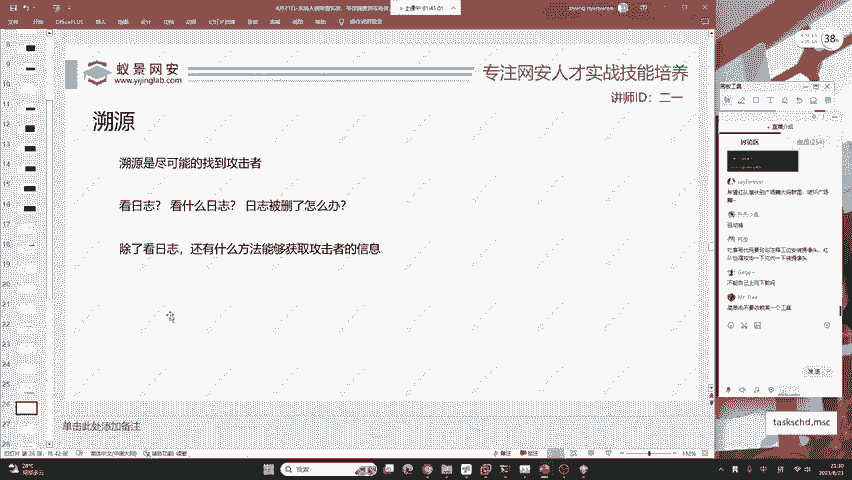

在本节课中，我们将要学习蓝队应急响应中的关键环节——溯源。我们将探讨如何从攻击事件中寻找攻击者的线索，理解溯源的可行性与局限性，并介绍一些主动反制的思路。

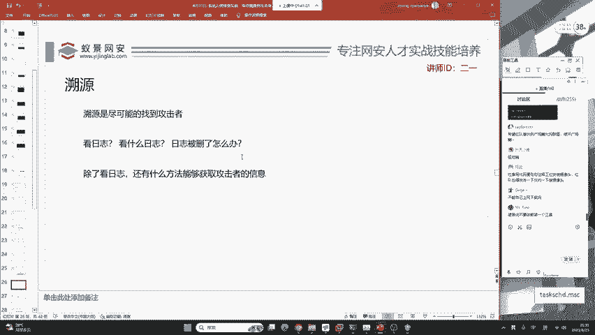

上一节我们介绍了入侵排查，本节中我们来看看如何在此基础上进行溯源。

## 什么是溯源？🔍

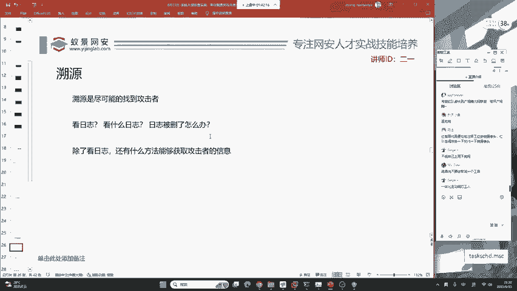

溯源是指在发生安全事件后，尝试追踪并定位攻击者身份或来源的过程。请注意，溯源没有100%成功的方法。实际护网行动中，团队成员有分工，但作为其中一员，必须掌握相关技能。

现在的问题是，如何尽可能找到攻击者？

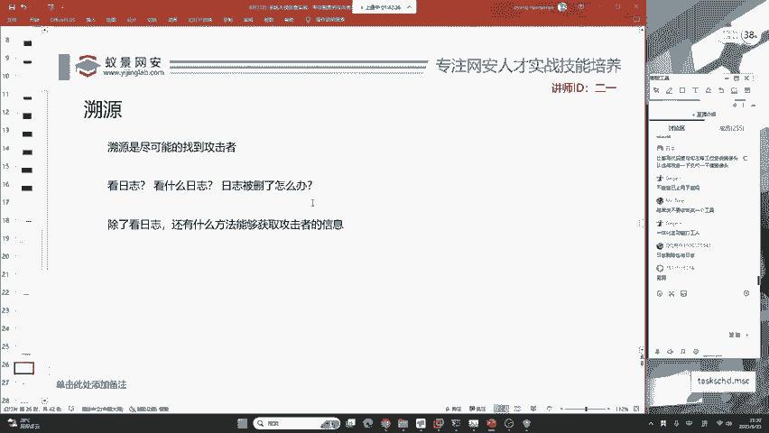

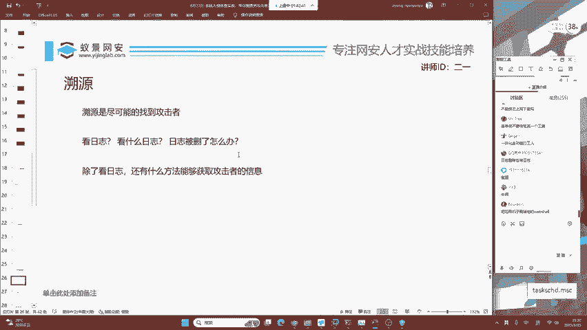

## 溯源的信息来源 📂

以下是获取攻击者信息的主要途径：

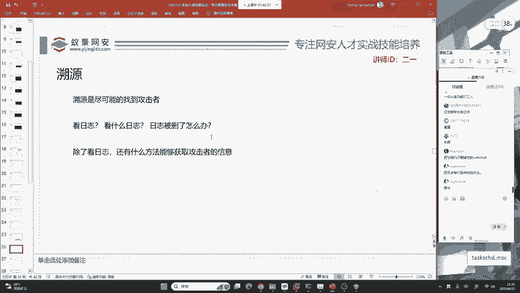

首先，日志是首选信息来源。但需要考虑日志可能被红队删除。学习过渗透测试就知道有“日志删除”技术。

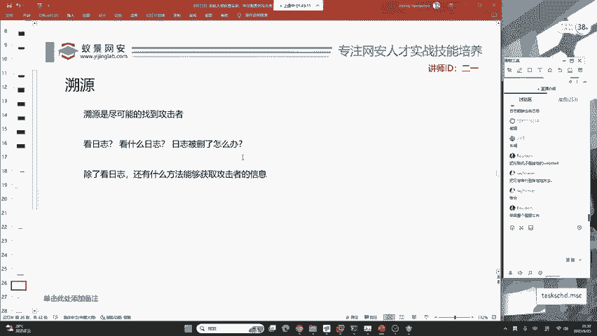

除了日志，还有其他能够获取攻击者信息的方法。

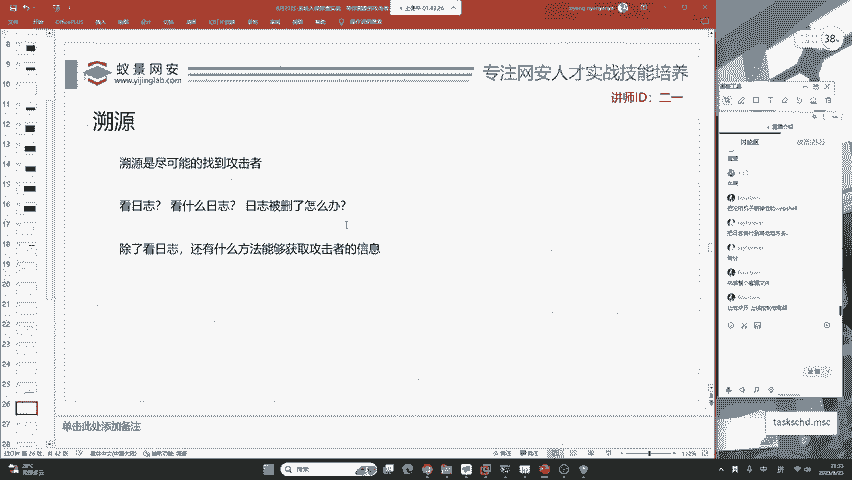

以下是其他可能的溯源思路：

*   **被删除的操作日志**：即使删除日志的操作本身，也可能留下记录。
*   **部署蜜罐**：通过部署诱饵系统，主动吸引并记录攻击者的行为。
*   **网络流量分析**：分析异常的网络连接和通信模式。
*   **系统残留痕迹**：检查内存、临时文件、注册表等可能留下的攻击痕迹。

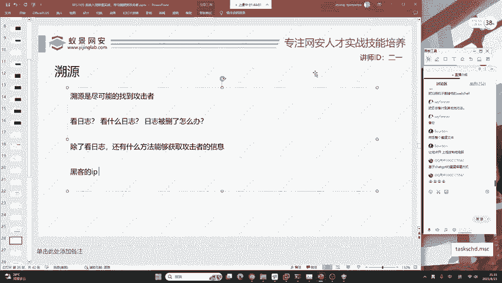

很多红队会使用代理隐藏真实IP，除非攻击者缺乏经验。对于蓝队而言，面对弱密码等低级失误，应将其视为学习和提升的机会。

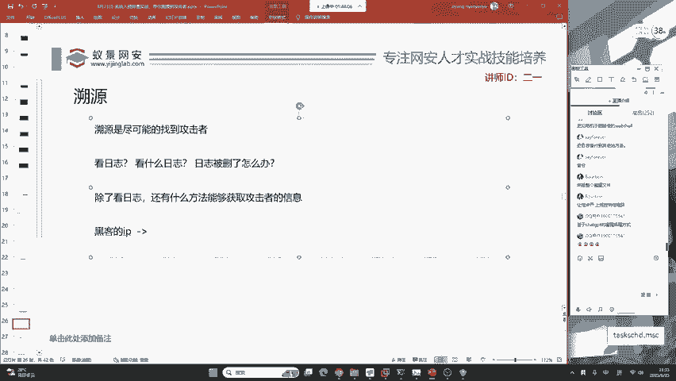

## 溯源的挑战与误区 ⚠️

因此，蓝队常常需要主动出击。目前很多成功的溯源案例，实际上是蓝队通过反制手段（如反钓鱼）实现的。

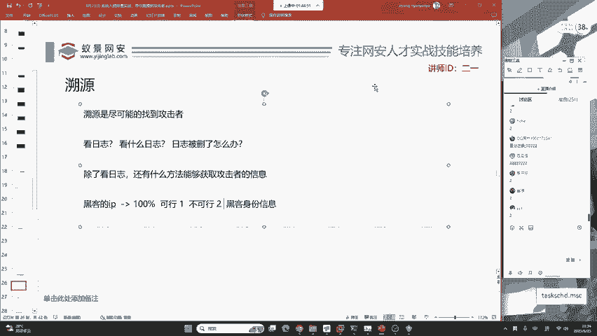

这些成功溯源往往综合利用了多种方法，没有单一途径能保证成功。

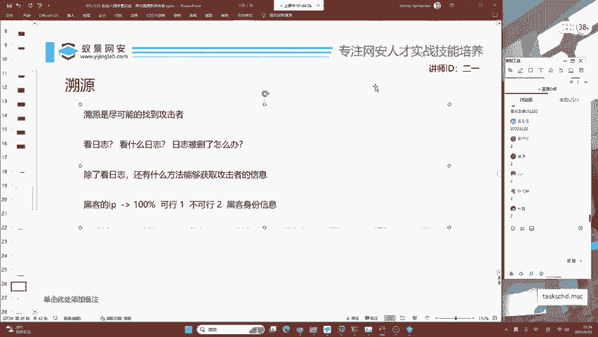

现在思考一个基础问题：通过日志分析，我们得到了攻击者的IP地址。

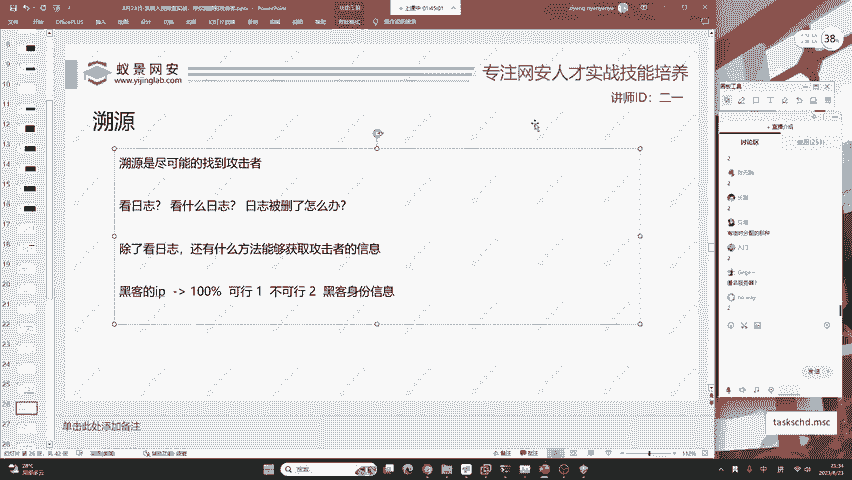

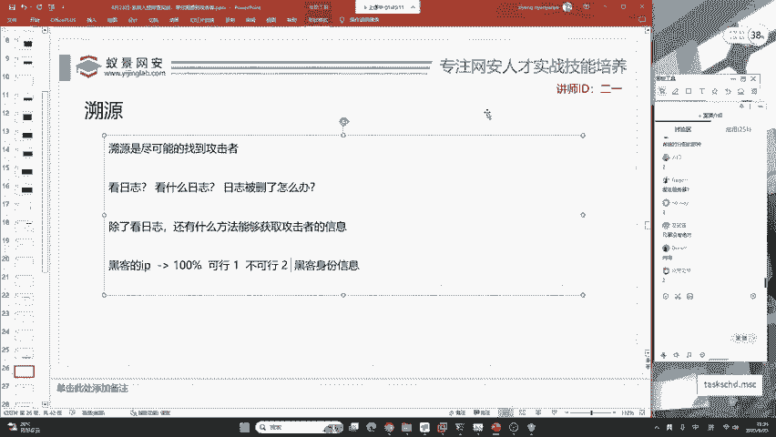

如何通过这个IP地址找到攻击者的身份信息？

在社交媒体上，有人调侃说得到IP就等于溯源成功。大家认为这种方法100%可行吗？

真理掌握在少数人手中。通过IP地址直接获取黑客身份信息并非易事。

原因如下：

1.  **攻击者使用代理**：黑客会使用代理、VPN或跳板机隐藏真实IP。
2.  **IP与身份的映射关系**：即使获得家庭宽带IP，也需要通过运营商配合才能关联到具体个人身份，这通常需要执法权限，并非在任何场景下都能实现。
3.  **现实案例佐证**：如果仅凭IP就能100%定位，那么警方在侦破网络犯罪时就不会如此费力。这说明了其复杂性。

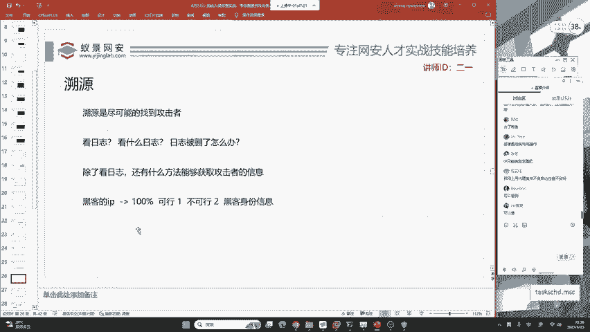

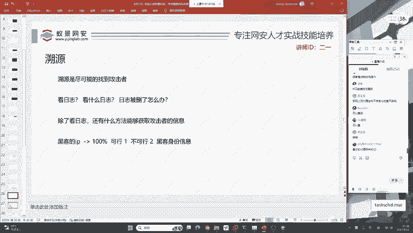

这种路径可以尝试，但无法达到100%成功率。攻击者可以通过各种手段隐藏自己，增加溯源难度。

## 攻击者的隐匿与破绽 🕵️

例如，家庭网络来自运营商，运营商确实掌握用户信息。即使用户购买境外服务器，若使用支付宝等实名支付方式，也会留下关联线索。

因此，攻击者想做到100%隐匿几乎不可能。但对于蓝队而言，仅凭一个IP就要提供攻击者的身份证号，这是非常困难的，并非100%可行。

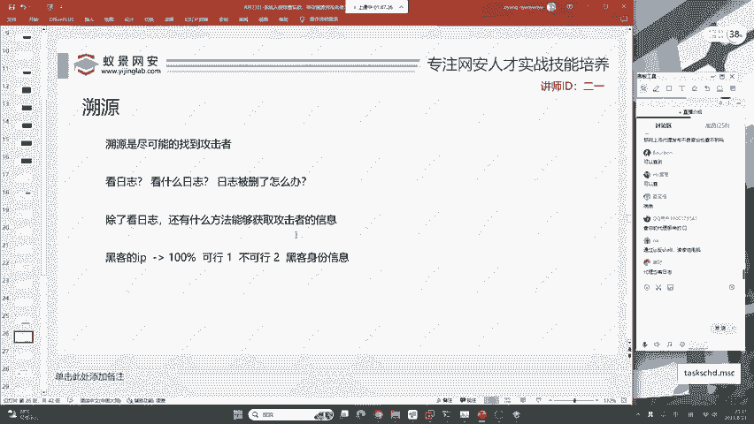

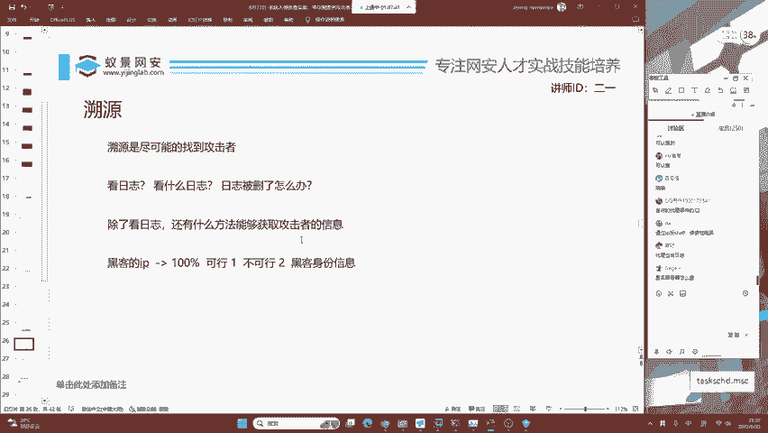

## 主动反制策略 🎣

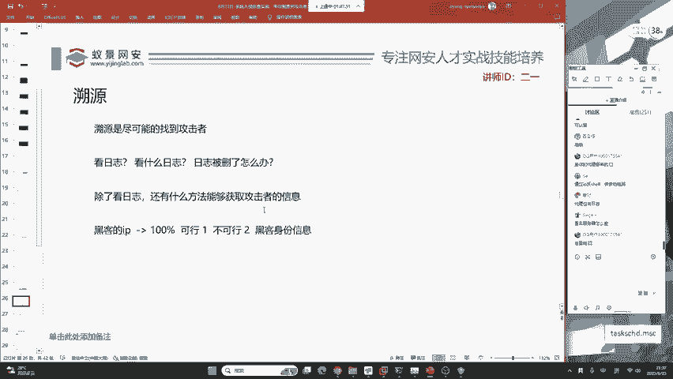

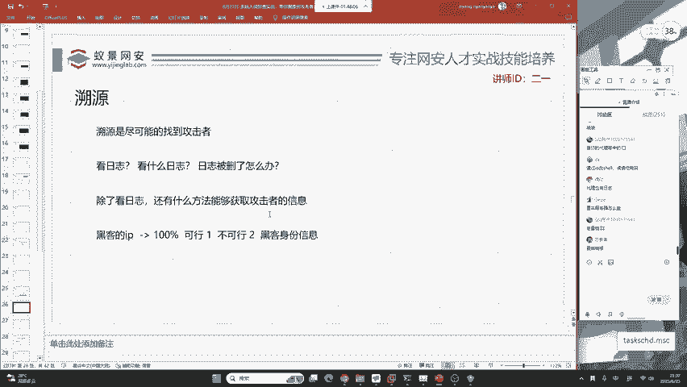

关于溯源，我们的主要策略是进行蜜罐钓鱼，主动反制红队。

通过部署精心设计的蜜罐，诱导攻击者触发并留下更多信息，从而为溯源创造有利条件。

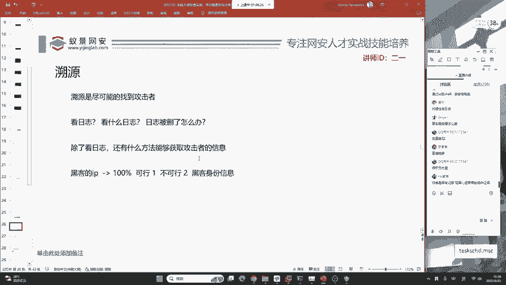

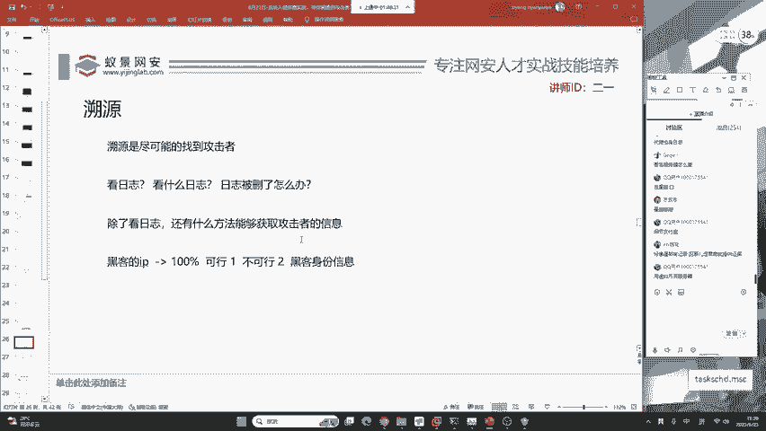

本节课中我们一起学习了蓝队应急响应中的溯源工作。我们了解了溯源的核心是寻找攻击者线索，认识到其可行性与局限性，并明确了日志分析、蜜罐使用等主要方法，以及主动反制的重要性。记住，溯源是一个综合性的过程，需要耐心、技巧和一点运气。