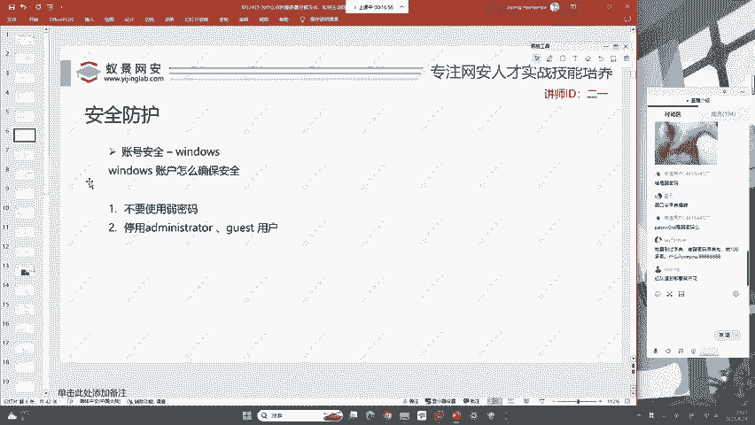
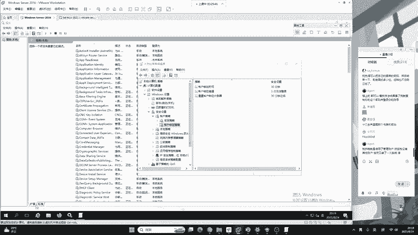
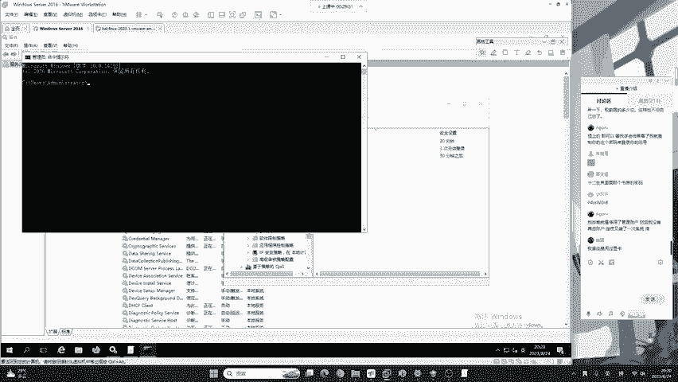
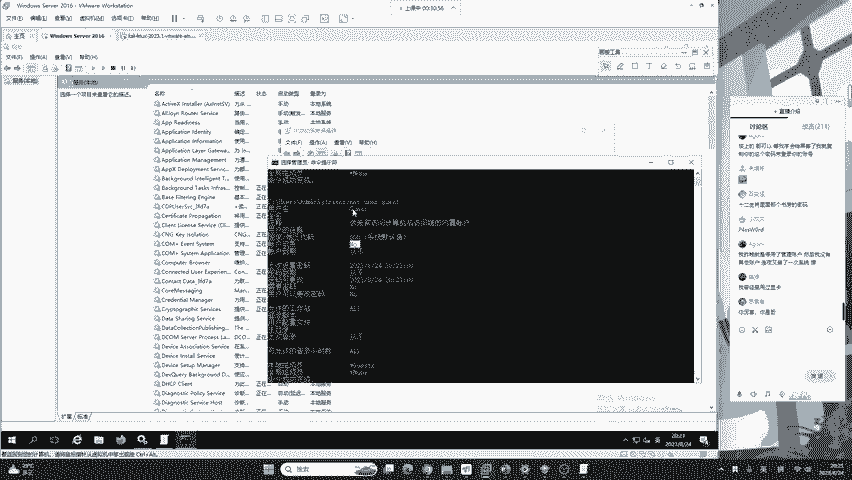

# 蓝队应急响应：P18：账号安全 🔐

在本节课中，我们将学习Windows账号安全的核心防护措施。账号是系统访问的第一道关口，确保其安全是应急响应和日常防御的重中之重。我们将重点探讨如何通过配置组策略和禁用高危账户来加固系统，防止黑客通过弱密码或默认账户进行入侵。

## 通过组策略强化密码安全

上一节我们介绍了入侵排查中常见的后门用户问题。本节中，我们来看看如何从根源上加强账号安全，首要任务是防止用户使用弱密码。

仅仅依靠安全意识培训要求用户不使用弱密码是不够的，我们需要通过系统配置进行强制约束。这需要用到Windows的**本地组策略编辑器**（简称组策略）。

**打开组策略编辑器的方法如下：**
1.  按下 `Windows` + `R` 键打开“运行”对话框。
2.  输入 `gpedit.msc` 并点击“确定”。

> **注意**：`gpedit.msc` 是 `Group Policy Editor` 的缩写。此功能仅在Windows专业版、企业版等版本中提供，家庭版通常不具备。

打开组策略编辑器后，依次展开：**计算机配置** -> **Windows 设置** -> **安全设置** -> **账户策略** -> **密码策略**。

以下是密码策略中需要配置的关键项：

*   **密码必须符合复杂性要求**：启用此策略后，系统将强制要求用户密码必须包含以下四类字符中的至少三类：大写字母、小写字母、数字、特殊符号。这是防止使用“123456”这类简单密码的最有效手段。
*   **密码长度最小值**：建议设置为8位或以上。默认值为0，意味着允许设置任意长度的密码，包括1位密码，这是极不安全的。
*   **密码最长使用期限**：设置密码的有效期（例如42天），到期后系统会强制要求用户更改密码。这可以降低密码被长期破解或冒用的风险。
*   **强制密码历史**：此策略可以防止用户在一段时间内重复使用旧密码。

配置好这些策略后，可以极大增加黑客通过爆破（暴力破解）方式获取密码的难度。然而，仅靠强密码策略可能仍存在漏洞，例如用户使用键盘上连续的字符组合（如“1qaz@WSX”）作为密码，虽然符合复杂性要求，但依然属于易被猜解的弱密码。

## 配置账户锁定策略

为了进一步防御密码爆破攻击，我们还需要配置**账户锁定策略**。该策略默认未启用，但对于服务器安全至关重要。

在组策略编辑器中，路径为：**计算机配置** -> **Windows 设置** -> **安全设置** -> **账户策略** -> **账户锁定策略**。

需要配置的策略如下：

*   **账户锁定阈值**：设置允许的无效登录尝试次数（例如3次）。超过此阈值后，账户将被锁定。
*   **账户锁定时间**：设置账户被锁定的时长（例如30分钟）。在此期间，即使用户输入了正确密码也无法登录。

这类似于手机解锁密码输入错误多次后的锁定机制，能有效阻止黑客的自动化爆破工具。

## 禁用高危默认账户

在设置了账户锁定策略后，还需考虑一种情况：黑客可能故意触发锁定，导致合法管理员账户被锁，造成拒绝服务。因此，我们需要禁用Windows中两个高危的默认账户：**Administrator**（管理员）和 **Guest**（来宾）。

**在执行此操作前，必须确保系统中至少存在另一个属于“Administrators”用户组的账户**，否则可能导致无法登录系统。

检查及禁用账户的方法如下：

1.  打开命令提示符（CMD）。
2.  输入 `net user` 查看所有用户账户。
3.  使用 `net user administrator` 和 `net user guest` 命令查看这两个账户的状态。在“账户启用”一行，若显示“Yes”则表示已启用，“No”则表示已禁用。
4.  禁用账户的命令为：
    *   禁用Administrator账户：`net user administrator /active:no`
    *   禁用Guest账户：`net user guest /active:no`

> **提示**：在标准的Windows Server服务器中，这两个账户默认应保持禁用状态。黑客在攻陷系统后，常会尝试激活它们以建立持久化后门。

## 总结

本节课中我们一起学习了Windows账号安全加固的核心流程。首先，我们通过**组策略编辑器**（`gpedit.msc`）配置了**密码策略**和**账户锁定策略**，强制使用强密码并防御爆破攻击。接着，我们强调了禁用**Administrator**和**Guest**这两个高危默认账户的重要性及操作方法。这些措施共同构成了Windows系统账号安全的基础防线，是蓝队进行安全运维和应急响应的必备技能。