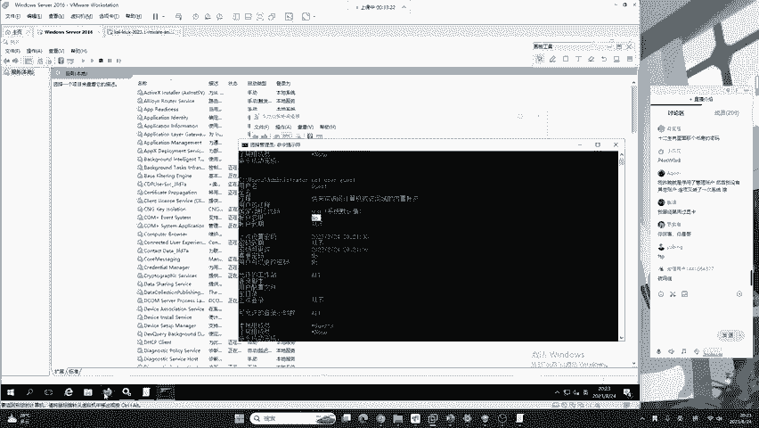
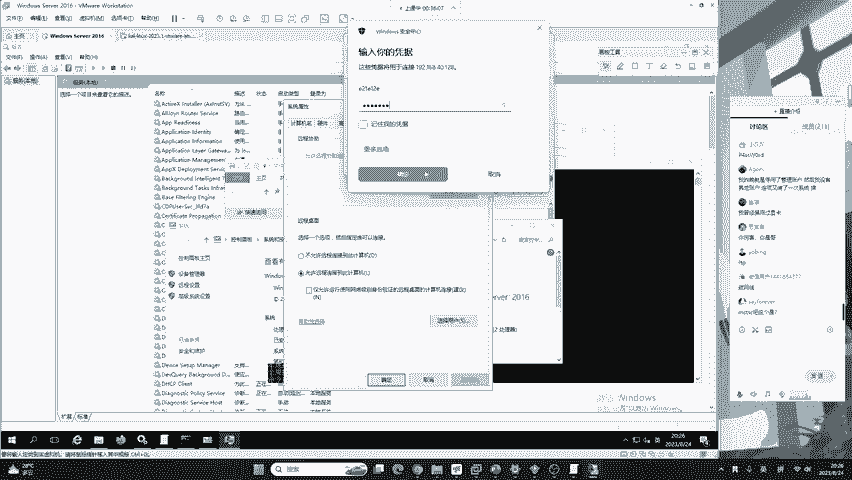
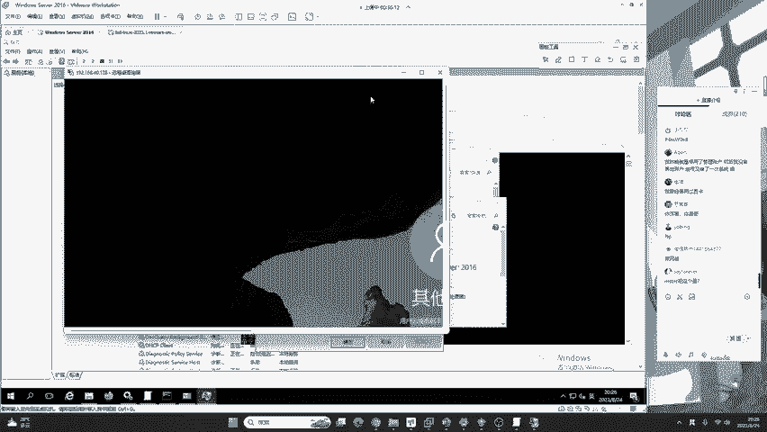
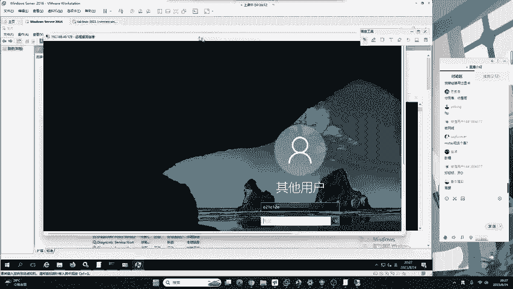
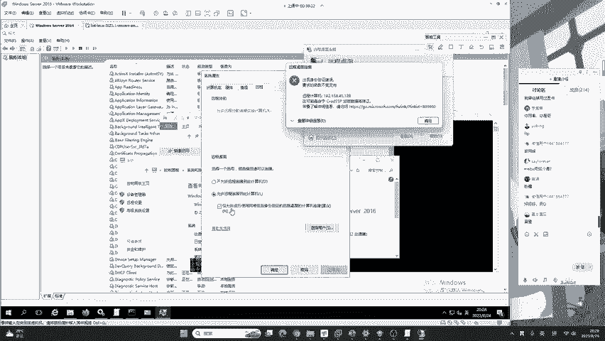
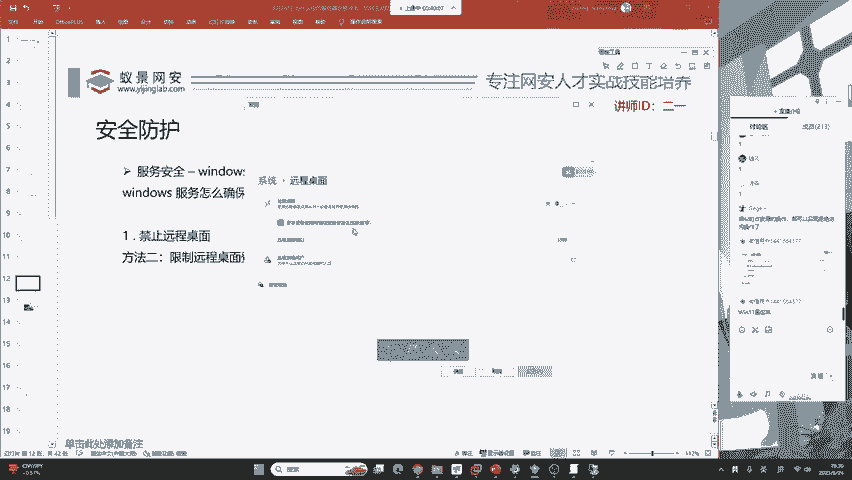
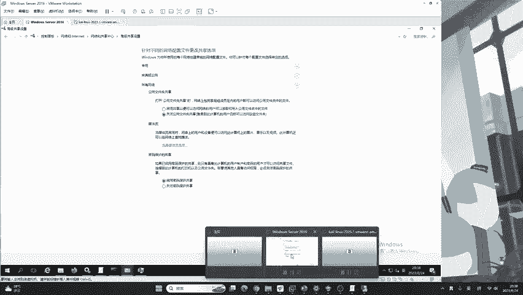
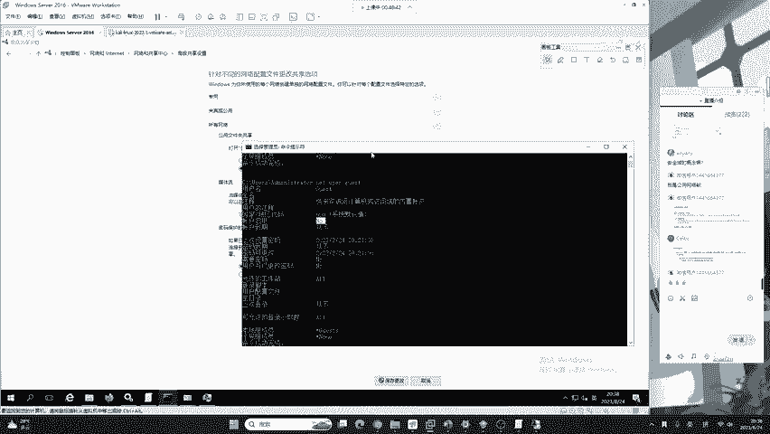
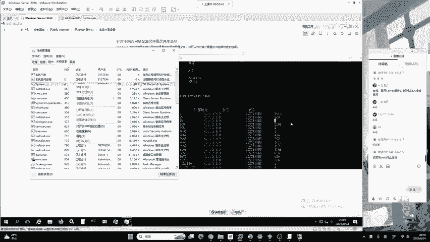
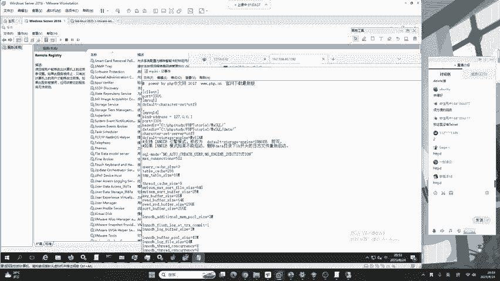

# 护网行动红蓝攻防教程：P19：蓝队应急响应-18.服务安全 🔒

在本节课中，我们将学习如何保障Windows系统的服务安全。服务是黑客攻击的常见入口点，例如网站服务（Web服务）出现SQL注入漏洞，就意味着该服务存在安全风险。我们将通过四个关键步骤来加固服务，防止被利用。

## 1. 远程桌面安全配置 🖥️

上一节我们介绍了服务安全的重要性，本节中我们来看看如何确保远程桌面服务的安全。远程桌面服务是系统管理的重要工具，但配置不当会成为严重的安全隐患。

以下是配置远程桌面安全的步骤：

1.  **禁止或严格限制远程连接**：最彻底的方法是直接关闭远程桌面功能。打开“文件资源管理器”，右键点击“此电脑”选择“属性”，进入“远程设置”，选择“不允许远程连接到此计算机”。但请注意，这会完全禁用远程管理功能。
2.  **启用网络级别身份验证（NLA）**：如果必须开启远程桌面，务必勾选“仅允许运行使用网络级别身份验证的远程桌面的计算机连接”。此选项的作用至关重要：
    *   **未启用NLA**：即使用户名和密码错误，系统也会加载完整的图形化登录界面，这会消耗大量系统资源。攻击者可通过发起大量错误连接进行拒绝服务攻击（类似DDoS），导致系统资源耗尽甚至崩溃。
    *   **启用NLA**：身份验证在建立完整会话前于网络层完成。密码错误时，连接会在远程桌面客户端软件内直接报错，不会加载图形界面，几乎不占用服务器资源，能有效防御此类攻击。
3.  **限制远程桌面用户**：在“远程设置”中点击“选择用户”，可以指定允许连接远程桌面的用户账户。**但请注意**：此限制对管理员组（Administrators）成员无效。系统明确提示“管理员组中的任何成员都可以进行连接，即使没有列出”。因此，该措施防护作用有限，仅作为辅助手段。

## 2. 文件共享服务安全 📁

上一节我们介绍了远程桌面的安全配置，本节中我们来看看如何管理文件共享服务。文件共享服务（如SMB）是内网渗透和横向移动的常用途径，需重点防护。

以下是管理文件共享安全的两种方式：

1.  **限制文件共享**：通过控制面板进入“网络和共享中心”，点击“更改高级共享设置”。在这里，你可以为“专用网络”、“来宾或公用网络”以及“所有网络”分别配置选项。出于安全考虑，建议：
    *   关闭“网络发现”。
    *   关闭“文件和打印机共享”。
    *   在“所有网络”中，确保“启用密码保护共享”处于**开启**状态，防止未经授权的访问。
    *   **注意**：“专用网络”与“公用网络”的区别取决于首次连接网络时用户的选择，而非简单的内网/外网之分。
2.  **关闭文件共享服务**：这是最彻底的防御方式，可防范针对共享服务的密码破解和横向攻击。但同样可能影响系统正常功能（如Windows子系统Linux）。关闭方法如下：
    *   文件共享默认使用 **445** 端口，其进程ID（PID）为4，属于Windows内核进程，无法直接结束。
    *   按 `Win + R`，输入 `services.msc` 打开服务管理器。
    *   找到名为 **Server** 的服务（描述为：支持计算机通过网络的文件、打印和命名管道共享）。
    *   右键点击该服务，选择“停止”，然后将其“启动类型”设置为“禁用”。重启系统后，445端口将不再监听。

## 3. 关闭非必要系统服务 ⚙️

在加固了核心网络服务后，我们还需要审视并关闭一些非必需的系统服务，以减少攻击面。

以下是一些通常可以安全禁用的服务示例：

*   **Computer Browser**：维护局域网计算机列表，用于“网络邻居”。在现代网络环境中作用有限。
*   **Remote Registry**：允许远程用户修改此计算机的注册表。这是极其危险的服务，攻击者可利用它创建隐藏账户、植入后门等。**强烈建议禁用**。
*   **Routing and Remote Access**：提供路由和远程访问服务。
*   **Telnet**：允许远程用户使用Telnet协议登录到此计算机。这是一个不加密的明文协议，**如果未使用，务必禁用**。
*   其他如“SSDP Discovery”、“Print Spooler”（如果无需打印）等，也可根据实际情况考虑禁用。

**操作方法**：在 `services.msc` 中找到对应服务，右键选择“属性”，将“启动类型”设置为“禁用”，并停止服务。

## 4. 中间件与数据库监听地址配置 🗄️

最后，我们来学习如何通过配置监听地址来保护Web服务和数据库。许多安全事件源于将服务暴露给了不必要的访问者。

以下是配置监听地址的核心思路：

1.  **Web服务器（以Apache为例）**：
    *   默认配置中，监听地址常为 `0.0.0.0:80`，表示接受来自任何IP的连接。
    *   可以修改Apache配置文件（如 `httpd.conf`），找到 `Listen` 指令。例如，将其改为 `Listen 127.0.0.1:80`，则Web服务仅对本机可用。
    *   使用命令 `netstat -ano | findstr :80` 可以验证监听地址已从 `0.0.0.0` 变为 `127.0.0.1`。
2.  **数据库（以MySQL为例）**：
    *   数据库服务（默认端口3306）是高频攻击目标。
    *   修改MySQL配置文件（如 `my.ini` 或 `my.cnf`），在 `[mysqld]` 部分添加一行：`bind-address = 127.0.0.1`。
    *   重启MySQL服务后，数据库将只允许本地连接，外部网络无法直接访问，极大地提升了安全性。
3.  **重要提醒**：将服务绑定到 `127.0.0.1` 并非绝对安全。攻击者仍可能通过Web应用漏洞（如SQL注入、SSRF服务端请求伪造等）从服务器内部“本地”访问到这些服务。因此，这只是一项重要的**纵深防御措施**，而非一劳永逸的解决方案。

## 总结 📝

本节课中我们一起学习了Windows系统服务安全的四大核心措施：
1.  安全配置远程桌面，重点是启用**网络级别身份验证（NLA）**。
2.  严格限制或关闭**文件共享服务**，特别是处理 **445** 端口。
3.  识别并关闭**非必要的系统服务**，如Remote Registry、Telnet等，以减少攻击面。
4.  合理配置**中间件和数据库的监听地址**，避免将服务不必要的暴露在网络上。

安全防护是分层、综合的工程，需要根据业务实际在安全性与可用性之间找到平衡点。关闭服务是最直接的方法，但理解其原理并正确配置，才能构建既安全又可用的系统环境。