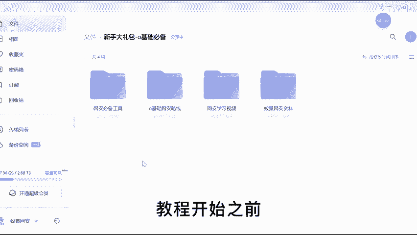
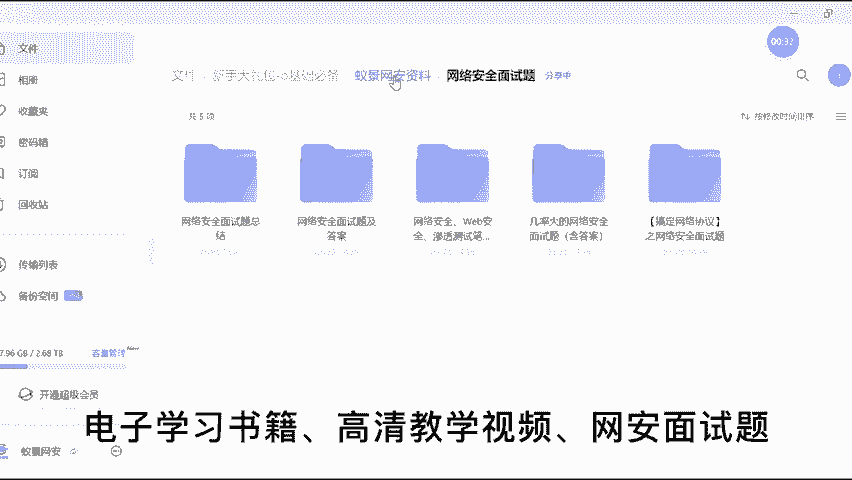
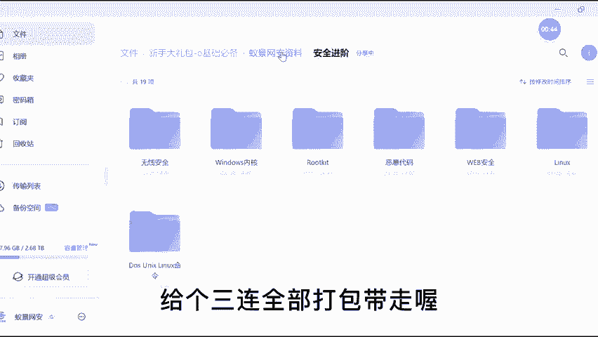

# 护网行动红蓝攻防教程：P1：视频配套资料和笔记 📚

在本节课中，我们将介绍本系列教程的配套学习资料与笔记，为后续深入学习护网行动中的红蓝攻防技能做好准备。

---

上一节我们介绍了本课程的整体框架，本节中我们来看看如何获取和使用配套的学习资料。

在开始正式学习前，我们已经为你准备了系统性的学习资源。以下是资料的具体内容列表：

*   网安基础学习路线图
*   网安学习必备工具包
*   精选电子学习书籍
*   高清配套教学视频
*   网安岗位面试题库

这些资料旨在帮助你构建完整的知识体系，从理论到实践，为掌握应急响应、Web安全、渗透测试等核心技能打下坚实基础。

---

为了更直观地展示部分学习路径与工具，请参考以下图示：

---

本节课中我们一起学习了如何获取本系列红蓝攻防教程的全套配套资料。准备好这些资源，将为你后续的学习之旅提供极大的便利。下一节，我们将正式进入网络安全基础概念的学习。