# 护网行动红蓝攻防教程：P20：蓝队应急响应-19.个人系统安全 🔒

在本节课中，我们将要学习个人系统安全的核心内容。我们将探讨如何通过选择合适的杀毒软件来增强个人电脑或服务器的防御能力，并了解一些主流安全工具的特点与区别。课程最后，我们还会介绍一个针对云服务器防护的实用技巧。

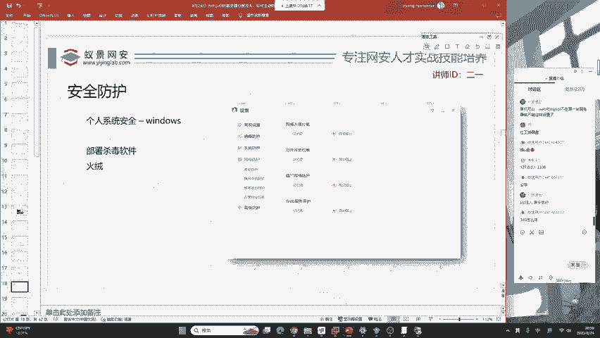

## 杀毒软件的选择与作用

上一节我们介绍了中间件和数据库的安全配置，本节中我们来看看如何保障个人系统的安全。个人系统安全要求我们选择一款成熟且功能全面的杀毒软件，以尽可能拦截黑客的攻击。

以下是选择杀毒软件时需要考虑的核心功能：

*   **病毒查杀与行为监控**：优秀的杀毒软件不仅能查杀木马病毒，还应能拦截黑客的攻击行为。
*   **系统防护**：包括对注册表、敏感系统动作（如创建用户、计划任务）的防护。
*   **应用加固**：对常见的服务器、数据库及办公软件提供额外的安全加固。
*   **网络防护**：防御红队常用的横向渗透技术，例如拦截对默认共享、远程服务、计划任务等的恶意利用。
*   **附加保护**：如软件安装拦截、摄像头保护、恶意网址拦截等。

## 主流杀毒软件介绍

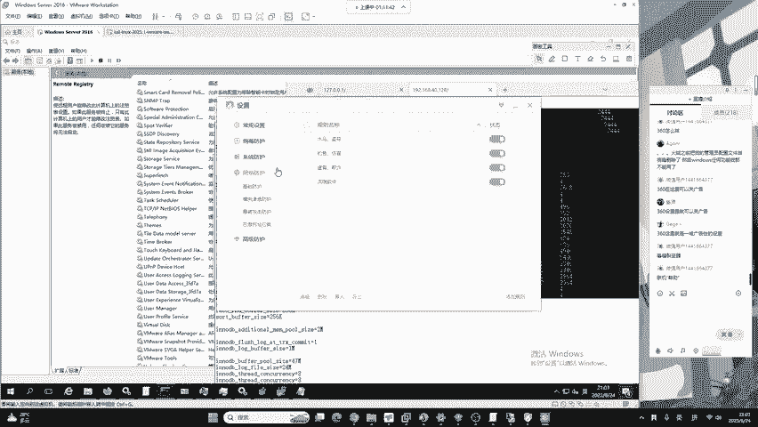

了解了基本要求后，我们来看看一些国内外主流的杀毒软件，它们各有侧重，适用于不同的场景和用户群体。

以下是几款值得关注的杀毒软件：

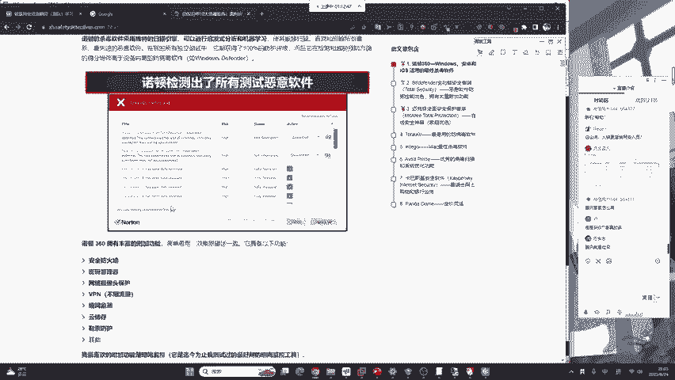

1.  **火绒**：适合国内渗透测试环境。它不仅进行病毒查杀，还能拦截攻击行为，其安全设置可充当简易防火墙甚至EDR（端点检测与响应）。
2.  **360安全卫士**：适合普通电脑使用者。其木马查杀能力较强，对红队制作的免杀木马防御难度较高。
3.  **Bitdefender（比特梵德）**：国际主流软件，在恶意软件防御和网络监测方面非常强大，能抵挡多种攻击，但属于收费软件。
4.  **Norton（诺顿）**：功能强大的收费杀毒软件。
5.  **McAfee（迈克菲）**：提供免费版本，是知名的安全解决方案。
6.  **Avira（小红伞）**：杀毒效率高，提供免费版。360杀毒引擎就采用了小红伞的技术。
7.  **Kaspersky（卡巴斯基）**：提供免费版，其高级功能需付费订阅，以强大的防御能力著称。
8.  **Trend Micro（趋势科技）**：防御能力突出，同样属于收费软件。

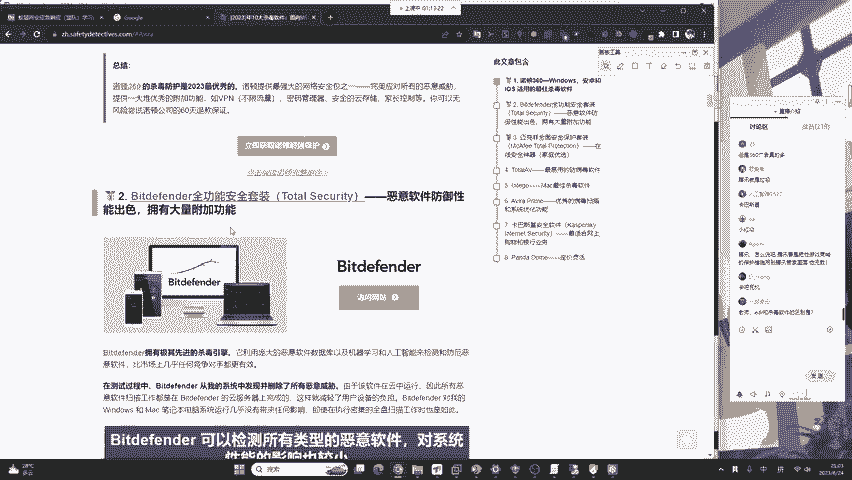

对于大部分用户，**360、火绒、Avira（小红伞）** 等提供的免费版本是较好且实用的选择。

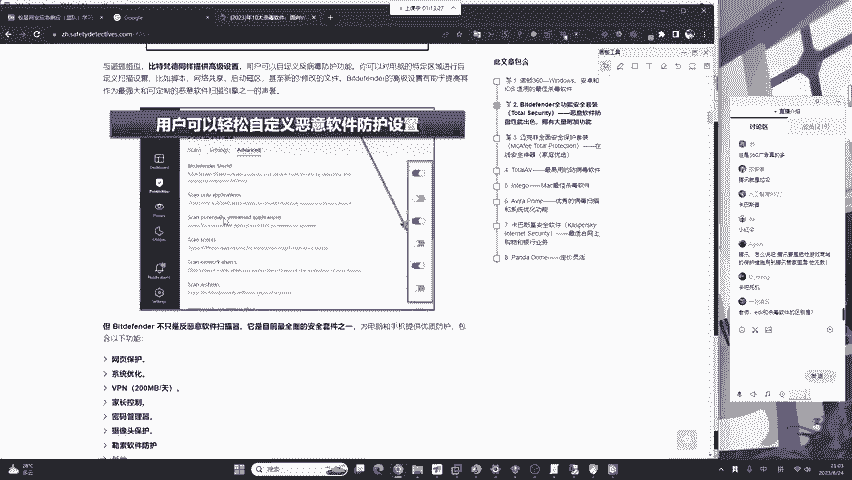

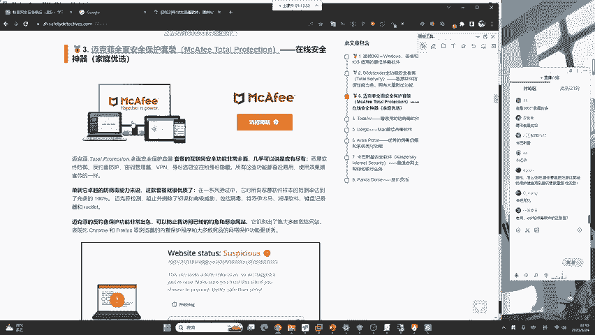

## EDR与杀毒软件的区别

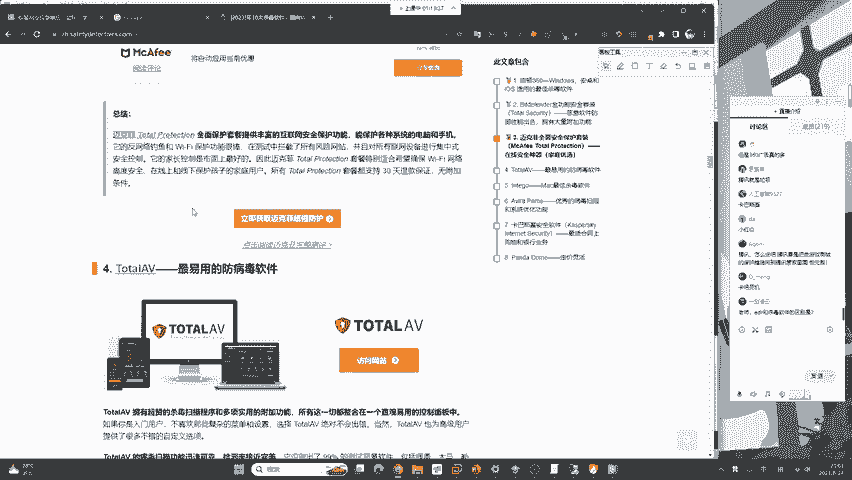

在讨论安全软件时，EDR是一个重要的概念。它代表了比传统杀毒软件更高级的防护理念。

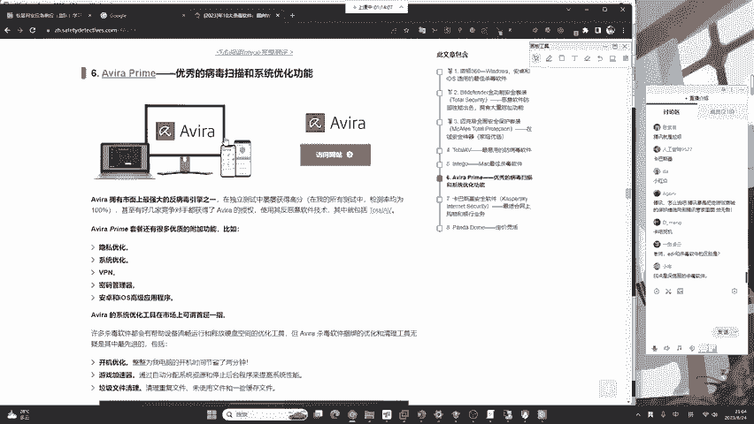

我们可以用一个简单的公式来理解它们的关系：
**EDR ≈ 杀毒软件 + 深度行为监控与记录 + 攻击溯源能力**

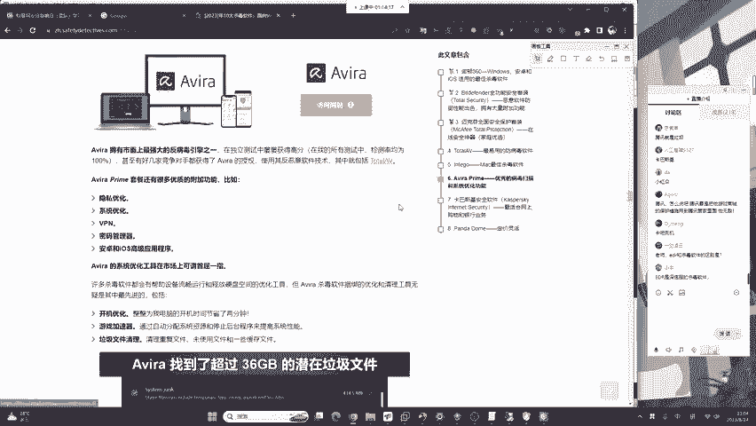

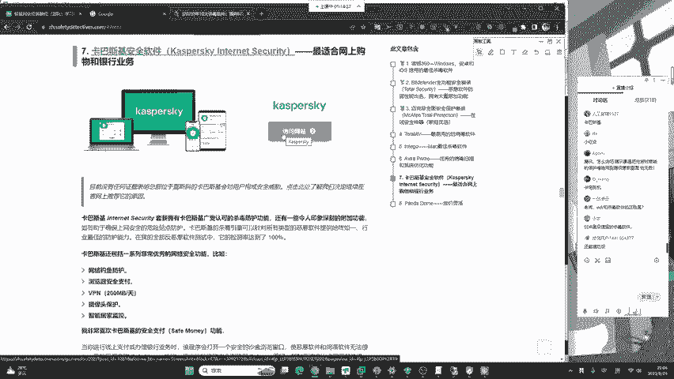

传统杀毒软件主要专注于**预防和拦截**已知或基于行为的威胁。而EDR（端点检测与响应）可以看作是杀毒软件的“增强版”。它不仅能够拦截威胁，更能**详细记录**终端上的所有进程、网络连接、文件操作等行为。当发生安全事件时，EDR可以通过这些记录生成清晰的行为时间线和攻击链拓扑图，极大地便利了安全人员进行**应急响应、威胁排查和攻击溯源**。

## 云服务器防护小技巧

介绍完本地防护工具，我们来看一个针对线上服务器的常见问题。许多运维同学的个人云服务器或博客网站时常遭受黑客的爆破和攻击。

一个基础的防护思路是构建一个**多层次防御体系**，可以概括为：
`安全防护 = 杀毒软件 + 网络层防御 + 敏感操作日志记录`

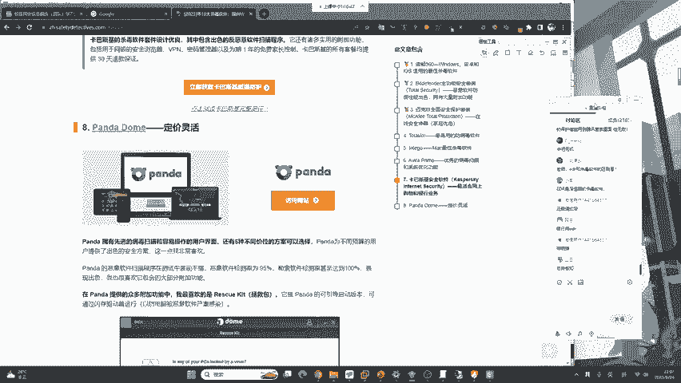

对于云服务器，除了安装服务器版的安全软件外，务必充分利用云服务商提供的安全组功能，严格限制不必要的端口访问，并开启系统及应用程序的详细日志记录功能，以便在遭受攻击时能够快速分析和响应。

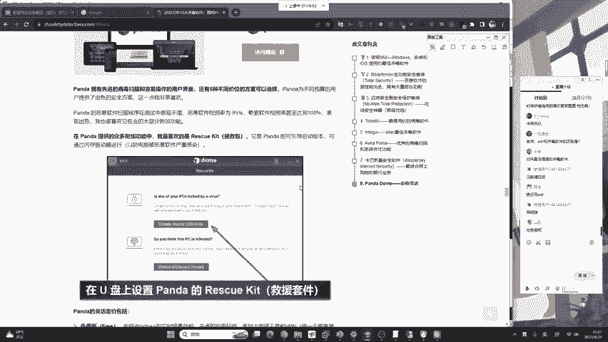

---

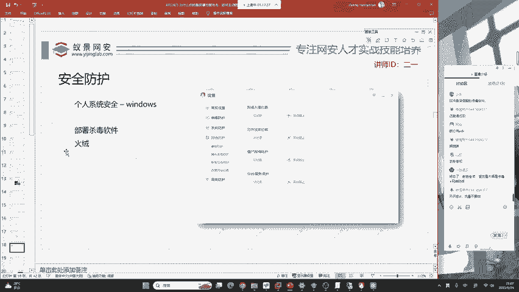

本节课中我们一起学习了个人系统安全的关键措施。我们明确了选择杀毒软件的核心要点，对比了多款主流安全工具的特性，厘清了EDR与传统杀毒软件的区别，并掌握了一个基础的云服务器防护思路。通过部署合适的安全软件并保持良好的安全习惯，可以显著提升个人系统面对网络威胁时的防御能力。