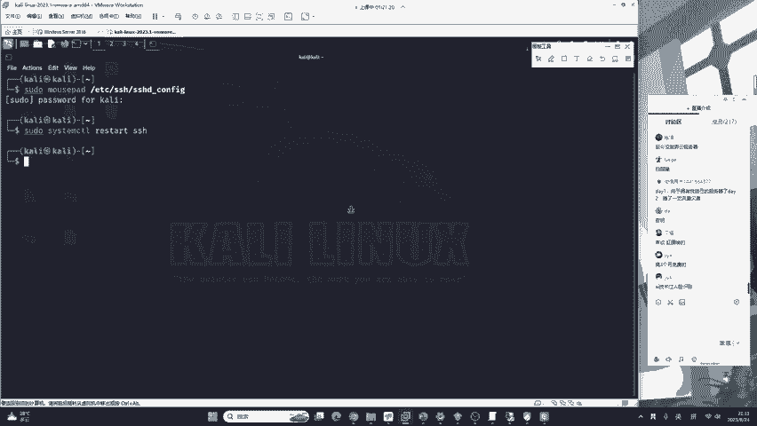
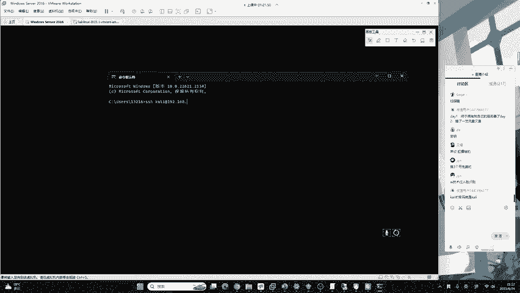
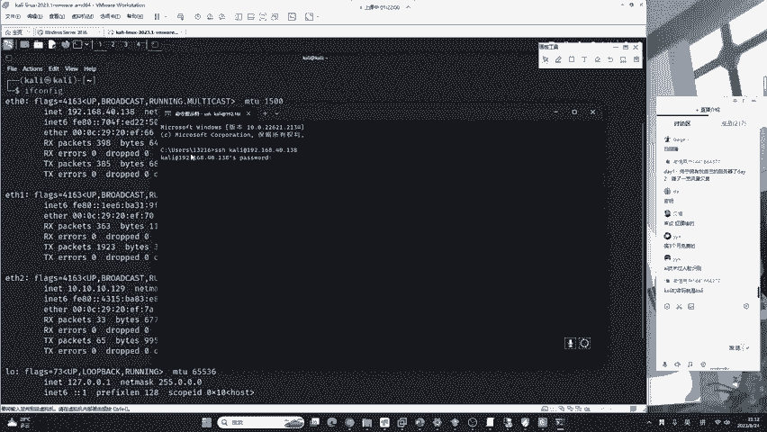
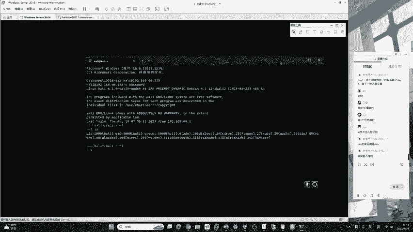
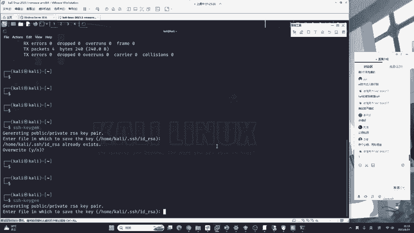
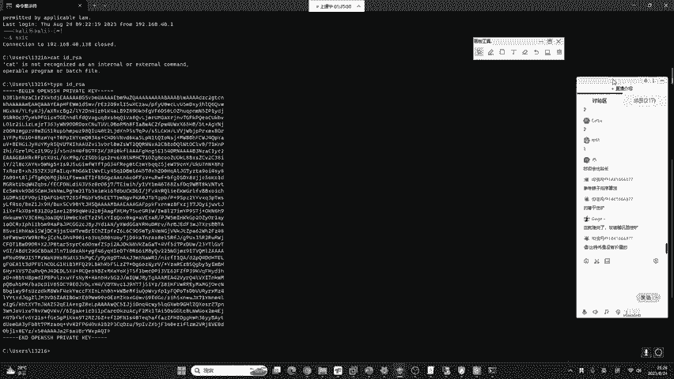
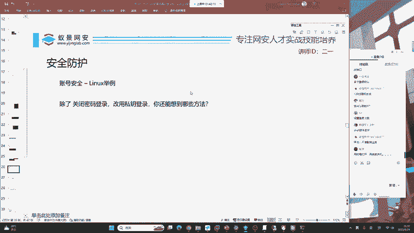

# 护网行动红蓝攻防教程：P21：蓝队应急响应-20.账号安全 🔐


## 概述
在本节课中，我们将学习如何保护Linux服务器，特别是云服务器，免受密码爆破攻击。我们将重点介绍一种更安全、更先进的登录方式——密钥对登录，并讲解其原理和配置步骤，以替代传统的密码登录，从而从根本上提升服务器的账号安全。

---

## 服务器面临的爆破威胁
上一节我们介绍了应急响应的基本概念，本节中我们来看看如何从源头防御一种常见攻击：密码爆破。

境外黑客组织会持续对全网设备进行密码爆破攻击。只要系统密码强度不足或存在弱密码账户，服务器就极易被攻破，沦为“肉鸡”被利用。因此，对服务器进行合理的安全配置至关重要。

以下是如何检查Linux系统是否遭受过爆破攻击：
*   使用 `lastb` 命令可以查看失败的登录尝试记录。从记录中可以看到，服务器可能每时每刻都在经历爆破尝试。



这带来了巨大的安全隐患。一旦因配置疏忽导致弱密码账户存在并被爆破成功，后果将非常严重。下面，我们将介绍一种面向未来的安全思路来应对此问题。





---

## 面向未来的安全思路：无密码（No Password）
未来的安全发展趋势是“无密码”（No Password）验证。其核心思想是：既然攻击者爆破密码，那么系统如果没有密码，自然就无法被爆破。

这并非取消所有验证，而是将验证方式从“你知道什么”（密码）转变为“你拥有什么”（密钥）或“你是什么”（生物特征）。例如，支付宝的刷脸、声纹识别都属于生物识别验证，是无密码进程的初始阶段。要实现全面的无密码化，需要整个开发社区的共同努力。

对于Linux服务器的远程登录，虽然没有完全实现无密码，但提供了一种类似的、更安全的解决方案：**密钥对登录**。



---

## 传统密码登录的演示与风险
在深入密钥登录之前，我们先回顾一下传统的密码登录方式及其风险。



我们以Kali Linux为例进行演示，其默认账户`kali`的密码是弱密码`kali`。
1.  首先，我们需要知道目标Kali系统的IP地址（例如 `192.168.40.138`）。
2.  在Windows命令提示符中，使用SSH命令进行连接：
    ```bash
    ssh kali@192.168.40.138
    ```
3.  系统会提示输入密码，输入`kali`后即可成功登录。

云服务器（如阿里云、腾讯云提供的Linux主机）的登录原理与此完全相同。如果这样一台使用弱密码的服务器暴露在互联网上，将极其危险。

即使`root`账户使用了强密码，攻击者仍会爆破系统中的其他所有用户账户（如`www-data`, `mysql`等）。因此，要保证安全，必须保证**所有**账户的安全。

---

## 密钥对登录的原理与配置
本节我们将详细介绍如何配置更安全的密钥对登录。

密钥对包含两部分：
*   **公钥 (Public Key)**：相当于一把“锁”。需要将其安装在服务器（“门”）上。
*   **私钥 (Private Key)**：相当于一把“钥匙”。需要用户自己妥善保管在本地。

配置成功后，登录时使用本地私钥“开锁”，而无需输入密码。只要私钥不泄露，安全性就极高。

以下是配置密钥对登录的完整步骤：

### 第一步：在Linux服务器上生成密钥对
在服务器上，使用 `ssh-keygen` 命令生成密钥对。为了简化，我们一路按回车使用默认选项即可。
```bash
ssh-keygen
```
命令执行后，会生成两个文件：
*   `~/.ssh/id_rsa.pub`：这是**公钥**（锁）。
*   `~/.ssh/id_rsa`：这是**私钥**（钥匙）。**务必保密！**

### 第二步：将公钥“安装”到服务器上
我们需要把生成的“锁”（公钥）安装到服务器的“门”上。对于Linux系统，这扇“门”是一个固定的文件：`~/.ssh/authorized_keys`。

执行以下命令，将公钥内容追加到该文件中：
```bash
cat ~/.ssh/id_rsa.pub >> ~/.ssh/authorized_keys
```
现在，公钥已经成功安装到服务器上。

**生产环境建议**：在实际工作中，应避免直接使用`root`账户进行远程登录，因为其权限过高，误操作风险大。建议为普通用户（如`kali`）配置密钥登录。

### 第三步：在本地客户端使用私钥登录测试
接下来，测试我们本地的“钥匙”（私钥）能否打开服务器的“锁”。

1.  **定位私钥**：私钥文件通常位于用户主目录的`.ssh`文件夹下（这是一个隐藏文件夹）。
2.  **使用私钥登录**：在客户端使用SSH命令时，通过 `-i` 参数指定私钥文件的路径。
    ```bash
    ssh -i /path/to/your/private/key kali@192.168.40.138
    ```
    如果配置正确，你将无需输入密码即可直接登录服务器。

私钥默认使用RSA等非对称加密算法（如SHA256），其安全性极高。暴力破解私钥的难度，在理论上接近于破解比特币的难度，在实际中几乎不可行。**安全的核心在于私钥的保密性**，切勿泄露。

### 第四步（关键）：禁用密码登录
在确认密钥登录成功后，**必须**禁用密码登录，否则之前的配置将失去意义。



1.  编辑SSH服务配置文件（需要管理员权限）：
    ```bash
    sudo nano /etc/ssh/sshd_config
    ```
2.  找到包含 `PasswordAuthentication` 的行，将其值改为 `no`。
    ```
    PasswordAuthentication no
    ```
3.  保存文件并退出编辑器。
4.  重启SSH服务以使配置生效：
    ```bash
    sudo systemctl restart ssh
    ```
重启后，尝试用密码登录将会失败，而使用密钥登录则正常。这样，服务器就彻底关闭了密码爆破的大门。

**重要警告**：务必在测试密钥登录**成功之后**，再执行禁用密码登录的操作。否则，如果密钥配置有误，你将无法再登录服务器。

---

## 其他增强账号安全的思路
除了使用密钥对登录，我们还可以结合其他方法来多维度提升安全。以下是几种常见的思路：

*   **使用超强密码**：为所有账户设置足够长、足够复杂的密码。
*   **修改默认端口**：将SSH默认的22端口改为其他非标准端口，能减少大量自动化扫描和爆破。
*   **限制登录尝试次数**：使用工具（如`fail2ban`）或配置系统防火墙，对短时间内多次登录失败的IP地址进行封禁。
*   **使用多因素认证（MFA）**：在密钥或密码之外，增加第二重验证（如手机验证码）。
*   **部署蜜罐**：设置诱饵系统，诱导并记录攻击者的行为。

这些防护措施的实现方式可能因操作系统、厂商设备而异，但其背后的安全体系和框架是相通的。掌握核心原理，就能快速适应不同的实际环境。

---

## 总结
本节课中，我们一起学习了如何防御针对Linux服务器的密码爆破攻击。

我们首先了解了服务器面临的持续爆破威胁。接着，引入了“无密码”的未来安全理念，并重点讲解了其当前在Linux系统中的最佳实践——**密钥对登录**。我们详细演示了生成密钥对、配置公钥、使用私钥登录以及最终**禁用密码登录**的完整流程。最后，我们还探讨了修改端口、限制尝试次数等其他辅助安全措施。



通过本课的学习，你不仅掌握了一种强大的服务器防护手段，也理解了公钥和私钥这一对在计算机安全领域广泛应用的核心概念。记住：**公钥是锁，装在服务器上；私钥是钥匙，务必保管在自己手中。**