# 护网行动红蓝攻防教程：P23：应急响应入侵排查 🕵️

在本节课中，我们将学习应急响应中至关重要的环节——入侵排查。我们将系统地介绍入侵排查的核心思路、常用方法以及针对Windows和Linux系统的具体操作，帮助你掌握在发现安全事件后，如何快速定位问题、分析痕迹并采取应对措施。

---

## 入侵排查思路

入侵排查是一个系统性的过程，旨在发现和分析系统被入侵的迹象。以下是主要的排查方向：

以下是入侵排查的核心思路分类：

*   **系统排查**：检查系统基本信息、用户、启动项等。
*   **进程分析**：检查当前运行和启动的进程。
*   **服务排查**：分析系统服务状态。
*   **文件痕迹排查**：寻找新增、可疑或异常的文件。
*   **日志分析**：审查操作系统和应用日志。
*   **内存分析**：检查内存中的恶意代码。
*   **流量分析**：分析网络流量中的异常。
*   **威胁情报**：利用外部情报辅助判断。

上一节我们概述了入侵排查的整体框架，本节中我们来看看具体从哪些方面入手进行文件分析。

### 文件分析

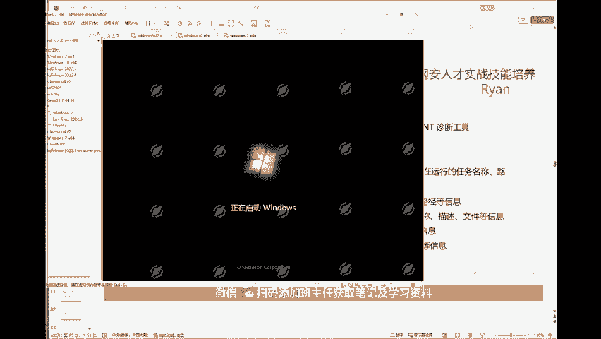

文件分析是排查的第一步，主要关注系统中文件的异常变化。

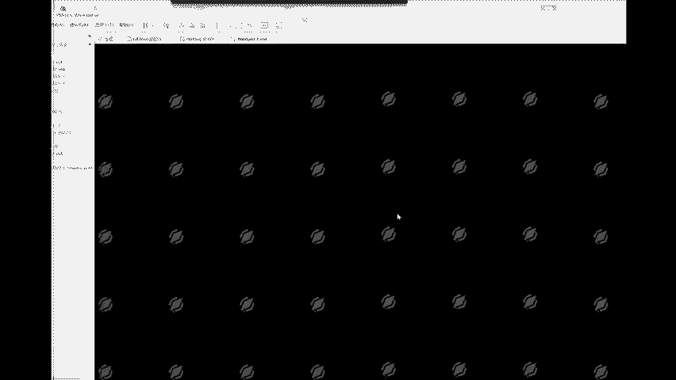

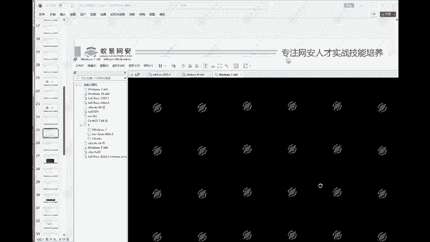

以下是文件分析需要关注的重点：

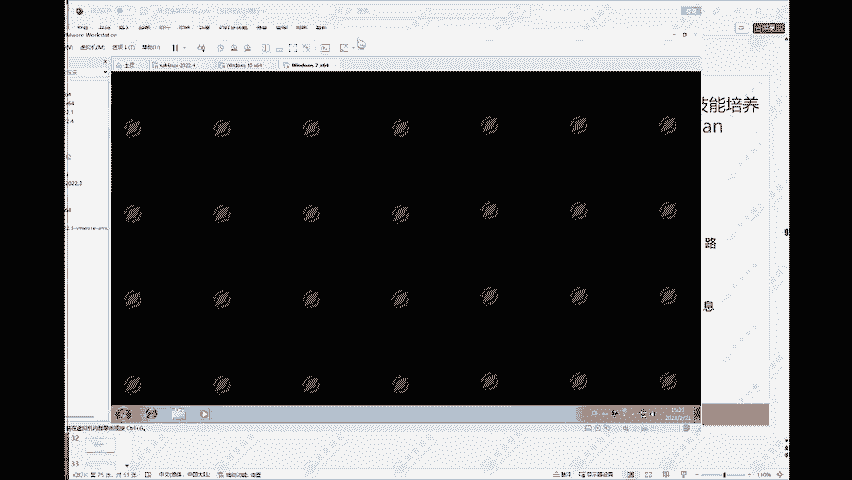

1.  **文件的日期**：检查关键文件的创建、修改和访问时间是否异常。
2.  **新增的文件**：寻找近期在系统目录（如系统盘根目录、Windows目录、临时目录）下新增的可执行文件、脚本或文档。
3.  **可疑的文件**：检查文件名可疑（如与系统进程名相似）、隐藏在深层目录或带有特殊后缀的文件。
4.  **异常文件**：文件大小异常、数字签名无效或来源不明的文件。
5.  **最近使用的文件**：通过系统功能（如Windows的“最近使用的项目”）检查近期被访问的文件。
6.  **浏览器下载的文件**：检查浏览器默认下载目录，排查恶意下载。
7.  **Webshell排查**：重点检查Web服务器目录（如`wwwroot`, `htdocs`）中是否存在非预期的脚本文件（如`.php`, `.jsp`, `.asp`）。

### 进程分析

在分析了文件痕迹后，我们需要检查系统中正在运行的进程，因为恶意程序通常会在内存中驻留。

以下是进程分析的关键点：

1.  **当前活动进程**：使用系统工具（如任务管理器、`tasklist`命令）查看所有运行进程，寻找CPU、内存占用异常或名称可疑的进程。
2.  **远程连接**：检查系统是否存在异常的远程连接（如通过`netstat -ano`命令查看网络连接和对应的进程ID）。
3.  **启动进程**：分析系统启动时自动运行的进程。
4.  **计划任务**：检查系统的计划任务，攻击者常利用其实现持久化控制。

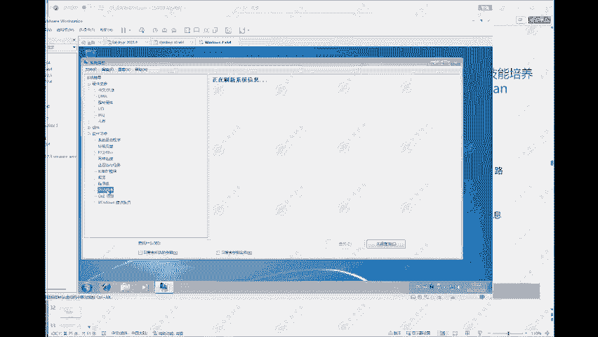

### 系统信息排查

除了进程，系统的整体配置信息也至关重要，包括环境变量、用户账号等。

以下是系统信息排查包含的内容：

1.  **环境变量**：检查`PATH`等环境变量是否被篡改，加入了恶意路径。
2.  **账号信息**：排查系统用户，特别是隐藏账户和新增的管理员账户。
3.  **历史命令**：查看用户的命令历史（如Linux的`.bash_history`），寻找攻击者执行过的命令。
4.  **系统配置文件**：检查重要的系统配置文件（如`/etc/passwd`, `/etc/shadow`）是否被修改。

### 日志分析

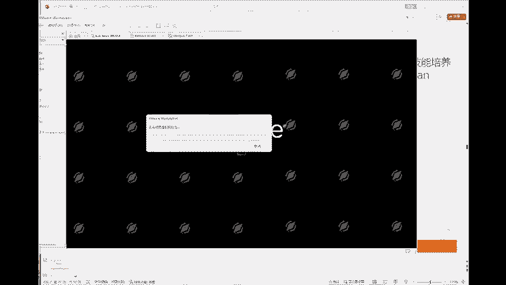

最后，系统的日志记录了大量的操作痕迹，是追溯攻击路径的宝贵资料。

日志分析主要指对**操作系统日志**（如Windows事件日志、Linux的`/var/log/`下的日志）进行审查，寻找登录失败、异常服务启动、错误警告等安全事件记录。

---

## Windows系统排查实践

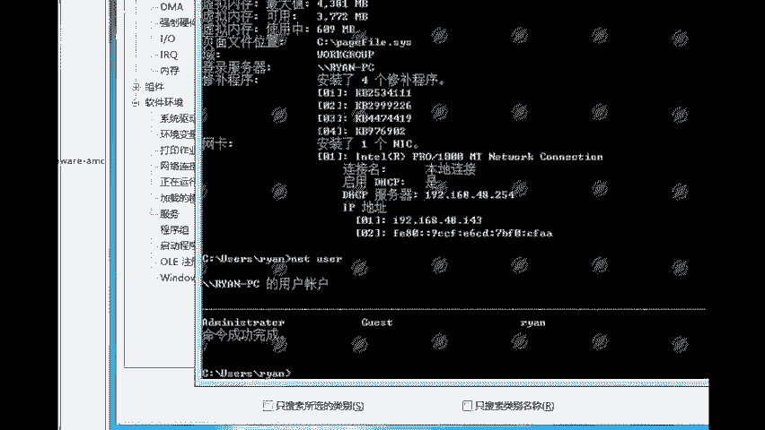

掌握了排查思路后，我们来看在Windows系统中如何进行具体操作。

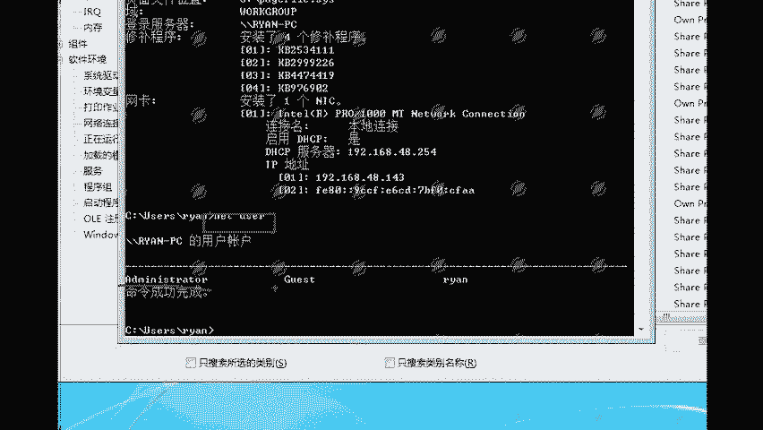

### 1. 查看系统基本信息

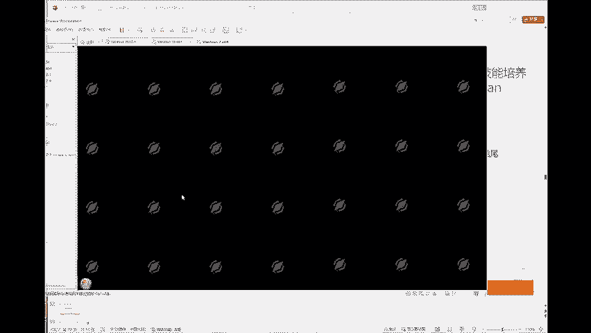

Windows自带系统信息工具，可以全面查看软硬件信息。

**方法一：使用`msinfo32`命令**
在运行窗口（`Win + R`）中输入 `msinfo32` 并回车，即可打开系统信息面板。在“软件环境” -> “正在运行的任务”中，可以查看当前运行的所有程序。

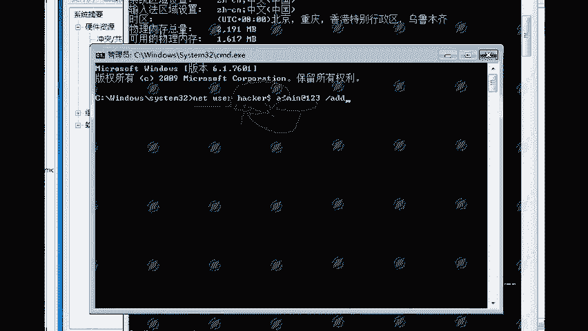

**方法二：使用`systeminfo`命令**
在命令提示符（CMD）中输入 `systeminfo` 并回车，可以快速获取系统概要信息，包括OS版本、补丁列表、硬件配置等。通过检查已安装的补丁，可以判断系统是否存在已知漏洞（例如，若未安装`KB4012212`补丁，则可能存在MS17-010永恒之蓝漏洞）。

### 2. 排查用户信息

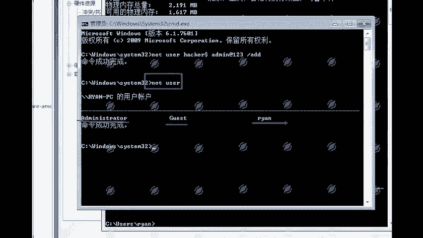

攻击者常会创建隐藏账户以维持访问权限。

**普通账户查看**：在CMD中执行 `net user` 命令，可以列出所有可见用户。

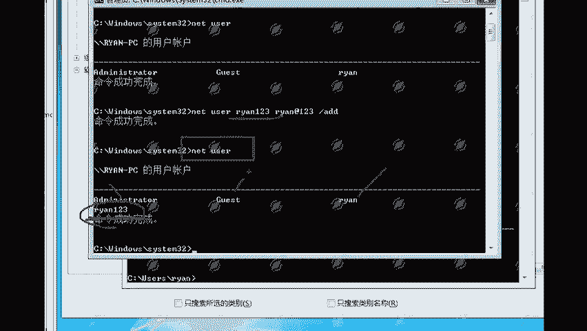

**创建与查看隐藏账户**：
隐藏账户通过在用户名后添加`$`符号创建，使用`net user`命令默认无法查看。
```cmd
# 创建名为hacker$的隐藏账户
net user hacker$ Admin@123 /add
```
**排查隐藏账户方法**：
*   **计算机管理**：通过“计算机管理” -> “本地用户和组” -> “用户”进行查看，此处可以显示包括隐藏账户在内的所有账户。
*   **注册表查看**：打开注册表编辑器（`regedit`），导航至 `HKEY_LOCAL_MACHINE\SAM\SAM\Domains\Account\Users\Names`，此处列出了所有账户的注册表项，包括隐藏账户。
*   **专用工具**：使用第三方安全工具（如`PCHunter`）可以更直接地枚举所有用户。

### 3. 排查启动项

恶意程序常将自己设置为开机自启动。

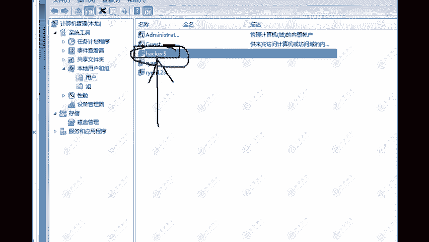

**方法一：系统配置工具**
在运行窗口输入 `msconfig` 并回车，在“启动”选项卡中（Windows 10后移至任务管理器）可以管理启动项。

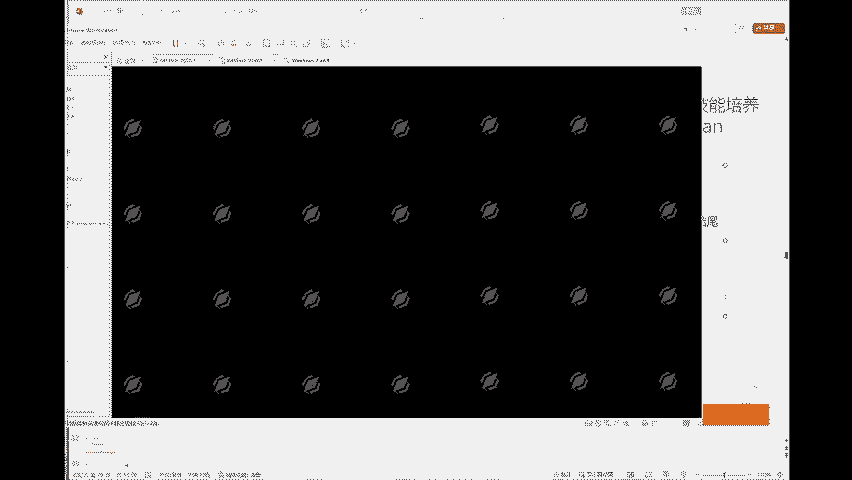

**方法二：检查注册表**
Windows自启动项主要存储在以下几个注册表路径中，需要重点检查：
*   `HKEY_CURRENT_USER\Software\Microsoft\Windows\CurrentVersion\Run`
*   `HKEY_LOCAL_MACHINE\SOFTWARE\Microsoft\Windows\CurrentVersion\Run`
*   `HKEY_LOCAL_MACHINE\SOFTWARE\WOW6432Node\Microsoft\Windows\CurrentVersion\Run` (64位系统)

### 4. 排查计划任务

攻击者利用计划任务实现定时执行或持久化。

打开“控制面板” -> “管理工具” -> “任务计划程序”，检查是否存在来源不明或行为异常的计划任务。

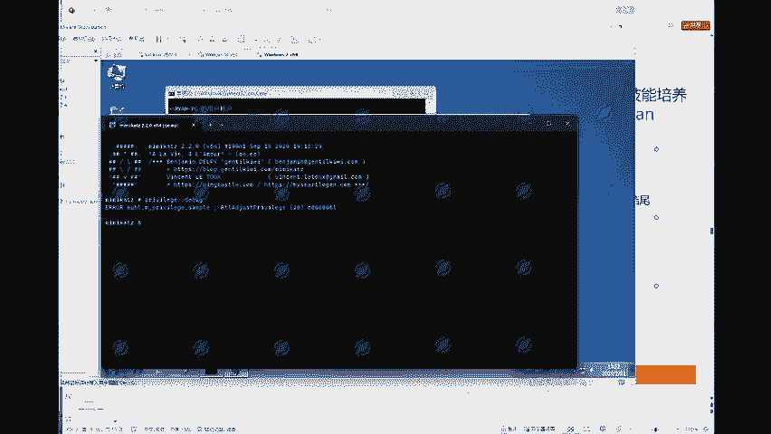

---

## Linux系统排查实践

接下来，我们看看在Linux系统中如何进行类似的排查。

### 1. 查看系统基本信息

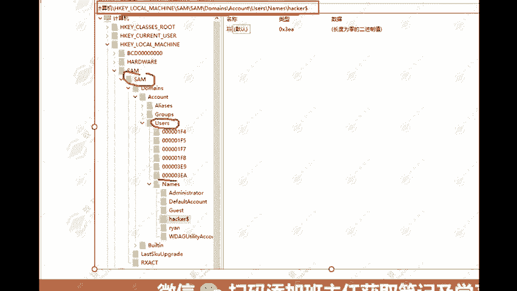

使用简单的命令即可获取系统关键信息。
```bash
# 查看CPU信息
lscpu

# 查看已加载的内核模块
lsmod

# 查看系统版本信息
uname -a
```

### 2. 排查用户信息

检查系统账户，特别是特权账户。
```bash
# 查看所有用户信息
cat /etc/passwd

# 重点排查UID为0的特权用户（root用户）
awk -F: '$3==0{print $1}' /etc/passwd

# 查看当前登录用户
who
```
`/etc/passwd`文件每行格式为：`用户名:密码占位符(x):UID:GID:描述:家目录:登录Shell`。需要关注UID为0的非root用户及登录Shell为`/bin/bash`或`/bin/zsh`的可登录用户。

### 3. 排查启动项

Linux的启动项管理因发行版而异。
```bash
# 查看系统服务（Systemd系统）
systemctl list-unit-files --type=service | grep enabled

# 查看历史启动项（SysVinit系统，检查对应运行级别的目录）
ls -la /etc/rc.d/rc[0-6].d/
```

### 4. 排查计划任务

检查系统的定时任务。
```bash
# 查看当前用户的计划任务
crontab -l

# 查看系统计划任务（需要root权限）
cat /etc/crontab
ls -la /etc/cron.d/
ls -la /etc/cron.hourly/ /etc/cron.daily/ /etc/cron.weekly/ /etc/cron.monthly/
```

---

## 总结与拓展

本节课中我们一起学习了应急响应中入侵排查的核心思路与实战操作。我们从**文件、进程、系统信息、日志**四大方向建立了排查框架，并具体演示了在**Windows和Linux**系统下如何查看系统信息、排查隐藏用户、分析启动项和计划任务。

入侵排查是一个深度和广度并重的工作，本节课涵盖的是基础且关键的环节。除此之外，还有更深入的内容需要掌握，例如：
*   **Webshell查杀**：使用专用工具扫描Web目录。
*   **深度日志分析**：使用工具对庞大的Windows事件日志或Linux系统日志进行聚合、筛选和关联分析。
*   **内存取证**：使用`Volatility`等工具分析内存转储文件，提取进程、网络连接、注册表信息等。
*   **网络流量分析**：使用`Wireshark`分析捕获的流量包，寻找C2通信、数据外传等痕迹。

建议结合相关的排查工具和脚本，并参考更详细的排查清单进行系统化的练习，才能在实际的护网行动或安全事件中快速有效地完成应急响应工作。