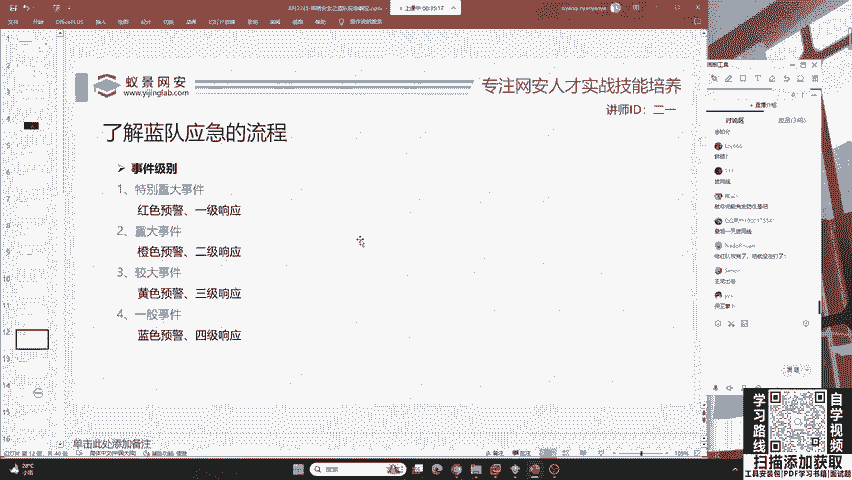
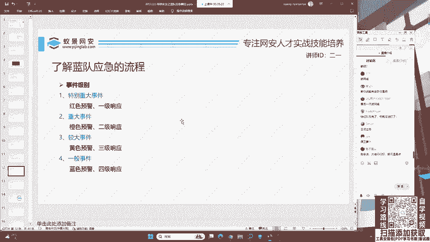
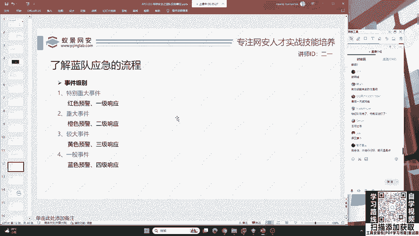
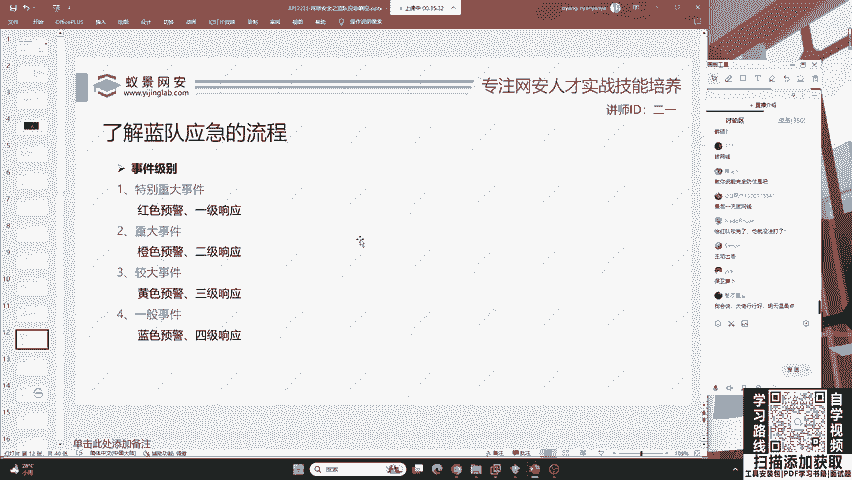
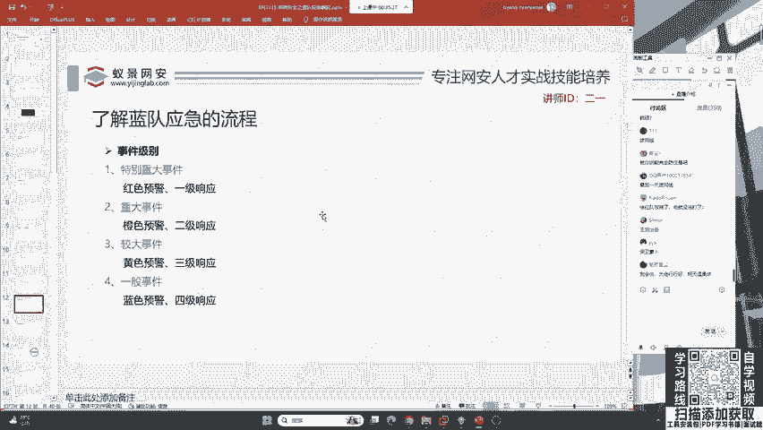
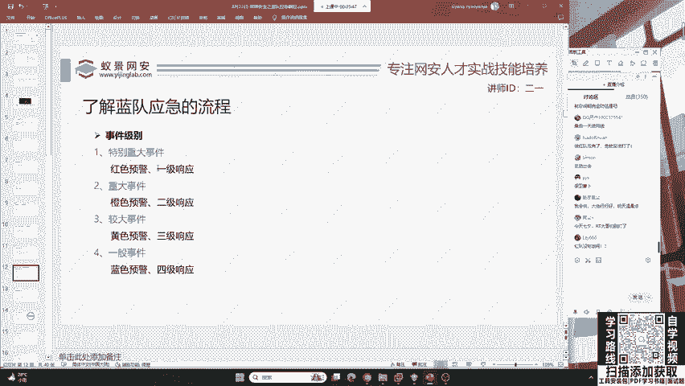
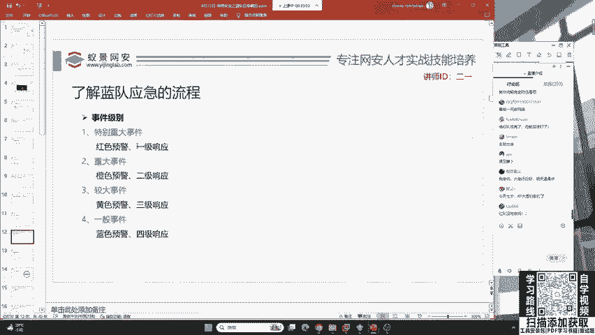
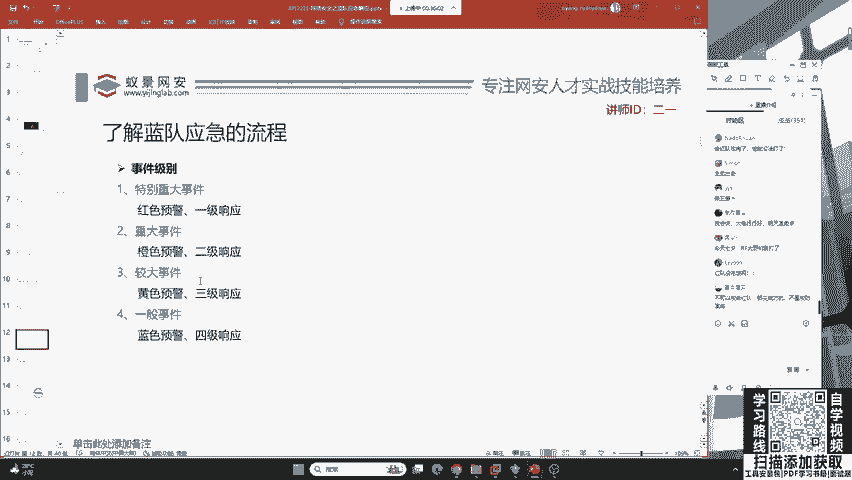

# 护网行动红蓝攻防教程：P2：蓝队应急响应-1.应用安全 🛡️

在本节课中，我们将要学习蓝队应急响应中的核心环节——应用安全。我们将了解应急响应的基本概念、事件分级方法，并从红队的攻击视角出发，认识常见的应用安全威胁，为后续的防御和处置打下基础。

## 应急响应概述

应急响应通常是指企业为了应对各种意外事件发生前所做的准备，以及意外事件发生后所采取的措施。这时必须注意，防御并非100%有效。

如果有人认为可以完全防御红队的攻击，这种想法是危险的。红队可能会因此将其作为重点攻击目标。因此，我们不应口出狂言，而是要学习如何尽可能做好准备，并在遭受攻击后，将企业的损失降到最低。

我们的目标是对已经发生或可能发生的安全事件进行监控、分析、协调处理以及保护资产安全。本课程的主要内容将围绕这些技术展开。

## 应急事件级别

上一节我们介绍了应急响应的目标，本节中我们来看看如何对安全事件进行分级。当我们被红队攻击后，需要根据事件的严重程度采取不同措施。

事件级别的判定依据是被攻击资产的重要性、攻击造成的危害程度以及所利用漏洞的类型。例如，员工个人因下载钓鱼软件导致手机被控、隐私泄露，这通常不会影响企业整体运营，因此不能算作特别重大事件。

以下是事件级别的分类，主要依据事件的影响范围和严重性进行划分：

*   **特别重大事件**
*   **重大事件**
*   **较大事件**
*   **一般事件**

对于上述员工个人中招的情况，可归类为一般或较大事件。这提醒我们需要提升员工的整体安全意识和反钓鱼能力。

## 红队攻击视角下的应用安全

了解了如何对事件定级后，我们需要知道攻击是如何发生的。这就要求我们从红队的视角来看蓝队的防御，必须清楚红队的攻击手法。

以下是应用安全领域常见的几种攻击类型：

*   **Web Shell（网站后门）**：攻击者在网站服务器上植入的后门程序，用于维持控制权。
*   **网站篡改**：攻击者未经授权修改网站的正常内容。
*   **网站挂马**：攻击者在网页中植入恶意代码，导致访问者被侵害。

一个常见的现象是：用户收藏的网站在一段时间后再次访问，会发现页面被植入恶意代码，导致浏览器不受控制地跳转到非法或诈骗网站。这通常意味着该网站被植入了后门木马、被挂马或主页内容被篡改。这是最为常见的应用安全威胁之一，许多境外黑客组织，特别是APT组织，经常采用此类手法攻击正常网站。

---

本节课中我们一起学习了蓝队应急响应的基础，明确了应急响应的定义与目标，掌握了根据资产、危害和漏洞类型对安全事件进行分级的方法，并从攻击者视角认识了Web Shell、网站篡改和网站挂马等核心的应用安全威胁。理解这些是构建有效防御体系的第一步。